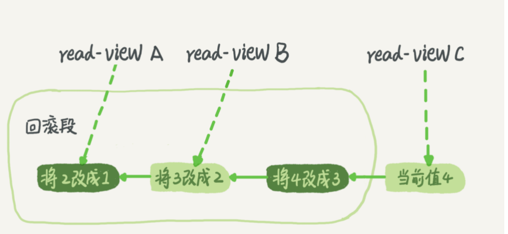

# Mysql 事务


## 概念

### 事务特性

mysql 事务有四大特性，ACID 特性

- A： 原子性 
  一个事物总的所有操作，要么全部完成要不全部不完成
- C： 一致性
  在事物开始之前和事物结束之后，数据的完整性没有破坏
- I： 隔离性
  事物的隔离性要求每个读写事物的对象与其他事物的操作对象能相互隔离，既该事物提交前对于其他事物是不可见的
- D： 持久性


事务有 ACID 四个属性， InnoDB 是支持事务的，它实现 ACID 的机制如下：

### Atomicity

innodb的原子性主要是通过提供的事务机制实现，与原子性相关的特性有：

- Autocommit 设置。
- COMMIT 和 ROLLBACK 语句(通过 Undo Log实现)。

### Consistency

innodb的一致性主要是指保护数据不受系统崩溃影响，相关特性包括：

- InnoDB 的双写缓冲区(doublewrite buffer)。
- InnoDB 的故障恢复机制(crash recovery)。

### Isolation

innodb的隔离性也是主要通过事务机制实现，特别是为事务提供的多种隔离级别，相关特性包括：

- Autocommit设置。
- SET ISOLATION LEVEL 语句。
- InnoDB 锁机制。

### Durability

innodb的持久性相关特性：

- Redo log。
- 双写缓冲功能。可以通过配置项 `innodb_doublewrite` 开启或者关闭。
- 配置 `innodb_flush_log_at_trx_commit`。用于配置innodb如何写入和刷新 redo 日志缓存到磁盘。默认为1，表示每次事务提交都会将日志缓存写入并刷到磁盘。`innodb_flush_log_at_timeout` 可以配置刷新日志缓存到磁盘的频率，默认是1秒。
- 配置 sync_binlog。用于设置同步 binlog 到磁盘的频率，为0表示禁止MySQL同步binlog到磁盘，binlog刷到磁盘的频率由操作系统决定，性能最好但是最不安全。为1表示每次事务提交前同步到磁盘，性能最差但是最安全。MySQL文档推荐是 `sync_binlog` 和 `innodb_flush_log_at_trx_commit` 都设置为 1。
- 操作系统的 fsync 系统调用。
- UPS设备和备份策略等。


### 隔离级别

数据库的四大隔离级别：

- 读未提交（read uncommitted）是指，一个事务还没提交时，它做的变更就能被别的事务看到。

- 读已提交（Read_Commited） 是指 一个事务提交之后，它做的变更才会被其他事务看到

- 可重复读（RR） 是指 一个事务执行过程中看到的数据，总是跟这个事务在启动时看到的数据是一致的。当然在可重复读隔离级别下，未提交变更对其他事务也是不可见的。

- 串行化(serializable) 顾名思义是对于同一行记录，“写”会加“写锁”，“读”会加“读锁”。当出现读写锁冲突的时候，后访问的事务必须等前一个事务执行完成，才能继续执行

其中读已提交级别解决了脏读的问题，可重复读级别解决了 不可重复读的问题，而 innodb 的 next-key lock + 可重复读 + mvcc 解决了 幻读问题


## Undo log

#### Undo 日志

MySQL的MVCC(多版本并发控制)依赖Undo Log实现。MySQL的表空间文件 t.ibd 存储的是记录最新值，每个记录都有一个回滚指针(见前面图中的Roll Ptr)，指向该记录的最近一条Undo记录，而每条Undo记录都会指向它的前一条Undo记录，如下图所示。默认情况下 undo log存储在系统表空间 ibdata1 中。


举例如下：

```csharp
CREATE TABLE `t3` (
  `id` int(11) NOT NULL,
  `a` varchar(100) DEFAULT NULL,
  PRIMARY KEY (`id`)
) ENGINE=InnoDB DEFAULT CHARSET=utf8mb4;

insert into t3 values(1, 'A');

update t3 set a='B' where id=1;
update t3 set a='C' where id=1;
```


插入一条数据后，可以发现当前 t3.ibd 文件中的记录是 (1, 'A')，而 Undo Log此时有一条 insert 的记录。如下：

```ruby
root@stretch:/var/lib/mysql# innodb_space -s ibdata1 -T test/t3 -p 3 -R 127 record-history
Transaction   Type                Undo record
(n/a)         insert              (id=1) → ()
```


执行后面的update语句，可以看到 undo log如下：

```ruby
root@stretch:/var/lib/mysql# innodb_space -s ibdata1 -T test/t3 -p 3 -R 127 record-history
Transaction   Type                Undo record
2333          update_existing     (id=1) → (a="B")
2330          update_existing     (id=1) → (a="A")
(n/a)         insert              (id=1) → ()
```

需要注意的是，Undo Log 在事务执行过程中就会产生，事务提交后才会持久化，如果事务回滚了则Undo Log也会删除。

另外，删除记录并不会立即在表空间中删除该记录，而只是做个标记(delete-mark)，真正的删除则是等由后台运行的 purge 进程处理。除了每条记录有Undo Log的列表外，整个数据库也会有一个历史列表，purge 进程会根据该历史列表真正删除已经没有再被其他事务使用的 delete-mark 的记录。purge 进程会删除该记录以及该记录的 Undo Log。


## MVCC

 MVCC是在并发访问数据库时，通过对数据做多版本管理，避免因为写锁的阻塞而造成读数据的并发阻塞问题。 

通俗的讲就是MVCC通过保存数据的历史版本，根据比较版本号来处理数据的是否显示，从而达到读取数据的时候不需要加锁就可以保证事务隔离性的效果 。

innodb 引擎的表中，每个事务有一个唯一的事务 ID，叫作 transaction id。每一行数据也是有多个版本的，每次事务更新数据的时候，都会生成一个新的数据版本，并且把 transaction id 赋值给这个数据版本的事务 ID，记为 row trx_id。


当我们对某一行数据做修改的时候都会将旧的记录相应的生成一个回滚段(即拷贝的行记录)保存在 undo log 中，然后再进行修改，并且将当前事务的ID 赋值给 修改完成后行记录的 row trx_id,  回滚指针指向拷贝到undo log的副本记录 ， 表示我的上一个版本就是它 




由于我们每次开启一个事务都会产生一个事务ID，所以相应的每一个事务启动的时候都会创建一个属于当前事务的read-view。read-view 就是用于保存当前正在执行的事务信息，并且记录了三个关键性的值，分别为：

- trx_list:  一个数值列表，用来维护Read View生成时刻系统正活跃的事务ID 

- low_limit_id:  trx_list列表中事务ID最大的ID 

- up_limit_id：已提交的最大事务id

当我们在某一个事务中需要快照读或者一致性读时，需要遵循 read-view 的 可见性算法，既规则如下：

当我们根据当前行的 roll_ptr 从 undo log中获取记录时，首先要将获取记录的 row trx_id 与 read-view 中维护的三个关键性值 做比较：

- 1、比较 row trx_id 是否与当前事务的 trx_id 相等，如果相等则表示是当前事务刚刚更新的值，直接返回

- 2、比较 row trx_id  是否小于 up_limit_id, 如果小于，则当前事务能看到 已提交事务的 所在的记录，如果大于等于进入下一个判断

- 3、接下来判断 DB_TRX_ID 大于等于 low_limit_id , 如果大于等于则代表DB_TRX_ID 所在的记录在Read View生成后才出现的，那对当前事务肯定不可见，如果小于则进入下一个判断

- 4、判断row trx_id 是否在活跃事务之中，trx_list.contains(DB_TRX_ID)，如果在，则代表我Read View生成时刻，你这个事务还在活跃，还没有Commit，你修改的数据，我当前事务也是看不见的；如果不在，则说明，你这个事务在Read View生成之前就已经Commit了，你修改的结果，我当前事务是能看见的


在 inndodb 中，每一行都添加了两个隐藏字段 分别为：trx_id, 与 roll_ptr

- DB_TRX_ID, 保存事务id，即trx->id， 用于可见性判断。
- DB_ROLL_PTR, 保存回滚段地址信息（spaceid，pageno，offset），用于回溯上一个版本。


如图 2 所示，就是一个记录被多个事务连续更新后的状态。


而读提交的逻辑和可重复读的逻辑类似，它们最主要的区别是：

- 在可重复读隔离级别下，只需要在事务开始的时候找到那个 up_limit_id，之后事务里的其他查询都共用这个 up_limit_id；
- 在读提交隔离级别下，每一个语句执行前都会重新算一次 up_limit_id 的值。


## 当前读 与 快照读

### 当前读

更新数据都是先读后写的，而这个读，只能读当前的值，称为“当前读（current read），读取的是已提交事务的最新的值

像select lock in share mode(共享锁), select for update ; update, insert ,delete(排他锁)这些操作都是一种当前读，为什么叫当前读？就是它读取的是记录的最新版本，读取时还要保证其他并发事务不能修改当前记录，会对读取的记录进行加锁。


### 快照读

像不加锁的select操作就是快照读，即不加锁的非阻塞读；快照读的前提是隔离级别不是串行级别，串行级别下的快照读会退化成当前读；之所以出现快照读的情况，是基于提高并发性能的考虑，快照读的实现是基于多版本并发控制，即MVCC,可以认为MVCC是行锁的一个变种，但它在很多情况下，避免了加锁操作，降低了开销；既然是基于多版本，即快照读可能读到的并不一定是数据的最新版本，而有可能是之前的历史版本


