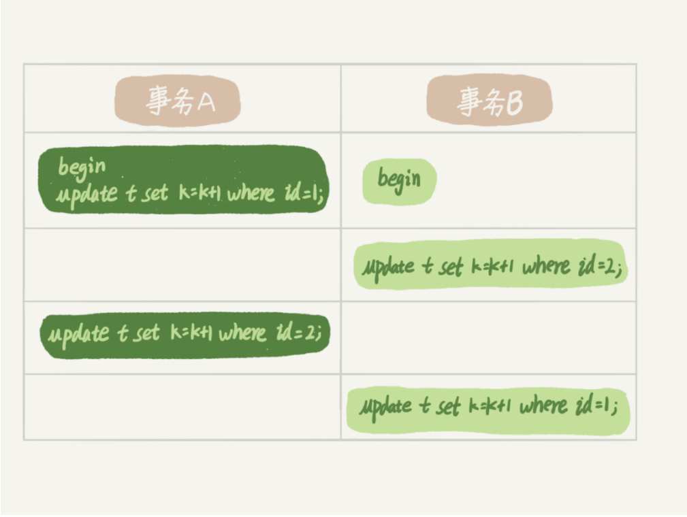

## Mysql 行锁

Mysql的行锁是在各个引擎自己实现的，并不是所有的存储的引擎都支持行锁，Myisam引擎就不支持行锁

行锁优点：通过减少锁粒度，来提高mysql的并发度


**在 InnoDB 事务中，行锁是在需要的时候才加上的，但并不是不需要了就立刻释放，而是要等到事务结束时才释放。这个就是两阶段锁协议。**

如果在某个事物中持有了多行锁，那么就由可能造成锁冲突，最有可能影响并发度的锁进了往后=房

### 死锁和死锁检测

当并发系统不同线程出现循环依赖资源，涉及的线程都在等待别线程释放锁，这几个线线程都进入无线等待状态，称为死锁

用例如下：



这个时候事务A等待事务B释放id=2的锁，而事务B在等待事务A释放 id=1的行锁，事务S和事务B都在互相等待对方释放资源，于是就进入了死锁状态，当死锁出现后有两种策略，如下：

- 一种策略是 直接进入等待，直到超时，这个时间可以通过参数 innodb_lock_wait_timeout 来设置
  - 另一种策略是发起死锁检测，发现死锁后，主动回复滚死锁链的某一事务，另一事务得以执行，将参数innodb_dead_detect 设置为on，mysql就会自动检测并回滚其中某一条事务

**注意**：

- 通过非索引条件检索数据时，使用 的是表锁，会导致数据表被锁定
- 通过索引条件检测数据时，使用的行锁
- 


### Insert 读锁

当我们在事务中insert 某一条语句时，mysql 默认会为我们在新insert 的那一行语句上加一个 X排他行锁，接下来我们来一下这个过程

Session1：

```mysql
begin;

mysql> select * from test ;
+----+------+------+
| id | age  | k    |
+----+------+------+
|  1 |    1 |    1 |
|  5 |    5 |    5 |
| 10 |   10 |   10 |
| 15 |   15 |   15 |
| 20 |   20 |   20 |
+----+------+------+
5 rows in set (0.00 sec)

mysql> insert into test values(3,3,3);
Query OK, 1 row affected (0.00 sec)
```


Session2:

```mysql
begin;
mysql> select * from test where id = 3 lock in share mode;
# 等待
```


Session3：

```mysql
mysql> SELECT * FROM information_schema.INNODB_LOCKs \G
*************************** 1. row ***************************
    lock_id: 2105:57:3:7
lock_trx_id: 2105
  lock_mode: S
  lock_type: RECORD
 lock_table: `test`.`test`
 lock_index: PRIMARY
 lock_space: 57
  lock_page: 3
   lock_rec: 7
  lock_data: 3
*************************** 2. row ***************************
    lock_id: 2099:57:3:7
lock_trx_id: 2099
  lock_mode: X
  lock_type: RECORD
 lock_table: `test`.`test`
 lock_index: PRIMARY
 lock_space: 57
  lock_page: 3
   lock_rec: 7
  lock_data: 3
2 rows in set, 1 warning (0.00 sec)

```

我们通过观察 innodb_information schema 的 inndodb_locks 表发现，该表中存在两条记录 分别为 Session 2 的 S 共享锁，与session1的 X 排他锁。

结论如下:  mysql 在 某个事务中 插入一条记录时，会为这一条记录添加 X排他锁，当其他事务操作改记录时间就会锁定。

 