# Mysql 锁机制

MySQL 锁主要分为全局锁、表级锁、行锁、间隙锁 这四种锁类型

mysql 实现了如下两种标准的锁级别：

- 共享锁(S Lock)
- 排他锁(X Lock)

除了上述提到的 标准锁类型，innodb 还定义了关于行锁的三个基本锁类型，如下：

- Record Lock: 单个记录上的锁
- Gap Lock: 间隙锁，锁定一个范围，但不包括记录本上
- Next-Key Lock: Gap Lock+Record Lock，锁定一个范围，并且锁定记录本身

**这里要记住一点：innodb 行级锁的默认的加锁单位为next-lock，不懂没有关系，接着往下看**


## 全局锁

全局锁就是给整个数据库实例加锁，mysql 提供了一个加全局锁的方法，语句为：

```sql
flush tables with read lock;
```

当你需要让整个库处于只读状态的时候，可以使用这个命令，之后其他线程的以下语句会被阻塞：数据更新语句（数据的增删改）、数据定义语句（包括建表、修改表结构等）和更新类事务的提交语句。

**全局锁的典型使用场景是，做全库逻辑备份。也就是把整库每个表都 select 出来存成文本。以前有一种做法，是通过 FTWRL 确保不会有其他线程对数据库做更新，然后对整个库做备份。注意，在备份过程中整个库完全处于只读状态。**


## 表级锁

MYSQL 表级别的锁主要有两种，一种是表锁，一种是 元数据锁（MDL 锁）

### 表锁

表锁的显示加锁的语法：

```mysql
 lock tables table_name read/write;
```

lock tables 语法除了会限制别的线程的读写外，也限定了本线程接下来的操作对象。

> 举个例子, 如果在某个线程 A 中执行 lock tables t1 read, t2 write; 这个语句，则其他线程写t1、读写 t2 的语句都会被阻塞。同时，线程 A 在执行 unlock tables 之前，也只能执行读 t1、写 t2 的操作。连读 t2 都不允许，自然也不能访问其他表。


表锁显示解锁的语法为：

```mysql
unlock tables;
```

> 注意：myisam 支持的最小锁粒度就是为 表级锁


### MDL 锁

所谓 MDL锁指的是表的元数据锁，既当我们在执行DML 语句时，是不允许表结构被修改的，保证了我们执行DML语句的正确性。

MDL 不需要显式使用，在访问一个表的时候会被自动加上。MDL 的作用是，保证读写的正确性。你可以想象一下，如果一个查询正在遍历一个表中的数据，而执行期间另一个线程对这个表结构做变更，删了一列，那么查询线程拿到的结果跟表结构对不上，肯定是不行的。

在 MySQL 5.5 版本中引入了 MDL，当对一个表做增删改查操作的时候，加 MDL 读锁；当要对表做结构变更操作的时候，加 MDL 写锁。

- 读锁之间不互斥，因此你可以有多个线程同时对一张表增删改查。
- 读写锁之间，写锁之间是互斥的，用来保证变更表结构操作的安全性。因此，如果有两个线程要同时给一个表加字段，其中一个要等另一个执行完才能开始执行。
- 如果在事务中涉及到了MDL 锁，那么只有等到事务完成才会释放MDL锁


## 行锁

### 两阶段锁

在 InnoDB 事务中，行锁是在需要的时候才加上的，但并不是不需要了就立刻释放，而是要等到事务结束时才释放。这个就是两阶段锁协议

如果你的事务中需要锁多个行，要把最可能造成锁冲突、最可能影响并发度的锁尽量往后放。


### 行锁实现

innodb的行锁是通过给索引上的索引项加锁来实现的，也就意味着：**只有通过索引条件检索数据，InnoDB 才使用行级锁，否则，InnoDB 将退化为表级锁**。这一点在实际应用中特别需要注意，不然的话**可能导致大量的锁冲突，从而影响引发并发性能**。

实验一：对没有索引的加锁，导致表锁

1）准备工作：建tab_no_index表，表中无任何索引，并插入数据

　　　　[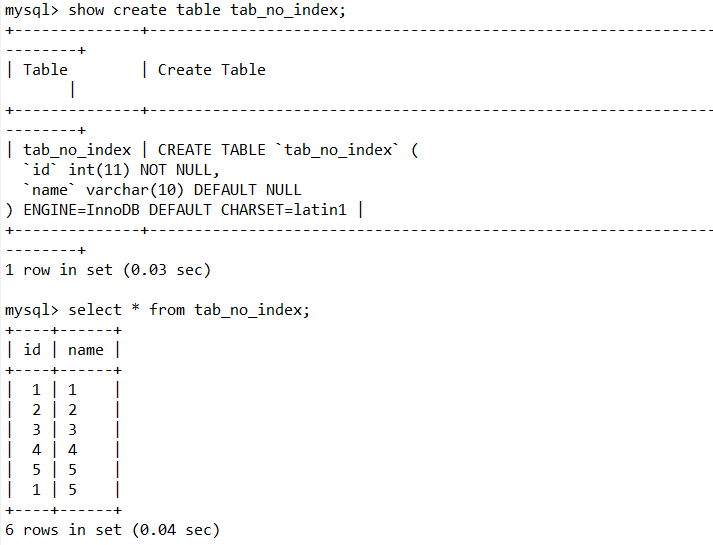](https://img2020.cnblogs.com/blog/1352849/202004/1352849-20200416173743060-2101044546.png)

 

2）Session_1: 我们给id=1的行加上排它锁（for update），由于id没有索引，实际上是表级锁；

　　　　[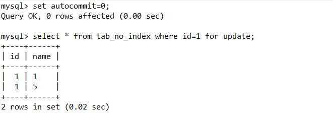](https://img2020.cnblogs.com/blog/1352849/202004/1352849-20200416173951866-1964322683.png)


3）Session_2：我们给id=2的行加上排它锁（for update），由于id没有索引，所以去申请表级锁，但是却出现了锁等待！原因就是在没有索引的情况下，InnoDB只能使用表锁。

 　　[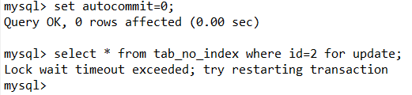](https://img2020.cnblogs.com/blog/1352849/202004/1352849-20200416174229098-636268991.png)


> 备注：MySQL中的for update 仅适用于InnoDB（因为是只有此引擎才有行级锁），并且必须开启事务，在begin与commit之间才生效。for update是在数据库中上锁用的，可以为数据库中的行上一个排它锁。当一个事务的操作未完成时候，其他事务可以对这行读取但是不能写入或更新，只能等该事务Rollback, Commit, Lost connection…


## 死锁检测

当并发系统中不同线程出现循环资源依赖，涉及的线程都在等待别的线程释放资源时，就会导致这几个线程都进入无限等待的状态，称为死锁。，下图中 id 为 主键：

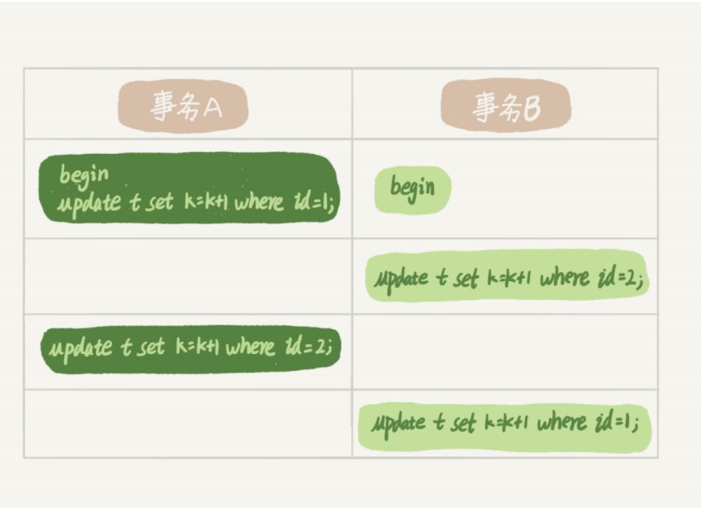

这时候，事务 A 在等待事务 B 释放 id=2 的行锁，而事务 B 在等待事务 A 释放 id=1 的行锁。事务 A 和事务 B 在互相等待对方的资源释放，就是进入了死锁状态。当出现死锁以后，有两种策略：

- 一种策略是，直接进入等待，直到超时。这个超时时间可以通过参数innodb_lock_wait_timeout 来设置。
- 另一种策略是，发起死锁检测，发现死锁后，主动回滚死锁链条中的某一个事务，让其他事务得以继续执行。将参数 innodb_deadlock_detect 设置为 on，表示开启这个逻辑

在 InnoDB 中，innodb_lock_wait_timeout 的默认值是 50s，意味着如果采用第一个策略，当出现死锁以后，第一个被锁住的线程要过 50s 才会超时退出，然后其他线程才有可能继续执行

mysql会自动检测到死锁，并且将事物资源少的一方进行回滚操作  一种策略是，直接进入等待，直到超时。这个超时时间可以通过参数innodb_lock_wait_timeout 来设置 默认为 50s，  我们可以借助 pt-deadlock-logger 来记录死锁信息 innodb_print_all_deadlocks 参数设置为ON，则在error.log中记录死锁信息


## Gap 锁  与 Next-Lock 锁

 InnoDB通过给索引项加锁来实现行锁，如果没有索引，则通过隐藏的聚簇索引来对记录加锁。如果操作不通过索引条件检索数据，InnoDB 则对表中的所有记录加锁，实际效果就和表锁一样。InnoDB存储引擎有3种行锁的算法，分别是： 

- Record Lock: 单个记录上的锁
- Gap Lock: 间隙锁，锁定一个范围，但不包括记录本上
- Next-Key Lock: Gap Lock+Record Lock，锁定一个范围，并且锁定记录本身

 如下图所示：

 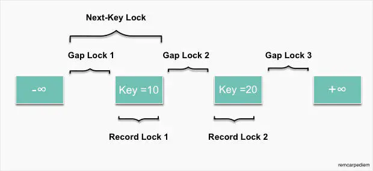 

例如一个索引有10,11,13,20这四个值。InnoDB可以根据需要使用Record Lock将10，11，13，20四个索引锁住，也可以使用Gap Lock将(-∞,10)，(10,11)，(11,13)，(13,20)，(20, +∞)五个范围区间锁住。Next-Key Locking类似于上述两种锁的结合，它可以锁住的区间有为(-∞,10]，(10,11]，(11,13]，(13,20]，(20, +∞)，可以看出它即锁定了一个范围，也会锁定记录本身。

 InnoDB存储引擎的锁算法的一些规则如下所示，后续章节会给出对应的实验案例和详细讲解。

- 在不通过索引条件查询时，InnoDB 会锁定表中的所有记录。所以，如果考虑性能，WHERE语句中的条件查询的字段都应该加上索引。
- InnoDB通过索引来实现行锁，而不是通过锁住记录。因此，当操作的两条不同记录拥有相同的索引时，也会因为行锁被锁而发生等待。
- 由于InnoDB的索引机制，数据库操作使用了主键索引，InnoDB会锁住主键索引；使用非主键索引时，InnoDB会先锁住非主键索引，再锁定主键索引。
- 当查询的索引是唯一索引(不存在两个数据行具有完全相同的键值)时，InnoDB存储引擎会将Next-Key Lock降级为Record Lock，即只锁住索引本身，而不是范围。
- InnoDB对于辅助索引有特殊的处理，不仅会锁住辅助索引值所在的范围，还会将其下一键值加上Gap LOCK。
- InnoDB使用Next-Key Lock机制来避免Phantom Problem（幻读问题）。


### 幻读

在了解什么是 next-key lock 与 gap lock 之前，我们先了解下什么是 幻读。**前提条件**：InnoDB引擎，可重复读隔离级别，使用**当前读**时。

**表现**：一个事务(同一个read view)在前后两次查询同一范围的时候，后一次查询看到了前一次查询没有看到的行。**两点需要说明**：
 　1、在可重复读隔离级别下，普通查询是快照读，是不会看到别的事务插入的数据的，幻读只在**当前读**下才会出现。
 　2、幻读专指**新插入的行**，读到原本存在行的更新结果不算。因为**当前读**的作用就是能读到所有已经提交记录的最新值。

> 如果事务A 按一定条件搜索， 期间事务B 删除了符合条件的某一条数据，导致事务A 再次读取时数据少了一条。这种情况归为 不可重复读


**幻读的影响**

- 会造成一个事务中先产生的锁，无法锁住后加入的满足条件的行。
- 产生数据一致性问题，在一个事务中，先对符合条件的目标行做变更，而在事务提交前有新的符合目标条件的行加入。这样通过binlog恢复的数据是会将所有符合条件的目标行都进行变更的


### 初始化 表

```sql
CREATE TABLE `t` ( 
    `id` int(11) NOT NULL,
    `c` int(11) DEFAULT NULL,
    `d` int(11) DEFAULT NULL, 
    PRIMARY KEY (`id`), 
    KEY `c` (`c`)
) ENGINE=InnoDB; 
              
-- 插入记录              
insert into t values(0,0,0),(5,5,5),(10,10,10),(15,15,15),(20,20,20),(25,25,25);
```


产生幻读的原因是，行锁只能锁住行，但是新插入记录这个动作，要更新的是记录之间的“间隙”。因此，为了解决幻读问题，InnoDB 引入新的锁，也就是间隙锁 (GapLock)

间隙锁，锁的就是两个值之间的空隙。比如表 t，初始化插入了 6 个记录，这就产生了 7 个间隙。

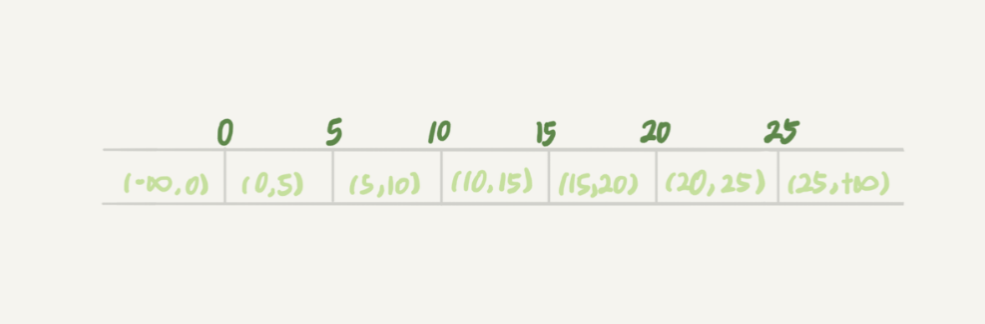

间隙锁与行锁不一样，我们直到跟行锁冲突的是另一个行锁，而 **跟间隙锁存在冲突关系的，是“往这个间隙中插入一个记录”这个操作**，例子如下：

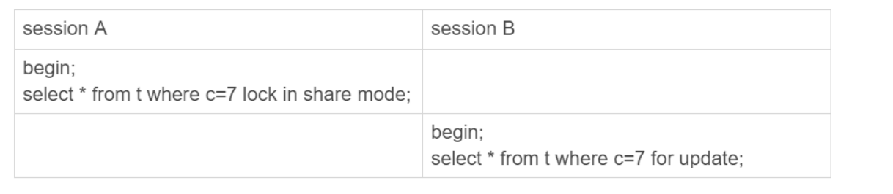

这里 session B 并不会被堵住。因为表 t 里并没有 c=7 这个记录，因此 session A 加的是间隙锁 (5,10)。而 session B 也是在这个间隙加的间隙锁。它们有共同的目标，即：保护这个间隙，不允许插入值。但，它们之间是不冲突的。


### Next-lock

间隙锁和行锁合称 next-key lock，每个 next-key lock 是前开后闭区间。也就是说，我们的表t 初始化以后，如果用 select * from t for update 要把整个表所有记录锁起来，就形成了 7 个next-key lock，分别是 (-∞,0]、(0,5]、(5,10]、(10,15]、(15,20]、(20, 25]、(25,+suprenum]

> 因为 +∞是开区间。实现上，InnoDB 给每个索引加了一个不存在的最大值 suprenum，这样才符合我们前面说的“都是前开后闭区间”

间隙锁的引入，可能会导致同样的语句锁住更大的范围，这其实是影响了并发度的

间隙锁的加锁规则如下：（版本： 5.x 系列 <=5.7.24，8.0 系列 <=8.0.13）

- **总结的加锁规则里面，包含了两个“原则”、两个“优化”和一个“bug”**
- 原则 1：加锁的基本单位是 next-key lock。希望你还记得，next-key lock 是前开后闭区间。
- 原则 2：查找过程中访问到的对象才会加锁。
- 优化 1：索引上的等值查询，给唯一索引加锁的时候，next-key lock 退化为行锁。
- 优化 2：索引上的等值查询，向右遍历时且最后一个值不满足等值条件的时候，next-keylock 退化为间隙锁。
- 一个 bug：唯一索引上的范围查询会访问到不满足条件的第一个值为止


#### **案例一：等值查询间隙锁**

第一个例子是关于等值条件操作间隙：

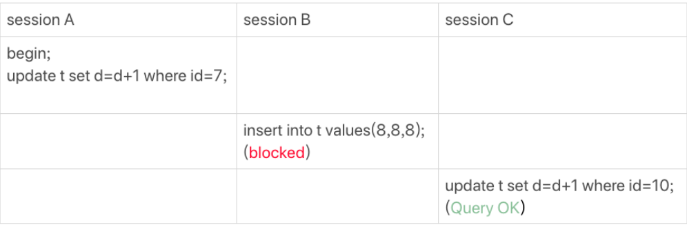

由于表 t 中没有 id=7 的记录，所以用我们上面提到的加锁规则判断一下的话：

1. 根据原则 1，加锁单位是 next-key lock，session A 加锁范围就是 (5,10]；
2. 同时根据优化 2，这是一个等值查询 (id=7)，而 id=10 不满足查询条件，next-key lock退化成间隙锁，因此最终加锁的范围是 (5,10)。


#### **案例二：非唯一索引等值锁**

第二个例子是关于覆盖索引上的锁：

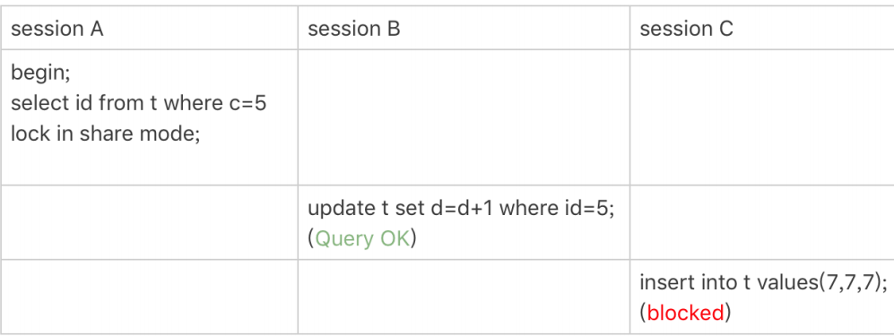

看到这个例子，你是不是有一种“该锁的不锁，不该锁的乱锁”的感觉？我们来分析一下吧。

这里 session A 要给索引 c 上 c=5 的这一行加上读锁。

1. 根据原则 1，加锁单位是 next-key lock，因此会给 (0,5] 加上 next-key lock。
2. 要注意 c 是普通索引，因此仅访问 c=5 这一条记录是不能马上停下来的，需要向右遍历，查到 c=10 才放弃。根据原则 2，访问到的都要加锁，因此要给 (5,10] 加 next-key lock。
3. 但是同时这个符合优化 2：等值判断，向右遍历，最后一个值不满足 c=5 这个等值条件，因此退化成间隙锁 (5,10)。
4. 根据原则 2 ，只有访问到的对象才会加锁，这个查询使用覆盖索引，并不需要访问主键索引，所以主键索引上没有加任何锁，这就是为什么 session B 的 update 语句可以执行完成。

但 session C 要插入一个 (7,7,7) 的记录，就会被 session A 的间隙锁 (5,10) 锁住。

需要注意，在这个例子中，lock in share mode 只锁覆盖索引，但是如果是 for update 就不一样了。 执行 for update 时，系统会认为你接下来要更新数据，因此会顺便给主键索引上满足条件的行加上行锁。

这个例子说明，锁是加在索引上的；同时，它给我们的指导是，如果你要用 lock in sharemode 来给行加读锁避免数据被更新的话，就必须得绕过覆盖索引的优化，在查询字段中加入索引中不存在的字段。比如，将 session A 的查询语句改成 select d from t where c=5 lockin share mode。你可以自己验证一下效果。


#### **案例三：主键索引范围锁**

第三个例子是关于范围查询的。

举例之前，你可以先思考一下这个问题：对于我们这个表 t，下面这两条查询语句，加锁范围相同吗？

```sql
mysql> select * from t where id=10 for update;
mysql> select * from t where id>=10 and id<11 for update;
```

你可能会想，id 定义为 int 类型，这两个语句就是等价的吧？其实，它们并不完全等价。

在逻辑上，这两条查语句肯定是等价的，但是它们的加锁规则不太一样。现在，我们就让session A 执行第二个查询语句，来看看加锁效果。

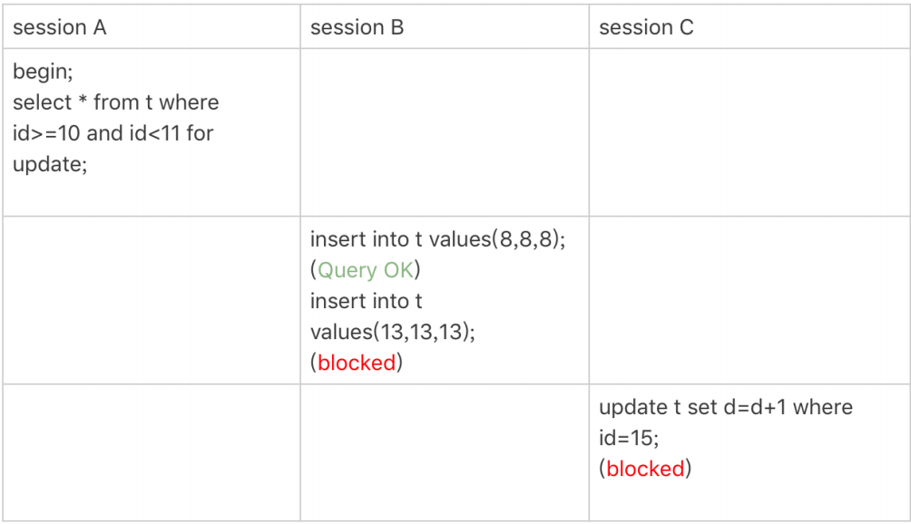

现在我们就用前面提到的加锁规则，来分析一下 session A 会加什么锁呢？

1. 开始执行的时候，要找到第一个 id=10 的行，因此本该是 next-key lock(5,10]。 根据优化1， 主键 id 上的等值条件，退化成行锁，只加了 id=10 这一行的行锁。
2.  范围查找就往后继续找，找到 id=15 这一行停下来，因此需要加 next-key lock(10,15]。

所以，session A 这时候锁的范围就是主键索引上，行锁 id=10 和 next-key lock(10,15]。这样，session B 和 session C 的结果你就能理解了。

这里你需要注意一点，首次 session A 定位查找 id=10 的行的时候，是当做等值查询来判断的，而向右扫描到 id=15 的时候，用的是范围查询判断。


#### **案例四：非唯一索引范围锁**

接下来，我们再看两个范围查询加锁的例子，你可以对照着案例三来看。

需要注意的是，与案例三不同的是，案例四中查询语句的 where 部分用的是字段 c。

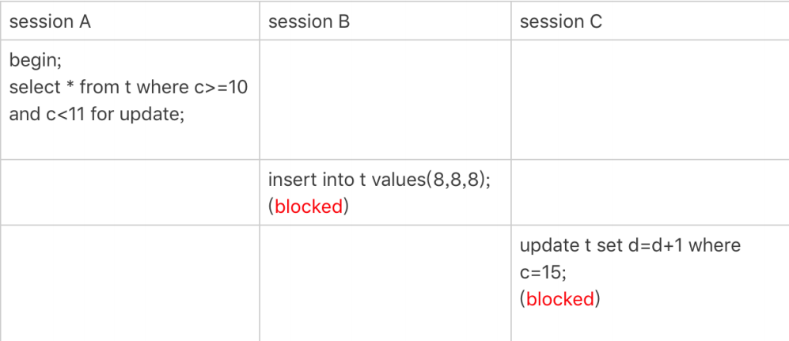

这次 session A 用字段 c 来判断，加锁规则跟案例三唯一的不同是：在第一次用 c=10 定位记录的时候，索引 c 上加了 (5,10] 这个 next-key lock 后，由于索引 c 是非唯一索引，没有优化规则，也就是说不会蜕变为行锁，因此最终 sesion A 加的锁是，索引 c 上的 (5,10] 和 (10,15]这两个 next-key lock。

所以从结果上来看，sesson B 要插入（8,8,8) 的这个 insert 语句时就被堵住了。

这里需要扫描到 c=15 才停止扫描，是合理的，因为 InnoDB 要扫到 c=15，才知道不需要继续往后找了。


#### **案例六：非唯一索引上存在"等值"的例子**

接下来的例子，是为了更好地说明“间隙”这个概念。这里，我给表 t 插入一条新记录。

```mysql
mysql> insert into t values(30,10,30);
```

新插入的这一行 c=10，也就是说现在表里有两个 c=10 的行。那么，这时候索引 c 上的间隙是什么状态了呢？你要知道，由于非唯一索引上包含主键的值，所以是不可能存在“相同”的两行的。

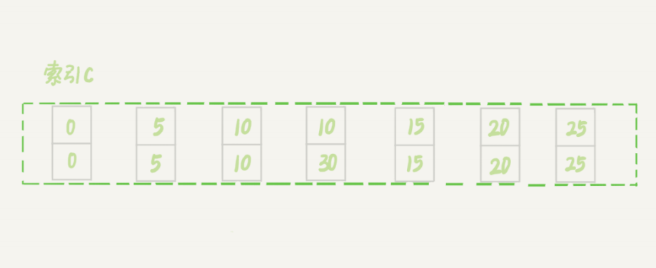

可以看到，虽然有两个 c=10，但是它们的主键值 id 是不同的（分别是 10 和 30），因此这两个 c=10 的记录之间，也是有间隙的。

图中我画出了索引 c 上的主键 id。为了跟间隙锁的开区间形式进行区别，我用 (c=10,id=30) 这样的形式，来表示索引上的一行。

现在，我们来看一下案例六。

这次我们用 delete 语句来验证。注意，delete 语句加锁的逻辑，其实跟 select ... for update是类似的，也就是我在文章开始总结的两个“原则”、两个“优化”和一个“bug”。

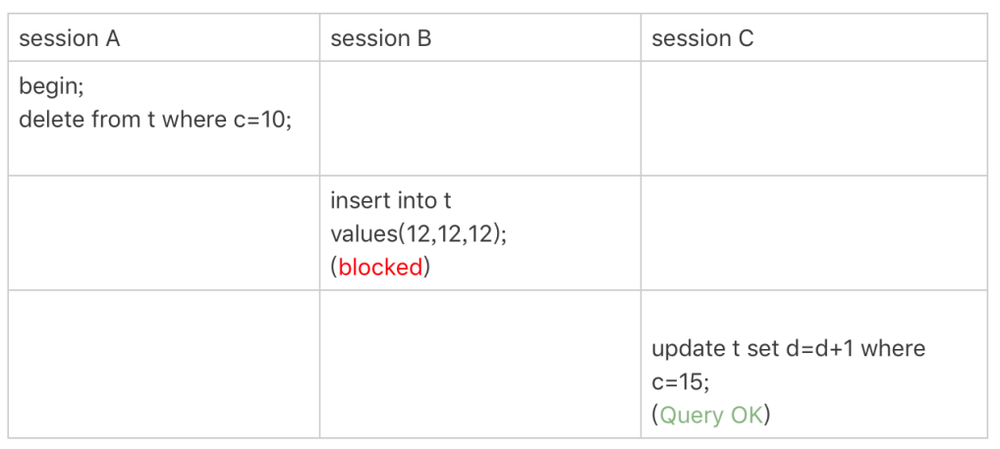

这时，session A 在遍历的时候，先访问第一个 c=10 的记录。同样地，根据原则 1，这里加的是 (c=5,id=5) 到 (c=10,id=10) 这个 next-key lock。

然后，session A 向右查找，直到碰到 (c=15,id=15) 这一行，循环才结束。根据优化 2，这是一个等值查询，向右查找到了不满足条件的行，所以会退化成 (c=10,id=10) 到 (c=15,id=15)的间隙锁。

也就是说，这个 delete 语句在索引 c 上的加锁范围，就是下图中蓝色区域覆盖的部分。

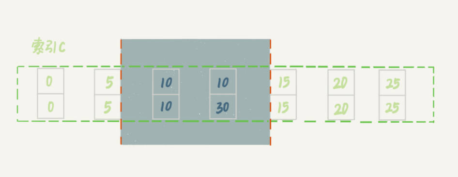

这个蓝色区域左右两边都是虚线，表示开区间，即 (c=5,id=5) 和 (c=15,id=15) 这两行上都没有锁。


#### **案例七：limit 语句加锁**

例子 6 也有一个对照案例，场景如下所示：

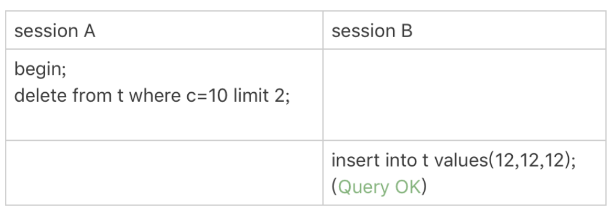

这个例子里，session A 的 delete 语句加了 limit 2。你知道表 t 里 c=10 的记录其实只有两条，因此加不加 limit 2，删除的效果都是一样的，但是加锁的效果却不同。可以看到，sessionB 的 insert 语句执行通过了，跟案例六的结果不同。

这是因为，案例七里的 delete 语句明确加了 limit 2 的限制，因此在遍历到 (c=10, id=30) 这一行之后，满足条件的语句已经有两条，循环就结束了。

因此，索引 c 上的加锁范围就变成了从（c=5,id=5) 到（c=10,id=30) 这个前开后闭区间，如下图所示： 

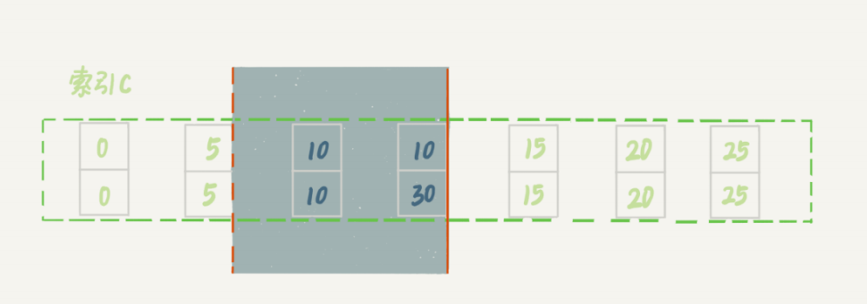

可以看到，(c=10,id=30）之后的这个间隙并没有在加锁范围里，因此 insert 语句插入 c=12是可以执行成功的。

这个例子对我们实践的指导意义就是，在删除数据的时候尽量加 limit。这样不仅可以控制删除数据的条数，让操作更安全，还可以减小加锁的范围。


### 间隙锁死锁

这里，我用两个 session 来模拟并发，并假设 N=9。

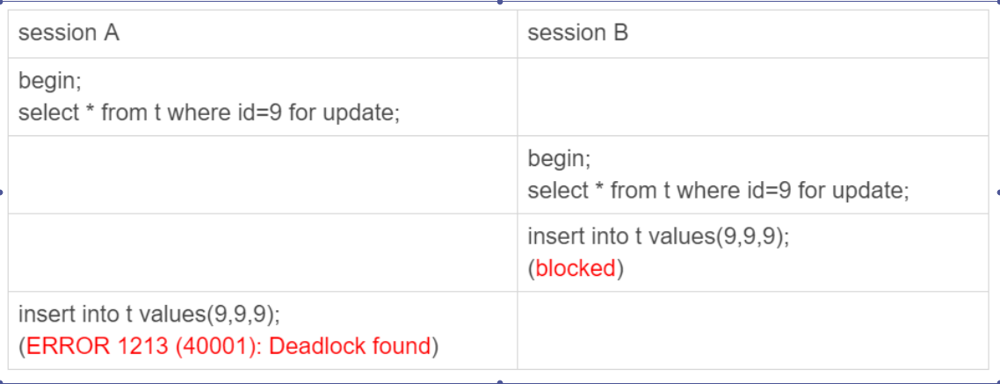

你看到了，其实都不需要用到后面的 update 语句，就已经形成死锁了。我们按语句执行顺序来分析一下：

1. session A 执行 select ... for update 语句，由于 id=9 这一行并不存在，因此会加上间隙锁 (5,10);
2. session B 执行 select ... for update 语句，同样会加上间隙锁 (5,10)，间隙锁之间不会冲突，因此这个语句可以执行成功；
3. session B 试图插入一行 (9,9,9)，被 session A 的间隙锁挡住了，只好进入等待；
4. session A 试图插入一行 (9,9,9)，被 session B 的间隙锁挡住了。

至此，两个 session 进入互相等待状态，形成死锁。当然，InnoDB 的死锁检测马上就发现了这对死锁关系，让 session A 的 insert 语句报错返回了。


## 扩展

### 常见的一些加锁项

1、当我们通过insert 插入一条语句时间，默认会在插入语句的主键、与二级索引上加上 RecordLock 锁，信息如下：

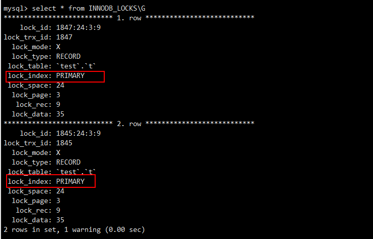

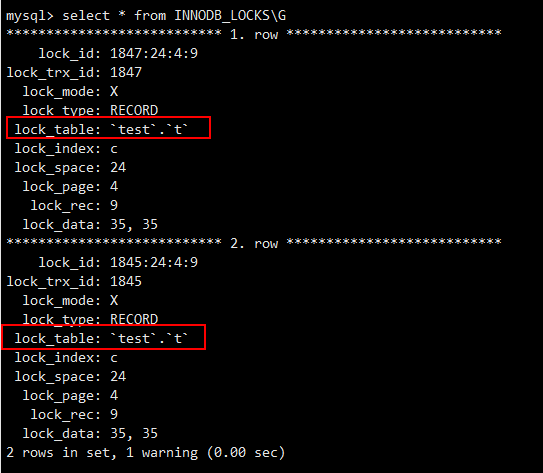


2、当我们select 使用当前读查询某个覆盖索引时，

- lock in share mode **只锁覆盖索引**，
- 但是如果是 for update 就不一样了。 执行 for update 时，系统会认为你接下来要更新数据，因此会**顺便给主键索引上满足条件的行加上行锁**。


### InnoDB锁相关状态查询

用户可以使用INFOMATION_SCHEMA库下的INNODB_TRX、INNODB_LOCKS和INNODB_LOCK_WAITS表来监控当前事务并分析可能出现的锁问题。或者通过查看 innodb 引擎的锁或者事务信息来定位问题

#### INNODB_TRX

INNODB_TRX 的定义如下表所示，其由8个字段组成。

- trx_id：InnoDB存储引擎内部唯一的事务ID
- trx_state：当前事务的状态
- trx_started：事务的开始时间
- trx_request_lock_id：等待事务的锁ID。如果trx_state的状态为LOCK WAIT,那么该字段代表当前事务等待之前事务占用的锁资源ID
- trx_wait_started：事务等待的时间
- trx_weight：事务的权重，反映了一个事务修改和锁住的行数，当发生死锁需要回滚时，会选择该数值最小的进行回滚
- trx_mysql_thread_id：线程ID，SHOW PROCESSLIST 显示的结果
- trx_query：事务运行的SQL语句

```
mysql> SELECT * FROM information_schema.INNODB_TRX\G;
************** 1.row ***********************
trx_id:  7311F4
trx_state: LOCK WAIT
trx_started: 2010-01-04 10:49:33
trx_requested_lock_id: 7311F4:96:3:2
trx_wait_started: 2010-01-04 10:49:33
trx_weight: 2
trx_mysql_thread_id: 471719
trx_query: select * from parent lock in share mode
```

 

#### INNODB_LOCKS

INNODB_TRX表只能显示当前运行的InnoDB事务，并不能直接判断锁的一些情况。如果需要查看锁，则还需要访问表INNODB_LOCKS，该表的字段组成如下表所示。

- lock_id：锁的ID
- lock_trx_id：事务的ID
- lock_mode：锁的模式
- lock_type：锁的类型，表锁还是行锁
- lock_table：要加锁的表
- lock_index：锁住的索引
- lock_space：锁住的space id
- lock_page：事务锁定页的数量，若是表锁，则该值为NULL
- lock_rec：事务锁定行的数量，如果是表锁，则该值为NULL
- lock_data：

```
mysql> SELECT * FROM information_schema.INNODB_LOCKS\G;
***************** 1.row ***********************
lock_id: 7311F4:96:3:2
lock_trx_id: 7311F4
lock_mode: S
lock_type: RECORD
lock_type: 'mytest'.'parent'
lock_index: 'PRIMARY'
lock_space: 96
lock_page: 3
lock_rec: 2
lock_data: 1
```

 通过表INNODB_LOCKS查看每张表上锁的情况后，用户就可以来判断由此引发的等待情况。当时当事务量非常大，其中锁和等待也时常发生，这个时候就不那么容易判断。但是通过表INNODB_LOCK_WAITS，可以很直观的反应当前事务的等待。表INNODB_LOCK_WAITS由四个字段组成，如下表所示。

- requesting_trx_id：申请锁资源的事务ID
- requesting_lock_id：申请的锁的ID
- blocking_trx_id：阻塞的事务ID
- blocking_lock_id：阻塞的锁的ID

```
mysql> SELECT * FROM information_schema.INNODB_LOCK_WAITS\G;
******************1.row**************************
requesting_trx_id: 7311F4
requesting_lock_id: 7311F4:96:3:2
blocking_trx_id: 730FEE
blocking_lock_id: 730FEE:96:3:2
```

通过上述的SQL语句，用户可以清楚直观地看到哪个事务阻塞了另一个事务，然后使用上述的事务ID和锁ID，去INNODB_TRX和INNDOB_LOCKS表中查看更加详细的信息。


#### 查看Innodb 引擎的状态

我们可以通过 show engine innodb status 来查看当前innodb 引擎中 锁或者事务的情况

```
------------
TRANSACTIONS
------------
Trx id counter 1826
Purge done for trx's n:o < 1819 undo n:o < 0 state: running but idle
History list length 0
LIST OF TRANSACTIONS FOR EACH SESSION:
---TRANSACTION 422152992988816, not started
0 lock struct(s), heap size 1136, 0 row lock(s)
---TRANSACTION 1825, ACTIVE 4 sec inserting
mysql tables in use 1, locked 1
LOCK WAIT 2 lock struct(s), heap size 1136, 1 row lock(s), undo log entries 1
MySQL thread id 3, OS thread handle 140677696808704, query id 161 localhost root update
insert into t values(1,1,5)
------- TRX HAS BEEN WAITING 4 SEC FOR THIS LOCK TO BE GRANTED:
RECORD LOCKS space id 24 page no 4 n bits 80 index c of table `test`.`t` trx id 1825 lock_mode X locks gap before rec insert intention waiting
Record lock, heap no 3 PHYSICAL RECORD: n_fields 2; compact format; info bits 0
 0: len 4; hex 80000005; asc     ;;
 1: len 4; hex 80000005; asc     ;;

------------------
---TRANSACTION 1824, ACTIVE 21 sec
4 lock struct(s), heap size 1136, 5 row lock(s)
MySQL thread id 2, OS thread handle 140677697079040, query id 160 localhost root
```


解释信息如下：

> 下面innodb 引擎的解释信息与上面的信息是不一样的，对照具体关键字知道意思即可

```
** (1) TRANSACTION:
TRANSACTION D20847, ACTIVE 141 sec starting index read
#这行表示事务D20847，ACTIVE 141 sec表示事务处于活跃状态141s，starting index read表示正在使用索引读取数据行

mysql tables in use 1, locked 1
#这行表示事务D20847正在使用1个表，且涉及锁的表有1个

LOCK WAIT 3 lock struct(s), heap size 376, 2 row lock(s)
#这行表示在等待3把锁，占用内存376字节，涉及2行记录，如果事务已经锁定了几行数据，这里将会有一行信息显示出锁定结构的数目（注意，这跟行锁是两回事）和堆大小，堆的大小指的是为了持有这些行锁而占用的内存大小，Innodb是用一种特殊的位图表来实现行锁的，从理论上讲，它可将每一个锁定的行表示为一个比特，经测试显示，每个锁通常不超过4比特

MySQL thread id 20027, OS thread handle 0x7f0a4c0f8700, query id 1818124 localhost root statistics
#这行表示该事务的线程ID信息，操作系统句柄信息，连接来源、用户

select * from test_deadlock where id=2 for update
#这行表示事务涉及的SQL
```

```
*** (1) WAITING FOR THIS LOCK TO BE GRANTED: 
#这行信息表示第一个事务正在等待锁被授予

RECORD LOCKS space id 441 page no 3 n bits 72 index `PRIMARY` of table `xiaoboluo`.`test_deadlock` trx id D20847 lock_mode X locks rec but not gap waiting
#这行信息表示等待的锁是一个record lock，空间id是441，页编号为3，大概位置在页的72位处，锁发生在表xiaoboluo.test_deadlock的主键上，是一个X锁，但是不是gap lock。 waiting表示正在等待锁

Record lock, heap no 3 PHYSICAL RECORD: n_fields 4; compact format; info bits 0
#这行表示record lock的heap no 位置

0: len 4; hex 00000002; asc ;;
1: len 6; hex 000000d20808; asc ;;
2: len 7; hex ad000001ab011d; asc ;;
3: len 4; hex 00000002; asc ;;
#这部分剩下的内容只对调试才有用。
```

