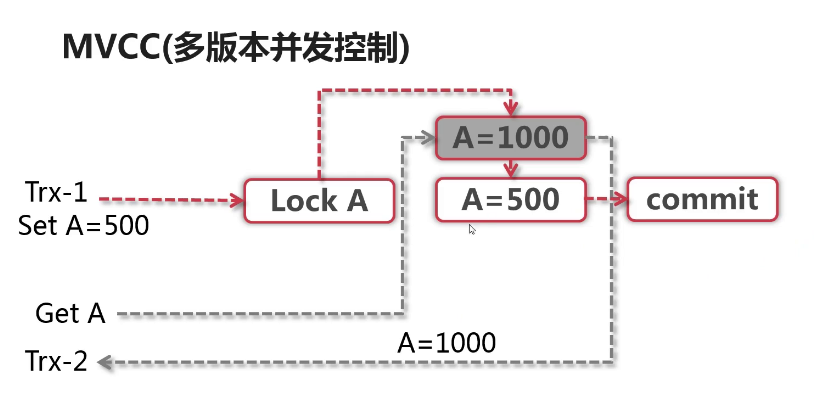
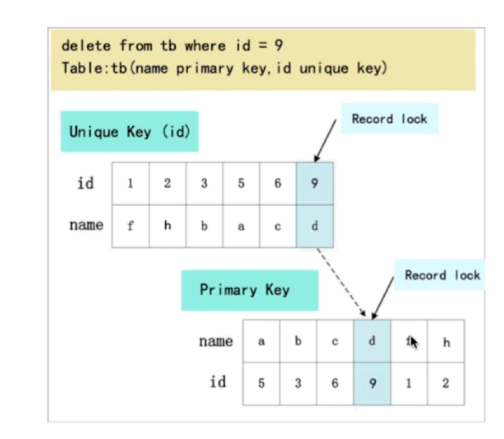
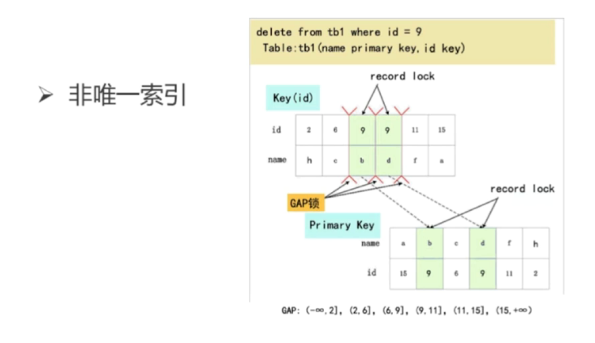

####mysql的锁机制？

```
Flush tables with read|write lock (FTWRL) 全局锁

local table read|write;	表锁

select * from tableName lock in share mode; (行级锁-排他锁)

select * from tableName for update;(行级锁-共享锁)
```

```
全局锁就是对整个数据库实例加锁。

MySQL 提供了一个加全局读锁的方法，命令是Flush tables with read lock (FTWRL)。

当你需要让整个库处于只读状态的时候，可以使用这个命令，之后其他线程的以下语句会被阻塞：数据更新语句（数据的增删改）、数据定义语句（包括建表、修改表结构等）和更新类事务的提交语句。
```


```
表级锁 分为两种

显示锁（lock table）
显示的为当前表加上表级锁

（锁升级）
当查询某一行数据（加共享锁）且条件中不使用索引的时候会自动升级为表级锁
	
MDL锁：
在访问某一个表的数据的时候会自动加上该锁，保证在数据CRUD执行期间表结构不会被修改
在 MySQL 5.5 版本中引入了 MDL，当对一个表做增删改查操作的时候，加 MDL 读锁；当要对表做结构变更操作的时候，加 MDL 写锁
```


```
行锁：
	在 InnoDB 事务中，行锁是在需要的时候才加上的，但并不是不需要了就立刻释放，而是要等到事务结束时才释放。这个就是两阶段锁协议。

	如果你的事务中需要锁多个行，要把最可能造成锁冲突、最可能影响并发度的锁尽量往后放。
```

```
死锁和死锁检测
	mysql会自动检测到死锁，并且将事物资源少的一方进行回滚操作
	
	一种策略是，直接进入等待，直到超时。这个超时时间可以通过参数innodb_lock_wait_timeout 来设置
	innodb_lock_wait_timeout
	
	pt-deadlock-logger 来记录死锁信息
	
	innodb_print_all_deadlocks 参数设置为ON，则在error.log中记录死锁信息
```


```
如果你要删除一个表里面的前 10000 行数据，有以下三种方法可以做到：

第一种，直接执行 delete from T limit 10000;

第二种，在一个连接中循环执行 20 次 delete from T limit 500;

第三种，在 20 个连接中同时执行 delete from T limit 500。

第一种方式（即：直接执行 delete from T limit 10000）里面，单个语句占用时间长，锁的时间也比较长；而且大事务还会导致主从延迟。

第三种方式（即：在 20 个连接中同时执行 delete from T limit 500），会人为造成锁冲突。
```


#### mysql数据库锁的分类：

```
按锁的粒度划分
	表级锁、行级锁、页级锁
	
按锁的级别划分
	共享锁
	排他锁
	
按锁的方式划分
	自动锁
	显式锁
	
按操作划分
	DML锁 和 DDL锁
	
按使用方式划分
	悲观锁
	乐观锁
	
myisam使用的是表级锁，不支持行级锁
innodb使用的是行级锁
```


#### mvcc机制

```
读写是否会相互阻塞

利用 undo log来实现mvcc的并发控制
```




```
RC和RR级别的非阻塞读？

数据行中存储的 DB_TRX_ID,DB_ROLL_PTR,DB_ROW_ID

DB_TRX_ID : 最近修改本行的事物ID

DB_ROLL_PTR：写入undo log的回滚指针

DB_ROW_ID：行号（主键的值）

undo log 
	insert undo log（事物对insert产生的记录，在事物回滚时需要，事物提交后就会丢弃）
	update undo log（事物对update和delete时产生的记录，回滚和 快照读都需要）
```

```
流程如下：
	 首先排他锁锁定改行数据
	 然后拷贝一份数据到undo log中
	 修改当前行的值，修改回滚指针指向undo log中的值
	 
	如过其他事物使用快照读来读取该行数据，那么undo log中就会又增加一行数据
```


read view

主要是进行快照读的时候，当前可以看到的哪个版本的数据

遵循可见性算法，将要修改的db_trx_id取出，如过事物id >= 活跃事物id上一层的db_trx_id


#### Gap锁（RC与 低级别不支持）

```
RR 与 Seriallize 使用 该锁

如过where 条件全部命中，则不会使用Gap锁，只会加记录锁

比如 where id in(1,3,5) 如过全部命中则不加，如过只命中 1,3 则加gap锁 

如过部分命中的话则在部分范围内进行加锁。
```







#### mysql锁；

```
当查询不走索引时，默认就会使用表锁

SET AUTOCOMMIT = 0;

START TRANSACTION;
SELECT * FROM t_demo WHERE commpoent = 'wang' LOCK IN SHARE MODE;
COMMIT ;


SET AUTOCOMMIT = 0;

UPDATE t_demo SET u_name = 'xiao' WHERE commpoent = 'zhang';

COMMIT ;
```

