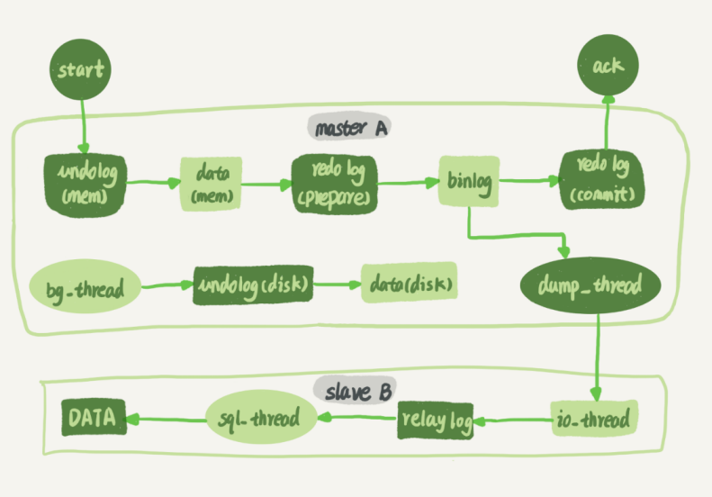
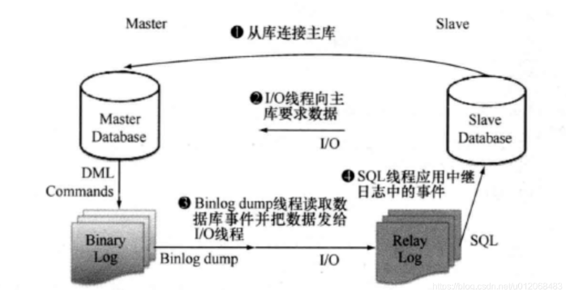
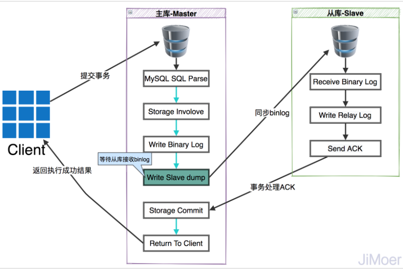
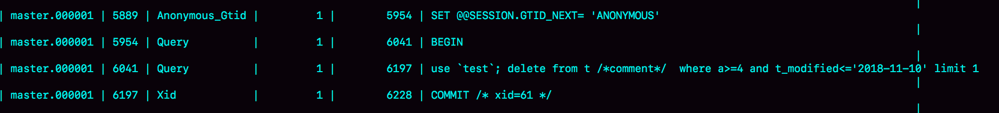
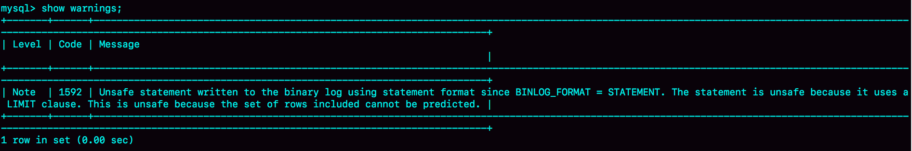
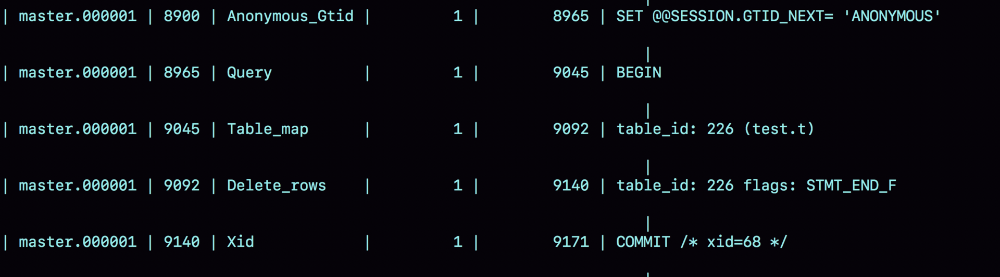

# Mysql 主从复制

mysql 主从复制主要分为三种方式，分别为异步复制、GTID 复制、半同步复制，具体的设置方式见：https://blog.csdn.net/WHDCCDJA/article/details/123796932

## 异步复制

异步复制是以前主从复制中最常用的方式，我们知道在Mysql提交事务时，使用的是两阶段提交的形式来保证不丢失数据的，既在写入Redo log 时并不会直接提交，而是将状态设置为prepare，然后再写入到binlog中，当binlog写入完成后，再提交redo log ，而异步复制则是在写入binlog后进行的，见下图：



1、当主库的数据写入到binlog 后，会由dump_thread 线程复制将binlog中的数据传输给slave

2、salve中的io_thread 接收到日志以后写入到本地文件，称之为中转日志 relay log

3、slave 中sql_thread 负责从relay log 读取新增的日志进行解析，并执行

### 优缺点

异步复制的方式有优点也有一些缺点，

**优点:** 不会阻塞到当前事务执行，当dump_thread 复制日志传输到 slave上，不需要关注slave是否接收到，就可以提交当前master的事务，

**缺点：**由于是异步复制，当slave 没有接收到master的日志或者是master在写入后故障而导致主从切换，就会导致数据丢失, 并且在master或者是slave发生故障后需要手动进行主从切换或者是手动找到 Binlog 和 位点信息，来恢复数据，以及将主节点指向新的主节点


## GITD 复制

GITD 流程上与传统的主从异步复制是一样的， 但是提供了新的数据恢复思路，当主从复制故障时，只需要知道主节点的 IP、端口以及账号密码就行，因为复制是自动的，MySQL 会通过内部机制 GTID 自动找点同步


### GTID 

GITD 指的是全局事务 ID，全程是 Global Transaction Identifier ，在整个事务流程中每一个事务 ID 是全局唯一的，且在整个主从复制架构中该 ID 都不会相同。

基于 GTID 的主从复制方主要是用于替换传统的日志点 复制方式。通过GTID 可以保证每个主库提交的事务在集群中都有 唯一 的一个事务 ID。强化了数据库主从的一致性和故障恢复数据的容错能力，在主库 宕机发生主从切换 的情况下，GTID 方式可以让其他从库自动找到新主库复制的位置。而且 GTID 可以忽略已经执行过的事务，减少了数据发生错误的概率

>GTID 由server_uuid +tid 组成，其中：
>
>- **server_uuid：** `server_uuid` 是在 Mysql 首次启动过程中自动生成的一个`uuid(128位)` 随机值，生成后会将该值存储到数据目录的`auto.cnf` 中。因为是随机值，所以不同服务器的 Mysql 的server_uuid 都是不相同的。
>- **tid：** 代表了该实例上已经提交的事务数量，是一个整数，初始值是 `1` ，每次提交事务的时候分配给这个事务并加`1` 。

其组成样式如下：
fb90fba5-60cf-11eb-b5fa-000c295fbc5f:21

### GITD复制流程

GITD 的复制流程与异步复制是大体一致的，不一样的地方在于基于binlog复制的方式不一样，异步复制是基于offset来进行复制的，而GITD 则是基于gtid来复制的，流程如下：



- ① 主节点执行事务提交前会产生一个 `GTID` ，其会随着事务一起记录到 `binlog` 日志中。
- ② 从节点 `I/O Thread` 会读取主节点的 `binlog` 日志文件并存储在从节点的 `relaylog` 日志中。从节点将主节点的 `GTID` 这个值配置到 `gtid_next` 中，即下一个要读取的 GTID 值。
- ③ 从节点读取 `gtid_next` 中的值，然后查找自己的 `binlog` 日志中是否有这个 `GTID` 。
- ④ 如果有这个记录，说明这个 `GTID` 的事务已经执行过了，就忽略掉。
- ⑤ 如果没有这个记录，从节点就会执行该 GTID 事务，并记录到自己的 `binlog` 日志中。在读取执行事务前会先检查其他`session` 中是否持有该 `GTID` ，确保不被重复执行。
- ⑥ 在解析过程中会判断是否有主键，如果没有就用二级索引，如果没有就用全部扫描。

> 通俗流程解释如下：
>
> 1、Master写入记录前生成一个 `GTID`
> 2、Master将`GTID`和数据一起写入二进制日志中，Dump _thread 将数据传输给 slave
> 3、slave 端的 IO 线程将变更的 binlog写入到本地的 relay-log（中继日志）中；
> 4、sql 线程从 relay-log 中获取对应的 GTID，对比 slave 端的 binlog 的记录 ；
> 5、如果有记录，说明该 GTID 的事务已执行，slave 会忽略该 GTID；
> 6、如果没有记录，slave 会从 relay-log 中执行该 GTID 的事务，并记录到 binlog 中；


### 优缺点

GITD 同步的优点与 异步复制是一样的，因为都是异步的方式进行复制的，所以都不会阻塞Master事务的执行，缺点就是可能在Master提交事务后发生故障，Slave 还没有同步完成数据，这时候主从切换导致数据丢失


## 半同步复制

半同步复制介于异步复制和全同步复制之间，主库在执行完客户端提交的事务后不是立刻返回给客户端，而是等待至少一个Slave接收到并写到relay log中才将Master中的Redo log 进行提交并且结束Master中的事务。相对于异步复制，半同步复制提高了数据的安全性，同时它也造成了一定程度的延迟，这个延迟最少是一个TCP/IP往返的时间。所以，**半同步复制最好在低延时的网络中使用**。

半同步复制模式，可以很明确的知道，在一个事务提交成功之后，此事务至少会存在于两个地方一个是主库一个是从库中的某一个。主要原理是，在master的dump线程去通知从库时，增加了一个ACK机制，也就是会确认从库是否收到事务的标志码，master的dump线程不但要发送binlog到从库，还有负责接收slave的ACK。当出现异常时或者超时后，Slave没有ACK事务，那么将自动降级为异步复制，直到异常修复后再自动变为半同步复制

流程如下：



1、Master 写入数据到binlog, 并且将binlog 发送到slave

2、slave 中的io_thread 读取binlog 并且写入到relay log，然后基于当前复制的请求回复ACK （只要有一个slave 回复ack，则标志当前同步已经完成）

3、当slave发生异常或者是超时，那么就会将半同步复制降级为异步复制，直到有slave回复 ACK

4、master 接收到ACK或者是由于超时以及其他原因无法接收到ACK，那么Master就会提交 redo log，并且结束当前事务

### 优缺点

对比于GTID 与 异步复制来说，半同步复制可以确保数据不会丢失，但是相较于其他两种复制方式来说 可能会导致Master事务阻塞 以及性能降低


## binlog 格式

binlog的格式存储分为三种，分别为 row，statement、mixed ，假设我们要执行这个sql ：delete from table where id < 10，而数据库 id < 10 的有8条数据

row格式： 将会记录下这8条数据，分别都是什么

statement：只会记录当前这个sql

mixed：根据具体的情况判断到底是使用什么样的方式进行记录


为了便于描述 binlog 的这三种格式间的区别，我创建了一个表，并初始化几行数据。如果要在表中删除一行数据的话，

```mysql
CREATE TABLE `t` (
    `id` int(11) NOT NULL,
    `a` int(11) DEFAULT NULL,
    `t_modified` timestamp NOT NULL DEFAULT CURRENT_TIMESTAMP,
    PRIMARY KEY (`id`),
    KEY `a` (`a`),
    KEY `t_modified`(`t_modified`)
    ENGINE=InnoDB;
    
    
  insert into t values(1,1,'2018-11-13');
  insert into t values(2,2,'2018-11-12');
  insert into t values(3,3,'2018-11-11');
  insert into t values(4,4,'2018-11-10');
  insert into t values(5,5,'2018-11-09');
```

如果要在表中删除一行数据的话，我们来看看这个 delete 语句的 binlog 是怎么记录的。

注意，下面这个语句包含注释，如果你用 MySQL 客户端来做这个实验的话，要记得加 -c 参数，否则客户端会自动去掉注释。

```
mysql> delete from t /*comment*/  where a>=4 and t_modified<='2018-11-10' limit 1;
```

当 binlog_format=statement 时，binlog 里面记录的就是 SQL 语句的原文。你可以用命令看 binlog 中的内容

```
mysql> show binlog events in 'master.000001'
```



现在，我们来看一下图 3 的输出结果。

- 第一行 SET @@SESSION.GTID_NEXT='ANONYMOUS’你可以先忽略，后面文章我们会在介绍主备切换的时候再提到；
- 第二行是一个 BEGIN，跟第四行的 commit 对应，表示中间是一个事务；
- 第三行就是真实执行的语句了。可以看到，在真实执行的 delete 命令之前，还有一个“use‘test’”命令。这条命令不是我们主动执行的，而是 MySQL 根据当前要操作的表所在的数据库，自行添加的。这样做可以保证日志传到备库去执行的时候，不论当前的工作线程在哪个库里，都能够正确地更新到 test 库的表 t。 use 'test’命令之后的 delete 语句，就是我们输入的 SQL 原文了。可以看到，binlog“忠实”地记录了 SQL 命令，甚至连注释也一并记录了。
- 最后一行是一个 COMMIT。你可以看到里面写着 xid=61。

为了说明 statement 和 row 格式的区别，我们来看一下这条 delete 命令的执行效果图：



可以看到，运行这条 delete 命令产生了一个 warning，原因是当前 binlog 设置的是statement 格式，并且语句中有 limit，所以这个命令可能是 unsafe 的。

为什么这么说呢？这是因为 delete 带 limit，很可能会出现主备数据不一致的情况。比如上面这个例子：

1. 如果 delete 语句使用的是索引 a，那么会根据索引 a 找到第一个满足条件的行，也就是说删除的是 a=4 这一行；
2. 2. 但如果使用的是索引 t_modified，那么删除的就是 t_modified='2018-11-09’也就是a=5 这一行。

由于 statement 格式下，记录到 binlog 里的是语句原文，因此可能会出现这样一种情况：在主库执行这条 SQL 语句的时候，用的是索引 a；而在备库执行这条 SQL 语句的时候，却使用了索引 t_modified。因此，MySQL 认为这样写是有风险的。

那么，如果我把 binlog 的格式改为 binlog_format=‘row’， 是不是就没有这个问题了呢？我们先来看看这时候 binog 中的内容吧。



可以看到，与 statement 格式的 binlog 相比，前后的 BEGIN 和 COMMIT 是一样的。但是，row 格式的 binlog 里没有了 SQL 语句的原文，而是替换成了两个 event：Table_map 和Delete_rows。

1. Table_map event，用于说明接下来要操作的表是 test 库的表 t;
2. Delete_rows event，用于定义删除的行为。

其实，我们通过图 5 是看不到详细信息的，还需要借助 mysqlbinlog 工具，用下面这个命令解析和查看 binlog 中的内容。因为图 5 中的信息显示，这个事务的 binlog 是从 8900 这个位置开始的，所以可以用 start-position 参数来指定从这个位置的日志开始解析

```
mysqlbinlog -vv data/master.000001 --start-position=8900;
```


从这个图中，我们可以看到以下几个信息：

- server id 1，表示这个事务是在 server_id=1 的这个库上执行的。
- 每个 event 都有 CRC32 的值，这是因为我把参数 binlog_checksum 设置成了 CRC32。
- Table_map event 跟在图 5 中看到的相同，显示了接下来要打开的表，map 到数字 226。现在我们这条 SQL 语句只操作了一张表，如果要操作多张表呢？每个表都有一个对应的Table_map event、都会 map 到一个单独的数字，用于区分对不同表的操作。
- 我们在 mysqlbinlog 的命令中，使用了 -vv 参数是为了把内容都解析出来，所以从结果里面可以看到各个字段的值（比如，@1=4、 @2=4 这些值）。
- binlog_row_image 的默认配置是 FULL，因此 Delete_event 里面，包含了删掉的行的所有字段的值。如果把 binlog_row_image 设置为 MINIMAL，则只会记录必要的信息，在这个例子里，就是只会记录 id=4 这个信息。
- 最后的 Xid event，用于表示事务被正确地提交了。

你可以看到，当 binlog_format 使用 row 格式的时候，binlog 里面记录了真实删除行的主键id，这样 binlog 传到备库去的时候，就肯定会删除 id=4 的行，不会有主备删除不同行的问题。


