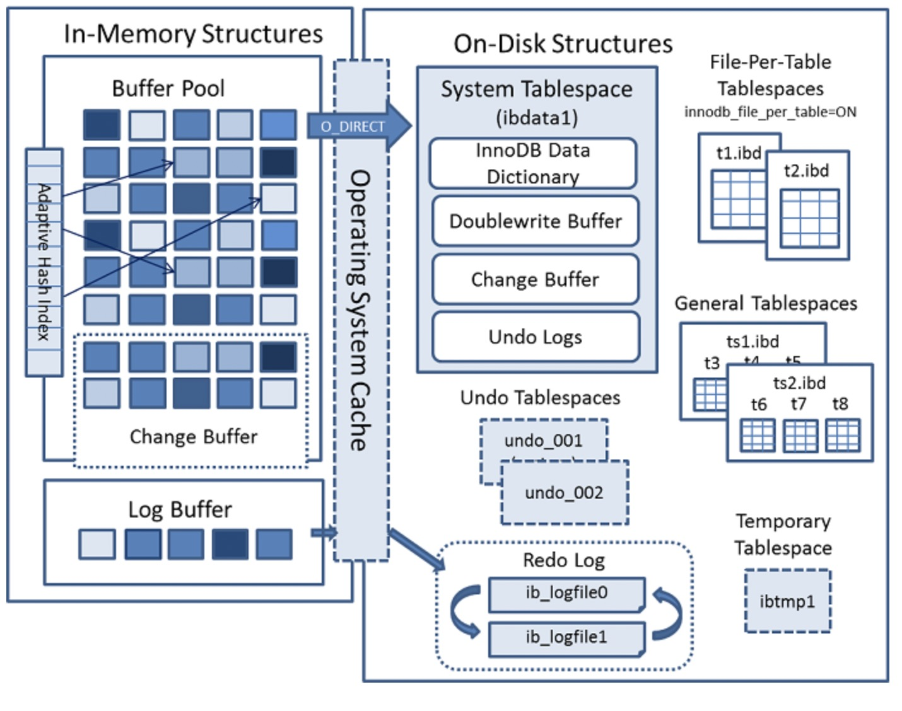

## Innodb引擎详解

### 概览

Innodb引擎架构图如下：

  

InnoDB 使用日志先行策略， 数据修改先在内存中完成，并且将事务记录成重做日志(Redo Log)，转换为顺序IO高效的提交事务。这里日志先行，说的是日志记录到数据库以后，对应的事务就可以返回给用户，表示事务完成。但是实际上，这个数据可能还只在内存中修改完，并没有刷到磁盘上去。内存是易失的，如果在数据落地前，机器挂了，那么这部分数据就丢失了。
InnoDB 通过 redo 日志来保证数据的一致性。如果保存所有的重做日志，显然可以在系统崩溃时根据日志重建数据。当然记录所有的重做日志不太现实，所以 InnoDB 引入了检查点机制。即定期检查，保证检查点之前的日志都已经写到磁盘，则下次恢复只需要从检查点开始。 

### 内存结构

Innodb在整体上分为 三大块，分别为 内存、 Cache、磁盘，而我们只需要内存与磁盘即可

Innodb 的内存机构包括四大组件分别为：

- `Buffer Pool`：缓冲池：是主内存中的一个区域，在InnoDB访问表和索引数据时会在其中进行高速缓存，大量减少磁盘IO操作，提升效率。
- `Change Buffer`：写缓冲区：避免每次增删改都进行IO操作，提升性能。
- `Adaptive Hash Index`：自适应哈希索引：使用索引关键字的前缀构建哈希索引，提升查询速度。
- `Log Buffer`：日志缓冲区：保存要写入磁盘上的日志文件的数据，缓冲区的内容定期刷新到磁盘

如果从内存上看 Change Buffer 与 Adaptive Hash Index 占用的内存都属于Buffer Pool，Log Buffer占用的内存与 Buffer Pool独立。 

- 内存结构 (内存结构又包括四大组件)

  `Buffer Pool`：缓冲池：是主内存中的一个区域，在InnoDB访问表和索引数据时会在其中进行高速缓存，大量减少磁盘IO操作，提升效率。

  `Change Buffer`：写缓冲区：避免每次增删改都进行IO操作，提升性能。

  `Adaptive Hash Index`：自适应哈希索引：使用索引关键字的前缀构建哈希索引，提升查询速度。

  `Log Buffer`：日志缓冲区：保存要写入磁盘上的日志文件的数据，缓冲区的内容定期刷新到磁盘。

- 磁盘结构

  `Tables`：数据表的物理结构。

  `Indexes`：索引的物理结构。

  `Tablespaces`：表空间，数据存储区域。

  `Data Dictionary`：数据字典，存储元数据信息的表，例如表的描述，结构，索引等。

  `Doublewrite Buffer`：位于系统表空间的一个存储区域，InnoDB在BufferPool中刷新页面时，会将数据页写入该缓冲区后才会写入磁盘。

  `Redo Log`：记录DML操作的日志，用来崩溃后的数据恢复。

  `Undo Logs`：数据更改前的快照，可以用来回滚数据。