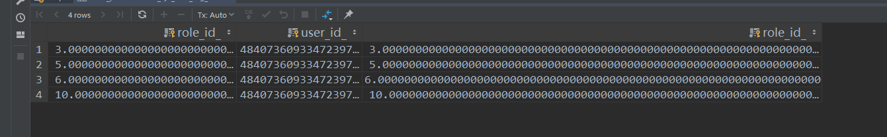

## 对数据进行分组排序，取分组排序后每组数据的前两条数据

基础数据



1、第一种思路

```sql
select a.role_id_, a.user_id_
  from t_user_org_role a
  where a.user_id_ = 48407360933472397
    and (select count(*)
         from t_sys_user_org_role b
         where a.user_id_ = b.user_id_

           and a.org_id_ = b.org_id_
           and a.role_id_ < b.role_id_) < 2
  ORDER BY a.user_id_, a.role_id_ DESC;
```

首先使用内联的笛卡尔积进行筛选查询，所谓的 where select count(*) 就是用外部的所有数据在内存进行线性遍历筛选，然后对筛选的数据进行 统计查询


2、第二种思路

```sql
select a.role_id_ as a_role_id,
         b.role_id_ as b_role_id,
         a.user_id_
  from t_sys_user_org_role a
         left join t_sys_user_org_role b on a.org_id_ = b.org_id_ and a.user_id_ = b.user_id_
    and a.role_id_ < b.role_id_
  where a.user_id_ in (48407360933472397)
  group by a.org_id_, a.user_id_, a.role_id_
  having count(b.role_id_) < 2;
```

进行左连接对比，在左连接的时候，最大数据对应右边数据会为null，然后对左边的数据进行分组就可以得到最大值

这种方法不能再where中进行对比过滤，因为使用where 做对比过滤的时候会导致最大数据被筛选掉