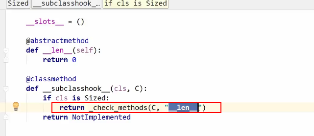

### python 基础类型

python的所有基础类型都在 abc模块中 

```
from collections.abc import Sized
```

比如 判断 对象是否是具有 len 长度的

```
isinstance(obj,Sized) 
```

<br>

<br>

### python 抽象基类

例如 Sized 基类

```
class C(metaclass=ABCMeta):

    @abstractmethod
    def my_abstract_method(self, attr):
        ...


class C1(C):

    def my_abstract_method(self, attr):
        ...

    def __init__(self):
        self.my_abstract_method(self, 1)
```

以上就是类似java的 抽象方法 ，如过没有重写 abstract 方法，则会提示 

Class C1 must implement all abstract methods


abc 下的 基准 类型 只是为了介绍py的这些类型标准，并不推荐实现

<br>

<br>

### python 继承


```
继承 object

class Demo(object):

    def __init__(self):
        self.name = 1
        self.age = 2


if __name__ == '__main__':
    demo = Demo()
    print(demo.age)
```


查看某个对象是否有某个属性`hasattr`

isinstance(a,abc.XXX基类)

<br>

<br>

### python class的装饰器


- @abstractmethod ： 表示子类必须实现抽象方法
- @staticmethod：表示是类方法
- @property ：表示是 类的属性


魔法函数

```
__subclass_hook__
```



isinstance 就是 使用的 `__subclasshook__`


### isinstance 和 type的区别

type 只是查看当前对象的类型，但是出现继承以后 并不能指向父类的类型

```
class A:
    ...


class Demo(A):

    def __init__(self):
        self.name = 1
        self.age = 2


d = Demo()
print(type(d) == A)

print(isinstance(d, A))

输出结果：
Flase
True
```


### is 和 == 的区别 


== 比较的是地址，而 is 比较的是值，`id()` 返回的是对象的地址

```
d = Demo()

id(d) 返回d的地址
```


### 类变量 和实例变量

```
class A:
    # 实例变量
    aa = 1

    def __init__(self, x, y):
        # 对象变量
        self.x = x
        self.y = y
        self.aa = 2


a = A(2, 3)

# 因为 aa变量是属于类变量，但是python 查找时会自下向上查找 对象属性-> 类属性
print(a.x, a.y, a.aa)

# 打印查找顺序
print(A.mro())

输出结果：
2 3 2
[<class '__main__.A'>, <class 'object'>]
```

**注意：python 是不会向下查找的，就是说 类.属性 查找不到时 会从父类查找，而不会从对象属性查找**

<br>

```
a = A()

#会新建一个属性aa 并且赋值为a
a.aa = 3 
```

类变量是所有实例共享的


### 类和实例属性的查找顺序 mro

```
class A:
    name = "A"


class B(A):
    name = "B"


class C:
    name = "C"


class D(C):
    name = "D"


class E(B, D):
    ...


print(E.name)
print(E.__mro__)

输出：
B
(<class '__main__.E'>, <class '__main__.B'>, <class '__main__.A'>, <class '__main__.D'>, <class '__main__.C'>, <class 'object'>)


```

查找顺序就为：B,A,D,C,object ，因为py支持多继承，所以在查找父类顺序时，就会根据mro算法查找


### 静态方法、类方法、实例方法

```
class Date:
    parttren = "yyyy-MM-dd"

    def __init__(self, year, month, day):
        self.year = year
        self.month = month
        self.day = day

    # 实例方法
    def tomorrow(self):
        return Date(self.year, self.month, self.day + 1)

    # 实现toString
    def __str__(self):
        return "{year}/{month}/{day}".format(year=self.year, month=self.month, day=self.day)

    # 静态方法不会传入当前的cls对象,并且无法获取类属性，一般用于不需要class的场景
    @staticmethod
    def parse(date_str):
        ...

    # 类方法则会将当前的class 作为对象传入，可以获取类属性
    @classmethod
    def parse_date(cls):
        
        # 直接使用class 可以实例化对象
        return cls(1, 2, 3)


# 直接使用类调用
Date.parse("")

# 直接使用类调用
Date.parse_date()
```


**注意：静态方法是无法放入类属性的，并且类方法中，可以直接用cls 来实例化对象**


### 数据封装（私有属性）

```
class User:
    __name = "123"

    def __init__(self, day):
        self.__day = day

    def get_day(self):
        return self._day


if __name__ == '__main__':
    user = User(13)
    user.get_day()

```


可以在属性前面使用双下划线，将该属性设置为私有，但是还是能访问到的。比如：

```
print(user._User__day)
```

可以使用对象.class名称 ＋　属性名称获取，还是可以获取属性值的


### python 的自省机制

自省是通过一定的机制查询到对象的内部结构

```
class Person:

    # 这个是定义了当前对象的 __doc__ 属性
    """
    Person Class
    """
    name = "user"


class Student(Person):
    def __init__(self, school_name):
        self.school_name = school_name


class User:
    __name = "123"

    def __init__(self, day):
        self.__day = day

    def get_day(self):
        return self.__day


if __name__ == '__main__':

    # 通过 __dict__ 查询属性
    user = Student("工作室")
    print(user.__dict__)

    # 查询 Person class 对象的属性
    print(Person.__dict__)

    # 通过dir()函数列出对象所有属性,dir 可以查找到类对象的所有属性以及实例的所有属性
    print(dir(user))
	
	# 只查找当前对象的所有属性，并不包括类实例的
    print(user.__dir__())

    # Person类定义的doc 文档
    print(Person.__doc__)
```


执行结果：

{'school_name': '工作室'}

{'__module__': '__main__', '__doc__': '\n    Person Class\n    ', 'name': 'user', '__dict__': <attribute '__dict__' of 'Person' objects>, '__weakref__': <attribute '__weakref__' of 'Person' objects>}

['__class__', '__delattr__', '__dict__', '__dir__', '__doc__', '__eq__', '__format__', '__ge__', '__getattribute__', '__gt__', '__hash__', '__init__', '__init_subclass__', '__le__', '__lt__', '__module__', '__ne__', '__new__', '__reduce__', '__reduce_ex__', '__repr__', '__setattr__', '__sizeof__', '__str__', '__subclasshook__', '__weakref__', 'name', 'school_name']

['school_name', '__module__', '__init__', '__doc__', 'name', '__dict__', '__weakref__', '__repr__', '__hash__', '__str__', '__getattribute__', '__setattr__', '__delattr__', '__lt__', '__le__', '__eq__', '__ne__', '__gt__', '__ge__', '__new__', '__reduce_ex__', '__reduce__', '__subclasshook__', '__init_subclass__', '__format__', '__sizeof__', '__dir__', '__class__']

Person Class


### super 函数

调用父类方法，或者初始化方法

```
class A:
    def __init__(self, name):
        self.name = name

    def set_name(self, name):
        self.name = name
        print(self.name)


class B(A):
    def __init__(self, name):
        # 在子类执行初始化方法的时候，调用父类的初始化方法
        super().__init__(name)
        print("B")

    def getName(self, name):
        super().set_name(name)


b = B("A")
b.getName("C")
```


### mixin 多继承

- mixin 类的功能很单一；

- 只是定义了一些方法（类似java接口）不和基类关联，可以和任意基类关联；

- 在mixin中不要使用super这种方法


```
class A(BMixIn,CMixIn):
	...
```


### with 语句（上下文管理器）

try except finally else 语法

```
try：
	pass
except KeyError as e:
	pass

# 如过没有抛出异常则执行else逻辑	
else:
	pass

# 不管有没有异常都会进入finally 语句
finally:
	pass	
```

<br>

上下文管理器相关的魔法函数

```
class FileIO:

    def __init__(self):
        ...

    def __enter__(self):
    	# 获取资源
        print("enter")

    def __exit__(self, exc_type, exc_val, exc_tb):
        # 释放资源
        print("exit")
        if exc_type:
            print(exc_type)


if __name__ == "__main__":
    # 当使用with 打开的时候 会进入enter语句，执行完成语句后 会退出则 执行exit，
    # 如过因为异常退出则会在 exit 中进行捕获，这样我们有一些资源就可以自动管理了
    with FileIO() as file:
        raise IOError

```


### contextlib 上下文管理器

将函数包装成上下文管理器

```
import contextlib


# 将该函数变成上下文管理器
@contextlib.contextmanager
def file_open(file_name):
    # enter
    print("file_open")
    yield {}
    # exit
    print("file end")


with file_open("aaa.txt") as file:
    print(file)
```

<br>

官方上下文管理介绍：

```
Typical usage:

    @contextmanager
    def some_generator(<arguments>):
        <setup>
        try:
            yield <value>
        finally:
            <cleanup>

This makes this:

    with some_generator(<arguments>) as <variable>:
        <body>

equivalent to this:

    <setup>
    try:
        <variable> = <value>
        <body>
    finally:
        <cleanup>
```

