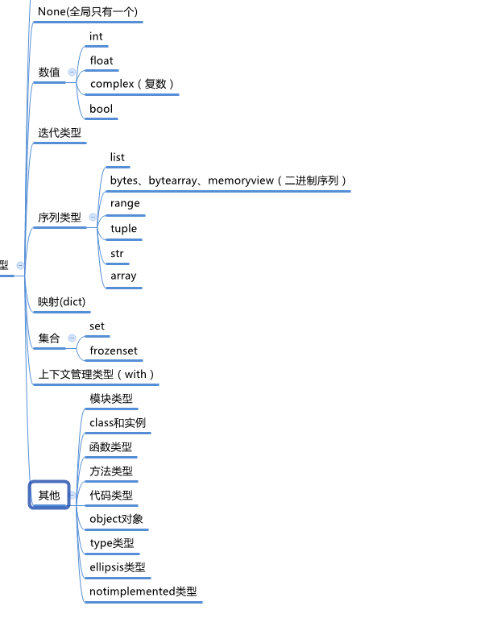
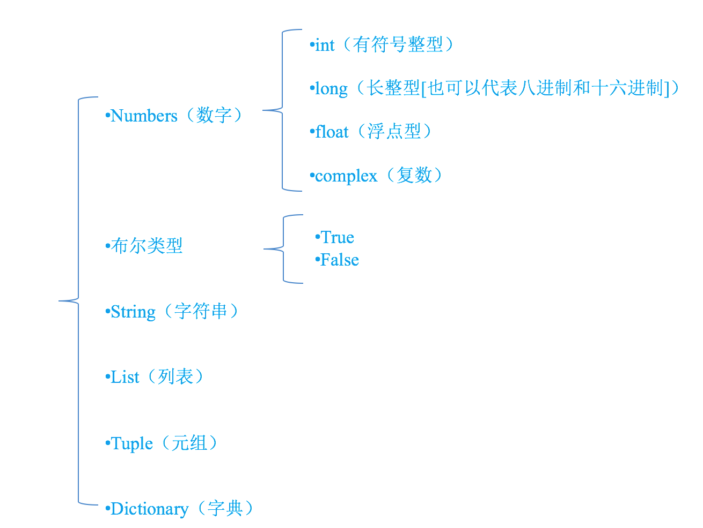
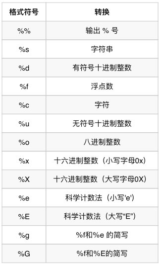
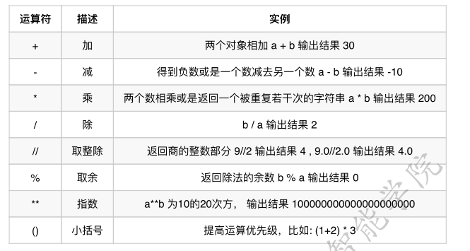
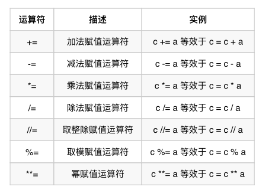
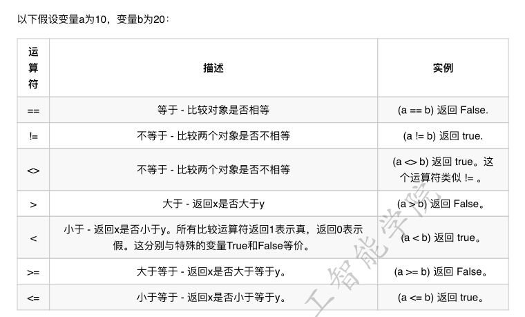
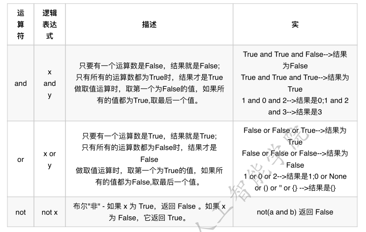
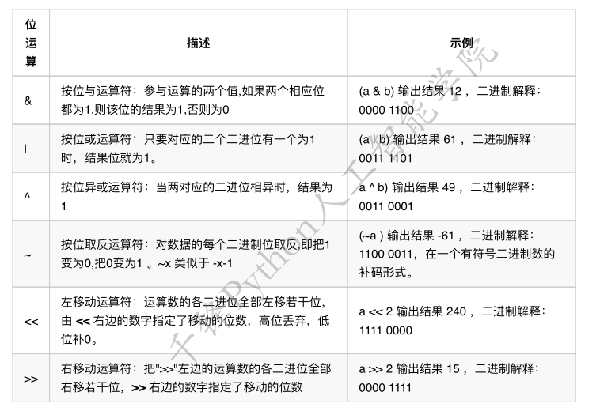
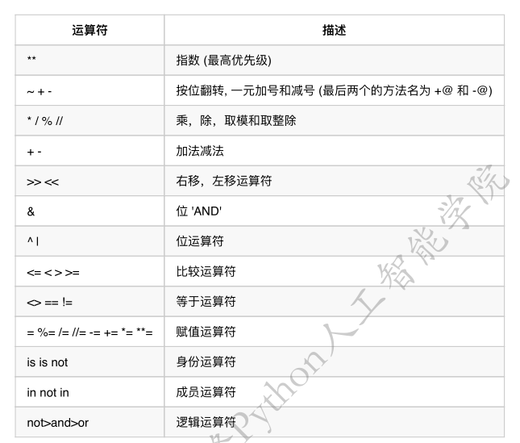

## type,object class 之间的关系

type 也是object 对象 class 是type的对象，但是 object 和  class 都是type 类型

https://www.cnblogs.com/Eva-J/p/7277026.html

## python内置类型



type 可以查看py 的类型


### 注释

单行注释： \# 开头的都是注释 解析器会忽略注释

多行注释： 以 ''' 开始，并以 ''' 结束，我们称之为多⾏行行注释。


### 命名规则

1. 标识符由字⺟母、下划线和数字组成，且数字不不能开头。
2. 严格区分⼤大⼩小写。
3. 不不能使⽤用关键字。

python 尽量用 下划线来连接多个名词，而不是驼峰


### python 基础类型

### 


### 输出格式化

age = 18
name = "xiaohua"
print("我的姓名是%s, 年年龄是%d" % (name, age))




### 输入内容

input函数可以获取输入的内容

```python
password = input("请输⼊入密码:")
print('您刚刚输⼊入的密码是:%s' % password)
```


### 类型转换

|         函数          |          说明           |
| :-------------------: | :---------------------: |
| int(x [,base(进制) ]) |    将x转换为一个整数    |
|       float(x)        |   将x转换为一个浮点数   |
|        str(x)         | 将对象 x 转换为字符串串 |
|        bool(x)        |  将对象x转换成为布尔值  |


- 转换为整数

```python
print(int("123")) # 123 将字符串串转换成为整数
print(int(123.78)) # 123 将浮点数转换成为整数
print(int(True)) # 1 布尔值True转换成为整数是 1
print(int(False)) # 0 布尔值False转换成为整数是 0
# 以下两种情况将会转换失败
'''
123.456 和 12ab 字符串串，都包含⾮非法字符，不不能被转换成为整数，会报错
print(int("123.456"))
print(int("12ab"))
'''
# 使⽤用int()函数进⾏行行类型转换时，还可以传⼊入两个参数，第⼆二个参数⽤用来表示进制。
print(int("21",8)) # 输出的结果是17.⼋八进制的21,对应的⼗十进制数字是17
print(int("F0",16)) # 输出的结果是240.⼗十六进制的F0,对应的⼗十进制数字是240
"""
以下写法会报错。⼋八进制⾥里里允许的最⼤大值是7,所以 29 不不是⼀一个合法的⼋八进制数
print(int("29",8))
"""
```


- 转换为浮点数

```python
f1 = float("12.34")
print(f1) # 12.34
print(type(f1)) # float 将字符串串的 "12.34" 转换成为浮点数 12.34
f2 = float(23)
print(f2) # 23.0
print(type(f2)) # float 将整数转换成为了了浮点数
```


- 转换为字符串

```python
str1 = str(45)
str2 = str(34.56)
str3 = str(True)
print(type(str1),type(str2),type(str3))
```


- 转换为布尔值

```python
python 
print(bool('')) 
print(bool("")) 
print(bool(0)) 
print(bool({}))
print(bool([])) 
print(bool(()))
print(bool(None))
```

在python中，只有空字符串串 '',"" ，数字0,空字典{},空列列表[],空元组(),和空数据None会被转换成为False,其他的都会被转换成为True


### 算数运算符




### 赋值运算符



```python
# 示例例：*=，运算时，符号右侧的表达式先计算出结果，再与左边变量量的值运算
>>> a = 100
>>> a *= 1 + 2 # 相当于执⾏行行 a = a * (1+2)
>>> a
```


### 比较运算符




### 逻辑运算符



```python
a = 34
a > 10 and print('hello world')
a < 10 and print('hello world')
a >10 or print('你好世界')
a <10 or print('你好世界')

输出结果：
hello world
你好世界
```


### 位运算符




### 运算符优先级




### 循环

#### for 循环

```python
for xx in xx;

for xx in range(xx);
```


#### while 循环

```
while xx <[>= | <= ] yy ;

while True;
```


### python 内置函数

```python
abs(number)：返回一个数的绝对值。
chr(number)：ASCII码转换为字符，相反的函数order
divmod(num1, num2)：求出商和余数，返回一个tuple. divmod(10,3)=(3,1)
eval(source[, globals[, locals]])：求表达式的值
excefile(object[, globals[, locals]])：exec语句用来执行储存在字符串或文件中的Python语句。
例：exec('print("abc")') 输出'abc'
filter(function or None, list)：将list的每项按照function进行筛选。function中，如果需要某个值继续存在，返回值为True，反之用False。
len(object)：求一个对象的子项的个数
map(function, iterable_objects)：接收一个函数和一个可迭代对象（如列表）作为参数，用函数处理每个元素，然后返回新的列表。
max()：求最大项
min()：求最小项
ord(character)：字符转换为ASCII码，相反的函数chr
pow(x, y[, z])：求幂(z为取模的可选项)
range()：生产一个列表
repr(object)：把对象转换为字符串，很多时候可以通过eval(repr(object))还原对象
sum(list)：求序列所有值的和
type(object)：查看数据对象类型
range([start,] stop[, step]) -> range object：左开右闭。
round(number[, ndigits]) -> number：把浮点数转变成指定小数位数的数
hex(number)：转化为十六进制的字符串
oct(number)：转化为八进制的字符串
int(str)：字符转换为数字函数
float(object)：将对象转化为浮点数。
str(object)：将对象转换为字符串
 

其他函数：

Decimal：控制精确小数点位数：(需要先引入：from decimal import Decimal)
```


### 浅拷贝 深拷贝

copy(xxx,xxxx) 浅拷贝

```python
import copy 

copy.deepcopy(list) 深拷贝
```


### 可变与不可变

int bool float tuple str (不可变参数)

list dict set（可变参数）


### 函数


####　普通类型

传入的是 不可变 就是 复制的值


#### 可变类型

传入的是地址


#### 默认值与关键字参数

```
def func(a=10,ll):
	...
	
func(ll=1)	
```


#### 可变参数

```
def func(*agrs):
	...

*args 代表的就是可变参数
```


#### 拆包

```
list1 = [1, 2, 3, 4, 5]

a, b, *c = list1

print(a, b, c)

输出：1,2,[3,4,5]
```


```python
print(123)
```

