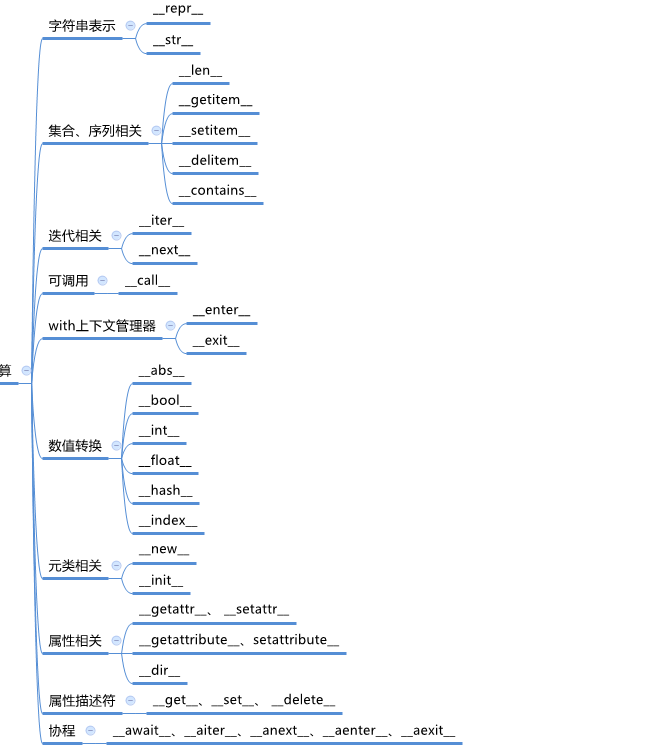
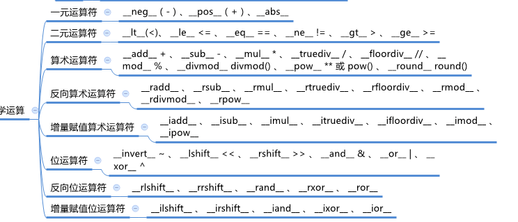

## python 常用的魔法函数

python的魔法函数是\__xxx__双下划线开头的

### 与 len() 方法相关的

```
__len__ （可以调用len方法）
```

像 list set dict 都是在cpython执行的，因为 使用c写的会比较快，如过我们自己定义的话，性能就会比较差


<br>


### 遍历相关的魔法函数

```
__item__ 

__getitem__（可以直接使用for循环来进行遍历,也可以用来切片）

__iter__

__next__
```

<br>

例如：

```

Company(object):
	def __init__(self,e_list):
		selft.em_list=e_list
		
	def __getitem__(self,item):
    	return self.em_list[item]
    	
company = Company(["a","b"])

for c in company:
	print(c)
```

<br>


### 非数学相关




<br>

### 数学相关

