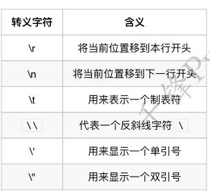

## 字符串

### 字符串表示方式

```py
a = "I'm Tom" # 一对双引号
b = 'Tom said:"I am Tom"' # 一对单引号
c = 'Tom said:"I\'m Tom"' # 转义字符
d = '''Tom said:"I'm Tom"''' # 三个单引号
e = """Tom said:"I'm Tom" """ # 三个双引号
```

小总结：
双引号或者单引号中的数据，就是字符串串
如果使用一对引号来定义字符串串，当出现符号冲突时可以使⽤用转义字符
使用三个单引号、双引号定义的字符串串可以包裹任意文本


### 转义字符




### 字符串操作

常见的字符串操作：

- 获取长度:len
- 查找内容:find,index,rfind,rindex
- 判断:startswith,endswith,isalpha,isdigit,isalnum,isspace
- 计算出现次数:count
- 替换内容:replace
- 切割字符串串:split,rsplit,splitlines,partition,rpartition
- 修改大小写:capitalize,title,upper,lower
- 空格处理理:ljust,rjust,center,lstrip,rstrip,strip
- 字符串串拼接:join

**注意：在Python中，字符串串是不不可变的！所有的字符串串相关方法，都不不会改变原有的字符串串，都是返回一个
结果，在这个新的返回值⾥里里，保留留了了执行行后的结果！**


#### len

len函数可以获取字符串串的长度。

```python
mystr = '今天天⽓气好晴朗，处处好⻛风光呀好⻛风光'
print(len(mystr)) # 17 获取字符串串的⻓长度
```


#### 查找

查找指定内容在字符串串中是否存在，如果存在就返回该内容在字符串串中第⼀一次出现的开始位置索引值，如果
不不存在，则返回-1.