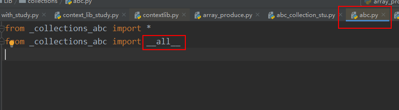
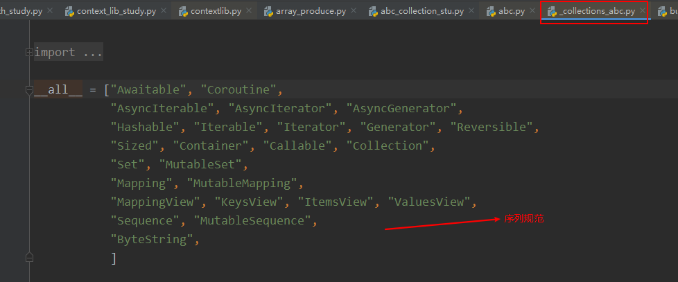
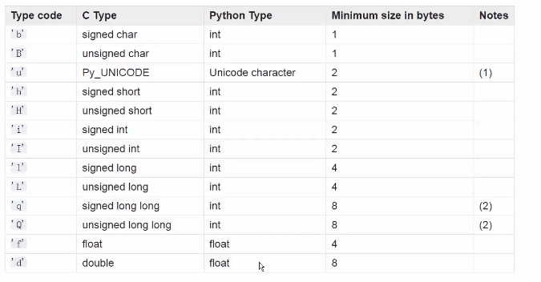

### 序列类分类

容器序列：list、tuple、deque（可以放置任意类型的数据）

扁平序列：str、bytes、bytearray、array.array (必须指明序列类型)

可变序列：list、deque、bytearray、array

不可变：str、tuple、bytes

slice ： 切片对象可以用来对序列切片

```
str[slice()]
```


<br>

容器序列：

```
my_list = []

my_list.append(1)
my_list.append("a")

输出：
[1,"a"]
```


### 直接点击序列type，比如list 可以查看list所有的方法


<br>

### 序列类型协议


abc 模块下的结构规范






Sequence ： 不可变序列

```
class Sequence(Reversible, Collection):


class Collection(Sized, Iterable, Container):

    __slots__ = ()

    @classmethod
    def __subclasshook__(cls, C):
        if cls is Collection:
            return _check_methods(C,  "__len__", "__iter__", "__contains__")
        return NotImplemented
        
        
Sized ： 获取序列长度(__len__)
Iterable: 可以进行迭代（可以使用for循环）
Container : 可以判断某个元素是否存在（if x in [xxx]）
```


MutableSequence： 可变序列

```
class MutableSequence(Sequence):

    __slots__ = ()

    """All the operations on a read-write sequence.

    Concrete subclasses must provide __new__ or __init__,
    __getitem__, __setitem__, __delitem__, __len__, and insert().

    """

    @abstractmethod
    def __setitem__(self, index, value):
        raise IndexError

    @abstractmethod
    def __delitem__(self, index):
        raise IndexError

    @abstractmethod
    def insert(self, index, value):
        'S.insert(index, value) -- insert value before index'
        raise IndexError

	# 一系列操作序列的方法
    def append(self, value):
    def clear(self):
    def reverse(self):
    def extend(self, values):
    def pop(self, index=-1):
    def remove(self, value):   
    def __iadd__(self, values):
        
        
__setitem__  ：可以对元素进行赋值

__deleteitem__ : 可以删除元素

__insert__ :可以插入元素
```


### 序列 +、+= 、extend


```
+= 调用的魔法函数为 __iadd__
__iadd__ 实现原理使用的 extend方法，如下：

 def extend(self, values):
        'S.extend(iterable) -- extend sequence by appending elements from the iterable'
        for v in values:
            self.append(v)
            
通过遍历 添加到当前的序列中                               
```

例子如下：

```
a = [1, 2]
c = a + [3, 4]

print(c)
# 输出[1, 2, 3, 4]

# 直接在a中进行添加元素
a += [3, 4]
print(a)
# 输出[1, 2, 3, 4]

# += 两边可以是不一样的序列类型，但是+ 两边必须是相同的序列类型
a += (3, 4)
print(a)
# 输出[1, 2, 3, 4, 3, 4]

a.extend("abc")
print(a)
# 输出[1, 2, 3, 4, 3, 4, 'a', 'b', 'c']

# append不会展开列表表达式
a.append([1,2])
print(a)
# 输出 [1, 2, 3, 4, 3, 4, 'a', 'b', 'c', [1, 2]]
```


### 实现可切片的对象

模式[start:end:step]

```

"""
    其中，第一个数字start表示切片开始位置，默认为0；
    第二个数字end表示切片截止（但不包含）位置（默认为列表长度）；
    第三个数字step表示切片的步长（默认为1）。
    当start为0时可以省略，当end为列表长度时可以省略，
    当step为1时可以省略，并且省略步长时可以同时省略最后一个冒号。
    另外，当step为负整数时，表示反向切片，这时start应该比end的值要大才行。
"""
aList = [3, 4, 5, 6, 7, 9, 11, 13, 15, 17]
print (aList[::])  # 返回包含原列表中所有元素的新列表（新建的）
print (aList[::-1])  # 返回包含原列表中所有元素的逆序列表（翻转序列）
print (aList[::2])  # 隔一个取一个，获取偶数位置的元素
print (aList[1::2])  # 隔一个取一个，获取奇数位置的元素
print (aList[3:6])  # 指定切片的开始和结束位置
aList[0:100]  # 切片结束位置大于列表长度时，从列表尾部截断
aList[100:]  # 切片开始位置大于列表长度时，返回空列表

aList[len(aList):] = [9]  # 在列表尾部增加元素
aList[:0] = [1, 2]  # 在列表头部插入元素
aList[3:3] = [4]  # 在列表中间位置插入元素
aList[:3] = [1, 2]  # 替换列表元素，等号两边的列表长度相等
aList[3:] = [4, 5, 6]  # 等号两边的列表长度也可以不相等
aList[::2] = [0] * 3  # 隔一个修改一个
print (aList)
aList[::2] = ['a', 'b', 'c']  # 隔一个修改一个
aList[::2] = [1,2]  # 左侧切片不连续，等号两边列表长度必须相等
aList[:3] = []  # 删除列表中前3个元素

del aList[:3]  # 切片元素连续
del aList[::2]  # 切片元素不连续，隔一个删一个
```


魔法函数：


实现可切片对象：

**将需要实现的对象重写abc模块下的基类抽象方法**

```
# 颠倒元素顺序
def __reversed__(self)

# 实现getitem 就可以进行切片
def __getitem__(self, item)

# 获取列表的长度
def __len__(self, other)

# 实现iter 就可以使用for循环迭代
def __iter__(self)

# 可以使用 if x in [xxx] 来 查看是否包含某个元素
def __contains__(self, item)
```


用例：

```
import numbers


class Group:
    def __init__(self, group_name, company_name, staffs):
        self.group_name = group_name
        self.company_name = company_name
        self.staffs = staffs

    def __reversed__(self):
        self.staffs.reverse()

    # group[0] item 就是 int 0
    # group[:2] item的就是 slice对象 slice(2, None, None)
    def __getitem__(self, item):
        cls = type(self)
        if isinstance(item, slice):
            return cls(group_name=self.group_name, company_name=self.company_name,
                       staffs=self.staffs[item])
        if isinstance(item, numbers.Integral):
            return cls(group_name=self.group_name, company_name=self.company_name,
                       staffs=[self.staffs[item]])

    def __len__(self):
        return len(self.staffs)

    def __iter__(self):
        return iter(self.staffs)

    def __contains__(self, item):
        if item in self.staffs:
            return True
        else:
            return False

    def __str__(self):
        return "group = {group},company={company},staffs={staffs}".format(group=self.group_name,
                                                                          company=self.company_name,
                                                                          staffs=self.staffs)


staffs = ["user1", "user2", "user3"]
group = Group(company_name="immoc", group_name="user", staffs=staffs)
print(group[2:])

输出如下：
group = user,company=immoc,staffs=['user3']
```


### basic维护已排序列表

 用来处理已排序的序列，用来维持已排序的序列，升序，使用二分查找来维护序列


insort 是插入数据，bisect 是查找数据

insort = insort_right(在 list中插入元素，并排序)

bisect = bisect_right(获取插入位置的索引位置)

insort_right：插入到指定数据的左边

insort_left ：插入到指定数据的右边

bisect_right：查找的是当前元素的索引

bisect_left：查找的是前一个元素的索引

```
inter_list = []

bisect.insort(inter_list,3)
bisect.insort(inter_list,2)
bisect.insort(inter_list,4)

print(inter_list)

输出结果：
[2，3，4]
```


### 什么时候不是用列表

array(数组), deque（双端队列）

array 和 list的区别是： array 只能存放指定类型的数据,array 比 list 更加的高效



```
import array

arr = array.array("i")

arr.append(1)

print(arr)
```


### 列表推导式、生成器表达、字典推导

列表生成表达式是高于列表操作的性能

```
# 普通方式
odd_list = []
for i in range(10):
    if i % 2 == 0:
        odd_list.append(i)

print(odd_list)


def handle_item(item):
    return item * item


# 列表生成表达式(高于列表操作的性能)
odd_list = [handle_item(i) for i in range(10) if i % 2 == 0]

# 生成器表达式
odd_list_generator = (handle_item(i) for i in range(10) if i % 2 == 0)

# 将生成器转为list
odd_gen_list = list(odd_list_generator)

# 字典推倒式
my_dict = {"bo1": 22, "bo2": 33, "bo3": 44}
reversed_dict = {value: key for key, value in my_dict.items()}
print(reversed_dict)

# 集合推导式
my_set = {key for key, value in my_dict.items()}
print(my_set, type(my_set))

输出结果：
[0, 2, 4, 6, 8]
{22: 'bo1', 33: 'bo2', 44: 'bo3'}
{'bo2', 'bo1', 'bo3'} <class 'set'>
```

