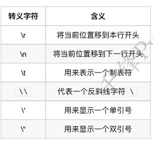

### 字符串表示方式

```py
a = "I'm Tom" # ⼀一对双引号
b = 'Tom said:"I am Tom"' # ⼀一对单引号
c = 'Tom said:"I\'m Tom"' # 转义字符
d = '''Tom said:"I'm Tom"''' # 三个单引号
e = """Tom said:"I'm Tom" """ # 三个双引号
```

小总结：
双引号或者单引号中的数据，就是字符串串
如果使用一对引号来定义字符串串，当出现符号冲突时可以使⽤用转义字符
使⽤用三个单引号、双引号定义的字符串串可以包裹任意文本


### 转义字符

