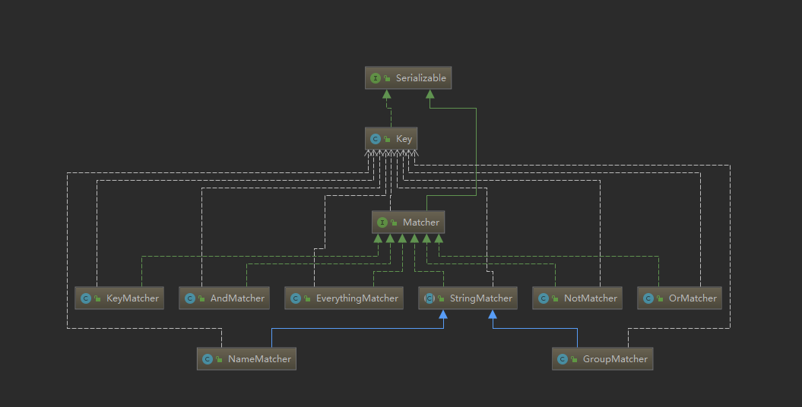

## Quartz 接口说明

Quartz 核心接口分为 Job、Trigger、xxxFactory 等三种类型，下面来一一说明

### Job

Job 为 Quartz的最小单位，代表一次执行的任务

- JobFactory：用于创建Job对象
- JobKey ：表示Job任务的唯一性
- JobExecutionContext：执行Job任务的上下文
- JobBuilder：构建Job任务
- JobListener：Job监听器
- JobDataMap：Job上下文的数据存储
- JobStore
  - RMIJobStore 内存Job存储
  - JdbcStoreSupport：数据库存储

### Trigger

与 Trigger 相关的为

- TriggerKey：
- TriggerBuilder：构建触发器的
- TriggerListener：触发器的上下文
- SimpleTrigger：一种触发器，用于在给定的时间点触发作业，并可在指定的时间间隔重复。
- ScheduleBuilder：用于构建Trigger对象
- cron
  - CronExpression：cron表达式
  - CronTrigger：cron 触发器
  - CronScheduleBuilder：构建CronTrigger对象
- calendar
  - CalendarIntervalTrigger
  - CalendarIntervalScheduleBuilder
- MutableTrigger
- DailyTimeIntervalTrigger
  - DailyTimeIntervalScheduleBuilder
- simple
  - SimpleTrigger
  - SimpleTriggerBuilder

- DateBuilder：构建时间对象

TriggerKey、TriggerBuilder、TriggerListener、SimpleTrigger、ScheduleBuilder

### Scheduler

Scheduler、SchedulerContext、SchedulerFactory、SchedulerListener、SchedulerMetaData、

- Scheduler
  - StdScheduler
  - RemoteScheduler：Scheduler接口的实现，通过RMI将所有方法调用远程代理到给定的QuartzScheduler实例上的等效调用
- SchedulerFactory
  - StdSchedulerFactory
  - DirectSchedulerFactory
- SchedulerListener
- SchedulerContext
- SchedulerMetaData

- SchedulerPlugin：在初始化Scheduler对象时的回调，并且在Scheduler启动和停止时也会回调

- RemotableQuartzScheduler

### Matcher

Matcher 接口实现如下；

KeyMactcher

AndMacther

EverythingMacther

StringMacther

- NameMatcher
- GroupMacther

NotMacther

OrMacther

### ClassLoadHelper

InstanceIdGenerator

### Job执行线程池

- ThreadExecutor
- ThreadPool

### JobRunShellFactory

