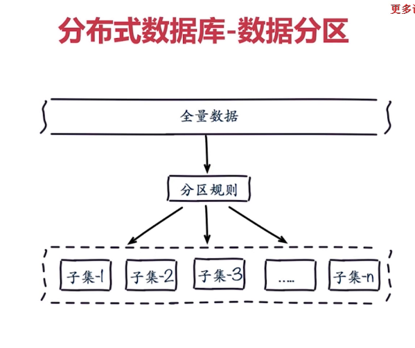
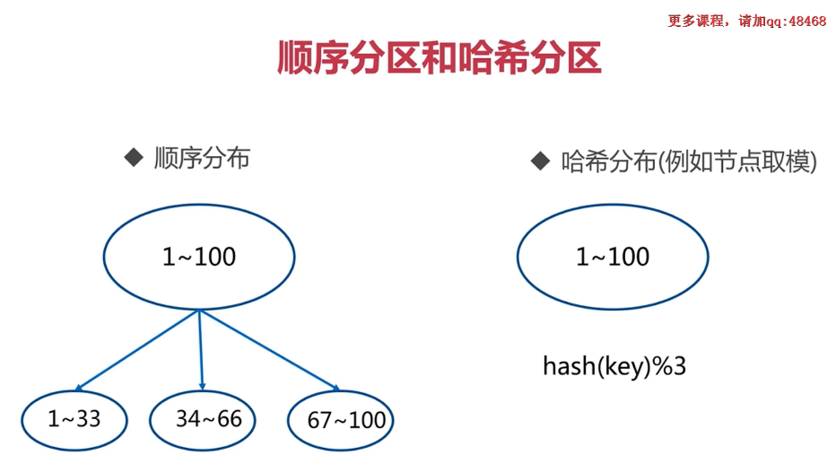
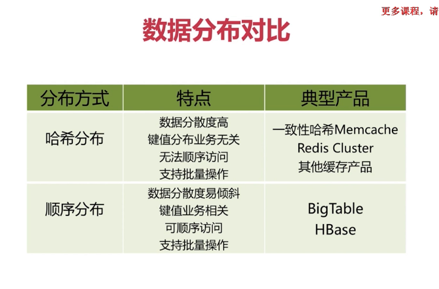
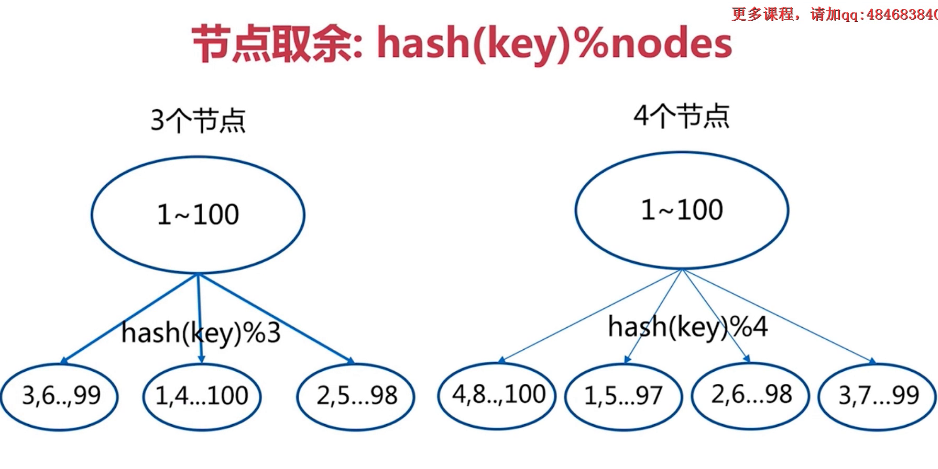
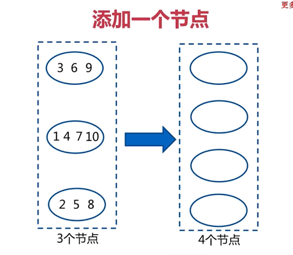
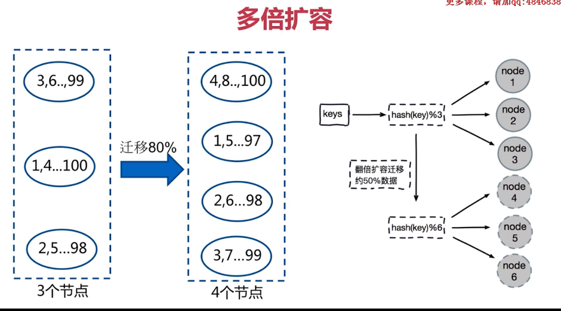
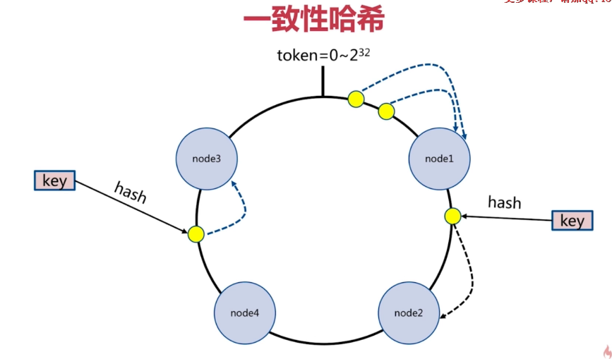
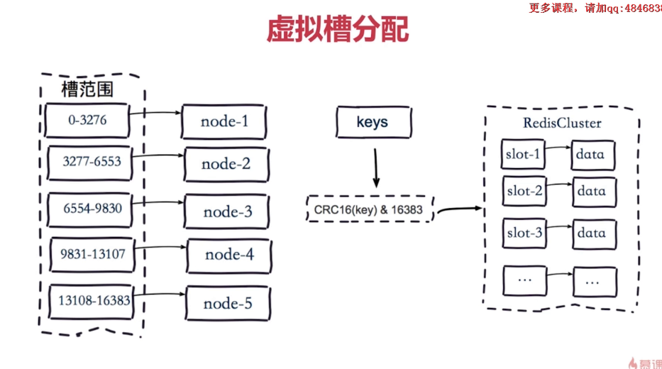
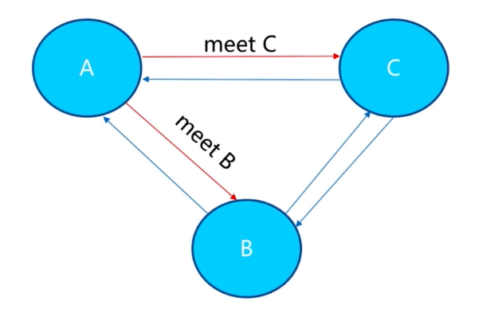
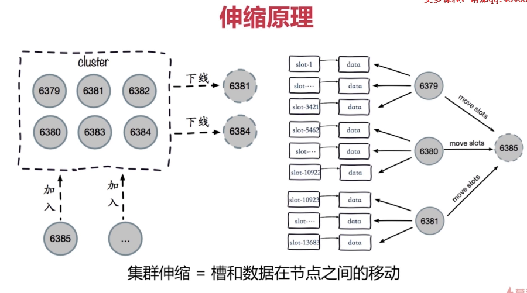

redis clustor的架构

 并发量的QPS


### redis clustor的数据分布









节点取余的方式

一致性hash的方式

虚拟槽的方式


#### 节点取余的方式











#### 一致性hash分区




#### 虚拟槽分区：




### 搭建集群


redis的节点之间是相互通信的，彼此之间都知道虚拟槽的分配

client-> 请求数据，如过当前节点并不存在这个数据，那就直接去相应的槽取数据，然后返回数据


#### 原生的方式搭建流程：

redis的架构组成：

- 节点

  clustor-enabled ：yes ： 当前节点是否为clustor节点，是否是集群模式

  

- meet ： 可以让redis每个节点之间是相互通信的

  


       ```
A meet B  A B之间通信

A meet C  A C之间通信

B C 两者之间是自行根据A 节点信息建立的
       ```


- 指派槽

  


- 复制（每个主节点都有一个从节点）

  主节点挂了以后会自动切换从节点上升为主节点


安装的流程：

1. 配置开启节点

   ```
   配置文件：
   
   port ${port}
   
   daemonize yes
   
   dir "/data"
   
   dbfilename "dump-${port}.rdb"
   
   logfile "${port}.log"
   
   # 当前节点是否为集群状态
   cluster-enabled yes
   
   # 为当前clustor节点指定一个配置文件
   clustor-config-file nodes-{port}.conf
   ```

   

   ```
   cluster节点的配置：
   
   cluster-enabled yes
   
   # 节点超时的时间、
   cluster-node-timeout 15000
   
   # 为当前clustor节点指定一个配置文件
   clustor-config-file nodes-{port}.conf
   
   # 是否集群内所有的节点都可以提供服务，该节点才是正确的
   # 如过一个节点出错，那么这个集群就是不可用的
   # 一般设置为 no
   cluster-require-full-coverage yes
   ```

   


2. meet

   ```
   cluster meet ip port （节点之间执行meet操作，使得所有节点之间相互通讯）
   ```

3. 指派槽

   ```
   cluster addslots ${slot} 为每个节点分配指定的槽
   ```

   

4. 主从搭建

   ```
   cluster replicate node-id 设置集群节点内的主从关系
   ```

   

#### ruby方式的安装

1. 下载ruby

   wget https://cache.ruby-lang.org/pub/ruby/2.3/ruby-2.3.1.tar.gz

2. 安装ruby

   ```
   tar -vxf ruby.2.3.1.gz
   ./configure -prefix=/usr/local/ruby
   make
   make install
   
   cp /usr/local/ruby
   
   cp bin/ruby/ /usr/local/bin
   ```

   ```
   安装 redis的客户端
   
   wget http://rubygems.org/downloads/redis-3.3.0.gem
   
   gem install -l redis-3.3.0.gem
   
   gem list --check redis gem
   
   cp ~/redis-5.0.6/src/redis-trib.rb /usr/local/bin/
   ```

3. 启动redis节点

   ```
   redis-cli --cluster create 127.0.0.1:8000 127.0.0.1:8001 127.0.0.1:8002 127.0.0.1:8003 127.0.0.1:8004 127.0.0.1:8005 --cluster-replicas 1
   
   --cluster-replicas 1
   设置一个slave节点
   ```

   


### 集群伸缩

伸缩的原理



扩容集群

准备新节点

​	准备 8006,8007节点


加入集群


分配槽节点


缩容集群

