####java redis配置优化：

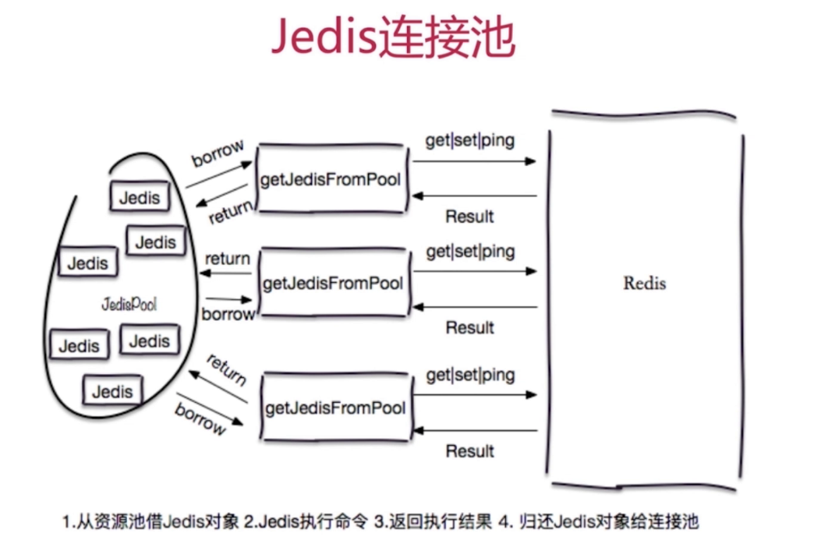

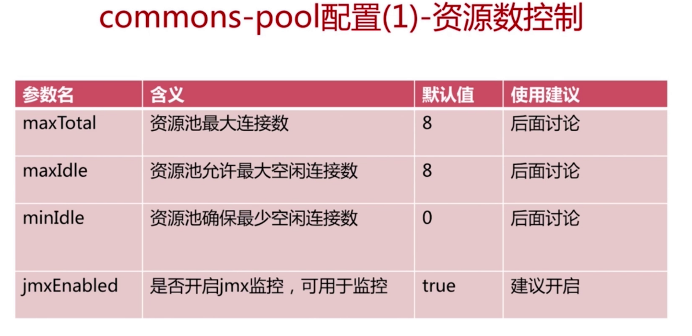

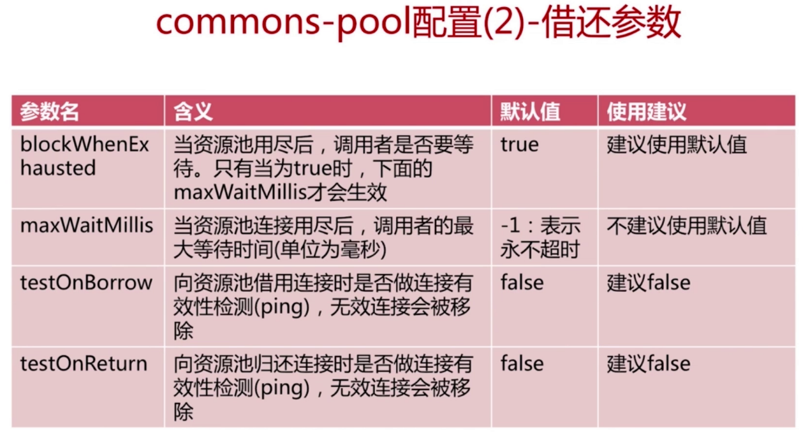


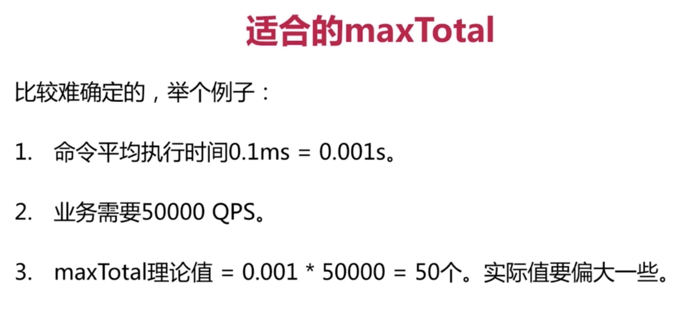

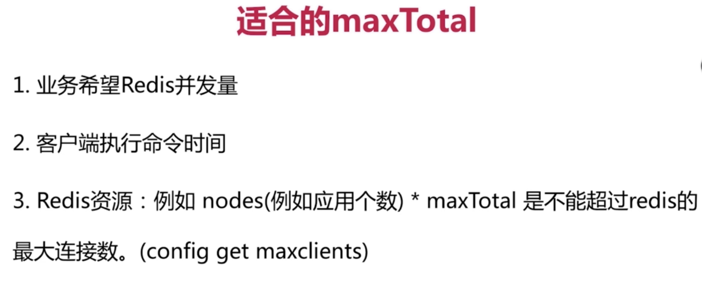


#### redis 慢查询

```
慢查询是 一个先进先出队列，固定长度、保存在内存内部

配置文件
slowlog-max-len：队列的最大长度
slowlog-log-slower-than 设置查询超过某个时间存入慢查询对垒，默认10毫秒

命令
slowlog get [n] 获取慢查询队列
slowlog len  获取慢查询队列的长度
slowlog reset	清空慢查询队列

优化：
	定时持久化
```

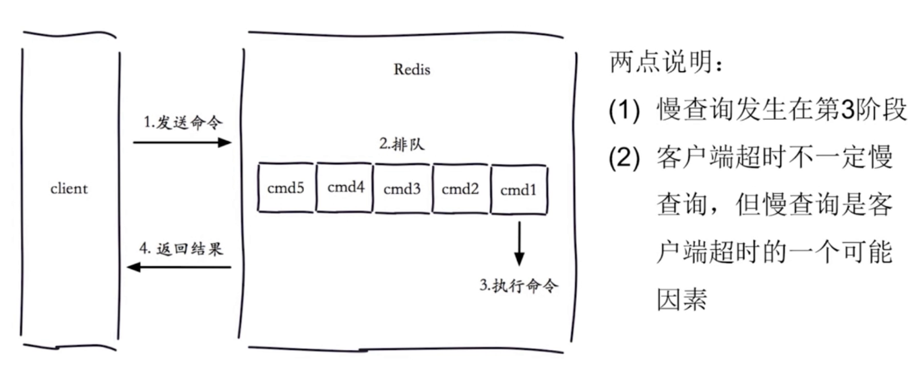


####redis pipeline

```
作用：
	将多个命令一次发送到客户端（为了优化网络时间）
	
代码：
	redisTemplate.executePipelined(new SessionCallback<Object>() {
            @Override
            public <K, V> Object execute(RedisOperations<K, V> operations){
                return null;
            }
        })；
```

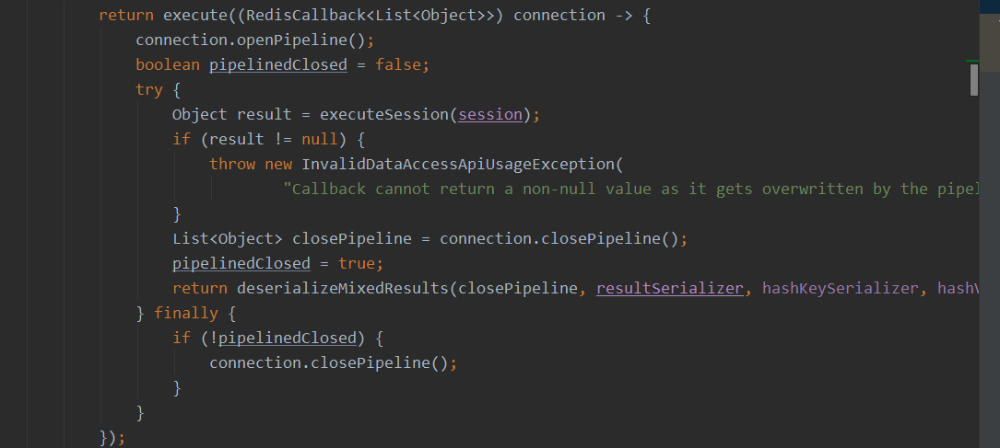


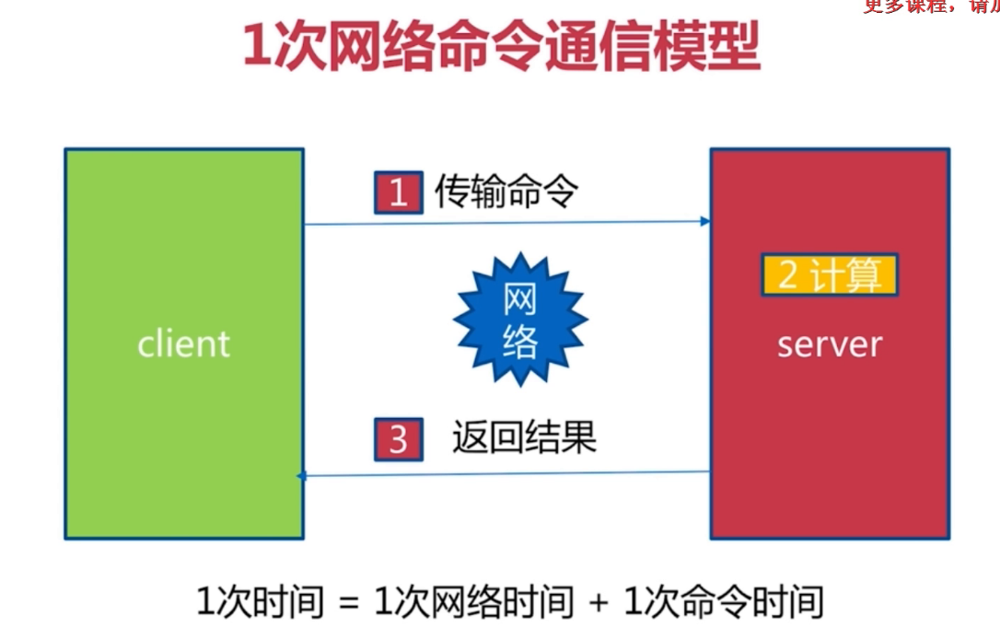


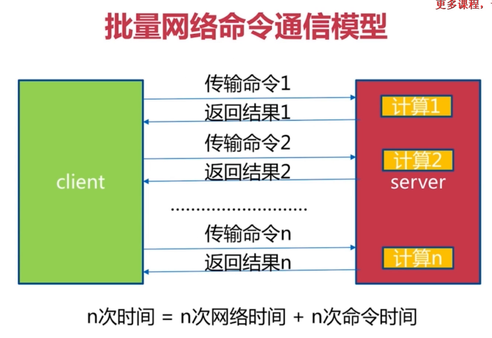


####redis 发布订阅

```
生产者消费模型： 
	订阅者无法获取历史消息

命令：
	publish channel message 发布消息
	
	subscribe [channel](可以为多个) 订阅消息
	
	psubscribe [pattern] 按照模式进行订阅

	unsubscribe[channel](可以为多个) 取消订阅
	
	punsubscribe [pattern] 退订指定的模式
	
	pubsub channles 列出至少有一个订阅者的频道
	
	pubsub numsub[channel...] #列出给定频道的订阅数量
	
	pubsub numpat # 列出被订阅者的数量
```

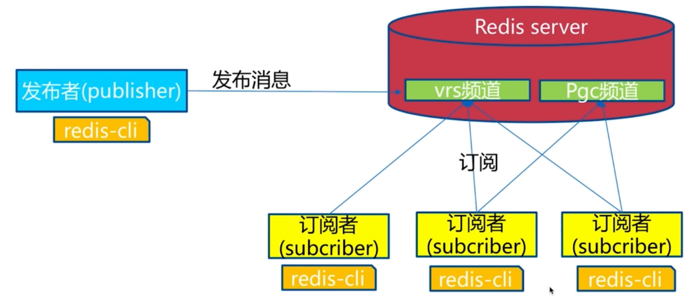


####redis 内存优化

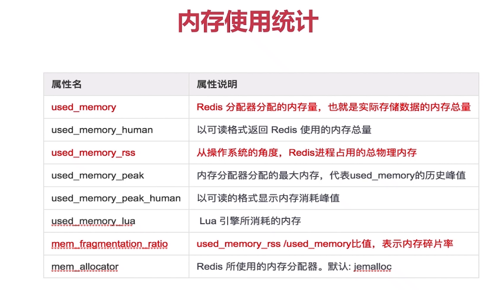


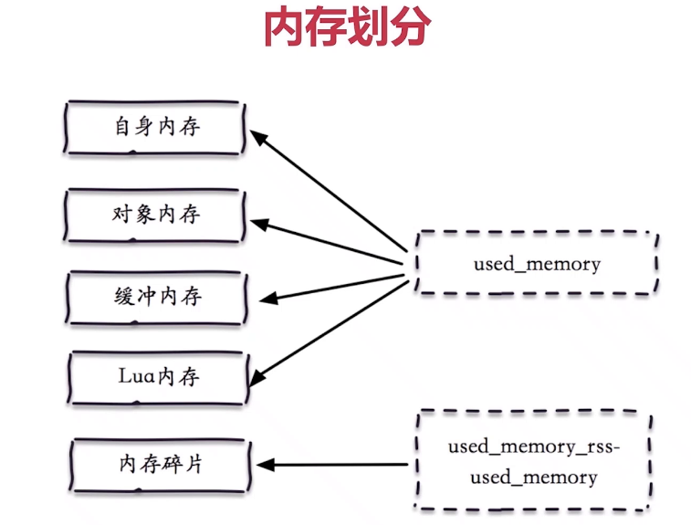


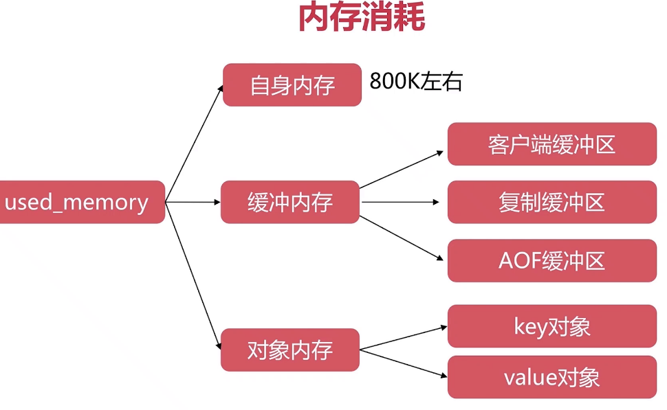


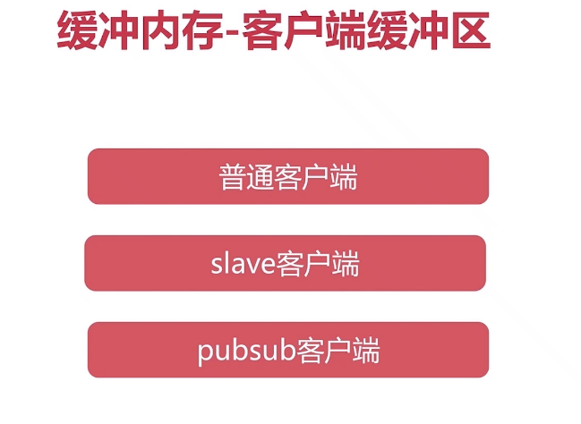

