####redis常用命令？

```
set key value

expire key seconds

del ket

get key

ttl key 查看key的过去时间

persist key 取消key的过期时间


mset

mget 

dbsize：计算key的总数

type key：查看key的类型

keys：遍历所有的key
	keys [pattern] (支持正则)
```


####Redis的数据结构都有哪些？

```
string list set hash  zset

string 场景： 普通字符串，二进制图片，序列化对象

list 场景 按照string顺序排序，是一个队列 是后进先出的

set场景 是string类型的元素，key是不允许重复的

hash场景 用于存储对象，hmset lilei age xxx name xxx

zset场景 可以设置分数用来进行排序

HyperLogLog

bitmap
```


从海量key中找到某一前缀的key？

keys 会导致卡顿


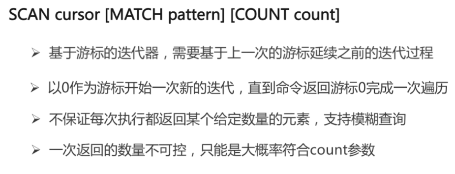


#### String类型

```
value的类型不能大于512M
场景：
	缓存
	计数器
	分布式锁
	set key value NX|PX expire_seconds

命令：
	get key
	set key value
	del key
	incr key （自增为1）
		（可以做某个页面的访问量）
		（分布式自增ID生成器）
	decr key
	incrby key k （自增K）
	decrby key k

	mget mset(获取批量，插入批量数据)
	
	getset key value 获取旧的value并且设置新的值
	append key value 将value附加在key对应value的末尾
	strlen key 计算key的长度
	getrange key start end 获取 start到end范围内的value值 例如（java） start=1，end=2，return ja
	setrange key start end
```

#####n次get执行时间

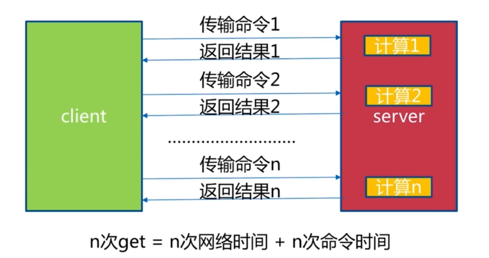


#### hash类型

```
hash类型(Mapmap)
				name  	'wang'
user:1:info --->  age	  13
				date	'2019'
场景：
	记录网站每个用户个人主页的访问量
	hincrby uer:1:info field count
	缓存基本信息：
		见图2-1
命令:
	hget key field
	hset key field
	hdel key field
	hexists key field (是否存在某个属性)
	hlen key field 
	hmget key field field2 field3
	hset key field1 v1 field2 v2 field3 v3
	hgetall key 返回hash key对用所有的field和 value（redis单线程，可能为阻塞）
	hvals key 返回hashkey对应所有field的value
	hkeys key 返回hash key对应的所有field


```


#### string vs hash

```
每次更新都要重新写入
```

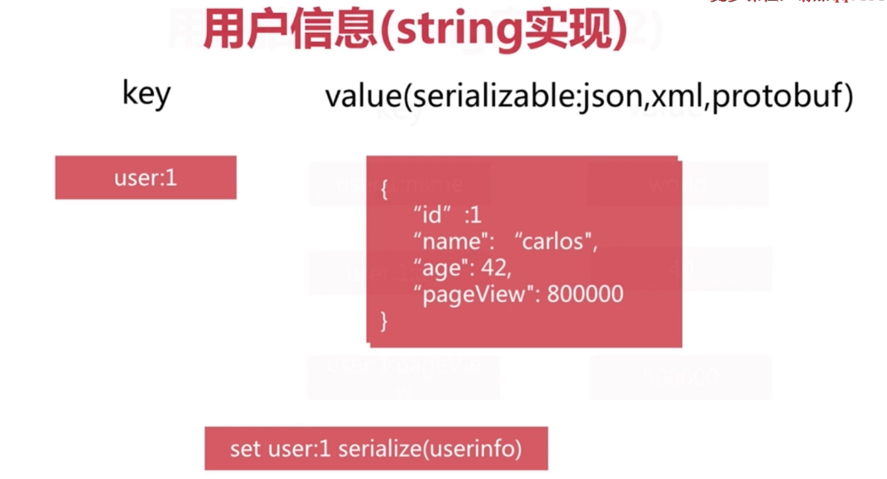


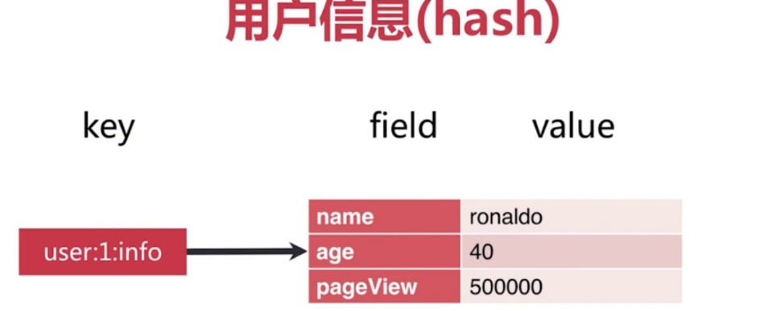


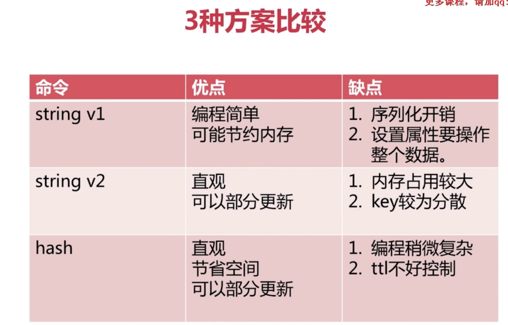


#### list类型

```
list类型（队列实现FILO，后进先出）见图 3-1
	有序的
	可是重复的
	左右两边插入弹出
命令
	增：
		rpush key value1 value2 values3
		lpush key value1 value2 value3
		linsert key before | after value newValue
	删除：
		lpop key
		rpop key
		
		lrem key count value
		根据count值，从列表中删除所有value相等的项
		1、count > 0,从左到右删除最多count个value相等的项
		2、count < 0,从右到左删除最多count个value相等的项
		1、count = 0,删除所有value相等的项
		
		ltrim key start end
		按照所索引范围修剪列表（保留 start - end范围内的元素）
		
	查询：
		lrange key start end（包含end）
		获取列表指定索引范围所有item
		
		lindex key index
		获取自定key的index的value值
		
		llen key 获取列表的长度
	
	update：
		lset key index newValue
		设置列表指定索引的值为newValue
		
	阻塞弹出：
		blpop key timeout
		brpop key timeout
		(x)pop阻塞版本，timeout是阻塞超时时间，timeout=0.为永远不阻塞
		如过当前队列没有元素，会阻塞timeout时间等待
	
	

场景：
	进行排名操作（）

LRUSH + LPOP = Stack（后进先出队列）FILO
LPUSH + RPOP = Queue（先进先出队列）FIFO
```

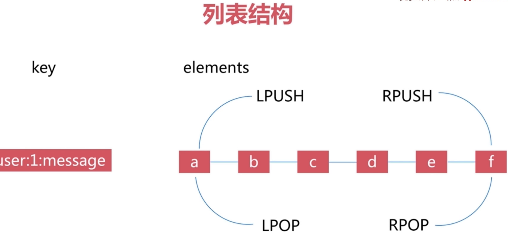				       

​										（3-1）


#### set类型

```
set 类型（不允许插入相同的元素）
	支持并集 交集 全部（uinon）
	无序，无重复、集合间操作

命令：
	sadd key element（添加操作，element存在添加失败）
	srem key element（删除操作）
	sdiff 
	sinter
	sunion 

场景：
	作为抽奖系统随机取出元素
	给用户添加标签
	sadd user:1:tags tag1 tag2 tag3
	
	比如用户两个喜欢的一样的物品
```

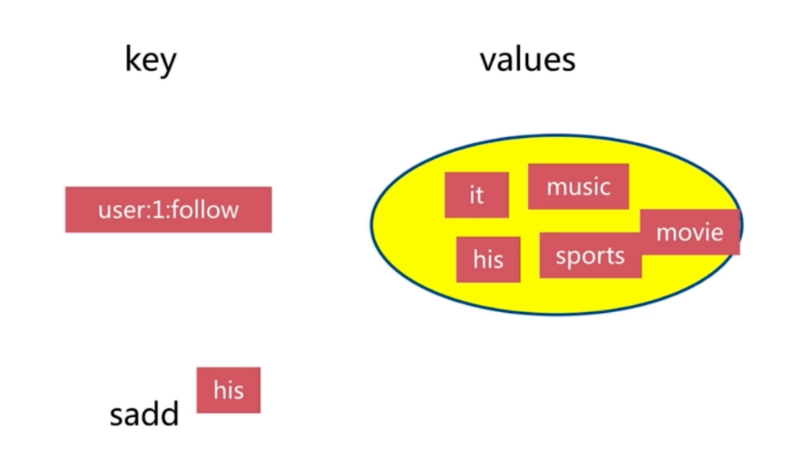


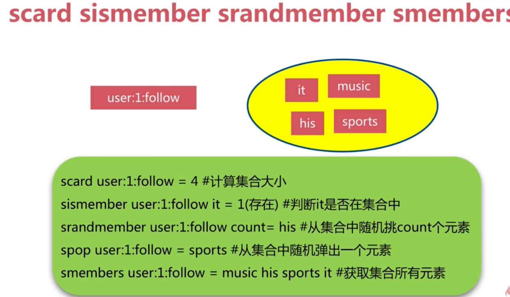


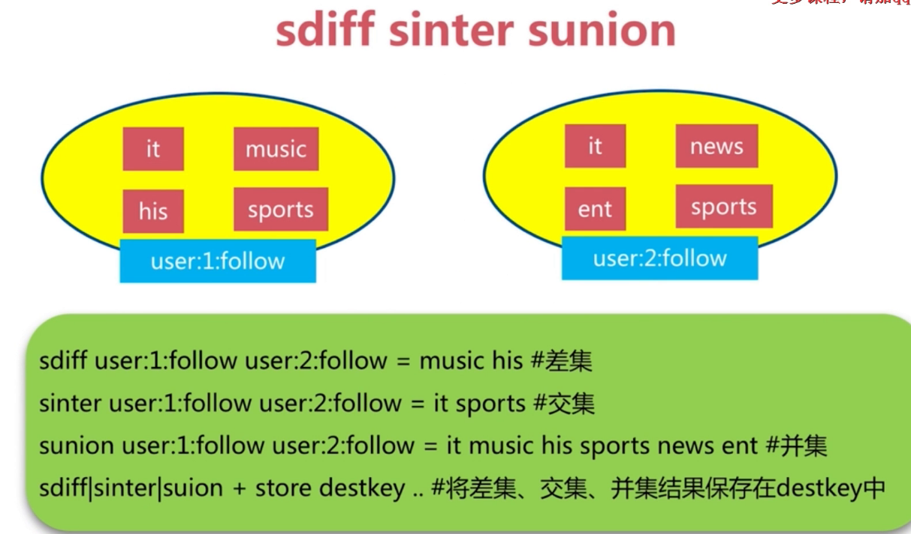


#### ZSet

```
ZSet 集合 （是有序的集合，key->score , value）

命令：
	zadd key score element（可以是多对）
	添加score和element
	zrem key element（可以是多个） 删除元素
	zscore key element 获取元素分数
	
	zincrby key increSocre element
	增加或者减少元素的分数
	
	zcard key 获取元素的个数
	
	zrank key element 获取当前元素的排名
	
	zrange key start end（包含） withscores 根据分数排名返回start 到 end范围内的元素，最后一个元素用-1表示
	
	zrangebysocre key minScore maxScore 根据分数来返回范围匀速
	
	zcount key minScore maxsCORE
	
	zremrangebyscore key minScore maxScore 根据分数范围进行删除
	
场景：
	排行榜，根据score来进行排行

与 set的区别
	set
		无重复元素
		无序
		element
	zset
		无重复元素
		有序
		element + score

与 list的区别
	list
	有重复元素
	有序
	element
```

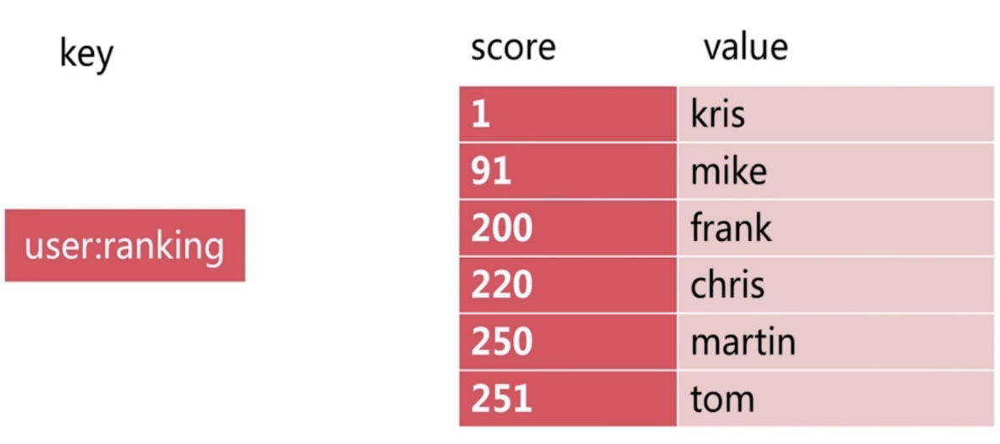


#### BitMap

```
命令
	setbit key offset value 
	
	set hello big
	
	getbit key offset
	
	bitcount key [start-end]
	
	bit op destkey key [key...]
```


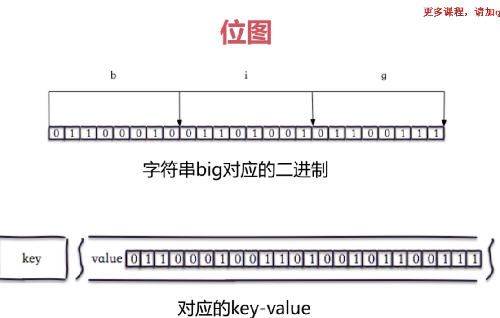


###HyperLogLog

```
数据结构


命令
pfadd key [element] (可是是多个)

pfcount key 返回元素数量


```


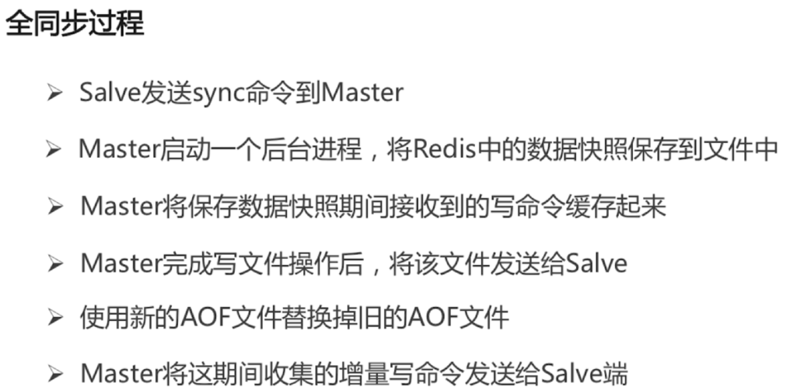


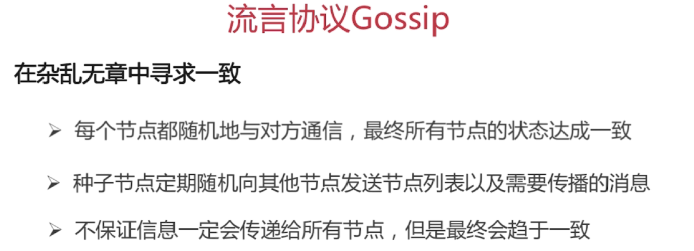