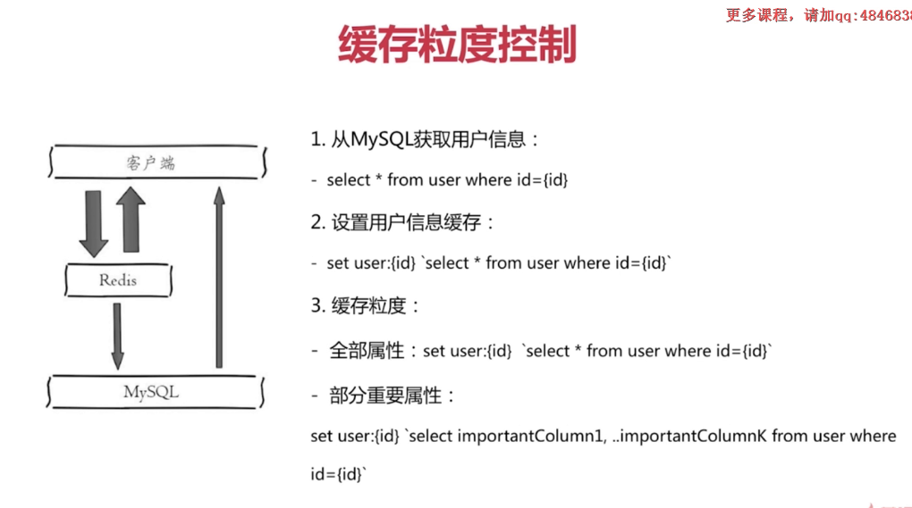
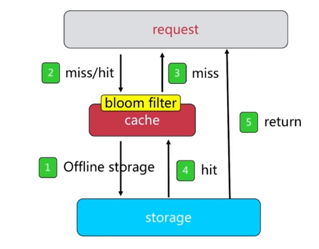

## redis缓存的设计和优化

[TOC]

<br/>

### 缓存的收益和成本

- 收益

  ```\
  1. 通过缓存可以加速读写
  
  2. 降低后端的负载
  后端服务器通过前端缓存降低负载，业务端使用redis降低后端mysql的负载
  ```

- 成本

  ```
  1. 数据不一致
  缓存层和数据层有时间窗口不一致，和更新策略有关
  
  2. 代码维护成本，多了一层缓存逻辑
  
  3. 运维成本：例如 redis cluster
  ```

- 使用场景

  ```
  1. 降低后端负载
  对高消耗的sql：join结果集/分组统计结果缓存
  
  2. 加速请求响应
  利用redis/memcache优化io响应时间
  
  3. 大量写合并为批量写
  如计数器先redis累加然后批量写入db
  ```

  


<br/>

### 缓存的更新策略

1、LRU/LFU/FIFO 算法剔除，例如maxmemory-policy 

​	如过内存达到最大值，会将过期的键值或者根据LRU算法将一些不常用的进行删除

2、超时剔除：expire（超时剔除）

3、主动更新：开发控制生命周期。


**三种策略对比如下**

|        策略        | 一致性 | 维护成本 |
| :----------------: | :----: | :------: |
| LRU/LIRS(算法剔除) |  最差  |    底    |
|      超时剔除      |  较差  |    底    |
|      主动更新      |   强   |    高    |

**两条建议： **

1、最大内存和淘汰策略

2、高一致性

​	超时剔除和主动更新结合，最大内存和淘汰策略兜底


<br/>

### 缓存的粒度控制



**粒度控制的三个角度**

1、通用性：全量属性更好

2、占用空间：部分属性更好

3、代码维护：表面上全量属性更好


<br/>

### 缓存的穿透优化


如过大量请求未命中cache，然后存储层也不存在某一条数据，那么每一次都要去存储层进行查询访问， 这就是缓存穿透

**原因如下：**

1、业务代码自身的问题

2、恶意攻击，爬虫等。


**如何发现：**

1、业务的响应时间

2、业务本身的问题

3、相关指标：总调用数、缓存层命中数、存储层命中数


解决方案1： 缓存空对象，然后加过期时间


像上述这种解决方法可能存在的问题如下：

1、需要更多的键（爬虫或者攻击的时候可能会生成大量的键，所以需要加过期时间）

2、缓存曾和存储层数据的 "短期" 不一致。


缓存代码如下：


解决方案2： 使用布隆过滤器



<br/>

### 缓存无底洞问题

问题描述：

- 2010年，FaceBook有了3000个Memcache节点
- 发现问题：加机器性能没有提升，反而下降了


问题关键点：

- mget会随着节点的越来越多，mget执行时间就会越长
- 更多的机器!= 更高的性能
- 批量接口的需求（mget，mset 等）
- 数据的增长和水平扩展需求


优化IO的几种方法

1、命令本身优化：例如慢查询 keys、hgetall bigkey

2、减少网络通信次数（pipeline）

3、降低接入成本：例如客户端的长连接/连接池 、NIO等


四中批量优化的方法

1、串行mget

​	

2、串行IO

3、并行IO

4、hash_tag


四种方案的对比：


<br/>

### 缓存的雪崩优化

由于cache服务承载大量的请求，当cache服务异常或者荡机的时候，流量会直接压向下游的组件（如DB），会造成级联故障


优化方案：

1、保存缓存高可用性

 - 个别节点、个别机器、机房
 - 例如 Redis Cluster、Redis Sentinel、VIP

2、依赖隔离组件为后端限流，或者服务降级

3、优先压力测试


#### 服务高可用的方案

**Redis Sentinel：哨兵节点监控**


**Redis Cluster：集群节点**


**KeepAlived：主从漂移**


#### 依赖隔离组件

线程池/信号量隔离


<br/>

### 热点key的优化

热点key + 较长的重建时间


上述的情况会导致大量的线程对缓存进行重建，导致数据库压力增大，响应时间变慢


#### 建立缓存的目的

1、减少缓存重建的次数

2、数据保证一致


#### 解决方案：

- 互斥锁
- 永不过期（逻辑缓存，如过逻辑过期时间过期，则重新构建缓存）


##### 互斥锁机制


互斥锁会存在大量线程阻塞或者自旋的过程，导致性能消耗，实现代码如下


##### 永不过期机制

1、缓存层面：没有设置过期时间（没有expire）

2、功能层面：为每个value添加逻辑过期时间，但发现超过逻辑过期时间后，会使用单独的线程去构建缓存


实现代码如下：


互斥锁和 永远不过期的对比如下：


<br/>

### redis的布隆过滤器

过滤器原理：