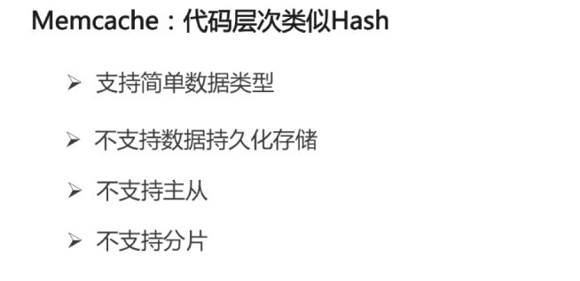
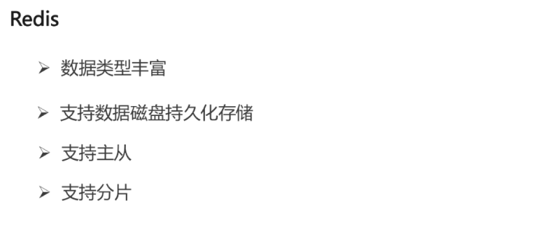
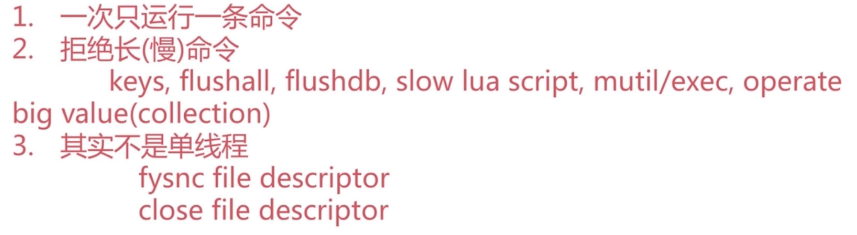
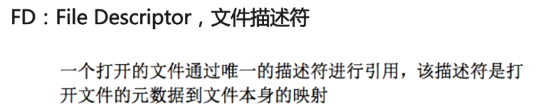
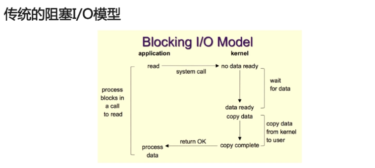
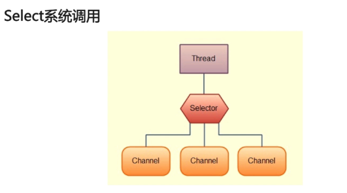
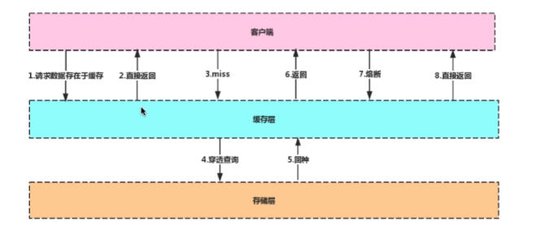

常见的缓存策略有哪些，如何做到缓存(比如redis)与DB里的数据一致性，你们项目中用到了

什么缓存系统，如何设计的。

如何防止缓存击穿和雪崩。

缓存数据过期后的更新如何设计。


#### redis常用命令


Memcache和redis的区别？







Redis的使用要注意什么，讲讲持久化方式，内存设置，集群的应用和优劣势，淘汰策略等。

当前redis集群有哪些玩法，各自优缺点，场景。

Redis的并发竞争问题如何解决，了解Redis事务的CAS操作吗。

Redis的选举算法和流程是怎样的。

redis的持久化的机制，aof和rdb的区别。

redis的集群怎么同步的数据的。

知道哪些redis的优化操作。

Reids的主从复制机制原理。

Redis的线程模型是什么。

```
redis是单线程的架构，所有的命令都是串行执行的，redis是基于纯内存的
数据结构简单，对数据操作也简单
使用多路I/O复用模型，是非阻塞IO
redis一次只执行一条命令
```











请思考一个方案，设计一个可以控制缓存总体大小的自动适应的本地缓存

LRU算法。

如何看待缓存的使用（本地缓存，集中式缓存），简述本地缓存和集中式缓存和优缺

