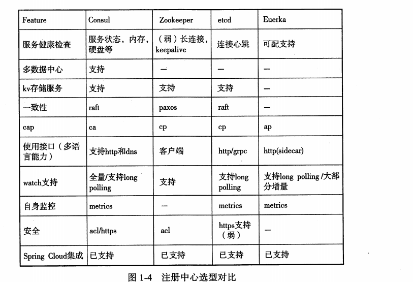
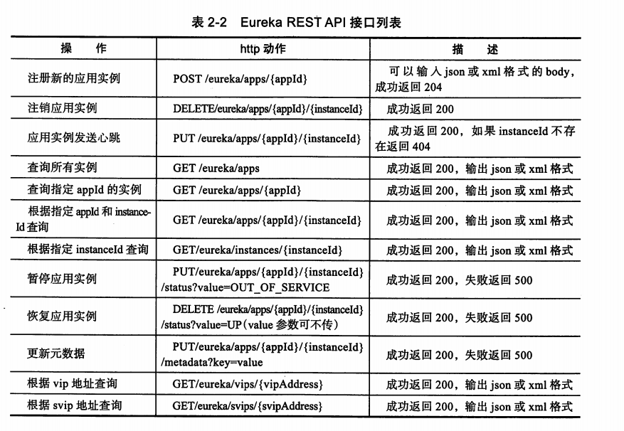
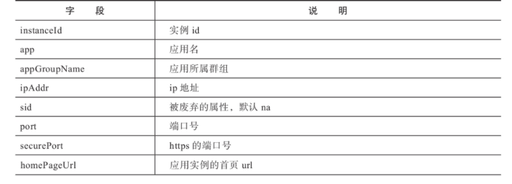
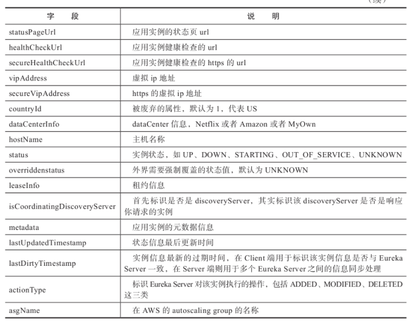
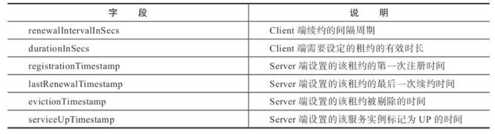
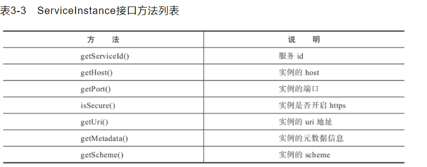
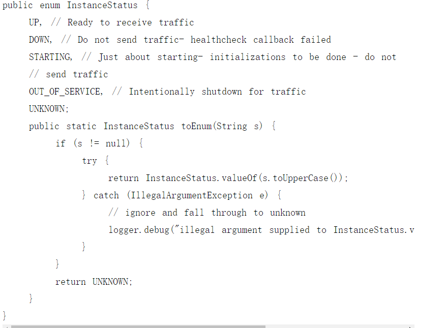
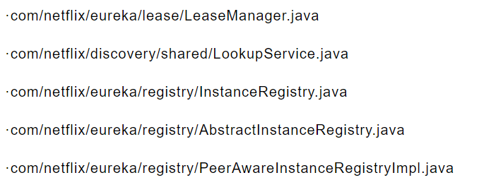
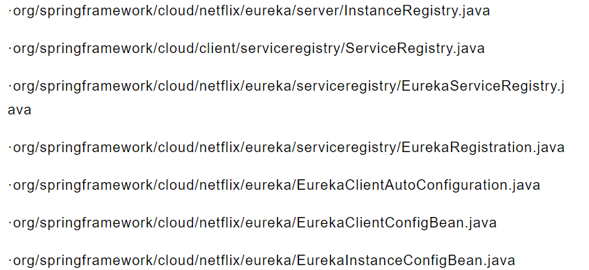
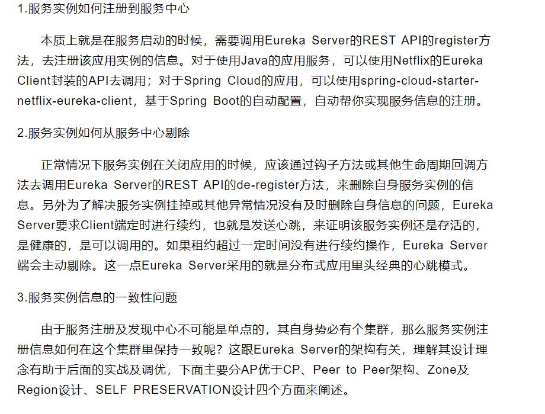

## Eureka

Spring cloud eureka 扮演了分布式系统的 服务发现与注册中心的角色

各个注册中心的对比




### Eureka 常用的API列表 




### Eureka 的 核心类：

Eureka 使用InstanceInfo 来代表注册的服务实例。

#### InstanceInfo 类字段说明：





可以看到InstanceInfo 里既又metadata，也有dataCenterInfo，还有一个比较重要的leaseInfo，用来表示应用实例的租约信息


#### LeaseInfo

Eureka 使用LeaseInfo 来标识实例的租约信息，其字段如下：



这些参数主要用于标识应用实例的心跳情况，比如约定的心跳周期，租约有效期，和最近一次的续约时间等


#### ServiceInstance

ServiceInstance 是spring cloud 对 service discovery 的实例信息的抽象接口，约定了服务发线的实例应用又哪些通用的信息。



由于Spring cloud discovery 适配了 Zookeeper、Consul、Enureka 等注册中心，因此其 ServiceInstance 定义的更为抽象和通用，而且采取的是定义方法的方式，Spring Cloud 对该接口的实现类为 EurekaRegistration，EurekaRegistration 实现类 ServiceInsatnce 接口，同时还实现了Closeable接口。


#### InstanceStatus

InstanceStatus 用于标识服务实例的状态，它是一个枚举，如下：



从定义可以看出，服务实例主要有 UP （启动），DOWN（下线），STARTING (启动中)、OUT_OF_SERVICE (服务暂停)，UNKNOWN(未知状态)，其中OUT_OF_SERVICE 标识 表示停止服务，既停止接受请求，处于这个状态的服务实例将不会被路由到，经常用于升级部署的场景


### 服务的核心操作

对于服务发现来说，围绕服务实例主要有如下几个重要操作：

- 服务注册（register）
- 服务下线 （cancel）
- 服务租约 （renew）
- 服务剔除 （evict）

围绕这几个功能，Eureka 设计了几个核心操作类：




Spring Cloud Eureka 在 Netfix Eureka 的基础上，抽象和定义了如下几个核心类：



其中 LeaseManager 以及 LookupService 是 Eureka 关于服务发线相关操作定义的接口类，前者定义了服务写操作相关的方法，后者定义了查询操作相关的方法


#### LeaseManager （服务写）

LeaseManager 定义了应用服务实例在服务中心的几个操作方法： register、cancel、renew、evict，其接口源码如下：

```java
public interface LeaseManager<T> {
    //Register: 用于注册服务示例信息
    void register(T r, int leaseDuration, boolean isReplication);
    
    //Cancel: 用处剔除服务实例信息
    boolean cancel(String appName, String id, boolean isReplication);
    
    //用于与Eureka Server进行心跳操作，维持租约
    boolean renew(String appName, String id, boolean isReplication);
    
    //evict 是 Server端的一个方法，用于剔除租约过期的服务实例
    void evict();
}
```


#### LookupService （服务查询）

LookupServer 主要提供client 端服务的查询操作，源码如下：

```java
/**
 * Lookup service for finding active instances.
 *
 * @author Karthik Ranganathan, Greg Kim.
 * @param <T> for backward compatibility

 */
public interface LookupService<T> {

   //根据集群ID获取集群列表
    Application getApplication(String appName);

    //获取服务注册列表
    Applications getApplications();

   //根据实例ID获取实例信息
    List<InstanceInfo> getInstancesById(String id);

   //轮询获取集群中的下一个可用的注册服务，起到负载均衡作用，保证每个可用注册服务均衡的被使用，此方法仅提供个Eureka 客户端使用实现，服务端默认为空实现
    InstanceInfo getNextServerFromEureka(String virtualHostname, boolean secure);
}

```


### Eureka 的设计理念

作为一个服务注册及发线中心，主要解决一下问题



