## Spring Batch 核心

### Job

批处理作业Job由一组Step 组成，同时是作业配置的顶层元素，每个Job 都有自己的名字，可以定义Step执行的顺序，以及定义作业是否可以重启

Job执行的时候会生成一个JobInstance（作业实例），JobInstance 包含执行Job期间产生的数据以及Job执行的状态信息等；JobInstance 是通过JobName 和 JobParamter（作业参数） 来区分，每次Job执行的时候都有一个JobExecution（作业执行器），JobExecution 负责具体的job的执行，Job 、job insatnce 和 JobExecution三者的关系见图：

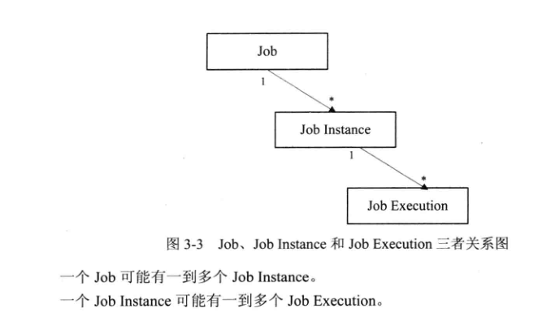


### JonInstance

JobInstance（作业实例）是一个运行期的概念，Job每执行一次都会涉及一个JobInstance，JobInstance的来源可能由两种，一种是根据设置的JobParamters从JobParamter（作业仓库）中获取一个，如果根据JobParamters从JobRepository没有获取JobInstance，则创建一个新的JobInstance，

根据带入的JobParmaters参数不同的执行结果：

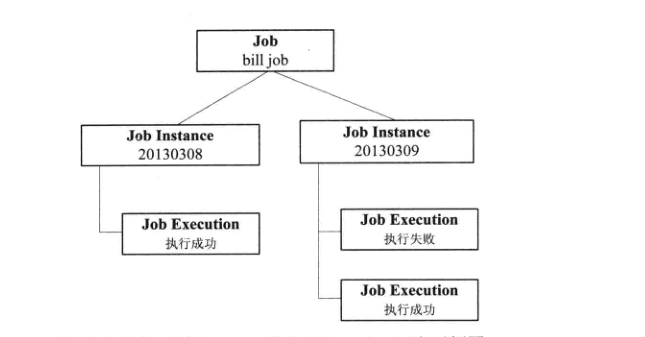


### JobParamters

Job通过JobParamters 来区分不同的JobInstance，简单的说 JobName + JobParamters来唯一确定一个JobInstance，如果JobName 一样，则JobParamters 肯定不一样，但是对不同的Job来说，允许有相同的JobParamters，JobInstance、JobName和JobParamters 三个关系参见图 3-7


### JobParamter

表示单个JobParamter 参数

### JobParamtersBuilder

用来构建JobParamter 参数的 Builder 构建起


### JobExecution

JobExecution 表示Job执行的句柄，根据上面的描述可值，一次Job的执行可能成功也可能失败，只有JobExecution 执行成功后，对应的JobInstance才会被完成

**属性概览：**

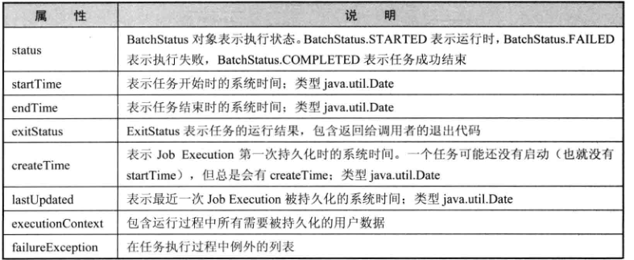


### Step

Step 表示作业中一个完整步骤，一个Job可以由一个或者多个Step组成，Step包含一个实际运行的批处理任务中的所有必要的信息，Step 可以是非常简单的业务实现，比如打印HelloWorld信息，也可以是非常复杂的业务处理，**Step的复杂程度通常是由业务决定的**

一个Job 可以拥有一个到多个Step，一个Step 可以有一个多到多个StepExecution（当一个Step 执行失败下次执重新执行该任务的时候，会为该Step重新生成一个StepExeution），一个JobExecution 可以有用到多个StepExecution（当一个Job 由多个Step组成时，每个Step执行都会生成一个新的StepExecution），则一个JobExecution 会拥有多个StepExecution

Step 可以配置Tasklet、partition、job、flow，图如下:

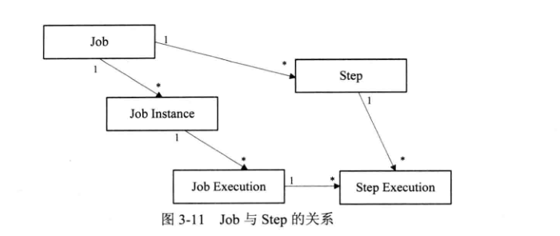


### StepExecution

StepExecution 是Step执行的句柄，一次Step执行可能成功也可能失败，例如上面执行的三次任务，billJob任务只有一个Step，但是作业步执行器对应的 BATCH_STEP_EXECUTION 却有三条激励


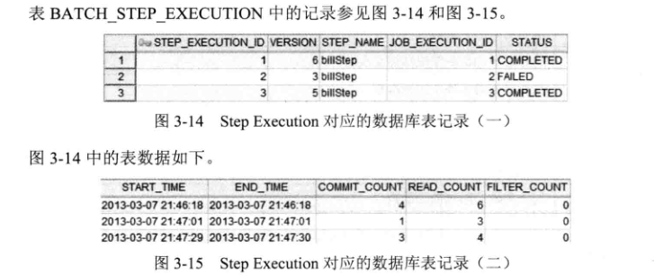

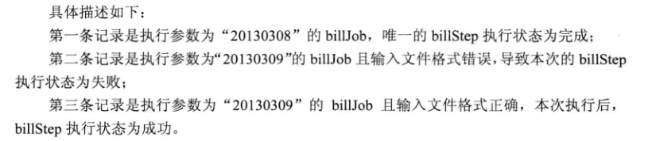

Step Execution 包括每次执行对应的Step，JobExecution，相关的事务操作**（例如提交与回滚）**、开始时间与结束时间等，此外每次执行Step时还包含一个ExecutionContext，用来存放开发者在批处理运行过程中所需要的任何信息，例如用来重启的静态数据与状态数据


**StepExecution 属性：**

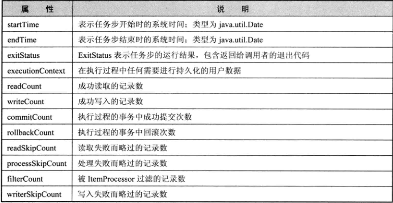

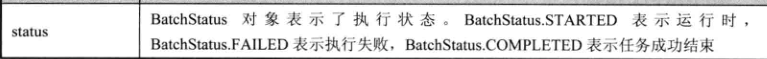


### ExecutionContext


### JobRepository

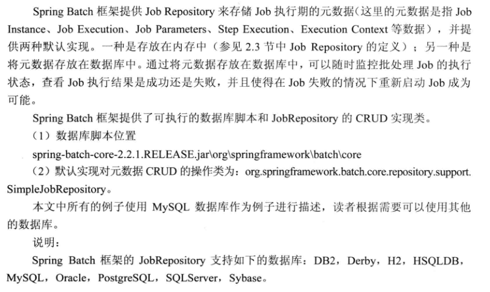


#### JobRepository Schema

在定义JobRepository 以及 数据表时，提供属性如下：

data-source：数据源，默认自动注入

trsaction-manager：事务管理器，为了确保批处理操作元数据以及失败后重启的专题太能够被准确的持久化，如果repository的方法不是事务控制的，那么框架的型为就不能被准确的定义，默认引用transactionManager

isolation-level-before-create：创建job execution 实体时候的隔离级别，默认使用SERIALIZABLE, 通用使用 REPEATABLE_READ 也可以很好的工作，默认值：SERIALIZABLE

max-varchar-length：数据库字段类型为VARCHAR时候允许的最大长度，默认：2500

table_prefix：表名前缀，JobRepository 可以修改元数据表的表前缀，但是表民和列名不能修改，默认值：BATCH_

lob-handler: 大字段列的处理方式，默认只有Oracle数据库，或者Spring Batch 框架不支持的数据库类型需要配置


#### Memory JobRepository

平时测试的时候，会用到

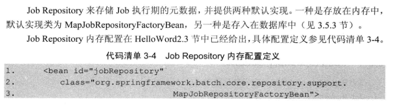	

#### 基于JavaConfig的JobRepository 配置

```
暂时未空
```


### JobLauncher


## Batch 数据表

- BATCH_JOB_INSTANCE

  对应java 实体类 `JobInstance` 

  作业实例表，用于存放Job的实例信息，

  ```sql
  CREATE TABLE BATCH_JOB_INSTANCE  (
  	JOB_INSTANCE_ID BIGINT  NOT NULL PRIMARY KEY ,
  	VERSION BIGINT ,
  	JOB_NAME VARCHAR(100) NOT NULL,
  	JOB_KEY VARCHAR(32) NOT NULL,
  	constraint JOB_INST_UN unique (JOB_NAME, JOB_KEY)
  ) ENGINE=InnoDB;
  
  
  JOB_INSTANCE_ID: 主键，作业实例ID编号，根据BATCH_JOB_SEQ自动生成
  VERSION: 版本号
  JOB_NAME: 作业名称，既在配置文件中定义的Job id字段内容
  JOB_KEY: 作业标识，根据作业参数序列化生成的标识；需要注意通过JOB_NAME + JOB_KEY 能够唯一区分一个作业实例，
  		如果是同一个Job，则JobKey一定能相同，既作业参数不能相同，如果不是同一个Job，JOB_KEY则可以相同，既作业参数可以相同
  ```


- BATCH_JOB_EXECUTION_PARAMS

  对应java实体类 `JobParamters`

  作业参数表，用于存放每个Job执行时候的参数信息，该参数实际上是对应Job实例的

  ```sql
  CREATE TABLE BATCH_JOB_EXECUTION_PARAMS  (
  	JOB_EXECUTION_ID BIGINT NOT NULL ,
  	TYPE_CD VARCHAR(6) NOT NULL ,
  	KEY_NAME VARCHAR(100) NOT NULL ,
  	STRING_VAL VARCHAR(250) ,
  	DATE_VAL DATETIME DEFAULT NULL ,
  	LONG_VAL BIGINT ,
  	DOUBLE_VAL DOUBLE PRECISION ,
  	IDENTIFYING CHAR(1) NOT NULL ,
  	constraint JOB_EXEC_PARAMS_FK foreign key (JOB_EXECUTION_ID)
  	references BATCH_JOB_EXECUTION(JOB_EXECUTION_ID)
  ) ENGINE=InnoDB;
  ```

  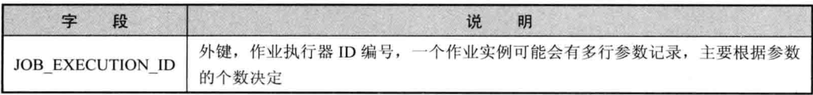

  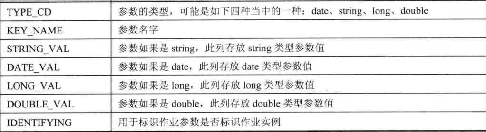

  


- BATCH_JOB_EXECUTION

  对应java实体类 `JobExecution`

  作业执行器表，用于存放每个Job执行时候的参数信息，该参数实际上是对应Job实例的

  ```sql
  CREATE TABLE BATCH_JOB_EXECUTION  (
  	JOB_EXECUTION_ID BIGINT  NOT NULL PRIMARY KEY ,
  	VERSION BIGINT  ,
  	JOB_INSTANCE_ID BIGINT NOT NULL,
  	CREATE_TIME DATETIME NOT NULL,
  	START_TIME DATETIME DEFAULT NULL ,
  	END_TIME DATETIME DEFAULT NULL ,
  	STATUS VARCHAR(10) ,
  	EXIT_CODE VARCHAR(2500) ,
  	EXIT_MESSAGE VARCHAR(2500) ,
  	LAST_UPDATED DATETIME,
  	JOB_CONFIGURATION_LOCATION VARCHAR(2500) NULL,
  	constraint JOB_INST_EXEC_FK foreign key (JOB_INSTANCE_ID)
  	references BATCH_JOB_INSTANCE(JOB_INSTANCE_ID)
  ) ENGINE=InnoDB;
  ```

  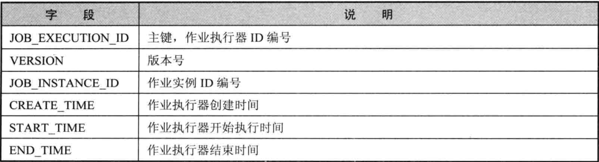

  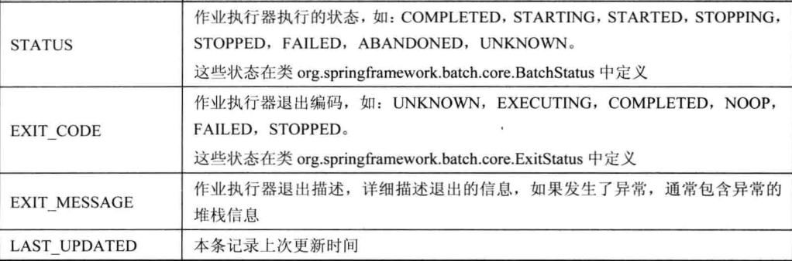


- BATCH_STEP_EXECUTION

  对应java实体类 `StepExecution`

  作业执行器表，用于存放每个Step执行器的信息，比如作业步骤开始执行的时间，执行完成时间，执行状态，读、写次数，跳过次数等

  ```sql
  CREATE TABLE BATCH_STEP_EXECUTION  (
  	STEP_EXECUTION_ID BIGINT  NOT NULL PRIMARY KEY ,
  	VERSION BIGINT NOT NULL,
  	STEP_NAME VARCHAR(100) NOT NULL,
  	JOB_EXECUTION_ID BIGINT NOT NULL,
  	START_TIME DATETIME NOT NULL ,
  	END_TIME DATETIME DEFAULT NULL ,
  	STATUS VARCHAR(10) ,
  	COMMIT_COUNT BIGINT ,
  	READ_COUNT BIGINT ,
  	FILTER_COUNT BIGINT ,
  	WRITE_COUNT BIGINT ,
  	READ_SKIP_COUNT BIGINT ,
  	WRITE_SKIP_COUNT BIGINT ,
  	PROCESS_SKIP_COUNT BIGINT ,
  	ROLLBACK_COUNT BIGINT ,
  	EXIT_CODE VARCHAR(2500) ,
  	EXIT_MESSAGE VARCHAR(2500) ,
  	LAST_UPDATED DATETIME,
  	constraint JOB_EXEC_STEP_FK foreign key (JOB_EXECUTION_ID)
  	references BATCH_JOB_EXECUTION(JOB_EXECUTION_ID)
  ) ENGINE=InnoDB;
  ```

  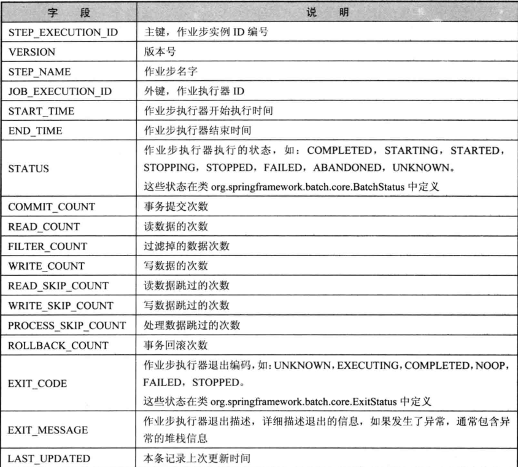


- BATCH_JOB_EXECUTION_CONTEXT

  对应java实体类 `ExecutionContext` ，表示当前Job执行的上下文参数作业执行上下文表，用于存放作业执行器的上下文信息

  ```sql
  CREATE TABLE BATCH_JOB_EXECUTION_CONTEXT  (
  	JOB_EXECUTION_ID BIGINT NOT NULL PRIMARY KEY,
  	SHORT_CONTEXT VARCHAR(2500) NOT NULL,
  	SERIALIZED_CONTEXT TEXT ,
  	constraint JOB_EXEC_CTX_FK foreign key (JOB_EXECUTION_ID)
  	references BATCH_JOB_EXECUTION(JOB_EXECUTION_ID)
  ) ENGINE=InnoDB;
  ```

  


- BATCH_STEP_EXECUTION_CONTEXT

  对应java实体类 `ExecutionContext` 表示当前Step 执行的上下文参数

  作业 Step 执行上下文表，用于存放每个作业Step 上下文的信息

  ```sql
  CREATE TABLE BATCH_STEP_EXECUTION_CONTEXT  (
  	STEP_EXECUTION_ID BIGINT NOT NULL PRIMARY KEY,
  	SHORT_CONTEXT VARCHAR(2500) NOT NULL,
  	SERIALIZED_CONTEXT TEXT ,
  	constraint STEP_EXEC_CTX_FK foreign key (STEP_EXECUTION_ID)
  	references BATCH_STEP_EXECUTION(STEP_EXECUTION_ID)
  ) ENGINE=InnoDB;
  ```

  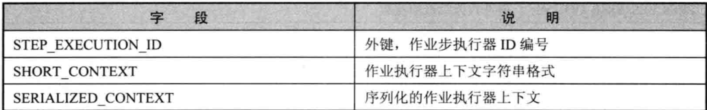


- BATCH_JOB_SEQ

  作业序列表，用于给表 BATCH_JOB_INSTANCE 和 BATCH_JOB_EXECUTION_PARAMS 提供主键

  ```sql
  CREATE TABLE BATCH_STEP_EXECUTION_SEQ (
  	ID BIGINT NOT NULL,
  	UNIQUE_KEY CHAR(1) NOT NULL,
  	constraint UNIQUE_KEY_UN unique (UNIQUE_KEY)
  ) ENGINE=InnoDB;
  ```

  


- BATCH_JOB_EXECUTION_SEQ

  作业执行器序列表，用于给表BATCH_JOB_EXECUTION和BATCH_JOB_EXECUTION_CONTEXT 提供主键

  ```sql
  CREATE TABLE BATCH_JOB_EXECUTION_SEQ (
  	ID BIGINT NOT NULL,
  	UNIQUE_KEY CHAR(1) NOT NULL,
  	constraint UNIQUE_KEY_UN unique (UNIQUE_KEY)
  ) ENGINE=InnoDB;
  ```

  


- BATCH_STEP_EXECUTION_SEQ

  作业执行器序列表，用于给表BATCH_JOB_EXECUTION和 BATCH_JOB_EXECUTION_CONTEXT 提供主键

  ```sql
  CREATE TABLE BATCH_JOB_SEQ (
  	ID BIGINT NOT NULL,
  	UNIQUE_KEY CHAR(1) NOT NULL,
  	constraint UNIQUE_KEY_UN unique (UNIQUE_KEY)
  ) ENGINE=InnoDB;
  ```

  


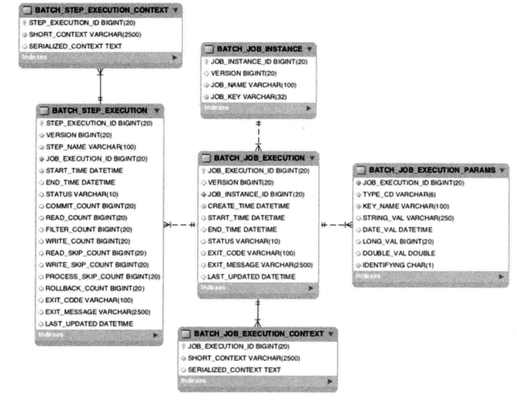