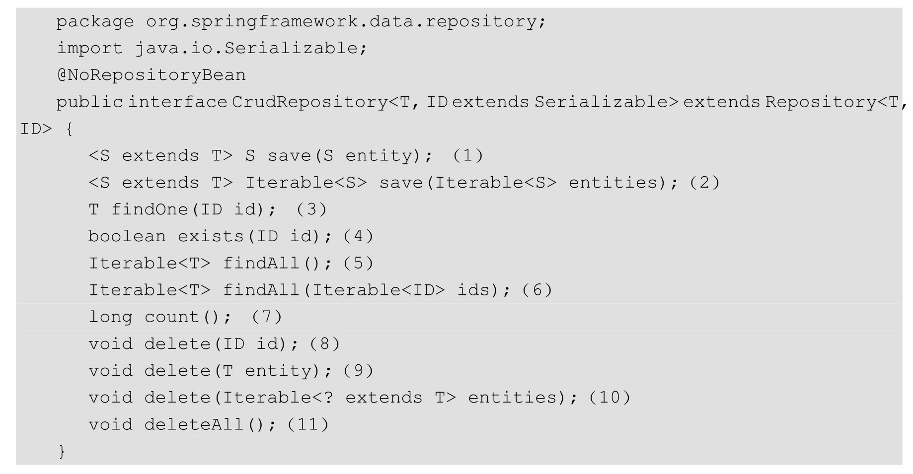
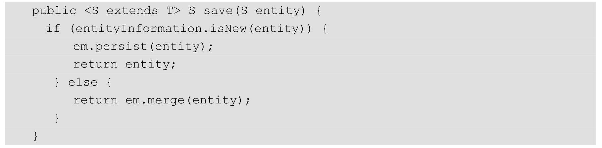
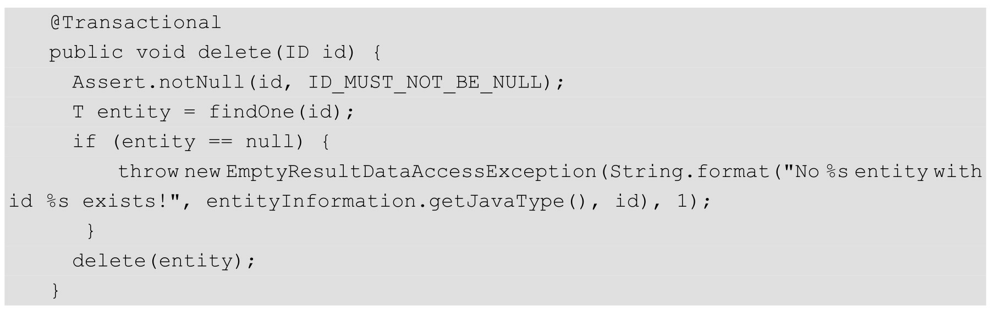
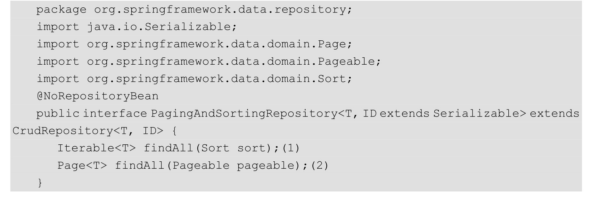
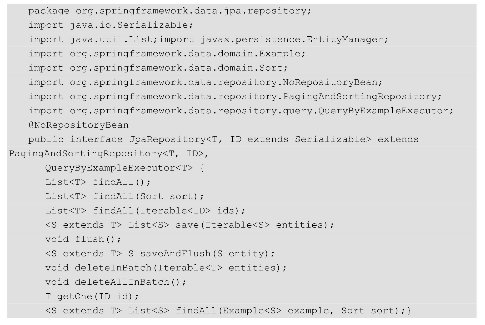
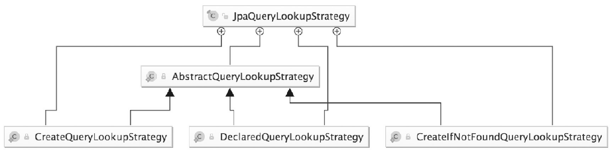
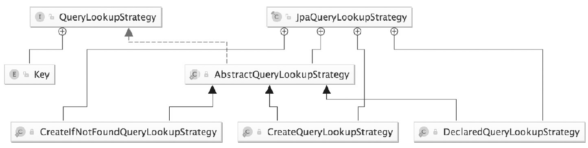

## JPA接口规范

### Jpa的默认实现接口

Repository

- CrudRepository
- PagingAndSortingRepository

- QueryByExampleExecutor

- JpaRepository

- JpaSpecificationExecutor

### Jpa的默认实现类：

SimpleJpaRepository
QueryDslJpaRepository（已经废弃）

### JPA的底层封装类。

- EntityManager (javax.persistence)
- EntityManagerImpl (org.hibernate.jpa.internal)

自定义Repository扩展

@NoRepositoryBean （告诉spring自定义的Repository是用来做扩展的）

@RepositortBeanDifinition 不依赖于spring内置的bean，自己来扩展

### CurdRepository

(1) 保存实体方法。我们通过刚才的类关系查看其他实现类。

SimpleJpaRepository里面的实现方法：

我们发现它是先检查传进去的实体是不是存在，然后判断是新增还是更新；是不是存在两种根据机制，一种是根据主键来判断，另一种是根据Version来判断（后面讲解Version的时候详解）

如果我们去看JPA控制台打印出来的SQL，最少会有两条，一条是查询，一条是insert或者update。

（2）批量保存。原理和步骤（1）相同。实现方法就是for循环调用上面的save方法。
（3）根据主键查询实体。
（4）根据主键判断实体是否存在。
（5）查询实体的所有列表。
（6）根据主键列表查询实体列表。
（7）查询总数。
（8）根据主键删除。我们通过刚才的类关系查看其他实现类。

SimpleJpaRepository里面的实现方法：

我们看到JPA会先去查询一下，再做保存，不存在抛出异常。

#### PagingAndSortingRepository

(1）根据排序取所有对象的集合。
(2）根据分页和排序进行查询，并用Page对象封装。Pageable对象包含分页和Sort对象。

分页依据： PageRequest，排序规则：Sort

#### JpaRepository

支持Query By Example，批量删除，提高删除效率，手动刷新数据库的更改方法，并将默认实现的查询结果变成了List。

#### SimpleJpaRepository

SimpleJpaRepository是JPA整个关联数据库的所有Repository的接口实现类。如果想进行扩展，可以继承此类同时也是Spring JPA动态代理的实现类

SimpleJpaRepository提供了所有Repository接口的实现，默认生成代理对象的时候，会生成一个实例来作为所有接口的代理对象

## JPA查询策略

通过@EnableJpaRepositories(queryLookupStrategy=QueryLookupStrategy.Key.CREATE_IF_NOT_FOUND)可以配置方法的查询策略，其中QueryLookupStrategy.Key的值一共有三个。

CREATE：直接根据方法名进行创建。规则是根据方法名称的构造进行尝试，一般的方法是从方法名中删除给定的一组已知前缀，并解析该方法的其余部分。如果方法名不符合规则，启动的时候就会报异常。

USE_DECLARED_QUERY：声明方式创建，即本书说的注解方式。启动的时候会尝试找到一个声明的查询，如果没有找到就将抛出一个异常。查询可以由某处注释或其他方法声明。

CREATE_IF_NOT_FOUND：这个是默认的，以上两种方式的结合版。先用声明方式进行查找，如果没有找到与方法相匹配的查询，就用create的方法名创建规则创建一个查询

除非有特殊需求，一般直接用默认的

