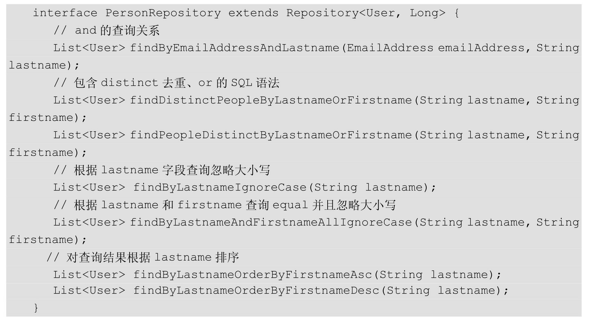
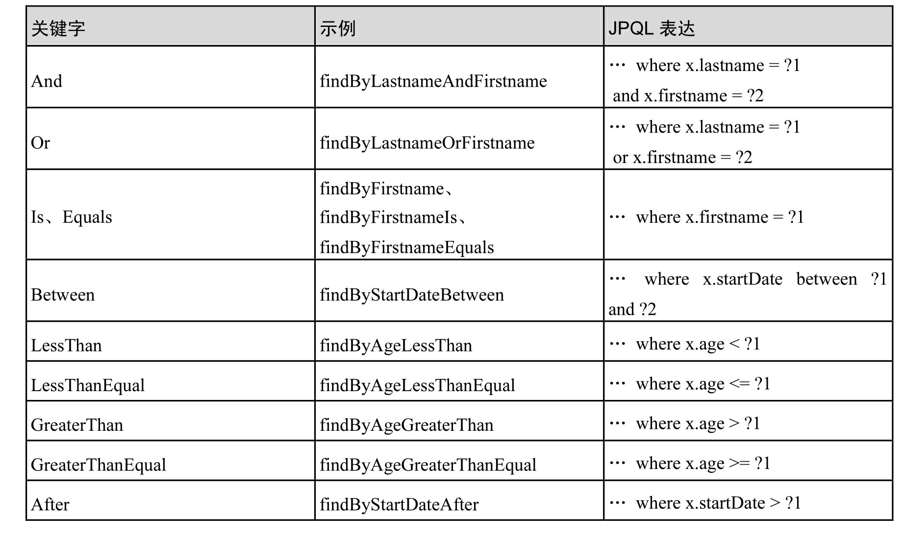
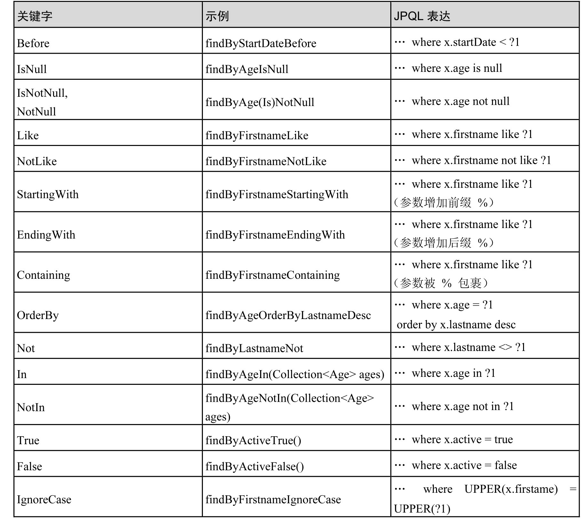
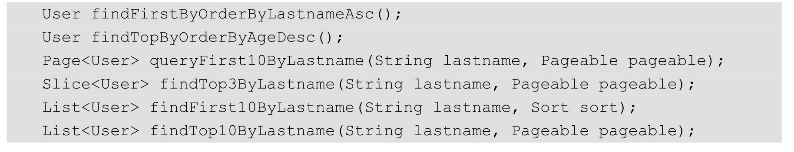

### 方法名查询策略

表达式通常是可以连接的运算符的属性遍历。你可以使用组合属性表达式AND和OR。你还可以将运算关键字Between、LessThan、GreaterThan、Like作为属性表达式。受支持的操作员可能因数据存储而异，因此请参阅官方参考文档的相应部分内容。

该方法解析器支持设置一个IgnoreCase标志个别特性（例如，findByLastnameIgnoreCase(…)）或支持忽略大小写（通常是一个类型的所有属性为String的情况下，例findByLastnameAndFirstnameAllIgnoreCase(…)）。是否支持忽略示例可能会因存储而异，因此请参阅参考文档中的相关
章节，了解特定于场景的查询方法。

可以通过OrderBy在引用属性和提供排序方向（Asc或Desc）的查询方法中附加一个子句来应用静态排序。要创建支持动态排序的查询方法来影响查询结果

#### 方法查询关键字

#### 限制查询结果

查询方法的结果可以通过关键字来限制first或top，其可以被互换地使用。可选的数值可以追加到顶部/第一个以指定要返回的最大结果大小。如果数字被省略，则假设结果大小为1。限制表达式也支持Distinct关键字。此外，对于将结果集限制为一个实例的查询，支持将结果包装到一个实例中的Optional中。如果将分页或切片应用于限制查询分页（以及可用页数的计算），则在限制结果中应用。