### JPA支持返回的查询结果

```
Iterator

List

Stream

Page

Future

CompletableFuture

Streamable<T>
```


#### Stream 查询

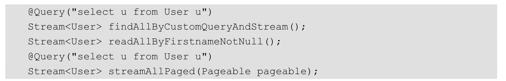

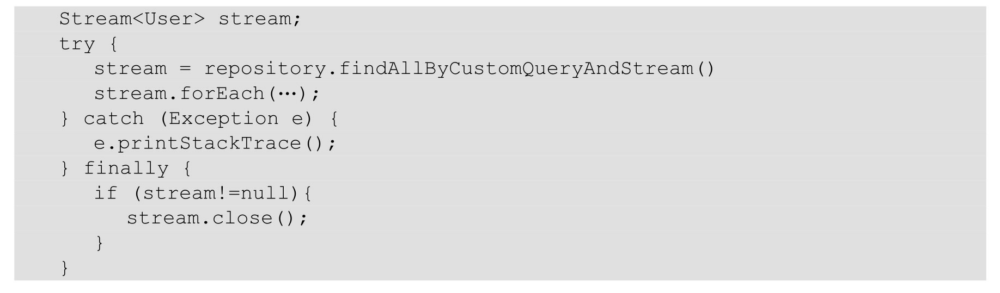


#### 异步查询

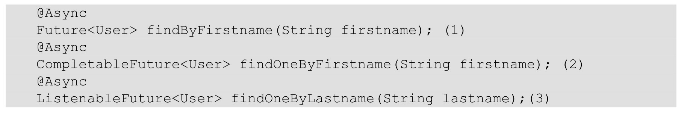

（1）使用java.util.concurrent.Future的返回类型。
（2）使用java.util.concurrent.CompletableFuture作为返回类型。
（3）使用org.springframework.util.concurrent.ListenableFuture作为返回类型


### 对特定结果做隐射

Spring JPA对Projections扩展的支持是非常好的。从字面意思上理解就是映射，指的是和DB查询结果的字段映射关系。一般情况下，返回的字段和DB查询结果的字段是一一对应的，但有的时候，我们需要返回一些指定的字段，不需要全部返回，或者只返回一些复合型的字段，还要自己写逻辑

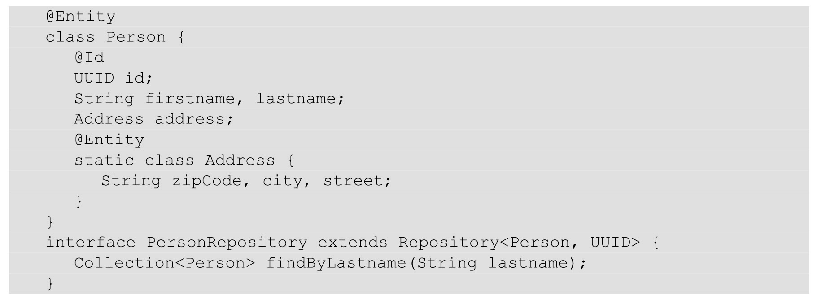


#### (1) 接口支持

基于projections的思路，其实是比较容易的。我们只需要声明一个接口，包含要返回的属性的方法即可，例如：

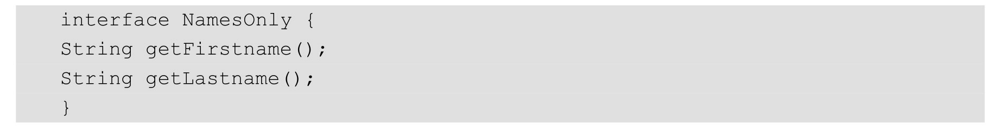

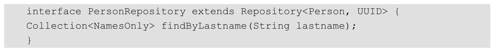


#### (2) 子对象查询支持

查询关联的子对象，例如

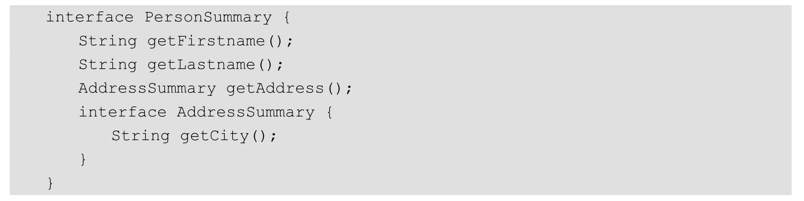


#### (3) @Value和SPEL支持

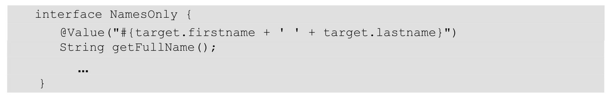


#### (4) spel bean支持

对Spel表达式的支持远不止这些：

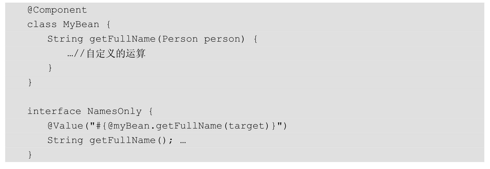


#### (5) spel支持 [arg参数]

还可以通过Spel表达式取到方法里面的参数值。

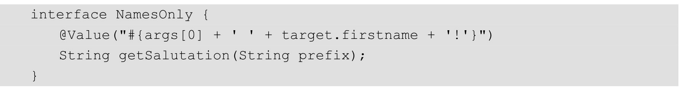

#### (6) dto支持

这时可能有人会想，只能用interface吗？Dto支持吗？其实也是可以的，我们也可以定义自己的Dto实体类。需要哪些字段，我们直接在Dto类中使用get/set属性即可。例如：

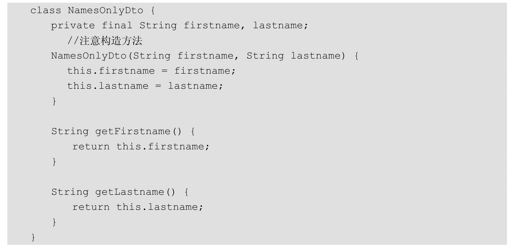


#### (7) 支持动态projections。

#### 通过泛化，可以根据不同的业务情况返回不同的字段集合。可以对PersonRepository做一定的变化，例如：

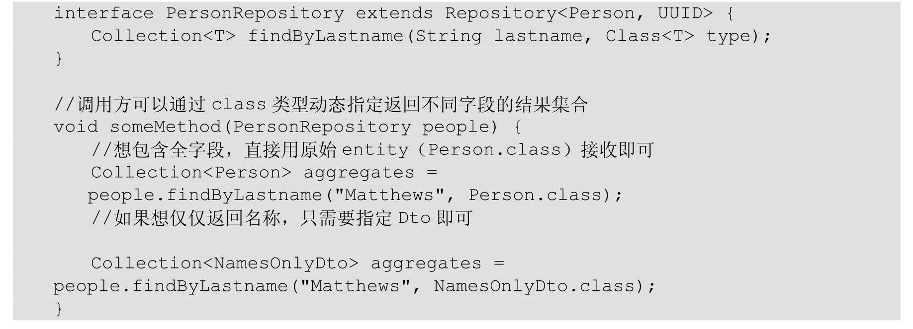

Projections的应用场景还是挺多的，希望大家好好体会，以利用更优雅的代码实现不同的场景，不必用数组、冗余的对象去接收查询结果


### 查询实现机制

通过QueryExecutorMethodInterceptor这个类的源代码，我们发现这个类实现了MethodInterceptor接口。也就是说它是一个方法调用的拦截器，当一个Repository上的查询方法（譬如indByEmailAndLastname方法）被调用时，Advice拦截器会在方法真正地实现调用前先执行MethodInterceptor的invoke方法。这样我们
就有机会在真正方法实现执行前执行其他的代码了。对于QueryExecutorMethodInterceptor来说，最重要的代码并不在invoke方法中，而是在它的构造器QueryExecutorMethodInterceptor(RepositoryInformation  r,Object customImplementation, Object target)中。

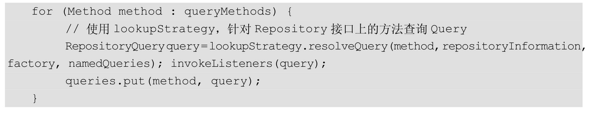


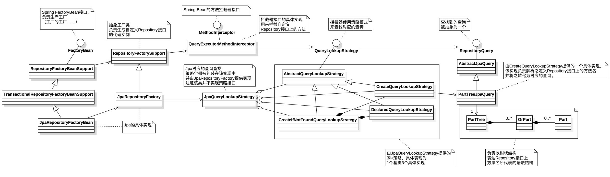


### 分页、排序

在查询方法中使用Pageable、Slice和Sort