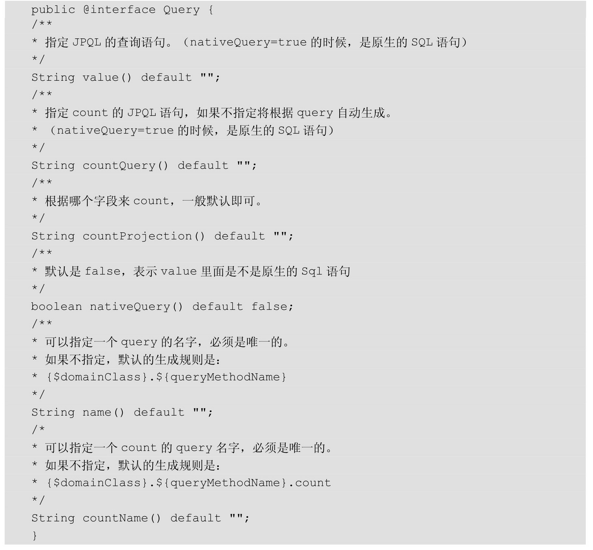
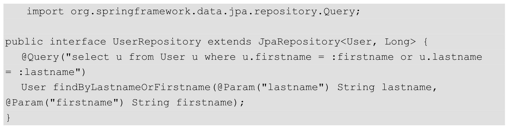
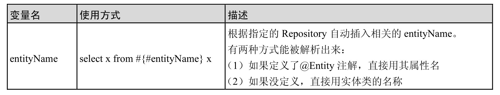
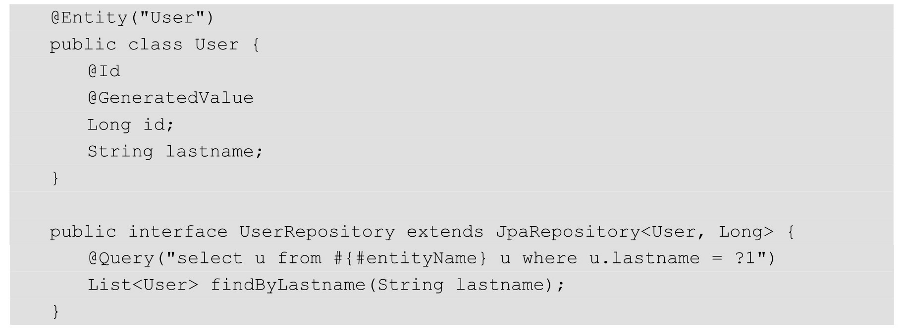
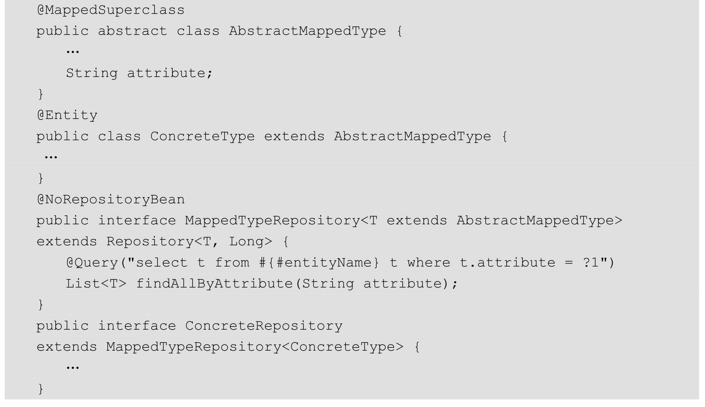

查询方法常用注解：

@Query注解

1、Like模糊查询的时候，字段是上不加%%的

2、查询的时候默认使用的是JPQL语句

3、查询的时候可以使用nativeSQL默认是原生SQL（nativeSql = true）,nativeQuery不支持直接Sort的参数查询。

#### 排序查询：

Sort JpaSort

#### 分页查询

Page<E> findAll(Pageable)

#### @Param 注解用法

#### Spel表达式支持

在以下的例子中，我们在查询语句中插入表达式：
这个SpEL的支持比较适合自定义的Repository，如果想写一个通用的Repository接口，那么可以用这个表达式来处理：

MappedTypeRepository作为一个公用的父类，自己的Repository可以继承它，当调用ConcreteRepository执行findAllByAttribute方法的时候执行结果如下：

i

#### @Modifying修改查询