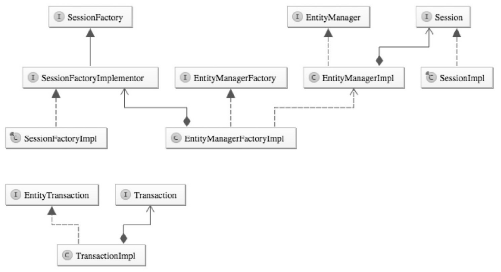

### Jpa规范常用注解




#### @Entity

@Entity定义对象将会成为被JPA管理的实体，将映射到指定的数据库表

```
public @interface Entity {
	// 可选，默认是此实体类的名字，全局唯一
    String name() default "";
}
```

#### @Table

@Table指定数据库的表名。


#### @Id
@Id定义属性为数据库的主键，一个实体里面必须有一个。