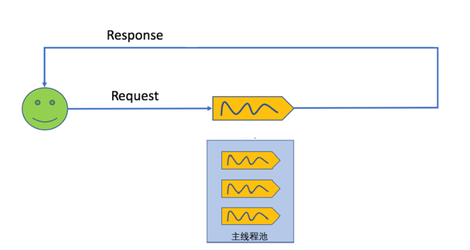
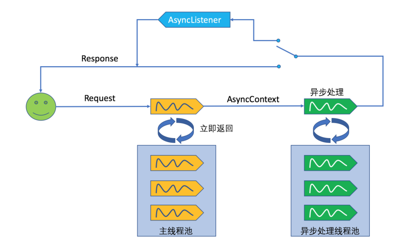
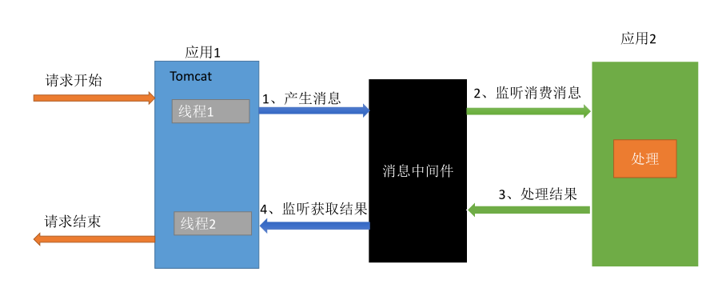

spring涉及到的源码类

```
DeferredResultInterceptorChain

WebAsyncManager

WebAsyncTask

WebAsyncUtils

DeferredResultMethodReturnValueHandler

return (DeferredResult.class.isAssignableFrom(type) ||
				ListenableFuture.class.isAssignableFrom(type) ||
				CompletionStage.class.isAssignableFrom(type));
```


Spring异步请求返回图


传统返回类型




异步返回类型




模拟图：




异步请求流程代码

```
@Controller
public class AsyncController {
	
	
	@ResponseBody
	@RequestMapping("/createOrder")
	public DeferredResult<Object> createOrder(){
		DeferredResult<Object> deferredResult = new DeferredResult<>((long)3000, "create fail...");	
		DeferredResultQueue.save(deferredResult);
		return deferredResult;
	}
	
	
	@ResponseBody
	@RequestMapping("/create")
	public String create(){
		//创建订单
		String order = UUID.randomUUID().toString();
		DeferredResult<Object> deferredResult = DeferredResultQueue.get();
		deferredResult.setResult(order);
		return "success===>"+order;
	}
	
	/**
	 * 1、控制器返回Callable
	 * 2、Spring异步处理，将Callable 提交到 TaskExecutor 使用一个隔离的线程进行执行
	 * 3、DispatcherServlet和所有的Filter退出web容器的线程，但是response 保持打开状态；
	 * 4、Callable返回结果，SpringMVC将请求重新派发给容器，恢复之前的处理；
	 * 5、根据Callable返回的结果。SpringMVC继续进行视图渲染流程等（从收请求-视图渲染）。
	 * 
	 * preHandle.../springmvc-annotation/async01
		主线程开始...Thread[http-bio-8081-exec-3,5,main]==>1513932494700
		主线程结束...Thread[http-bio-8081-exec-3,5,main]==>1513932494700
		=========DispatcherServlet及所有的Filter退出线程============================
		
		================等待Callable执行==========
		副线程开始...Thread[MvcAsync1,5,main]==>1513932494707
		副线程开始...Thread[MvcAsync1,5,main]==>1513932496708
		================Callable执行完成==========
		
		================再次收到之前重发过来的请求========
		preHandle.../springmvc-annotation/async01
		postHandle...（Callable的之前的返回值就是目标方法的返回值）
		afterCompletion...
		
		异步的拦截器:
			1）、原生API的AsyncListener
			2）、SpringMVC：实现AsyncHandlerInterceptor；
	 * @return
	 */
	@ResponseBody
	@RequestMapping("/async01")
	public Callable<String> async01(){
		System.out.println("主线程开始..."+Thread.currentThread()+"==>"+System.currentTimeMillis());
		
		Callable<String> callable = new Callable<String>() {
			@Override
			public String call() throws Exception {
				System.out.println("副线程开始..."+Thread.currentThread()+"==>"+System.currentTimeMillis());
				Thread.sleep(2000);
				System.out.println("副线程开始..."+Thread.currentThread()+"==>"+System.currentTimeMillis());
				return "Callable<String> async01()";
			}
		};
		
		System.out.println("主线程结束..."+Thread.currentThread()+"==>"+System.currentTimeMillis());
		return callable;
	}

}
```


