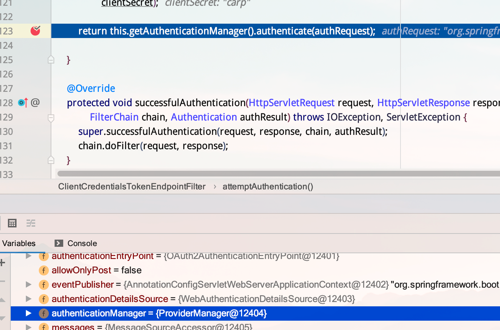

### Spring Oauth2 介绍

Spring OAuth2.0提供者实际上分为：

- 授权服务 Authorization Service.
- 资源服务 Resource Service.


配置一个授权服务必须要实现的endpoints：

- AuthorizationEndpoint：用来作为请求者获得授权的服务，默认的URL是/oauth/authorize.
- TokenEndpoint：用来作为请求者获得令牌（Token）的服务，默认的URL是/oauth/token.


配置一个资源服务必须要实现的过滤器：

- OAuth2AuthenticationProcessingFilter：用来作为认证令牌（Token）的一个处理流程过滤器。只有当过滤器通过之后，请求者才能获得受保护的资源。


你需要考虑几种授权类型（Grant Type），不同的授权类型为客户端（Client）提供了不同的获取令牌（Token）方式，为了实现并确定这几种授权，需要配置使用 ClientDetailsService 和 TokenService 来开启或者禁用这几种授权机制。到这里就请注意了，不管你使用什么样的授权类型（Grant Type），每一个客户端（Client）都能够通过明确的配置以及权限来实现不同的授权访问机制。这也就是说，假如你提供了一个支持"client_credentials"的授权方式，并不意味着客户端就需要使用这种方式来获得授权。下面是几种授权类型的列表，具体授权机制的含义可以参见RFC6749([中文版本](https://github.com/jeansfish/RFC6749.zh-cn))：

- authorization_code：授权码类型。
- implicit：隐式授权类型。
- password：资源所有者（即用户）密码类型。
- client_credentials：客户端凭据（客户端ID以及Key）类型。
- refresh_token：通过以上授权获得的刷新令牌来获取新的令牌。

授权玛类型相关类：

TokenGranter：令牌授予者

| AuthorizationCodeTokenGranter     | 授权码模式      |
| --------------------------------- | --------------- |
| ClientCredentialsTokenGranter     | 客户端模式      |
| ImplicitTokenGranter              | implicit 模式   |
| RefreshTokenGranter               | 刷新 token 模式 |
| ResourceOwnerPasswordTokenGranter | 密码模式        |


可以用 @EnableAuthorizationServer 注解来配置OAuth2.0 授权服务机制，通过使用@Bean注解的几个方法一起来配置这个授权服务。下面咱们介绍几个配置类，这几个配置是由Spring创建的独立的配置对象，它们会被Spring传入AuthorizationServerConfigurer中：

- ClientDetailsServiceConfigurer：用来配置客户端详情服务（ClientDetailsService），客户端详情信息在这里进行初始化，你能够把客户端详情信息写死在这里或者是通过数据库来存储调取详情信息。
- AuthorizationServerSecurityConfigurer：用来配置令牌端点(Token Endpoint)的安全约束.
- AuthorizationServerEndpointsConfigurer：用来配置授权（authorization）以及令牌（token）的访问端点和令牌服务(token services)。

（译者注：以上的配置可以选择继承AuthorizationServerConfigurerAdapter并且覆写其中的三个configure方法来进行配置。）


**配置客户端详情信息（Client Details)：**

ClientDetailsServiceConfigurer (AuthorizationServerConfigurer 的一个回调配置项，见上的概述) 能够使用内存或者JDBC来实现客户端详情服务（ClientDetailsService），有几个重要的属性如下列表：

- clientId：（必须的）用来标识客户的Id。
- secret：（需要值得信任的客户端）客户端安全码，如果有的话。
- scope：用来限制客户端的访问范围，如果为空（默认）的话，那么客户端拥有全部的访问范围。
- authorizedGrantTypes：此客户端可以使用的授权类型，默认为空。
- authorities：此客户端可以使用的权限（基于Spring Security authorities）。

 


```
ClientCredentialsTokenEndpointFilter

用于拦截 /oauth/token请求


```


AccessTokenConverter: 令牌服务实现的转换器接口，将身份验证数据存储在令牌中

TokenStore 存储token 信息

AuthenticationManager : 认证管理器用户认证当前的Authentication 是否合法

UserDetailsService ：

 AuthorizationServerConfigurerAdapter ： 授权服务配置适配器，开发人员可定义其实现类来完成对授权服务的各项配置； 

ClientDetailService： 加载clientID与 Clientsecuirt


 *配置授权（authorization）以及令牌（token）的访问端点和令牌服务(token services)* 


### 生成Oauth2AccessToken的步骤

关键 类如下：

```
OAuth2Request

Oauth2AutheticationToken

TokenRequest

Oauth2RequestFactory

TokenGranter 根据当前的grant_type 与 TokenReuest 生成 Oauth2AccessToken

Oauth2Authetication
```


# ClientCredentialsTokenEndpointFilter

# 介绍

Spring Security对于获取TOKEN的请求（默认是"/oauth/token"）,需要认证client_id和client_secret。认证client_id和client_secret可以有2种方式，一种是通过本节讲的ClientCredentialsTokenEndpointFilter，另一种是通过BasicAuthenticationFilter。ClientCredentialsTokenEndpointFilter首先比对请求URL是否是TOKEN请求路径以及请求参数中是否包含client_id，如果满足以上条件，再调用ProviderManager认证client_id和client_secret是否与配置的一致。如果通过认证，会把身份认证信息保存打SecurityContext上下文中。

# 代码分析

## 步骤1

Spring Security建议用BasicAuthenticationFilter替换ClientCredentialsTokenEndpointFilter，因此默认ClientCredentialsTokenEndpointFilter是不被开启的，我们为了讲解这个过滤器，可以按照如下方式开启过滤，配置如下：

```java
@RefreshScope
@Configuration
@EnableAuthorizationServer
public class AuthorizationServerConfig extends AuthorizationServerConfigurerAdapter {  
    @Override
    public void configure(AuthorizationServerSecurityConfigurer security) throws Exception {
        security.allowFormAuthenticationForClients();
    }
}
123456789
```

## 步骤2

ClientCredentialsTokenEndpointFilter继承自AbstractAuthenticationProcessingFilter，doFilter()方法在父类当中。请求经过过滤器时先判断url是否为与配置的获取access token的url进行匹配，并且请求参数中client_id不能为空时，然后将参数中的client_id和client_sercet与内存或者数据库(取决于ClientDetailService的实现方式)的client_id和client_sercet进行匹配，匹配成功则验证成功，反之则验证失败，代码如下：

```java
public void doFilter(ServletRequest req, ServletResponse res, FilterChain chain)
        throws IOException, ServletException {

    HttpServletRequest request = (HttpServletRequest) req;
    HttpServletResponse response = (HttpServletResponse) res;
	//判断请求是否需要进行认证：1）url与获取token的url一致 2）请求参数中client_id不能为空
    if (!requiresAuthentication(request, response)) {
        chain.doFilter(request, response);

        return;
    }

    if (logger.isDebugEnabled()) {
        logger.debug("Request is to process authentication");
    }

    Authentication authResult;

    try {
        //进行client_id和client_sercet认证
        authResult = attemptAuthentication(request, response);
        if (authResult == null) {
            // return immediately as subclass has indicated that it hasn't completed
            // authentication
            return;
        }
        sessionStrategy.onAuthentication(authResult, request, response);
    }
    catch (InternalAuthenticationServiceException failed) {
		...
        //处理认证失败
        unsuccessfulAuthentication(request, response, failed);
        return;
    }
    catch (AuthenticationException failed) {
        //处理认证失败
        unsuccessfulAuthentication(request, response, failed);
        return;
    }

    // Authentication success
    //是否在认证成功处理之前调用下一级过滤链
    if (continueChainBeforeSuccessfulAuthentication) {
        chain.doFilter(request, response);
    }
	//认证成功处理，1:SecurityContext上下文存储身份认证信息 2:rememberMeServices处理登录成功 3:发布登录成功Spring事件
    successfulAuthentication(request, response, chain, authResult);
}
123456789101112131415161718192021222324252627282930313233343536373839404142434445464748
```

requiresAuthentication()最终会调用ClientCredentialsTokenEndpointFilter#matches()

```java
protected boolean requiresAuthentication(HttpServletRequest request,
        HttpServletResponse response) {
    //requiresAuthenticationRequestMatcher是一个ClientCredentialsRequestMatcher
    return requiresAuthenticationRequestMatcher.matches(request);
}
12345
@Override
public boolean matches(HttpServletRequest request) {
    String uri = request.getRequestURI();
    int pathParamIndex = uri.indexOf(';');

    if (pathParamIndex > 0) {
        // strip everything after the first semi-colon
        uri = uri.substring(0, pathParamIndex);
    }
	//参数中必须要含有client_id参数
    String clientId = request.getParameter("client_id");

    if (clientId == null) {
        // Give basic auth a chance to work instead (it's preferred anyway)
        return false;
    }

    if ("".equals(request.getContextPath())) {
        return uri.endsWith(path);
    }

    //请求路径一定要是获取token的URL，一般为"/oauth/token"
    return uri.endsWith(request.getContextPath() + path);
}
123456789101112131415161718192021222324
```

## 步骤3

若上下无有效的身份认证信息，attemptAuthentication()最终会调用ProviderManager#authenticate()方法进行验证，authenticationManager中包含1.AnoymousAuthenticationProvider 2.DaoAuthenticationProvider，实际上只有DaoAuthenticationProvider在起作用，DaoAuthenticationProvider#authenticate()根据client_id获取client详情，然后判断client是否禁用、过期、锁定、密码是否一致等，若都满足条件则验证通过。截图和代码如下：

```java
@Override
public Authentication attemptAuthentication(HttpServletRequest request, HttpServletResponse response)
        throws AuthenticationException, IOException, ServletException {
    ...
    //取client_id
    String clientId = request.getParameter("client_id");
    //取client_secret
    String clientSecret = request.getParameter("client_secret");

    // If the request is already authenticated we can assume that this
    // filter is not needed
    //从SpringSecurity上下文中取一下身份认证信息，看看已经认证过的就无需重复认证了
    Authentication authentication = SecurityContextHolder.getContext().getAuthentication();
    if (authentication != null && authentication.isAuthenticated()) {
        return authentication;
    }
	
    if (clientId == null) {
        throw new BadCredentialsException("No client credentials presented");
    }

    if (clientSecret == null) {
        clientSecret = "";
    }

    clientId = clientId.trim();
    UsernamePasswordAuthenticationToken authRequest = new UsernamePasswordAuthenticationToken(clientId,
            clientSecret);
	//进行认证
    return this.getAuthenticationManager().authenticate(authRequest);

}
1234567891011121314151617181920212223242526272829303132
```



```java
public Authentication authenticate(Authentication authentication)
        throws AuthenticationException {
    Class<? extends Authentication> toTest = authentication.getClass();
    AuthenticationException lastException = null;
    AuthenticationException parentException = null;
    Authentication result = null;
    Authentication parentResult = null;
    boolean debug = logger.isDebugEnabled();
	//providers包含2个Provider：1.AnoymousAuthenticationProvider 2.DaoAuthenticationProvider
    for (AuthenticationProvider provider : getProviders()) {
        //这里的support逻辑很简单，就是判断一下authentication.getClass()与Provider支持的类类型是否一致或父子继承关系
        //AnoymousAuthenticationProvider是不支持的，DaoAuthenticationProvider支持
        if (!provider.supports(toTest)) {
            continue;
        }

        try {
            //provider实例是DaoAuthenticationProvider
            result = provider.authenticate(authentication);

            if (result != null) {
                //将认证成功的身份认证信息复制到另外一个实例
                copyDetails(authentication, result);
                break;
            }
        }
        catch (AccountStatusException | InternalAuthenticationServiceException e) {
            prepareException(e, authentication);
            // SEC-546: Avoid polling additional providers if auth failure is due to
            // invalid account status
            throw e;
        } catch (AuthenticationException e) {
            lastException = e;
        }
    }

    throw lastException;
}
1234567891011121314151617181920212223242526272829303132333435363738
public Authentication authenticate(Authentication authentication)
        throws AuthenticationException {
	...
    // Determine username
    String username = (authentication.getPrincipal() == null) ? "NONE_PROVIDED"
            : authentication.getName();

    boolean cacheWasUsed = true;
    //默认是NullUserCache，即不加缓存
    UserDetails user = this.userCache.getUserFromCache(username);
	//缓存中没用命中
    if (user == null) {
        //设置命中标识
        cacheWasUsed = false;

        try {
            //调用ClientDetailsUserDetailsService根据client_id获取用户
            user = retrieveUser(username,
                    (UsernamePasswordAuthenticationToken) authentication);
        }
        catch (UsernameNotFoundException notFound) {
 			...
        }
		...
    }

    try {
        //检查账户是否锁定、启用、过期等
        preAuthenticationChecks.check(user);
        //检查凭据[密码]是否非空、以及存储密码与输入密码是否一致
        additionalAuthenticationChecks(user,
                (UsernamePasswordAuthenticationToken) authentication);
    }
    catch (AuthenticationException exception) {
		...
    }
	//检查凭据是否未过期
    postAuthenticationChecks.check(user);

    if (!cacheWasUsed) {
        this.userCache.putUserInCache(user);
    }

    Object principalToReturn = user;

    if (forcePrincipalAsString) {
        principalToReturn = user.getUsername();
    }
	//创建Authentication[身份认证信息]
    return createSuccessAuthentication(principalToReturn, authentication, user);
}
```

