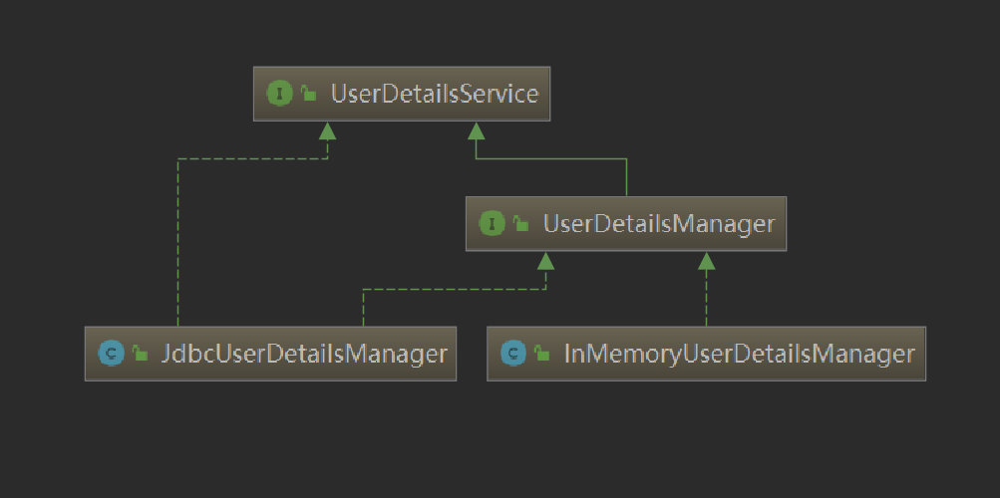
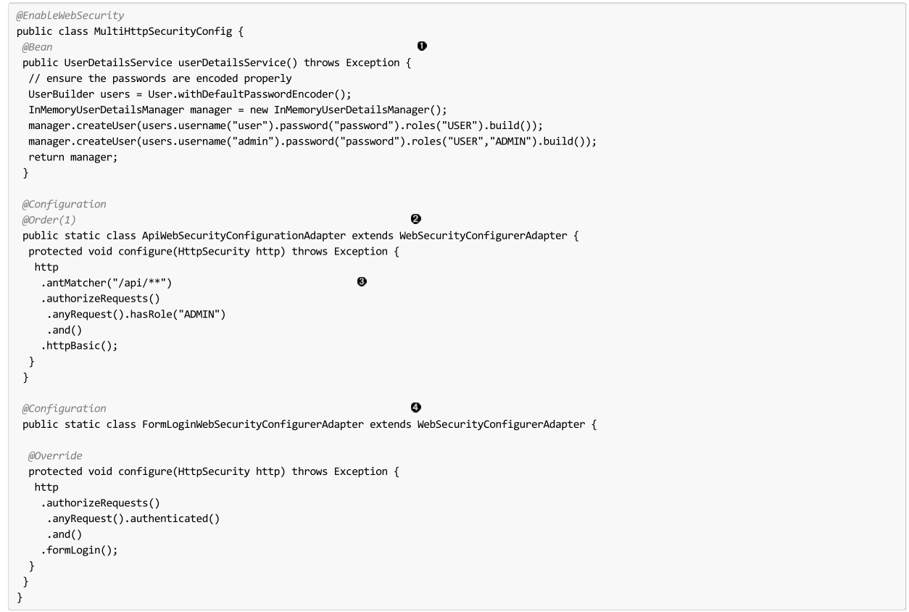
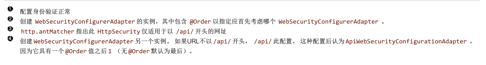
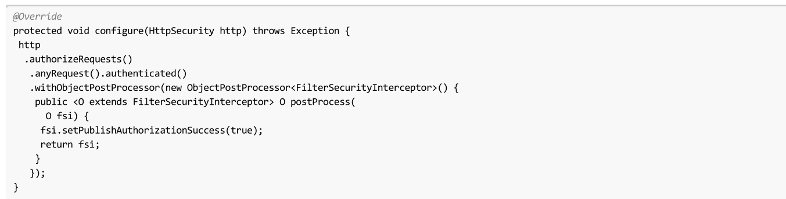
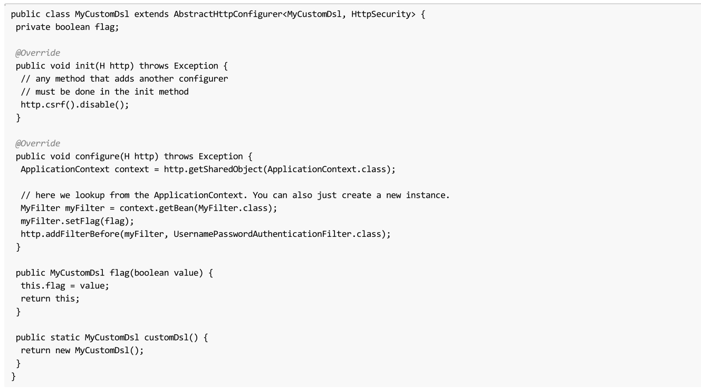
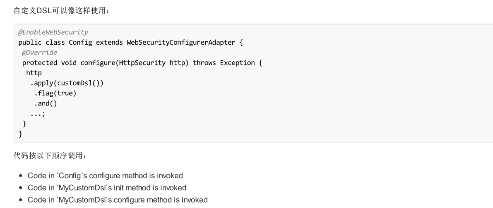
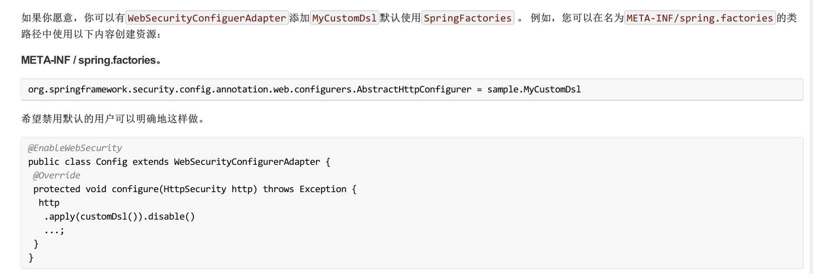
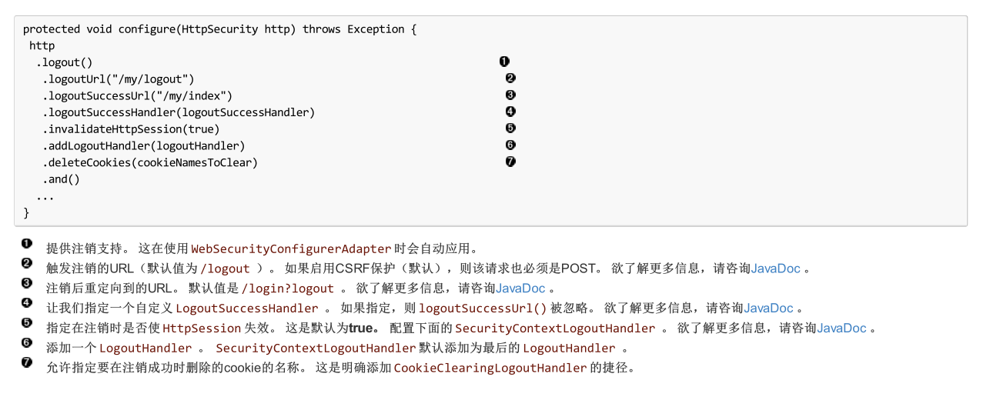
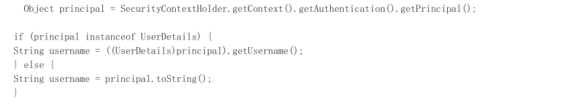

@EbableWebSecurity 开启web服务器的验证机制


### UserDetails

配置 UserDetails 信息

自定义 UserDetailsService 为 bean 来定义自定义身份验证。 例如，假设 SpringDataUserDetailsService 实现了 UserDetailsService 

```java
@Bean
public SpringDataUserDetailsService springDataUserDetailsService() {
	return new SpringDataUserDetailsService();
}
```

这仅在 AuthenticationManagerBuilder 尚未填充 AuthenticationProviderBean 定义 AuthenticationManagerBuilder 时才使用。


1、在内存中为单个用户配置认证的例子。 以下是配置多个用户的示例

```java
@Bean
public UserDetailsService userDetailsService() throws Exception {
// ensure the passwords are encoded properly
UserBuilder users = User.withDefaultPasswordEncoder();
InMemoryUserDetailsManager manager = new InMemoryUserDetailsManager();
manager.createUser(users.username("user").password("password").roles("USER").build());
manager.createUser(users.username("admin").password("password").roles("USER","ADMIN").build());
return manager;
}
```

2、使用jdbc 的方式来配置身份验证

```java
@Autowired
private DataSource dataSource;
@Autowired
public void configureGlobal(AuthenticationManagerBuilder auth) throws Exception {
// ensure the passwords are encoded properly
UserBuilder users = User.withDefaultPasswordEncoder();
auth
.jdbcAuthentication()
.dataSource(dataSource)
.withDefaultSchema()
.withUser(users.username("user").password("password").roles("USER"))
.withUser(users.username("admin").password("password").roles("USER","ADMIN"));
}
```


#### UserDetailsManager



```java
interface UserManagerDetails: 用户管理
	void createUser(UserDetails user);
	void updateUser(UserDetails user);	
	void deleteUser(String username);
	void changePassword(String oldPassword, String newPassword);
	boolean userExists(String username);
```


### PasswordEncoder

为 bean 来自定义密码的加密方式，可以声明PasswrodEncoder Bean 来实现

```java
@Bean
public BCryptPasswordEncoder passwordEncoder() {
	return new BCryptPasswordEncoder();
}
```


### 多个HttpSecuirty 配置

可以配置多个 HttpSecurity 实例，就像我们可以有多个 <http> 块一样。 关键是多次延长 WebSecurityConfigurationAdapter 。 例如，以下是以 /api/ 开头的具有不
同配置的 URL 的 /api/ 






### Method Secuirty

使用注解的形式或者AOP的形式来校验用户的权限信息

####  EnableGlobalMethodSecurity

我们可以在任何 @Configuration 实例上使用 @EnableGlobalMethodSecurity 注释来启用基于注释的安全性。

```java
@EnableGlobalMethodSecurity(prePostEnabled = true)
public class MethodSecurityConfig {
	// ...
}
```

使用java代码来表示

```java
public interface BankService {
	@PreAuthorize("isAnonymous()")
	public Account readAccount(Long id);
	@PreAuthorize("isAnonymous()")
	public Account[] findAccounts();
	@PreAuthorize("hasAuthority('ROLE_TELLER')")
	public Account post(Account account, double amount);
}
```


#### GlobalMethodSecurityConfiguration

GlobalMethodSecurityConfiguration主要负责配置全局的基于方法的用户信息校验，对于这些实例，可以扩展 GlobalMethodSecurityConfiguration ， 例如，如果想提供自定义 MethodSecurityExpressionHandler ，则可以使用以下配置：

```java
@EnableGlobalMethodSecurity(prePostEnabled = true)
public class MethodSecurityConfig extends GlobalMethodSecurityConfiguration {
	@Override
	protected MethodSecurityExpressionHandler createExpressionHandler() {
		// ... create and return custom MethodSecurityExpressionHandler ...
	return expressionHandler;
	}
}
```


### ObjectPostProcessor

Spring Security 的 Java 配置不公开其配置的每个对象的每个属性, 为了解决这个问题， Spring Security 引入了 ObjectPostProcessor 的概念，它可以用来修改或替换由 Java 配置创建的许多对象实例。 例如，如果您想要配置 filterSecurityPublishAuthorizationSuccess 上
的 filterSecurityPublishAuthorizationSuccess 属性， FilterSecurityInterceptor 可以使用以下内容: 




### 自定义DSL(AbstractHttpConfigurer)

可以通过继承AbstractHttpConfigurer 抽象类，来实现自己的http权限配置信息



> 这实际上是诠释了 HttpSecurity.authorizeRequests() 这样的方法调用






### FilterChain

标准过滤器的别名和实现类

| Alias                        | Filter Class                                 |
| ---------------------------- | -------------------------------------------- |
| CHANNEL_FILTER               | ChannelProcessingFilter                      |
| SECURITY_CONTEXT_FILTER      | SecurityContextPersistenceFilter             |
| CONCURRENT_SESSION_FILTER    | ConcurrentSessionFilter                      |
| HEADERS_FILTER               | HeaderWriterFilter                           |
| CSRF_FILTER                  | CsrfFilter                                   |
| LOGOUT_FILTER                | LogoutFilter                                 |
| X509_FILTER                  | X509AuthenticationFilter                     |
| PRE_AUTH_FILTER              | AbstractPreAuthenticatedProcessingFilter子类 |
| CAS_FILTER                   | CasAuthenticationFilter                      |
| FORM_LOGIN_FILTER            | UsernamePasswordAuthenticationFilter         |
| BASIC_AUTH_FILTER            | BasicAuthenticationFilter                    |
| SERVLET_API_SUPPORT_FILTER   | SecurityContextHolderAwareRequestFilter      |
| JAAS_API_SUPPORT_FILTER      | JaasApiIntegrationFilter                     |
| REMEMBER_ME_FILTER           | RememberMeAuthenticationFilter               |
| ANONYMOUS_FILTER             | AnonymousAuthenticationFilter                |
| SESSION_MANAGEMENT_FILTER    | SessionManagementFilter                      |
| EXCEPTION_TRANSLATION_FILTER | ExceptionTranslationFilter                   |
| FILTER_SECURITY_INTERCEPTOR  | FilterSecurityInterceptor                    |
| SWITCH_USER_FILTER           | SwitchUserFilter                             |


### SpringSecurityFilterChain

spring secuirty 的 filterChain 核心执行链


### AbstractSecurityWebApplicationInitializer

通过 Servlet 3.0+ 环境中的 Spring’s WebApplicationInitializer support Java 配置完成。 不出所料， Spring
Security 提供了一个基类 AbstractSecurityWebApplicationInitializer


### HttpSecurity 

定义了需要如何验证用户的信息，哪些需要验证，哪一些不需要

- authorizeRequests： 添加多个子项来为我们的 URL 指定自定义要求
  - anyRequest 任何请求
  - antMatchers
  - mvcMatchers
  - requestMacthers：只允许哪些request请求访问（比如 /test, 则/test1 则返回404，即使是 server端有这个端点也不行）
    - authenticated 都要被验证
    - .hasRole("ADMIN")
    - .access("hasRole('ADMIN') and hasRole('DBA')")
    - permitAll() 允许访问
  - 
- formLogin 开启表单登录
  - loginPage("/login")  : 更新的配置指定登录页面的位置。
  - permitAll() : 授予所有用户（即未经身份验证的用户）访问我们的登录页面
- httpBasic 允许basic 登录认证


### Logout

使用 WebSecurityConfigurerAdapter ，会自动应用注销功能。 默认情况下，访问 URL  /logout 将通过以下方式将注销用户：

- Invalidating the HTTP Session
- Cleaning up any RememberMe authentication that was configured
- Clearing the  SecurityContextHolder
- Redirect to  /login?logout


自定义注销：

```java
protected void configure(HttpSecurity http) throws Exception {
	http
		.logout()
		.logoutUrl("/my/logout")
		.logoutSuccessUrl("/my/index")
		.logoutSuccessHandler(logoutSuccessHandler)
		.invalidateHttpSession(true)
		.addLogoutHandler(logoutHandler)
		.deleteCookies(cookieNamesToClear)
		.and()
		...
}
```




自定义注销功能，可以添加 LogoutHandler 和 LogoutSuccessHandler 实现。 对于很多常见的场景，这些处理程序在使用流利 API 时会在封面下应用


#### LogoutHandler

LogoutHandler 默认提供了以下几种实现，来实现登出功能

- PersistentTokenBasedRememberMeServices
- TokenBasedRememberMeServices
- CookieClearingLogoutHandler
- CsrfLogoutHandler
- SecurityContextLogoutHandler

Fluent API 不是直接提供 LogoutHandler 实现，而是提供了快捷方式，它们提供了相应的 LogoutHandler 实现。 例如， deleteCookies() 允许指定在注销成功时删除
一个或多个 cookie 的名称。 与添加 CookieClearingLogoutHandler 相比，这是一条捷径。


#### LogoutSuccessHandler

LogoutSuccessHandler 在 LogoutFilter 成功注销后被 LogoutFilter 调用 ，用来处理重定向或转发到目标url地址

- SimpleUrlLogoutSuccessHandler
- HttpStatusReturningLogoutSuccessHandler

我们可以直接使用Fluent Api 来设置 ` logoutSuccessUrl() ` 来设置登出成功后的地址，而不是直接SimpleUrlLogoutSuccessHandler 来设置

在 REST API 的类型场景中， HttpStatusReturningLogoutSuccessHandler不是在成功注销后重定向到 URL ，而是提供
一个普通的 HTTP 状态代码来返回。 如果未配置，则缺省情况下将返回状态代码 200 。


### AuthenticationProvider

用来校验某个Authentication 是否有权限，如果没有权限的话 则投票

- ```
  RememberMeAuthenticationProvider
  DaoAuthenticationProvider
  NullAuthenticationProvider
  PreAuthenticatedAuthenticationProvider
  RunAsImplAuthenticationProvider
  AnonymousAuthenticationProvider
  ```


### AuticationManager

管理所有的Provider，由provider 投票后，根据投票结果来判断用户是否据有权限，一个Manager 可以 拥有多个Provider

-  ProviderManager


### AccessDecisionManager

- AffirmativeBased
- RoleVoter
- AuthenticatedVoter

## 核心组件

### SecurityContextHolder, SecurityContext和Authentication 对象

 SecurityContextHolder 使用ThreadLocal 存储了当前用户的登录信息，这意味着，安全环境在同一个线程执行的方法一直是有效的，在处理完当前主体的请求以后，把这个线程清除就行了。Spring Security自动管理这一切了，

希望Java Virtual Machine里所有的线程 都使用同一个安全环境。 SecurityContextHolder 可以配置启动策略来指定你希望上下文怎么被存储。对于一个独立的应用程序，你会使用 SecurityContextHolder.MODE_GLOBAL 策略。其他程序可能也想由安全线程产生的线程也承担同样的安全标识。这是通过使用SecurityContextHolder.MODE_INHERITABLETHREADLOCAL 实现。你可以通过两种方式更改默认的 SecurityContextHolder.MODE_THREADLOCAL 模式。第一个是设置系统属性，第二个是调用 SecurityContextHolder 的静态方法。大多数应用程序不需要修改默认值，但是如果你想要修改，可以看一下 SecurityContextHolder 的JavaDocs中的详细信息了解更多。

**获取当前用户信息**
我们在 SecurityContextHolder 内存储目前与应用程序交互的主要细节。Spring Security使用一个 Authentication 对象来表示这些信息。你通常不需要创建一个自我认证的对象,但它是很常见的用户查询的 Authentication 对象。你可以使用以下代码块-从你的应用程序的任何部分-获得当前身份验证的用户的名称，例如:



通过调用 getContext() 返回的对象是 SecurityContext 接口的实例。这是保存在线程本地存储中的对象。我们将在下面看到，大多数的认证机制以Spring Security返回 UserDetails 实例为主


### UserDetailsService

UserDetails 是一个Spring Security的核心接口。它代表一个主体，是扩展的，而且是为特定程序服务的。

```java
UserDetails loadUserByUsername(String username) throws UsernameNotFoundException;
```

Spring 通过调用UserDetailService 来获取当前的用户信息

成功认证后， UserDetails 用于构建存储在 SecurityContextHolder (详见 以下)的 Authentication 对象。好消息是，我们提供了一些UserDetailsService 的实现，包括一个使用内存映射( InMemoryDaoImpl )而另一个使用JDBC( JdbcDaoImpl )

> UserDetailService 只是用于用户数据的DAO并没有其它功能，特别是它不会对用户进行身份验证,这是由 AuthenticationManager 完成，如果需要自定身份验证，直接实现AutenticationProvider 即可


### GrantedAuthority

 Authentication 提供的重要方法是 getAuthorities() 。这个方法提供了 GrantedAuthority 对象数组。GrantedAuthority  代表了赋予当前用户的权限，这些权限通常使用角色表示，比如 ROLE_ADMINISTRATOR 或 ROLE_HR_SUPERVISOR 。这些角色在对于Web 验证 方法验证 或者领域对象验证的时候会被用到，Spring Secuirty 的其他Filter 会对该权限做拦截，以判断角色是否匹配等

**核心类如下：**

- SecurityContextHolder , 提供几种访问  SecurityContext 的方式。
- SecurityContext , 保存 Authentication 信息和请求对应的安全信息。
- Authentication , 展示Spring Security特定的主体。
- GrantedAuthority   在应用程序范围内，赋予主体的权限。
- UserDetails  通过你的应用DAO，提供必要的信息，构建Authentication对象。
- UserDetailsService   创建一个 UserDetails ，传递一个  String 类型的用户名(或者证书ID或其他)


### AbstractSecurityInterceptor 

Spring Security不介意你如何把 Authentication 对象包含在 SecurityContextHolder 内。唯一的关键要求是 SecurityContextHolder包含 Authentication 在 AbstractSecurityInterceptor 之前(我们会看到更多的版本)需要用户授权操作。


## Filter 过滤链

### 请求流程

在Web应用程序中使用Spring Security的情况(不启用 web.xml 安全性)。用户如何进行身份验证和建立安全环境?考虑一个典型的Web应用程序的身份验证过程:

1. 你访问首页, 点击一个链接。
2. 向服务器发送一个请求，服务器判断你是否在访问一个受保护的资源。
3. 如果你还没有进行过认证，服务器发回一个响应，提示你必须进行认证。响应可能是HTTP响应代码，或者是重新定向到一个特定的web页
   面。
4. 依据验证机制，你的浏览器将重定向到特定的web页面，这样你可以添加表单，或者浏览器使用其他方式校验你的身份（比如，一个基
   本校验对话框，cookie，或者X509证书，或者其他）。
5. 浏览器会发回一个响应给服务器。 这将是HTTP POST包含你填写的表单内容，或者是HTTP头部，包含你的验证信息。
6. 下一步，服务器会判断当前的证书是否是有效的， 如果他们是有效的，下一步会执行。 如果他们是非法的，通常你的浏览器会再尝试
   一次（所以你返回的步骤二）。
7. 你发送的原始请求，会导致重新尝试验证过程。有希望的是，你会通过验证，得到足够的授权，访问被保护的资源。如果你有足够的权
   限，请求会成功。否则，你会收到一个HTTP错误代码403，意思是访问被拒绝


### ExceptionTranslationFilter 

ExceptionTranslationFilter 是一个Spring Security过滤器，用来检测是否抛出了Spring Security异常。这些异常会被AbstractSecurityInterceptor 抛出，它主要用来提供验证服务。我们会在下一节讨论 AbstractSecurityInterceptor ，但是现在，我们只需
要知道，它是用来生成Java，并且要知道和HTTP没什么关系，或者如何验证一个主体。而 ExceptionTranslationFilter 提供这些服务，使用特点那个的响应，返回错误代码403(如果主体被验证了，但是权限不足-在上边的步骤七),或者启动一个 AuthenticationEntryPoint (如果主体没有被认证，然后我们需要进入步骤三)。


### AuthenticationEntryPoint

AuthenticationEntryPoint 对应上面列表中的步骤三。如你所想的，每个web应用程序都有默认的验证策略(好的，这可以在Spring Security里配置一切，但是让我们现在保持简单)。每个主要验证系统会有它自己的 AuthenticationEntryPoint 实现， 会执行动作，如同步骤三里的描述一样