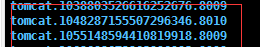
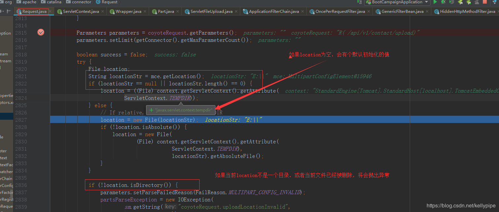
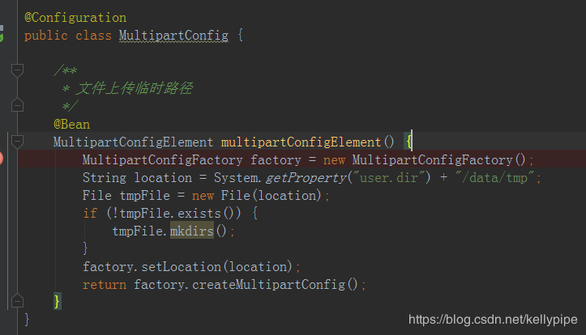
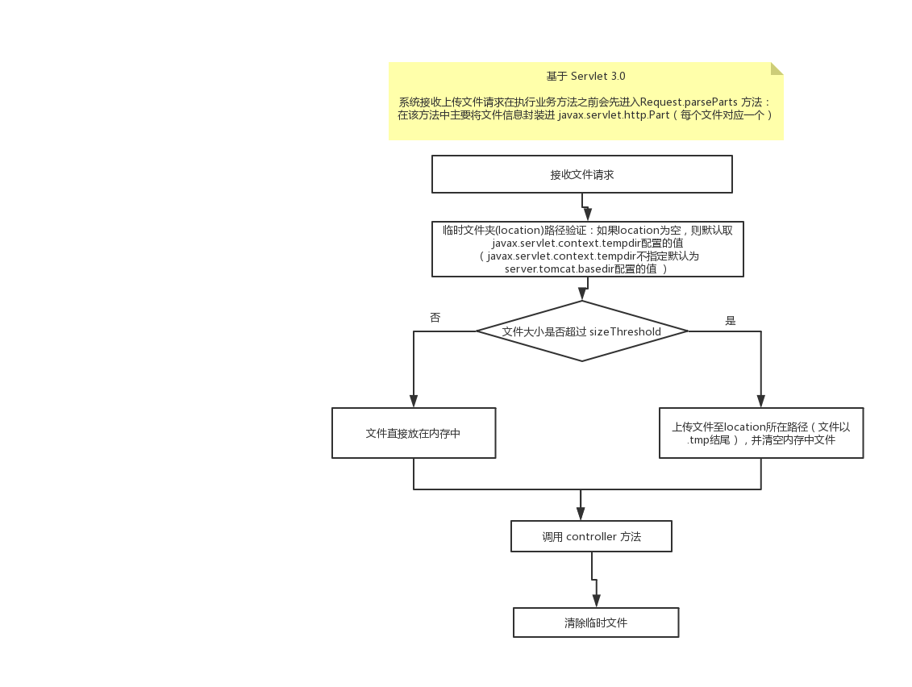

## Spring 上传文件常见问题

### Centos 自动清除 tmp 目录文件

上传文件报错：org.springframework.web.multipart.MultipartException: Could not parse multipart servlet request; nested exception is java.io.IOException: The temporary upload location [/tmp/tomcat.1220970741172837513.8080/work/Tomcat/localhost/ROOT] is not valid at org.springframework.web.multipart.support.StandardMultipartHttpServletRequest.parseRequest(StandardMultipartHttpServletRequest.java:111)

产生的原因（目前项目中sprint-boot 版本用的是1.5.8）：
Tomcat在上传文件的时候，会先将文件上传至临时文件夹(默认情况下，tomcat 启动的时候会在 tmp 下 进行初始化临时文件夹，如果上传文件没有指定临时文件夹的位置，这个时候默认为Tomcat 的基本工作路径)，由于Linux系统会定期对 tmp 下的文件夹进行清除， 当一旦这个目录被系统清除掉，在上传文件的时候就会导致找不到路径 而报错；
注：Tomcat 在启动的时候根据 server.tomcat.basedir 指定的值（默认 tmp ）下初始化 tomcat.xxxxx（上传文件临时

  

路径）；默认我们可以在tmp 下面看到很多这样的tomcat 开头的临时文件夹

  

**这个问题springboot 在1.5.20 版本之后已经修复了；**
https://github.com/spring-projects/spring-boot/issues/9616

  

解决方式：
1、改变tomcat 的基本工作目录所在位置，不放在tmp文件下；统一指定 server.tomcat.basedir=${user.home}/tomcat_upload （项目启动的时候会自动创建）
注： 1、不能同时设置 spring.http.multipart.location 因为server.tomcat.basedir 只是默认值，一旦spring.http.multipart.location 设置了值就不会取默认值了；

2、可以指定上传文件的临时路径（spring.http.multipart.location=/tmp） （这种方式缺点是如果指定的位置不存在 需要手动去创建 这个指定路径,除非指定的位置是已经存在比如spring.http.multipart.location=/tmp ）

3、这种方式是将第二种配置文件方式用java config 来实现（好处是当配置的路径不存在时，可以手动的去创建他）

  

参考：https://blog.51cto.com/breaklinux/2149624?source=dra

**Servlet3.0 后spring 上传文件的机制：**
Spring 在处理上传文件的时候，会将当前文件的大小跟 fileSizeThreshold（默认为0） 判断，如果 大于 fileSizeThreshold 将 文件保存在临时文件夹中，否则 直接将文件放入内存中； 所以在上传文件过程中会对临时路径进行验证；如果临时 路径不是文件夹或者不存在都将抛出异常；location临时路径可以 通过 spring.http.multipart.location 指定； 当不指定的时候会默认取 servlet上下文临时存储目录:（javax.servlet.context.tempdir）当servlet上下文临时存储目录 不指定时会被赋值为 tomcat 的基本工作路径 :tomcat 基本工作目录可以由 server.tomcat.basedir 指定（linux 系统默认为在 tmp 文件夹下）

  

spring 解决地址:  https://github.com/spring-projects/spring-boot/issues/9616 