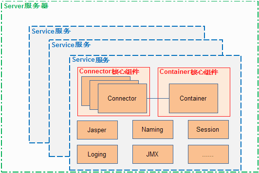

## Tomcat 整体架构图

**所谓Servlet，其实就是Sun为了让Java能实现动态可交互的网页，从而进入Web编程领域而制定的一套标准！**

一个Servlet主要做下面三件事情：

1. 创建并填充Request对象，包括：URI、参数、method、请求头信息、请求体信息等
2. 创建Response对象
3. 执行业务逻辑，将结果通过Response的输出流输出到客户端

Servlet没有main方法，所以，如果要执行，则需要在一个`容器`里面才能执行，这个容器就是为了支持Servlet的功能而存在，Tomcat其实就是一个Servlet容器的实现

### 整体架构图

  