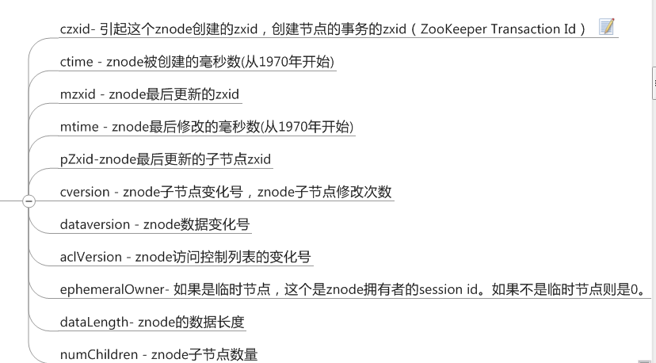
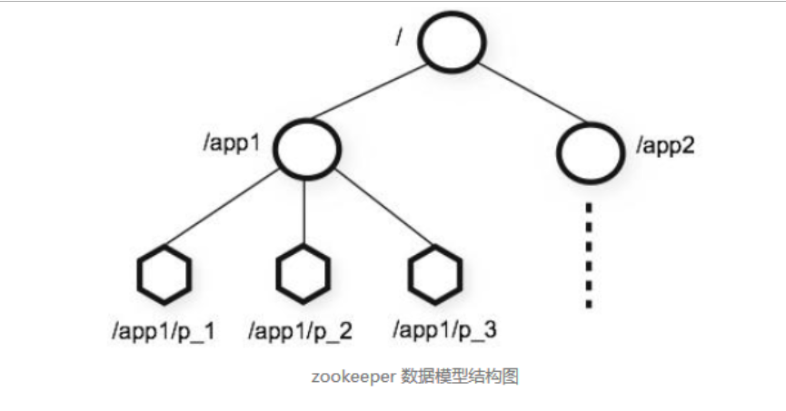
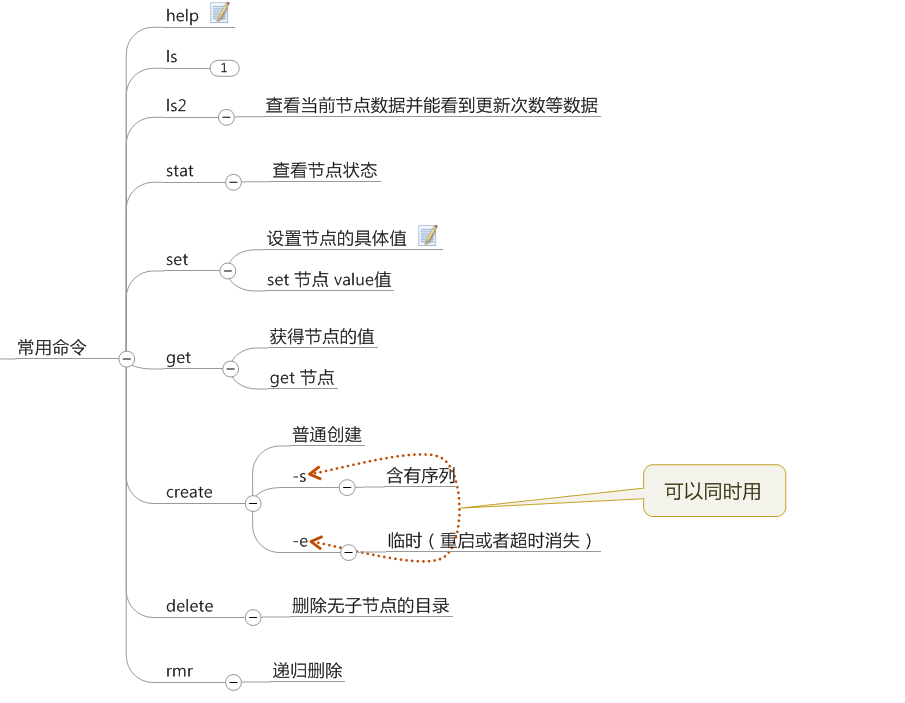

### CAP原理


**在分布式领域有一个很著名的CAP定理：C：数据一致性。A：服务可用性。P：分区容错性（服务对网络分区故障的容错性）。** 

 


C（Consistency）：数据一致性。大家都知道，分布式系统中，数据会有副本。由于网络或者机器故障等因素，可能有些副本数据写入正确，有些却写入错误或者失败，这样就导致了数据的不一致了。而满足数据一致性规则，就是保证所有数据都要同步。

A（Availability）：可用性。我们需要获取什么数据时，都能够正常的获取到想要的数据（当然，允许可接受范围内的网络延迟），也就是说，要保证任何时候请求数据都能够正常响应。

P（Partition Tolerance）：分区容错性。当网络通信发生故障时，集群仍然可用，不会因为某个节点挂了或者存在问题，而影响整个系统的正常运作。


#### Zookeeper的基本

##### 基本组成

```
所使用的数据模型风格很像文件系统的目录树结构，简单来说，有点类似windows中注册表的结构， 
有名称，
有树节点，
有Key(键)/Value(值)对的关系，
 
ZooKeeper数据模型的结构与Unix文件系统很类似，整体上可以看作是一棵树，每个节点称做一个ZNode
 很显然zookeeper集群自身维护了一套数据结构。这个存储结构是一个树形结构，其上的每一个节点，我们称之为"znode"，每一个znode默认能够存储1MB的数据，每个ZNode都可以通过其路径唯一标识
```

##### stat信息

```
Znode维护了一个stat结构，这个stat包含数据变化的版本号、访问控制列表变化、还有时间戳。版本号和时间戳一起，可让Zookeeper验证缓存和协调更新。每次znode的数据发生了变化，版本号就增加。
 
例如，无论何时客户端检索数据，它也一起检索数据的版本号。并且当客户端执行更新或删除时，客户端必须提供他正在改变的znode的版本号。如果它提供的版本号和真实的数据版本号不一致，更新将会失败
```



```
- cxzid
每次修改ZooKeeper状态都会收到一个zxid形式的时间戳，也就是ZooKeeper事务ID。
事务ID是ZooKeeper中所有修改总的次序。每个修改都有唯一的zxid，如果zxid1小于zxid2，那么zxid1在zxid2之前发生。
```


##### Znode中存在的类型

```
znode是由客户端创建的，它和创建它的客户端的内在联系，决定了它的存在性：

    PERSISTENT-持久化节点：创建这个节点的客户端在与zookeeper服务的连接断开后，这个节点也不会被删除（除非您使用API强制删除）。
 
    PERSISTENT_SEQUENTIAL-持久化顺序编号节点：当客户端请求创建这个节点A后，zookeeper会根据parent-znode的zxid状态，为这个A节点编写一个全目录唯一的编号（这个编号只会一直增长）。当客户端与zookeeper服务的连接断开后，这个节点也不会被删除。
 
    EPHEMERAL-临时目录节点：创建这个节点的客户端在与zookeeper服务的连接断开后，这个节点（还有涉及到的子节点）就会被删除。
 
    EPHEMERAL_SEQUENTIAL-临时顺序编号目录节点：当客户端请求创建这个节点A后，zookeeper会根据parent-znode的zxid状态，为这个A节点编写一个全目录唯一的编号（这个编号只会一直增长）。当创建这个节点的客户端与zookeeper服务的连接断开后，这个节点被删除。
 
    另外，无论是EPHEMERAL还是EPHEMERAL_SEQUENTIAL节点类型，在zookeeper的client异常终止后，节点也会被删除
```


##### 数据结构

```
Zookeeper表现为一个分层的文件系统目录树结构
不同于文件系统之处在于：zk节点可以有自己的数据，而unix文件系统中的目录节点只有子节点

一个节点对应一个应用/服务，节点存储的数据就是应用需要的配置信息
```



##### 常用的命令




##### Zookeeper 基本的api使用

```
create
创建节点


delete
删除节点


exists
判断节点是否存在


getData
获得一个节点的数据


setData
设置一个节点的数据


getChildren
获取节点下的所有子节点

这其中，exists，getData，getChildren属于读操作。Zookeeper客户端在请求读操作的时候，可以选择是否设置Watch。
```


####zookeeper的基本原理

```
文件系统 
2)通知机制 
3.Zookeeper文件系统 每个子目录项如 NameService 都被称作为znode，和文件系统一样，我们能够自由的增加、删除znode，在一个znode下增加、删除子znode，唯一的不同在于znode是可以存储数据的。 有四种类型的znode： 1、PERSISTENT-持久化目录节点 客户端与zookeeper断开连接后，该节点依旧存在 2、PERSISTENT_SEQUENTIAL-持久化顺序编号目录节点 客户端与zookeeper断开连接后，该节点依旧存在，只是Zookeeper给该节点名称进行顺序编号 3、EPHEMERAL-临时目录节点 客户端与zookeeper断开连接后，该节点被删除 4、EPHEMERAL_SEQUENTIAL-临时顺序编号目录节点 客户端与zookeeper断开连接后，该节点被删除，只是Zookeeper给该节点名称进行顺序编号
```

 


####Zookeeper watch机制原理？

客户端注册监听它关心的目录节点，当目录节点发生变化（数据改变、被删除、子目录节点增加删除）时，zookeeper会通知客户端。 

```
我们可以理解成是注册在特定Znode上的触发器。当这个Znode发生改变，也就是调用了create，delete，setData方法的时候，将会触发Znode上注册的对应事件，请求Watch的客户端会接收到异步通知。
```

具体交互过程如下：

1.客户端调用getData方法，watch参数是true。服务端接到请求，返回节点数据，并且在对应的哈希表里插入被Watch的Znode路径，以及Watcher列表。


2.当被Watch的Znode已删除，服务端会查找哈希表，找到该Znode对应的所有Watcher，异步通知客户端，并且删除哈希表中对应的Key-Value。


 

####Zookeeper的用途，选举的原理是什么？

 


```
Zookeeper Service集群是一主多从结构。

在更新数据时，首先更新到主节点（这里的节点是指服务器，不是Znode），再同步到从节点。

在读取数据时，直接读取任意从节点。

为了保证主从节点的数据一致性，Zookeeper采用了ZAB协议，这种协议非常类似于一致性算法Paxos和Raft。
```


####Zookeeper 和 Eureka的区别是什么？

```
对于 zookeeper 来说，它是 CP 的。也就是说，zookeeper 是保证数据的一致性的，但是这里还需要注意一点是，zookeeper 它不是强一致的，什么意思呢？

打个比方，现在客户端 A 提交一个写操作，zookeeper 在过半数节点操作成功之后就可以返回，但此时，客户端 B 的读操作请求的是 A 写曹操尚未同步到的节点，那么读取的就不是 A 最新提交的数据了。

那如何保证强一致性呢？我们可以在读取数据的时候先执行一下 sync 操作，即与 leader 节点先同步一下数据，再去取，这样才能保证数据的强一致性。

但是 zookeeper 也有个缺陷，刚刚提到了 leader 节点，当 master 节点因为网络故障与其他节点失去联系时，剩余节点会重新进行 leader 选举。问题在于，选举 leader 的时间太长，30 ~ 120s, 且选举期间整个 zookeeper 集群都是不可用的，这就导致在选举期间注册服务瘫痪。

在云部署的环境下，因网络问题使得 zookeeper 集群失去 master 节点是较大概率会发生的事，虽然服务能够最终恢复，但是漫长的选举时间导致的注册长期不可用是不能容忍的。比如双十一当天，那就是灾难性的。
```


```
Eureka 的 AP 原则

大规模网络部署时，失败是在所难免的，因此我们无法回避这个问题。当向注册中心查询服务列表时，我们可以容忍注册中心返回的是几分钟以前的注册信息，但不能接受服务直接 down 掉不可用。

Eureka 在被设计的时候，就考虑到了这一点，因此在设计时优先保证可用性，这就是 AP 原则。Eureka 各个节点都是平等的，几个节点挂掉不会影响正常节点的工作，剩余的节点依然可以提供注册和查询服务。

而 Eureka 的客户端在向某个 Eureka 注册或时如果发现连接失败，则会自动切换至其它节点，只要有一台 Eureka 还在，就能保证注册服务可用（即保证A原则），只不过查到的信息可能不是最新的（不保证C原则）。

正因为应用实例的注册信息在集群的所有节点间并不是强一致的，所以需要客户端能够支持负载均衡以及失败重试。在 Netflix 的生态中，ribbon 可以提供这个功能。

因此， Eureka 可以很好的应对因网络故障导致部分节点失去联系的情况，而不会像 zookeeper 那样使整个注册服务瘫痪。

在之前的文章已经提到过Eureka有自我保护机制（15分钟内超过85%的服务节点没有心跳/down），这点我觉得确实要比Zookeeper好，即使服务不可用，也会保留当前失效的微服务，默认90秒，在这90秒Eureka不会注销微服务，在这90秒内仍然可以接受新的服务注册，只是不会同步到其他节点上。当坏掉的服务恢复的时候，会自动加入到节点上，也是高可用的一种。然后退出自我保护机制，这也是应对网络异常的一种机制
```


####Zookeeper 和 ZAB协议 ?

（<https://www.jianshu.com/p/e35104ec6e5a> ）

在学习ZAB之前，我们需要首先了解ZAB协议所定义的三种节点状态：

**Looking** ：选举状态。

**Following** ：Follower节点（从节点）所处的状态。

**Leading** ：Leader节点（主节点）所处状态。

我们还需要知道**最大ZXID**的概念：

最大ZXID也就是节点本地的最新事务编号，包含**epoch**和计数两部分。epoch是纪元的意思，相当于Raft算法选主时候的term。

假如Zookeeper当前的主节点挂掉了，集群会进行**崩溃恢复**。ZAB的崩溃恢复分成三个阶段：


**1.Leader election**

选举阶段，此时集群中的节点处于Looking状态。它们会各自向其他节点发起投票，投票当中包含自己的服务器ID和最新事务ID（ZXID）。


接下来，节点会用自身的ZXID和从其他节点接收到的ZXID做比较，如果发现别人家的ZXID比自己大，也就是数据比自己新，那么就重新发起投票，投票给目前已知最大的ZXID所属节点。


每次投票后，服务器都会统计投票数量，判断是否有某个节点得到半数以上的投票。如果存在这样的节点，该节点将会成为准Leader，状态变为Leading。其他节点的状态变为Following。


这就相当于，一群武林高手经过激烈的竞争，选出了武林盟主。


**2.Discovery**

发现阶段，用于在从节点中发现最新的ZXID和事务日志。或许有人会问：既然Leader被选为主节点，已经是集群里数据最新的了，为什么还要从节点中寻找最新事务呢？

这是为了防止某些意外情况，比如因网络原因在上一阶段产生多个Leader的情况。

所以这一阶段，Leader集思广益，接收所有Follower发来各自的最新epoch值。Leader从中选出最大的epoch，基于此值加1，生成新的epoch分发给各个Follower。

各个Follower收到全新的epoch后，返回ACK给Leader，带上各自最大的ZXID和历史事务日志。Leader选出最大的ZXID，并更新自身历史日志。


**3.Synchronization**

同步阶段，把Leader刚才收集得到的最新历史事务日志，同步给集群中所有的Follower。只有当半数Follower同步成功，这个准Leader才能成为正式的Leader。

自此，故障恢复正式完成。


**Broadcast**

什么是**Broadcast**呢？简单来说，就是Zookeeper常规情况下更新数据的时候，由Leader广播到所有的Follower。其过程如下：

1.客户端发出写入数据请求给任意Follower。

2.Follower把写入数据请求转发给Leader。

3.Leader采用二阶段提交方式，先发送Propose广播给Follower。

4.Follower接到Propose消息，写入日志成功后，返回ACK消息给Leader。

5.Leader接到半数以上ACK消息，返回成功给客户端，并且广播Commit请求给Follower。


Zab协议既不是强一致性，也不是弱一致性，而是处于两者之间的**单调一致性**。它依靠事务ID和版本号，保证了数据的更新和读取是有序的。
