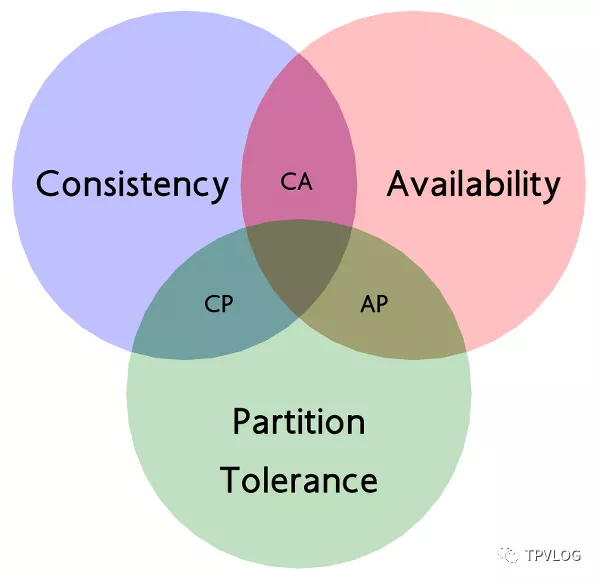
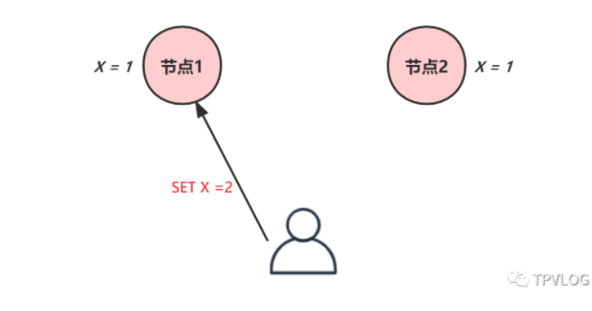
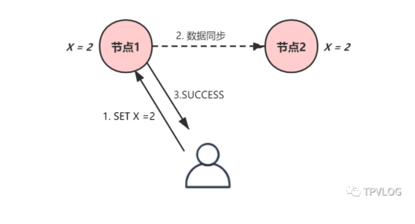
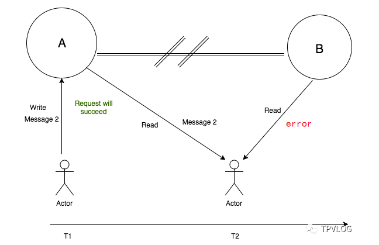
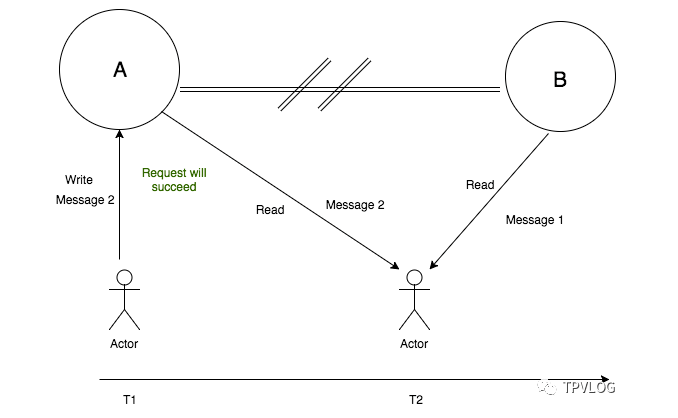
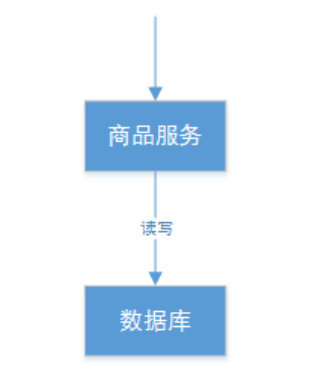

## 分布式基础理论

### CAP 三指标

 CAP 理论是一个很好的思考框架，它对分布式系统的特性做了高度抽象，抽象成了**一致性**、**可用性**和**分区容错性**，并对特性间的冲突做了总结。一旦掌握它，我们自然而然就能根据业务场景的特点进行权衡，设计出适合的系统模型。 

  

### 一致性

一致性，指的是客户端的每次读操作，不管访问哪个节点，要么读到的都是同一份最新数据，要么读取失败。

注意，一致性是站在客户端的视角出发的，并不是说在某个时间点分布式系统的所有节点的数据是一致的。事实上，在一个事务执行过程中，系统就是处于一种不一致状态，但是客户端是无法读取事务未提交的数据的，此时客户端会直接读取失败。

CAP理论中的一致性是强一致性，举个例子来理解下：

初始时，节点1和节点2的数据是一致的，然后客户端向节点1写入了新数据“X = 2”：

节点1在本地更新数据后，通过节点间的通讯，同步数据到节点2，确认节点2写入成功后，然后返回成功给客户端：

这样两个节点的数据就是一致的了，之后，不管客户端访问哪个节点，读取到的都是同一份最新数据。如果节点2在同步数据的过程中，有另外的客户端来访问任意节点，都会拒绝，这就是强一致性。

### 可用性

 可用性，指的是客户端的请求，不管访问哪个节点，都能得到响应数据，但不保证是同一份最新数据。你也可以把可用性看作是分布式系统对访问本系统的客户端的另外一种承诺：**我尽力给你返回数据，不会不响应你，但是我不保证每个节点给你的数据都是最新的**。 

### 分区容错性

**通常分布式系统的各各结点部署在不同的子网，这就是网络分区，不可避免的会出现由于网络问题而导致结点之间 通信失败，此时仍可对外提供服务，这叫分区容忍性。**

例如，商品信息读写满足分区容忍性就是要实现如下目标： 

1、主数据库向从数据库同步数据失败不影响读写操作。 

2、其一个结点挂掉不影响另一个结点对外提供服务。

分区容错性，指的是当节点间出现消息丢失、高延迟或者已经发生网络分区时，系统仍然可以继续提供服务。也就是说，分布式系统在告诉访问本系统的客户端：**不管我的内部出现什么样的数据同步问题，我会一直运行，提供服务**。

分区容错性，强调的是集群对分区故障的容错能力。因为分布式系统与单机系统不同，它涉及到多节点间的通讯和交互，节点间的分区故障是必然发生的，所以在分布式系统中分区容错性是必须要考虑的。

既然分区容错是必须要考虑的，那么这时候系统该如何运行呢？是选择一致性（C）呢，还是选择可用性（P）呢？这就引出了著名的“CAP不可能三角”。

### CA/AP/CP 选择

所谓“CAP不可能三角”，其实就是CAP理论中提到的： **对于一个分布式系统而言，一致性（Consistency）、可用性（Availability）、分区容错性（Partition Tolerance）3 个指标不可兼得，只能在 3 个指标中选择 2 个**。

上面说过了，因为只要有网络交互就一定会有延迟和数据丢失，而这种状况我们必须接受，同时还必须保证系统不能挂掉，所以节点间的分区故障是必然发生的。也就是说，分区容错性（P）是前提，是必须要保证的。

所以理论上CAP一般只能取CP或AP，CA只存在于集中式应用中。

#### CP架构

当选择了一致性（C）的时候，如果因为消息丢失、延迟过高发生了网络分区，那么这个时候，当集群节点接收到来自客户端的写请求时，因为无法保证所有节点都是最新信息，所以系统将返回写失败错误，也就是说集群拒绝新数据写入。

如下图，T1时刻，客户端往节点A写入**Message 2**，此时发生了网络分区，节点A的数据无法同步到节点B；T2时刻，如果客户端分别读取了节点A和节点B的数据，就会出现数据不一致。

 此时，为了保证一致性（C），客户端从节点B读取数据时，节点B应当返回**error**，提示客户端”系统发生了错误”，这种方式相当于放弃了可用性（A），此时CAP三者只能满足CP。 

追求一致性和分区容错性，我们的zookeeper其实就是追求的强一致，又比如跨行转账，一次转账请 求要等待双方银行系统都完成整个事务才算完成

#### AP架构

当选择了可用性（A）的时候，系统将始终处理客户端的查询，返回特定信息，如果发生了网络分区，一些节点将无法返回最新的特定信息，它们将返回自己当前的相对新的信息。

如下图，T1时刻，客户端往节点A写入**Message 2**，此时发生了网络分区，节点A的数据无法同步到节点B；T2时刻，客户端访问节点B时，节点B将自己当前拥有的数据**Message 1**返回给客户端，而实际上当前最新数据已经是**Message2**了，这就不满足一致性（C），此时CAP三者只能满足AP。

>  注意：这里节点B返回的**Message 1**虽然不是一个”正确“的结果，但是一个”合理“的结果，因为节点B只是返回的不是最新结果，并不是一个错乱的值。 

通常实现AP都会保证最终一致性，后面讲的BASE理论就是根据AP来扩展的，一些业务场景 比如：订单退款，今 日退款成功，明日账户到账，只要用户可以接受在一定时间内到账即可。

####  CA

放弃分区容忍性，即不进行分区，不考虑由于网络不通或结点挂掉的问题，则可以实现一致性和可用性。那么系统 

将不是一个标准的分布式系统，我们最常用的关系型数据就满足了CA。 

上边的商品管理，如果要实现CA则架构如下： 

主数据库和从数据库中间不再进行数据同步，数据库可以响应每次的查询请求，通过事务隔离级别实现每个查询请 

求都可以返回最新的数据。

### 总结

本章，我对CAP理论进行了基本的讲解，总结一下：

- CA 模型：在分布式系统中不存在，因为舍弃 P，意味着舍弃分布式系统，就比如单机版关系型数据库 MySQL，如果 MySQL 要考虑主备或集群部署时，它必须考虑 P。
- CP 模型：采用 CP 模型的分布式系统，一旦因为消息丢失、延迟过高发生了网络分区，就影响用户的体验和业务的可用性。因为为了防止数据不一致，集群将拒绝新数据的写入，典型的应用是 ZooKeeper，Etcd 和 HBase。
- AP 模型：采用 AP 模型的分布式系统，实现了服务的高可用。用户访问系统的时候，都能得到响应数据，不会出现响应错误，但当出现分区故障时，相同的读操作，访问不同的节点，得到响应数据可能不一样。典型应用就比如 Cassandra 和 DynamoDB。

最后，关于CAP 理论有个误解：就是认为无论在什么情况下，分布式系统都只能在 C 和 A 中选择 1 个。事实上，在不存在网络分区的情况下（也就是分布式系统正常运行时），C 和 A 能够同时保证。只有当发生分区故障的时候，也就是说需要 P 时，才会在 C 和 A 之间做出选择。

所以，我们在进行系统设计时，需要根据实际的业务场景， 在一致性和可用性之间做出权衡。

**引用: **https://mp.weixin.qq.com/s?__biz=MzIwMjU4MzU4MA==&mid=2247484676&idx=1&sn=2066cfd8b5db8f339bf7bd2b2f6e6e20&chksm=96dd3e77a1aab761330925d910449ad2ab69ccd19eaad08bf29c8672bf2e518f85684d73853f&scene=21#wechat_redirect

