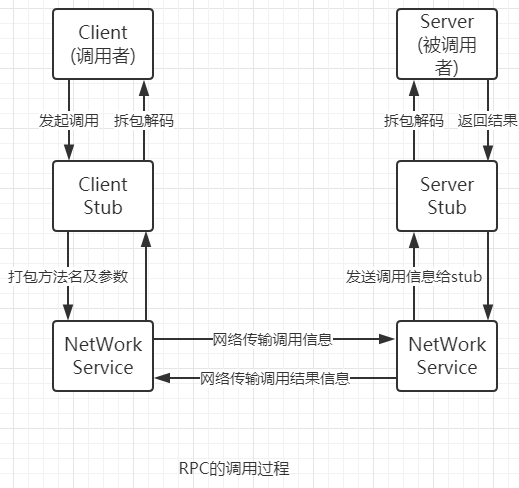
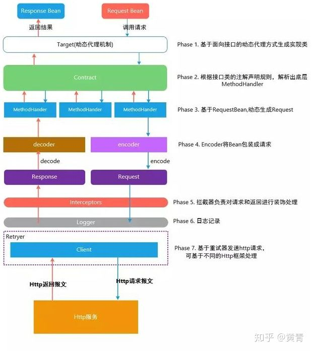
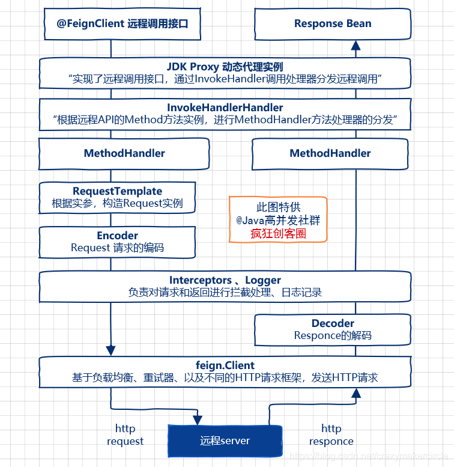

# RPC 通讯

RPC 通讯既远程过程调用，现在主流的包括 TCP 层调用与 Http层调用

## RPC 通讯过程

RPC 即为远程过程调用， 是一个计算机通信协议 ， 它允许运行于一台计算机的程序调用另一台计算机的子程序，而无需额外地为这个交互作用编程。 

RPC 的 实现框架有很多，比如thrift、dubbo、feign、grpc 等等， 对于消息数据的传输，主要有HTTP传输和TCP传输 ，两者比较如下：

优点：

- TCP 实现的RPC 传输效率高(二进制传输)，并且位于TCP 五层模型种的第四层
-  HTTP 实现的RPC 通用性更好。

RPC 调用过程如下：



1、 调用者（客户端Client）以本地调用的方式发起调用；

2、Client stub（客户端存根）收到调用后，负责将被调用的方法名、参数等打包编码成特定格式的能进行网络传输的消息体；

3、Client stub将消息体通过网络发送给服务端；

4、Server stub（服务端存根）收到通过网络接收到消息后按照相应格式进行拆包解码，获取方法名和参数；

5、Server stub根据方法名和参数进行本地调用；

6、被调用者（Server）本地调用执行后将结果返回给server stub；

7、Server stub将返回值打包编码成消息，并通过网络发送给客户端；

8、Client stub收到消息后，进行拆包解码，返回给Client；

9、Client得到本次RPC调用的最终结果。 


## Feign

Feign 是 使用 HTTP 来实现的 RPC 通讯，Feign 设计图如下：

  

Feign 中几个比较重要的接口如下：

- Constract：用来扫描需那些被自定义注解或者 feign 或者 spring 注解注释的类或者方法
- Decoder：RPC 调用返回 结果的解析与包装，默认为SpringDecoder
- Encoder：进行RPC远程调用时，针对POST 的 Body 进行序列化操作
- ErrorDecoder：当RPC 远程调用失败时，自定义处理错误结果
- Retryer：当RPC远程调用错误时，需要进行重试调用
- Logger：自定义打印日志信息，默认为Sl4jLogger
- Request.Options: 定义RPC请求的一些配置，比如超时时间、请求次数 等等
- Client: 实现 RPC 请求的HTTP 客户端


### Feign 注解

@FeignClient注解主要被@Target({ElementType.TYPE})修饰，表示该注解主要使用在接口上。它具备了如下的属性：

- name:指定FeignClient的名称，如果使用了Ribbon，name就作为微服务的名称，用于服务发现。
- url:url一般用于调试，可以指定@FeignClient调用的地址。
- decode404: 当发生404错误时，如果该字段为true，会调用decoder进行解码，否则抛出FeignException.
- configuration:Feign配置类，可以自定或者配置Feign的Encoder，Decoder，LogLevel，Contract。
- fallback:定义容错的处理类，当调用远程接口失败或者超时时，会调用对应的接口的容错逻辑，fallback指定的类必须实现@Feign标记的接口。
- fallbacjFactory:工厂类，用于生成fallback类实例，通过这个属性可以实现每个接口通用的容错逻辑们介绍重复的代码。
- path：定义当前FeignClient的统一前缀。


### Feign 调用流程如下

 Feign远程调用，核心就是通过一系列的封装和处理，将以JAVA注解的方式定义的远程调用API接口，最终转换成HTTP的请求形式，然后将HTTP的请求的响应结果，解码成JAVA Bean，放回给调用者。Feign远程调用的基本流程，大致如下图所示。 

  

我们首先对上面的图进行以下解释：

1、首先Spring 根据我们配置的配置信息，比如每一个 FeignClient 都可以对应于一个 Configuration 类，我们可以将需要的一些配置信息定义在Configuration 类中，Spring 会根据我们定义的配置信息比如 在 FeignClient 注解中设置的 url、在配置类中定义的Encoder、Decoder、Encoder 等包装成一个Feign Builder 对象，用于生成Feign 实例

2、Feign 通过 InvocationHandlerFactory 来生成实际的InvocationHandler 对象，并且将解析出 MethodHandler 的Map 对象 传入到实际的代理对象中，当我们进行方法调用时就会实际调用MethodHandler 的 invoke 方法，在默认的MethodHandler实例中，会调用Client 的 execute 方法进行远程RPC 调用，Client 的 execute 方法传入的是Request 对象，既封装的默认请求头、request url 等等，Request 对象则是通过 ReuestTemplate 的配置信息生成的 (Target ), 代码如下

```java
public Request apply(RequestTemplate input) {
      if (input.url().indexOf("http") != 0) {
        input.target(url());
      }
      return input.request();
    }
```


3、根据我们自定义的Encoder 对象，对即将进行RPC 通讯的数据进行序列化

4、遍历RequestIntercepter 实例可以对 Request 请求进行修改，比如添加请求头修改其他请求数据等等

5、调用Logger 进行日志记录，打印

6、可以基于自定义的Client 对象，比如 HttpClient、OkHttpClient，RetryHttpClient、RibbonHttpClient 等 进行HTTP 形式的远程RPC调用

7、根据远程调用返回的结果进行反序列化，将结果包装成目标方法的返回值

我们这里来稍微列举一下核心实现类：

- Feign

- ReflectiveFeign

- Client

- InvocaitionHandlerFactory

- FeignMethodHandler

- Target（用于生成request 对象）

- Request

- RequestTemplate

  


### Feign.Builder

Spring 允许我们可以自定义生成Feign 的Builder 实例，来定制化具体的Feign 实例，比如Sentinel、Hystrix等，但是像Seata这样的框架，也只是定义了Client 对象，用于添加一些自定义的请求头，定制属于我们自己的 Feign 实例，示例如下：

#### Seata

```java
 */
final class SeataFeignBuilder {
	private SeataFeignBuilder() {
	}
	static Feign.Builder builder(BeanFactory beanFactory) {
        //SeataClient 内部针对所有基于Feign的RPC 调用全部加了属于自己的RequestHeader 请求头
		return Feign.builder().client(new SeataFeignClient(beanFactory));
	}
}
```

```java
@Bean
	@ConditionalOnMissingBean
	@Scope("prototype")
	Feign.Builder feignBuilder(BeanFactory beanFactory) {
		return SeataFeignBuilder.builder(beanFactory);
	}
```


#### Sentinel

```java
@Bean
	@Scope("prototype")
	@ConditionalOnMissingBean
	@ConditionalOnProperty(name = "feign.sentinel.enabled")
	public Feign.Builder feignSentinelBuilder() {
		return SentinelFeign.builder();
	}

```

```java
public final class SentinelFeign {

	private SentinelFeign() {

	}

	public static Builder builder() {
		return new Builder();
	}

	public static final class Builder extends Feign.Builder
			implements ApplicationContextAware {

		private Contract contract = new Contract.Default();

		private ApplicationContext applicationContext;

		private FeignContext feignContext;

		@Override
		public Feign.Builder invocationHandlerFactory(
				InvocationHandlerFactory invocationHandlerFactory) {
			throw new UnsupportedOperationException();
		}

		@Override
		public Builder contract(Contract contract) {
			this.contract = contract;
			return this;
		}

		@Override
		public Feign build() {
			super.invocationHandlerFactory(new InvocationHandlerFactory() {
				@Override
				public InvocationHandler create(Target target,
						Map<Method, MethodHandler> dispatch) {
					// using reflect get fallback and fallbackFactory properties from
					// FeignClientFactoryBean because FeignClientFactoryBean is a package
					// level class, we can not use it in our package
					
                     //此处省略代码，以汉字代替
                    //1、从FeignClient 注解中获取到对应的降级策略
                    //2、设置 InvocationHandlerFactory 为 Snetinel 自定义的 SentinelInvocationHandler
				
                    //3、SentinelInvocationHandler 内部是包装了 Sentinel我们自动生成Sphu 对象以及对应的降级、熔断、异常统计等信息

			
			super.contract(new SentinelContractHolder(contract));
			return super.build();
		}

		private Object getFieldValue(Object instance, String fieldName) {
			Field field = ReflectionUtils.findField(instance.getClass(), fieldName);
			field.setAccessible(true);
			try {
				return field.get(instance);
			}
			catch (IllegalAccessException e) {
				// ignore
			}
			return null;
		}

		@Override
		public void setApplicationContext(ApplicationContext applicationContext)
				throws BeansException {
			this.applicationContext = applicationContext;
			feignContext = this.applicationContext.getBean(FeignContext.class);
		}

	}
```


#### Hystrix

与Sentinel 类似，这里就不贴关于HystrixFeignBuilder 的代码了

```java
@Bean
		@Scope("prototype")
		@ConditionalOnMissingBean
		@ConditionalOnProperty(name = "feign.hystrix.enabled")
		public Feign.Builder feignHystrixBuilder() {
			return HystrixFeign.builder();
		}

```


## Dubbo


## Feign 与 Dubbo 

### 相同点

1、Dubbo与Feign 都依赖注册中心、负载均衡

2、Dubbo 与Feign 都是RPC 远程通讯框架


### 不同点

#### Dubbo

**协议**

- Dubbo 支持多传输协议，例如 Dubbo 自身的传输协议，RMI, HTTP ，TCP 等

-  默认的Dubbo协议  利用`Netty`，`TCP`传输，单一、异步、`长连接`，适合数据量小、高并发和服务提供者远远少于消费者的场景。 

**负载均衡**

-  支持4种算法（随机、轮询、活跃度、Hash一致性），而且算法里面引入权重的概念 
- 负载均衡的算法可以精准到某个服务接口的某个方法。
-  配置的形式不仅支持代码配置，还支持Dubbo控制台灵活动态配置 


**容错策略**

-  支持多种容错策略：failover、failfast、brodecast、forking等，也引入了retry次数、timeout等配置参数。 


#### Feign

**协议**

-  基于`Http`传输协议，`短连接`，不适合高并发的访问。 

**负载均衡**

- 只支持N种策略：轮询、随机、ResponseTime加权。Spring 整合 Feign 之后则主要依赖于Ribbon


**容错策略**

-  利用熔断机制来实现容错的，主要依赖于Hystrix 与 Sentinel 来实现熔断、限流、降级

