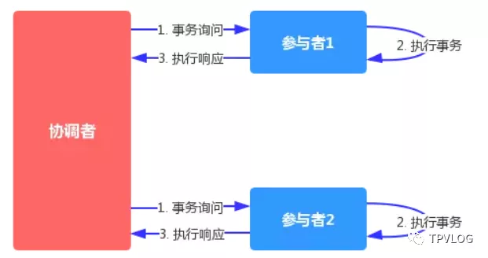
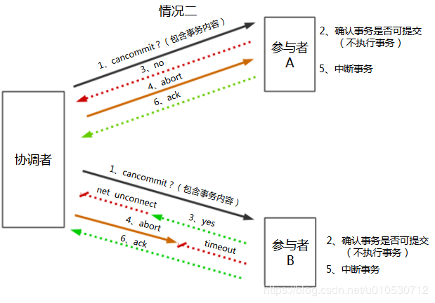
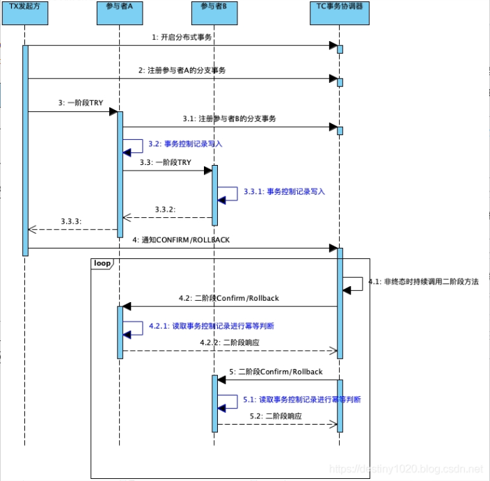
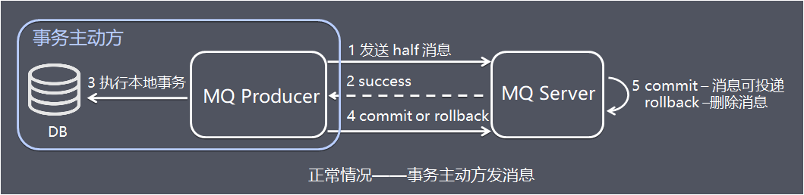

# 分布式事务

https://developer.aliyun.com/article/762770

## 理论

### Base 理论

Base 理论是 CAP 理论中的 AP 的延伸，是对互联网大规模分布式系统的实践总结，强调可用性。BASE 是 **基本可用（Basically Available）** 、**软状态（Soft-state）** 和 **最终一致（Eventually Consistent）** 三个短语的缩写：


#### 一、基本可用

在BASE理论中，基本可用是说，当分布式系统在出现不可预知的故障时，允许损失部分功能的可用性，保障核心功能的可用性。

具体来说，你可以把基本可用理解成，当系统节点出现大规模故障的时候，比如专线的光纤被挖断、突发流量导致系统过载，这个时候可以通过服务降级，牺牲部分功能的可用性，保障系统的核心功能可用。

**1.1 实现方式**

实现分布式系统基本可用的手段有很多，常见的有：

- 流量削峰
- 请求排队
- 服务降级
- 服务熔断

所以，**基本可用在本质上是一种妥协，也就是在出现节点故障或系统过载的时候，通过牺牲非核心功能的可用性，保障核心功能的稳定运行**。


#### 二、最终一致

最终一致性是指，分布式系统即使无法做到强一致性，但应当根据自身业务特点，采用适当的方式在一定时限后使各个节点的数据最终能够达到一致的状态。这个时限取决于网络延时，系统负载，数据复制方案设计等等因素。

几乎所有的互联网系统采用的都是最终一致性，只有在实在无法使用最终一致性，才使用强一致性或事务，比如，对于决定系统运行的敏感元数据，需要考虑采用强一致性，对于涉账类的支付系统或清算系统的数据，需要考虑采用事务。

我们可以将CAP理论中的“强一致性”理解为最终一致性的特例，也就是说，你可以把强一致性看作是不存在延迟的一致性。在实践中，你也可以这样思考：如果业务功能无法容忍一致性的延迟（比如分布式锁对应的数据），就实现强一致性；如果能容忍短暂的一致性延迟（比如 QQ 状态数据），则可以考虑最终一致性。

**2.1 实现方式**

那么如何实现最终一致性呢？你首先要知道它以什么为准，因为这是实现最终一致性的关键。一般来说，在实际工程实践中有这样几种方式：

- **读时修复：**在读取数据时，检测数据的不一致，进行修复。比如 Cassandra 的 Read Repair 实现，具体来说，就是向 Cassandra 系统查询数据的时候，如果检测到不同节点的副本数据不一致，系统就自动修复数据；
- **写时修复：**在写入数据时，检测数据的不一致，进行修复。比如 Cassandra 的 Hinted Handoff 实现，具体来说，就是Cassandra 集群的节点之间远程写数据的时候，如果写失败就将数据缓存下来，然后定时重传，修复数据的不一致性。
- **异步修复：**这个是最常用的方式，通过定时对账检测副本数据的一致性，并修复。

注意，因为写时修复不需要做数据一致性对比，性能消耗比较低，对系统运行影响也不大，所以许多开源框架都是用这种方式实现最终一致性的。而读时修复和异步修复因为需要做数据的一致性对比，性能消耗比较多，所以需要尽量优化一致性对比的算法，降低性能消耗，避免对系统运行造成影响。

> 在实现最终一致性的时候，一般要实现自定义写一致性级别（All、Quorum、One、Any）， 比如Elasticsearch在进行索引数据同步时，就支持各种写一致性级别。

#### 三、软状态

软状态，描述的是实现服务可用性的时候系统数据的一种过渡状态，也就是说不同节点间，数据副本存在短暂的不一致。

比如，分布式存储中一般一份数据至少会有N个副本，允许系统在不同节点的数据副本之间进行数据同步的过程中存在延时。mysql replication的异步复制也是一种体现。

这里，我们只需要知道软状态是一种过渡状态就可以了，BASE理论的重点是基本可用以及最终一致性。


### 分布式事务产生的场景

1、典型的场景就是微服务架构 微服务之间通过远程调用完成事务操作。 比如：订单微服务和库存微服务，下单的同时订单微服务请求库存微服务减库存。 简言之：跨JVM进程产生分布式事务。


2、单体系统访问多个数据库实例 当单体系统需要访问多个数据库（实例）时就会产生分布式事务。 比如：用户信息和订单信息分别在两个MySQL实例存储，用户管理系统删除用户信息，需要分别删除用户信息及用户的订单信息，由于数据分布在不同的数据实例，需要通过不同的数据库链接去操作数据，此时产生分布式事务。 简言之：跨数据库实例产生分布式事务。


3、多服务访问同一个数据库实例 比如：订单微服务和库存微服务即使访问同一个数据库也会产生分布式事务，原因就是跨JVM进程，两个微服务持有了不同的数据库链接进行数据库操作，此时产生分布式事务。


## 2pc

 二阶段提交（2PC， two-phase commit protocol），顾名思义，就是通过二阶段的协商来完成一个提交操作。 

2PC 分为两个阶段 分别为 投票节点与提交阶段


#### 事务过程

二阶段提交 包含两类节点：

- 事务协调者
-  **事务参与者** 


#### 投票阶段（commit-request phase / voting phase）

1. 事务协调者请所有事务参与者进行投票：是否可以提交事务，然后等待所有参与者的投票结果；
2. 参与者如果投票表示可以提交事务，那么就必须预留本地资源（执行本地事务），然后响应YES，后续也不再允许放弃事务；如果不能，就返回NO响应；
3. 如果协调者接受某个参与者的响应超时，它会认为该参与者投票为NO，即预留资源失败。



#### 提交阶段（commit phase）

在该阶段，事务协调者将基于投票阶段的投票结果进行决策：提交或取消各参与者的本地事务

1. 仅当所有参与者都返回 YES 响应时，协调者才向所有参与者发出提交请求，此时所有参与者必须保证提交事务成功；
2. 如果投票阶段中任意一个参与者返回 No 响应，则协调者向所有参与者发出回滚请求，所有参与者进行回滚操作。

 

两阶段提交协议成功场景示意图： 

  


### 优缺点

#### 优点

- 强一致性，因为一阶段预留了资源，所有只要节点或者网络最终恢复正常，协议就能保证二阶段执行成功；
- 业界标准支持，二阶段协议在业界有标准规范——XA 规范，许多数据库和框架都有针对XA规范的分布式事务实现。


#### 缺点

- 在提交请求阶段，需要预留资源，在资源预留期间，其他人不能操作（比如，XA 在第一阶段会将相关资源锁定） ，会造成分布式系统吞吐量大幅下降；

- 容错能力较差，比如在节点宕机或者超时的情况下，无法确定流程的状态，只能不断重试，同时这也会**导致事务在访问共享资源时发生冲突和死锁的概率增高**，随着数据库节点的增多，这种趋势会越来越严重，从而成为系统在数据库层面上水平伸缩的"枷锁"；

- 单点问题

  一旦协调者出现单点故障，无法保证事务的一致性操作

- 脑裂导致数据不一致

  如果分布式节点出现网络分区，某些参与者未收到commit提交命令。则出现部分参与者完成数据提交。未收到commit的命令的参与者则无法进行事务提交，整个分布式系统便出现了数据不一致性现象。

- 同步阻塞

  二阶段提交过程中，所有参与事务操作的节点处于同步阻塞状态，无法进行其他的操作

 2PC分布式事务方案，比较适合单体应用跨多库的场景，一般用spring + JTA就可以实现。但是因为严重依赖于数据库层面来搞定复杂的事务，效率很低，所以绝对不适合高并发的场景。 


2pc 的主要实现有以下两种，分别为 XA 与 TCC，其中TCC 是 由2PC 衍生而来


## 3PC

三阶段提交协议，是二阶段提交协议的改进版本，三阶段提交有两个改动点。

- 在协调者和参与者中都引入超时机制。
- 在第一阶段和第二阶段中插入一个准备阶段。保证了在最后提交阶段之前各参与节点的状态是一致的。

也就是说，除了引入超时机制之外，3PC把2PC的准备阶段再次一分为二，这样三阶段提交就有`CanCommit`、`PreCommit`、`DoCommit`三个阶段。处理流程如下：


小例子

```text
班长要组织全班同学聚餐，由于大家毕业多年，所以要逐个打电话敲定时间，时间初定10.1日。然后开始逐个打电话。

班长：小A，我们想定在10.1号聚会，你有时间嘛？有时间你就说YES，没有你就说NO，然后我还会再去问其他人，具体时间地点我会再通知你，这段时间你可先去干你自己的事儿，不用一直等着我。（协调者询问事务是否可以执行，这一步不会锁定资源）

小A：好的，我有时间。（参与者反馈）

班长：小B，我们想定在10.1号聚会……不用一直等我。

班长收集完大家的时间情况了，一看大家都有时间，那么就再次通知大家。（协调者接收到所有YES指令）

班长：小A，我们确定了10.1号聚餐，你要把这一天的时间空出来，这一天你不能再安排其他的事儿了。然后我会逐个通知其他同学，通知完之后我会再来和你确认一下，还有啊，如果我没有特意给你打电话，你就10.1号那天来聚餐就行了。对了，你确定能来是吧？（协调者发送事务执行指令，这一步锁住资源。如果由于网络原因参与者在后面没有收到协调者的命令，他也会执行commit）

小A顺手在自己的日历上把10.1号这一天圈上了，然后跟班长说，我可以去。（参与者执行事务操作，反馈状态）

班长：小B，我们觉得了10.1号聚餐……你就10.1号那天来聚餐就行了。

班长通知完一圈之后。所有同学都跟他说：”我已经把10.1号这天空出来了”。于是，他在10.1号这一天又挨个打了一遍电话告诉他们：嘿，现在你们可以出门拉。。。。（协调者收到所有参与者的ACK响应，通知所有参与者执行事务的commit）

小A，小B：我已经出门拉。（执行commit操作，反馈状态）
 
        Copied!
    
```


### 1. 阶段一：CanCommit阶段

3PC的`CanCommit`阶段其实和2PC的准备阶段很像。协调者向参与者发送`commit`请求，参与者如果可以提交就返回Yes响应，否则返回No响应。

1. 事务询问 协调者向所有参与者发出包含事务内容的 `canCommit` 请求，询问是否可以提交事务，并等待所有参与者答复。
2. 响应反馈 参与者收到 `canCommit` 请求后，如果认为可以执行事务操作，则反馈 yes 并进入预备状态，否则反馈 no。

### 2. PreCommit阶段

协调者根据参与者的反应情况来决定是否可以进行事务的`PreCommit`操作。根据响应情况，有以下两种可能。

- 假如所有参与者均反馈 yes，协调者预执行事务。

  1. 发送预提交请求 ：协调者向参与者发送`PreCommit`请求，并进入准备阶段
  2. 事务预提交 ：参与者接收到`PreCommit`请求后，会执行事务操作，并将`undo`和`redo`信息记录到事务日志中（但不提交事务）
  3. 响应反馈 ：如果参与者成功的执行了事务操作，则返回**ACK**响应，同时开始等待最终指令。

  

- 假如有任何一个参与者向协调者发送了No响应，或者等待超时之后，协调者都没有接到参与者的响应，那么就执行事务的中断。

  1. 发送中断请求 ：协调者向所有参与者发送`abort`请求。
  2. 中断事务 ：参与者收到来自协调者的`abort`请求之后（或超时之后，仍未收到协调者的请求），执行事务的中断。

  


### 3、doCommit阶段** 该阶段进行真正的事务提交，也可以分为以下两种情况。

> 注意：进入阶段 3 后，无论协调者出现问题，或者协调者与参与者网络出现问题，都会导致参与者无法接收到协调者发出的 do Commit 请求或 abort 请求。此时，参与者都会在等待超时之后，继续执行事务提交。

**3.1 执行提交**

所有参与者均反馈 ack 响应，执行真正的事务提交

1. 发送提交请求 协调接收到参与者发送的ACK响应，那么他将从预提交状态进入到提交状态。并向所有参与者发送`doCommit`请求。
2. 事务提交 参与者接收到`doCommit`请求之后，执行正式的事务提交。并在完成事务提交之后释放所有事务资源。
3. 响应反馈 事务提交完之后，向协调者发送ack响应。
4. 完成事务 协调者接收到所有参与者的ack响应之后，完成事务。


**3.2 中断事务**

> 任何一个参与者反馈 no，或者等待超时后协调者尚无法收到所有参与者的反馈，即中断事务

1. 发送中断请求 如果协调者处于工作状态，向所有参与者发出 abort 请求
2. 事务回滚 参与者接收到abort请求之后，利用其在阶段二记录的undo信息来执行事务的回滚操作，并在完成回滚之后释放所有的事务资源。
3. 反馈结果 参与者完成事务回滚之后，向协调者反馈ACK消息
4. 中断事务 协调者接收到参与者反馈的ACK消息之后，执行事务的中断。


> **注意**
>
> 在doCommit阶段，如果参与者无法及时接收到来自协调者的doCommit或者abort请求时，会在等待超时之后，会继续进行事务的提交。（其实这个应该是基于概率来决定的，当进入第三阶段时，说明参与者在第二阶段已经收到了PreCommit请求，那么协调者产生PreCommit请求的前提条件是他在第二阶段开始之前，收到所有参与者的CanCommit响应都是Yes。（一旦参与者收到了PreCommit，意味他知道大家其实都同意修改了）所以，一句话概括就是，当进入第三阶段时，由于网络超时等原因，虽然参与者没有收到commit或者abort响应，但是他有理由相信：成功提交的几率很大。 ）

### 方案总结

**优点**：相比二阶段提交，三阶段提交降低了阻塞范围，在等待超时后协调者或参与者会中断事务。避免了协调者单点问题，阶段 3 中协调者出现问题时，参与者会继续提交事务。

**缺点**：数据不一致问题依然存在，当在参与者收到 `preCommit` 请求后等待 `doCommit` 指令时，此时如果协调者请求中断事务，而协调者无法与参与者正常通信，会导致参与者继续提交事务，造成数据不一致。


## 事务补偿（TCC）

https://gw.alipayobjects.com/os/basement_prod/1dbe6c4f-271e-4e6c-bda2-9b4ac74e73c6.pdf

TCC方案是一种应用层面侵入业务的两阶段提交。是目前最火的一种柔性事务方案，其核心思想是：针对每个操作，都要注册一个与其对应的确认和补偿（撤销）操作

1. 第一阶段

   Try（尝试）：主要是对业务系统做检测及资源预留 **(加锁，锁住资源)**

2. 第二阶段

   本阶段根据第一阶段的结果，决定是执行confirm还是cancel

   Confirm（确认）：执行真正的业务执行业务，释放锁

   Cancle（取消）：是预留资源的取消出问题，释放锁


### 案例

为了方便理解，下面以电商下单为例进行方案解析，这里把整个过程简单分为扣减库存，订单创建 2 个步骤，库存服务和订单服务分别在不同的服务器节点上。

假设商品库存为 100，购买数量为 2，这里检查和更新库存的同时，冻结用户购买数量的库存，同时创建订单，订单状态为待确认。

**①Try 阶段**

TCC 机制中的 Try 仅是一个初步操作，它和后续的确认一起才能真正构成一个完整的业务逻辑，这个阶段主要完成：

- 完成所有业务检查( 一致性 ) 。
- 预留必须业务资源( 准隔离性 ) 。
- Try 尝试执行业务。


**②Confirm / Cancel 阶段**

根据 Try 阶段服务是否全部正常执行，继续执行确认操作（Confirm）或取消操作（Cancel）。

Confirm 和 Cancel 操作满足幂等性，如果 Confirm 或 Cancel 操作执行失败，将会不断重试直到执行完成。

**Confirm：当 Try 阶段服务全部正常执行， 执行确认业务逻辑操作**


这里使用的资源一定是 Try 阶段预留的业务资源。在 TCC 事务机制中认为，如果在 Try 阶段能正常的预留资源，那 Confirm 一定能完整正确的提交。

Confirm 阶段也可以看成是对 Try 阶段的一个补充，Try+Confirm 一起组成了一个完整的业务逻辑。

**Cancel：当 Try 阶段存在服务执行失败， 进入 Cancel 阶段**


Cancel 取消执行，释放 Try 阶段预留的业务资源，上面的例子中，Cancel 操作会把冻结的库存释放，并更新订单状态为取消。


### 最终一致性保证

- TCC 事务机制以初步操作（Try）为中心的，确认操作（Confirm）和取消操作（Cancel）都是围绕初步操作（Try）而展开。因此，Try 阶段中的操作，其保障性是最好的，即使失败，仍然有取消操作（Cancel）可以将其执行结果撤销。
- Try阶段执行成功并开始执行 `Confirm`阶段时，默认 `Confirm`阶段是不会出错的。也就是说只要`Try`成功，`Confirm`一定成功TCC设计之初的定义 。
- Confirm与Cancel如果失败，由TCC框架进行==重试==补偿
- 存在极低概率在CC环节彻底失败，则需要定时任务或人工介入


### 方案总结

TCC 事务机制相对于传统事务机制（X/Open XA），TCC 事务机制相比于上面介绍的 XA 事务机制，有以下优点：

- 性能提升：具体业务来实现控制资源锁的粒度变小，不会锁定整个资源。
- 数据最终一致性：基于 Confirm 和 Cancel 的幂等性，保证事务最终完成确认或者取消，保证数据的一致性。
- 可靠性：解决了 XA 协议的协调者单点故障问题，由主业务方发起并控制整个业务活动，业务活动管理器也变成多点，引入集群。

**缺点：** TCC 的 Try、Confirm 和 Cancel 操作功能要按具体业务来实现，业务耦合度较高，提高了开发成本。


### TCC 设计以及问题

#### 二阶段设计

二阶段设计和幂等控制比较容易明白。二阶段设计就是一阶段的资源预留和二阶段的提交回滚。

比如以扣钱场景为例，账户 A 有 100 元，要扣除其中的 30 元。一阶段要先检查资源是否足够，账户余额是否大于等于 30 块，资源不足则需要立马返回失败；资源足够则把这部分资源预留起来，预留就是锁资源，锁的粒度可大可小，尽量是按照最小粒度、尽快释放的原则来，比如这里引入一个“冻结部分”的字段，“可用余额”在一阶段后就能立马得到释放，锁的是冻结字段。


二阶段，如果是提交则真正扣除冻结的 30 元；如果是回滚的话，则把冻结部分加回可用余额里。

我们看个具体的客户案例，网商银行在使用 TCC 时，划分了三层，最上一层是具体的业务平台，承接着外部不断变化的业务需求；中间是资产交换服务，是事务发起方层，由它来发起和编排各种不同的事务链路；最底下一层是事务参与者层，提供最基础的服务，比如存款核心提供的存入、支出、冻结、解冻服务，借记账务的各种原子服务等。


看下我们日常生活中常见的几个金融业务场景，支出、存入、冻结、解冻、提现、手续费和销户。提现场景，比如信用卡提现至银行卡，类似 A 到 B 的转账；手续费，跟转账类似。

下面重点介绍一下其他 4 个场景：支出（扣款）、存入（记入）、冻结和解冻四个 Case。

首先，看下账户表的设计，前面说过，在设计的时候，需要尽可能减少锁的时间和锁的粒度，这里账户表有这 4 个字段：当前余额、未达金额、业务冻结金额和预冻结金额。用户看到的余额 = 当前金额 - 预冻结 - 业务冻结金额。


#### 支出（扣款）场景


先来看下支出（扣款）场景下，账户表里各字段的数额变化。初始状态下，显示的账户余额，和当前余额是一致的。TCC 的一阶段检查并预留资源，这里对应的资源是“预冻结金额”字段，预冻结金额设置为 100 元，当前余额不变。因为 100 块被预冻结了，显示给用户的可用余额现在是 900 元。如果二阶段是提交的话，就释放预冻结金额，扣除当前余额，账户的当前余额就是 900 元。如果二阶段不是提交，是回滚，这里就是把一阶段的资源释放，也就是把预冻结金额释放回去，显式的账户余额重新变成 1000 元。


#### 存入场景


上面是支出（扣款）场景，再来看下存入的场景。初始状态还是当前余额和显式的可用余额都是 1000 元。因为是存入，一阶段的话就是“未达金额”加 100 元，显示的可用余额还是不变。二阶段如果是提交，就把未达金额清除，把这部分的钱加到当前余额，当前余额就是 1100 元了。如果二阶段是回滚，直接清除一阶段的未达金额即可。


#### 冻结场景


冻结场景则是在一阶段是资源预留，就是预冻结，预冻结金额字段设置为 100 元，显示给用户的可用余额也要少 100 块。二阶段如果是提交，就是真正冻结，把预冻结金额释放，添加业务冻结金额。二阶段回滚的话，就是把一阶段的预冻结释放。


#### 解冻场景


最后看下解冻场景，一阶段检查账户状态是不是可用，二阶段如果提交，就释放冻结金额，显示的可用余额就多了 100 元。二阶段如果是回滚状态，就什么都不用做。以上分享了接入 TCC 如何进行二阶段设计以及如何进行资源预留，用实际的金融场景分析了下 TCC 一二阶段需要做的事情。因为二阶段设计是 TCC 接入的关键，所以进行了重点阐述。接下来我们继续看 TCC 设计的其他规范。


#### 幂等控制

幂等控制，就是 Try-Confirm-Cancel 三个方法均需要保持幂等性。无论是网络数据包重传，还是异常事务的补偿执行，都会导致 TCC 服务的 Try、Confirm 或者 Cancel 操作被重复执行；用户在实现 TCC 服务时，需要考虑幂等控制，即 Try、Confirm、Cancel 执行一次和执行多次的业务结果是一样的。


#### 并发控制

并发控制即当两个并发执行的分布式事务操作同一个账号时，冻结的部分是相互隔离的，也就是 T1 冻结金额只能被事务 1 使用，T2 冻结金额只能被事务 2 使用。冻结资源与事务 ID 之间建立关联关系。


#### 允许空回滚

首先对空回滚的定义就是 Try 未执行，Cancel 先执行了。正常是一阶段的请求先执行，然后才是二阶段的请求。出现空回滚的原因，是网络丢包导致的，调用 Try 方法时 RPC timeout 了，分布式事务回滚，触发 Cancel 调用；参与者未收到 Try 请求而收到了 Cancel 请求，出现空回滚。

我们在设计参与者时，要支持这种空回滚。


#### 防悬挂

悬挂的定义是 Cancel 比 Try 先执行。不同于空回滚，空回滚是 Try 方法的请求没有收到。悬挂是 Try 请求到达了，只不过由于网络拥堵，Try 的请求晚于二阶段的 Cancel 方法。


整个流程是这样的：

- 调用 TCC 服务 Try 方法，网络拥堵（未丢包），RPC 超时；
- 分布式事务回滚；
- TCC 服务 Cancel 被调用，执行了空回滚；整个分布式事务结束；
- 被拥堵的 Try 请求到达 TCC 服务，并被执行；出现了二阶段 Cancel 请求比一阶段 Try 请求先执行的情况，TCC 参与者悬挂；


### 解决方案

在分布式系统中，随时随地都需要面对网络超时，网络重发和服务器宕机等问题。所以分布式事务框架作为搭载在分布式系统之上的一个框架型应用也绕不开这些问题。具体而言，有以下常见问题：

1. 幂等处理
2. 空回滚
3. 资源悬挂

这些异常的应对需要TCC框架的支持和解决方案,主要依赖于以下的事务控制表实现

 异常控制–事务控制表 

```mysql
CREATE TABLE `account_transaction` (
`tx_id` varchar(100) NOT NULL COMMENT '事务TxId',
`action_id` varchar(100) NOT NULL COMMENT '分支事务Id',
`gmt_create` datetime NOT NULL COMMENT '创建时间',
`gmt_modified` datetime NOT NULL COMMENT '修改时间',
`user_id` varchar(100) NOT NULL COMMENT '账户UID',
`amount` varchar(100) NOT NULL COMMENT '变动金额',
`type` varchar(100) NOT NULL COMMENT '变动类型',
`state` smallint(4) NOT NULL COMMENT ‘状态：1. 初始化; 2. 已提交; 3. 已回滚,
PRIMARY KEY (`tx_id`, `action_id`)
) ENGINE=InnoDB DEFAULT CHARSET=utf8 COMMENT='业务流水表'
;
```


#### 幂等处理

**产生原因**

因为网络抖动等原因，分布式事务框架可能会重复调用同一个分布式事务中的一个分支事务的二阶段接口。所以分支事务的二阶段接口Confirm/Cancel需要能够保证幂等性。如果二阶段接口不能保证幂等性，则会产生严重的问题，造成资源的重复使用或者重复释放，进而导致业务故障。


 从上图中红色部分可以看到：如果当TC调用参与者的二阶段方法时，发生了异常(TC本身异常或者网络异常丢失结果)。此时TC无法感知到调用的结果。为了保证分布式事务能够走到终态，此时TC会按照一定的规则重复调用参与者的二阶段方法。


**应对策略**

对于幂等类型的问题，通常的手段是引入幂等字段进行防重放攻击。对于分布式事务框架中的幂等问题，同样可以祭出这一利器。我们可以通过增加一张事务状态控制表来实现，这个表的关键字段有以下几个：

1. 主事务ID
2. 分支事务ID
3. 分支事务状态

其中1和2构成表的联合主键来唯一标识一笔分布式事务中的一条分支事务。3用来标识该分支事务的状态，一共有3种状态：

1. INIT(I) - 初始化
2. CONFIRMED© - 已提交
3. ROLLBACKED® - 已回滚

幂等记录的插入时机是参与者的Try方法，此时的分支事务状态会被初始化为INIT。然后当二阶段的Confirm/Cancel执行时会将其状态置为CONFIRMED/ROLLBACKED。

当TC重复调用二阶段接口时，参与者会先获取事务状态控制表的对应记录查看其事务状态。如果状态已经为CONFIRMED/ROLLBACKED，那么表示参与者已经处理完其分内之事，不需要再次执行，可以直接返回幂等成功的结果给TC，帮助其推进分布式事务。增加了幂等记录的写入和读取判断后，时序图如下(蓝色部分)：




#### 空回滚

**产生原因**

先来说定义，当没有调用参与方Try方法的情况下，就调用了二阶段的Cancel方法，Cancel方法需要有办法识别出此时Try有没有执行。如果Try还没执行，表示这个Cancel操作是无效的，即本次Cancel属于空回滚；如果Try已经执行，那么执行的是正常的回滚逻辑。


 如上图所示，红色部分的一阶段Try可能失败。

首先发起方在调用参与者之前，会向TC申请开始一笔分布式事务。然后发起方调用参与者的一阶段方法，在调用实际发生之前，一般会有切面拦截器感知到此次Try调用，然后写入一条分支事务记录。紧接着，在实际调用参与者的Try方法时发生了异常。异常原因可以是发起方宕机，网络抖动等。

总而言之，就是Try方法没有执行成功，然而此时这笔分布式事务和分支事务已经落库。有两种情况会触发分布式事务的回滚：

1. 发起方认为当前分布式事务无法成功，主动通知TC回滚
2. TC发现分布式事务超时，被动触发回滚

触发回滚操作后，TC会对该分布式事务关联的分支事务调用其二阶段Cancel。在执行Cancel时，Try还未执行成功，触发空回滚。如果不对空回滚加以防范的话，可能会造成资源的无效释放。即在没有预留资源的情况下就释放资源，造成故障。


**应对策略**

可以发现，要应对空回滚的问题，就需要让参与者在二阶段的Cancel方法中有办法识别到一阶段的Try是否已经执行。

很显然，可以继续利用事务状态控制表来实现这个功能。

前面提到过为了保证幂等性，当Try方法被成功执行后，会插入一条记录，标识该分支事务处于INIT状态。所以后续当二阶段的Cancel方法被调用时，可以通过查询控制表的对应记录进行判断。如果记录存在且状态为INIT，就表示一阶段已成功执行，可以正常执行回滚操作，释放预留的资源；如果记录不存在则表示一阶段未执行，本次为空回滚，不释放任何资源。

时序图如下所示：


#### 资源悬挂

**产生原因**

悬挂，顾名思义，是有一些资源被悬挂起来后续无法处理了。那么什么场景下才会出现这种现象呢？

上一节中提到过空回滚，指的是当一阶段Try未执行成功，而二阶段Cancel就因TC回滚整个分布式事务而被调用。

但是考虑一种极端情况，当分布式事务到终态后，参与者的一阶段Try才被执行，此时参与者会根据业务需求预留相关资源。预留资源只有当前事务才能使用，然而此时分布式事务已经走到终态，后续再没有任何手段能够处理这些预留资源。至此，就形成了资源悬挂。

这种一阶段比二阶段执行的还晚的情况看似不可能，但是仔细考虑RPC调用的时序，其实这种情况在复杂多变的网络中是完全可能的，下面的时序展示了这种可能性：

1. 发起方通过RPC调用参与者一阶段Try，但是发生网络阻塞导致RPC超时
2. RPC超时后，TC会回滚分布式事务(可能是发起方主动通知TC回滚或者是TC发现事务超时后回滚)，调用已注册的各个参与方的二阶段Cancel
3. 参与方空回滚后，发起方对参与者的一阶段Try才开始执行，进行资源预留从而形成悬挂

使用时序图来描述，红色部分为产生资源悬挂的关键步骤：


**应对策略**

资源悬挂的本质原因在于，一阶段和二阶段的执行顺序没有被严格地保证。所以相应的解决方案还是通过读取事务状态控制表的事务状态。

前面在幂等方案的讨论中说过：

>  幂等记录的插入时机是参与者的Try方法，此时的分支事务状态会被初始化为INIT。然后当二阶段的Confirm/Cancel执行时会将其状态置为CONFIRMED/ROLLBACKED。 

由于悬挂的产生背景是一阶段方法根本就未执行，所以此时事务控制记录是不存在的，需要在二阶段中处理ROLLBACK的情况(因为超时后触发回滚不可能存在二阶段为CONFIRM)。

处理方案为在判断为空回滚的场景下(体现在对应一阶段事务控制记录不存在)，插入一条状态为ROLLBACKED的控制记录。

那么下次当一阶段Try抵达执行的时候，首先会尝试插入状态为INIT的事务控制记录。如果插入失败，表示当前分支事务的记录已经存在，Try无需继续执行。有几种可能性会导致此情形：

1. 一阶段Try重复请求，网络抖动情况可能发生，可以理解为命中幂等
2. 二阶段插入了防悬挂记录，一阶段不可继续执行

时序图描述如下，蓝色部分为防止资源悬挂增加的检查项：


#### 三种异常总结

前面讨论了分布式事务三种典型的异常类型，它们的解决方案都依赖于一张事务状态控制表。我们来尝试总结一下它们各自的特点。

**幂等**

问题：TC重复调用二阶段 解决：事务状态控制记录作为控制手段，只有存在INIT记录时才执行，存在CONFIRMED/ROLLBACKED记录时不再执行

**空回滚**

问题：TC回滚事务调用二阶段，但一阶段尚未执行 解决：事务状态控制记录作为控制手段，无记录时即为空回滚

**资源悬挂**

问题：TC回滚事务调用二阶段完成空回滚后，一阶段执行成功


## 本地消息表

### 方案简介

本地消息表的方案最初是由 eBay 提出，核心思路是将分布式事务拆分成本地事务进行处理。

方案通过在事务主动发起方额外新建事务消息表，事务发起方处理业务和记录事务消息在本地事务中完成，轮询事务消息表的数据发送事务消息，事务被动方基于消息中间件消费事务消息表中的事务。

这样设计可以避免”业务处理成功 + 事务消息发送失败"，或"业务处理失败 + 事务消息发送成功"的棘手情况出现，保证 2 个系统事务的数据一致性。

### 处理流程

下面把分布式事务最先开始处理的事务方称为事务主动方，在事务主动方之后处理的业务内的其他事务称为事务被动方。

为了方便理解，下面继续以电商下单为例进行方案解析，这里把整个过程简单分为扣减库存，订单创建 2 个步骤。

库存服务和订单服务分别在不同的服务器节点上，其中库存服务是事务主动方，订单服务是事务被动方。

事务的主动方需要额外新建事务消息表，用于记录分布式事务的消息的发生、处理状态。

整个业务处理流程如下：


**步骤1：**事务主动方处理本地事务。

事务主动方在本地事务中处理业务更新操作和写消息表操作。上面例子中库存服务阶段在本地事务中完成扣减库存和写消息表(图中 1、2)。

**步骤 2：**事务主动方通过消息中间件，通知事务被动方处理事务通知事务待消息。

消息中间件可以基于 Kafka、RocketMQ 消息队列，事务主动方主动写消息到消息队列，事务消费方消费并处理消息队列中的消息。

上面例子中，库存服务把事务待处理消息写到消息中间件，订单服务消费消息中间件的消息，完成新增订单（图中 3 - 5）。

**步骤 3：**事务被动方通过消息中间件，通知事务主动方事务已处理的消息。

上面例子中，订单服务把事务已处理消息写到消息中间件，库存服务消费中间件的消息，并将事务消息的状态更新为已完成(图中 6 - 8)。

为了数据的一致性，当处理错误需要重试，事务发送方和事务接收方相关业务处理需要支持幂等。

具体保存一致性的容错处理如下：

- 当步骤 1 处理出错，事务回滚，相当于什么都没发生。
- 当步骤 2、步骤 3 处理出错，由于未处理的事务消息还是保存在事务发送方，事务发送方可以定时轮询为超时消息数据，再次发送到消息中间件进行处理。事务被动方消费事务消息重试处理。
- 如果是业务上的失败，事务被动方可以发消息给事务主动方进行回滚。
- 如果多个事务被动方已经消费消息，事务主动方需要回滚事务时需要通知事务被动方回滚。


### 方案总结

方案的优点如下：

- 从应用设计开发的角度实现了消息数据的可靠性，消息数据的可靠性不依赖于消息中间件，弱化了对 MQ 中间件特性的依赖。
- 方案轻量，容易实现。

缺点如下：

- 与具体的业务场景绑定，耦合性强，不可公用。
- 消息数据与业务数据同库，占用业务系统资源。
- 业务系统在使用关系型数据库的情况下，消息服务性能会受到关系型数据库并发性能的局限


## MQ 事务方案

### 方案简介

基于 MQ 的分布式事务方案其实是对本地消息表的封装，将本地消息表基于 MQ 内部，其他方面的协议基本与本地消息表一致。


### 处理流程

下面主要基于 RocketMQ 4.3 之后的版本介绍 MQ 的分布式事务方案。

在本地消息表方案中，保证事务主动方发写业务表数据和写消息表数据的一致性是基于数据库事务，RocketMQ 的事务消息相对于普通 MQ，相对于提供了 2PC 的提交接口，方案如下：

**正常情况：事务主动方发消息**



这种情况下，事务主动方服务正常，没有发生故障，发消息流程如下：

- 图中 1：发送方向 MQ 服务端(MQ Server)发送 half 消息。
- 图中 2：MQ Server 将消息持久化成功之后，向发送方 ack 确认消息已经发送成功。
- 图中 3：发送方开始执行本地事务逻辑。
- 图中 4：发送方根据本地事务执行结果向 MQ Server 提交二次确认（commit 或是 rollback）。
- 图中 5：MQ Server 收到 commit 状态则将半消息标记为可投递，订阅方最终将收到该消息；MQ Server 收到 rollback 状态则删除半消息，订阅方将不会接受该消息。


### 异常情况：事务主动方消息恢复


在断网或者应用重启等异常情况下，图中 4 提交的二次确认超时未到达 MQ Server，此时处理逻辑如下：

- 图中 5：MQ Server 对该消息发起消息回查。
- 图中 6：发送方收到消息回查后，需要检查对应消息的本地事务执行的最终结果。
- 图中 7：发送方根据检查得到的本地事务的最终状态再次提交二次确认。
- 图中 8：MQ Server基于 commit/rollback 对消息进行投递或者删除。

介绍完 RocketMQ 的事务消息方案后，由于前面已经介绍过本地消息表方案，这里就简单介绍 RocketMQ 分布式事务：


事务主动方基于 MQ 通信通知事务被动方处理事务，事务被动方基于 MQ 返回处理结果。

如果事务被动方消费消息异常，需要不断重试，业务处理逻辑需要保证幂等。

如果是事务被动方业务上的处理失败，可以通过 MQ 通知事务主动方进行补偿或者事务回滚。


### 方案总结

相比本地消息表方案，MQ 事务方案优点是：

- 消息数据独立存储 ，降低业务系统与消息系统之间的耦合。
- 吞吐量由于使用本地消息表方案。

缺点是：

- 一次消息发送需要两次网络请求(half 消息 + commit/rollback 消息) 。
- 业务处理服务需要实现消息状态回查接口。


## Saga 事务：最终一致性

### 方案简介

Saga 事务源于 1987 年普林斯顿大学的 Hecto 和 Kenneth 发表的如何处理 long lived transaction（长活事务）论文。

Saga 事务核心思想是将长事务拆分为多个本地短事务，由 Saga 事务协调器协调，如果正常结束那就正常完成，如果某个步骤失败，则根据相反顺序一次调用补偿操作。

### 处理流程

Saga 事务基本协议如下：

- 每个 Saga 事务由一系列幂等的有序子事务(sub-transaction) Ti 组成。
- 每个 Ti 都有对应的幂等补偿动作 Ci，补偿动作用于撤销 Ti 造成的结果。

可以看到，和 TCC 相比，Saga 没有“预留”动作，它的 Ti 就是直接提交到库。

下面以下单流程为例，整个操作包括：创建订单、扣减库存、支付、增加积分。


Saga 的执行顺序有两种，如上图：

- 事务正常执行完成：T1, T2, T3, ..., Tn，例如：扣减库存(T1)，创建订单(T2)，支付(T3)，依次有序完成整个事务。
- 事务回滚：T1, T2, ..., Tj, Cj,..., C2, C1，其中 0 < j < n，例如：扣减库存(T1)，创建订单(T2)，支付(T3，支付失败)，支付回滚(C3)，订单回滚(C2)，恢复库存(C1)。

Saga 定义了两种恢复策略：


**向前恢复（forward recovery）：**对应于上面第一种执行顺序，适用于必须要成功的场景，发生失败进行重试，执行顺序是类似于这样的：T1, T2, ..., Tj(失败), Tj(重试),..., Tn，其中j是发生错误的子事务(sub-transaction)。该情况下不需要Ci。


**向后恢复（backward recovery）：**对应于上面提到的第二种执行顺序，其中 j 是发生错误的子事务(sub-transaction)，这种做法的效果是撤销掉之前所有成功的子事务，使得整个 Saga 的执行结果撤销。

Saga 事务常见的有两种不同的实现方式：

**①命令协调（Order Orchestrator）：**中央协调器负责集中处理事件的决策和业务逻辑排序。

中央协调器（Orchestrator，简称 OSO）以命令/回复的方式与每项服务进行通信，全权负责告诉每个参与者该做什么以及什么时候该做什么。


以电商订单的例子为例：

- 事务发起方的主业务逻辑请求 OSO 服务开启订单事务
- OSO 向库存服务请求扣减库存，库存服务回复处理结果。
- OSO 向订单服务请求创建订单，订单服务回复创建结果。
- OSO 向支付服务请求支付，支付服务回复处理结果。
- 主业务逻辑接收并处理 OSO 事务处理结果回复。

中央协调器必须事先知道执行整个订单事务所需的流程(例如通过读取配置)。如果有任何失败，它还负责通过向每个参与者发送命令来撤销之前的操作来协调分布式的回滚。

基于中央协调器协调一切时，回滚要容易得多，因为协调器默认是执行正向流程，回滚时只要执行反向流程即可。

**②事件编排（Event Choreography0）：**没有中央协调器（没有单点风险）时，每个服务产生并观察其他服务的事件，并决定是否应采取行动。

在事件编排方法中，第一个服务执行一个事务，然后发布一个事件。该事件被一个或多个服务进行监听，这些服务再执行本地事务并发布（或不发布）新的事件。

当最后一个服务执行本地事务并且不发布任何事件时，意味着分布式事务结束，或者它发布的事件没有被任何 Saga 参与者听到都意味着事务结束。


以电商订单的例子为例：

- 事务发起方的主业务逻辑发布开始订单事件。
- 库存服务监听开始订单事件，扣减库存，并发布库存已扣减事件。
- 订单服务监听库存已扣减事件，创建订单，并发布订单已创建事件。
- 支付服务监听订单已创建事件，进行支付，并发布订单已支付事件。
- 主业务逻辑监听订单已支付事件并处理。

事件/编排是实现 Saga 模式的自然方式，它很简单，容易理解，不需要太多的代码来构建。如果事务涉及 2 至 4 个步骤，则可能是非常合适的。

### 方案总结

命令协调设计的优点如下：

- 服务之间关系简单，避免服务之间的循环依赖关系，因为 Saga 协调器会调用 Saga 参与者，但参与者不会调用协调器。
- 程序开发简单，只需要执行命令/回复(其实回复消息也是一种事件消息)，降低参与者的复杂性。
- 易维护扩展，在添加新步骤时，事务复杂性保持线性，回滚更容易管理，更容易实施和测试。

命令协调设计缺点如下：

- 中央协调器容易处理逻辑容易过于复杂，导致难以维护。
- 存在协调器单点故障风险。

事件/编排设计优点如下：

- 避免中央协调器单点故障风险。
- 当涉及的步骤较少服务开发简单，容易实现。

事件/编排设计缺点如下：

- 服务之间存在循环依赖的风险。
- 当涉及的步骤较多，服务间关系混乱，难以追踪调测。

值得补充的是，由于 Saga 模型中没有 Prepare 阶段，因此事务间不能保证隔离性。

当多个 Saga 事务操作同一资源时，就会产生更新丢失、脏数据读取等问题，这时需要在业务层控制并发，例如：在应用层面加锁，或者应用层面预先冻结资源。

总结

**各方案使用场景**


介绍完分布式事务相关理论和常见解决方案后，最终的目的在实际项目中运用，因此，总结一下各个方案的常见的使用场景：

- 2PC/3PC：依赖于数据库，能够很好的提供强一致性和强事务性，但相对来说延迟比较高，比较适合传统的单体应用，在同一个方法中存在跨库操作的情况，不适合高并发和高性能要求的场景。
- TCC：适用于执行时间确定且较短，实时性要求高，对数据一致性要求高，比如互联网金融企业最核心的三个服务：交易、支付、账务。
- 本地消息表/MQ 事务：都适用于事务中参与方支持操作幂等，对一致性要求不高，业务上能容忍数据不一致到一个人工检查周期，事务涉及的参与方、参与环节较少，业务上有对账/校验系统兜底。
- Saga 事务：由于 Saga 事务不能保证隔离性，需要在业务层控制并发，适合于业务场景事务并发操作同一资源较少的情况。 Saga 相比缺少预提交动作，导致补偿动作的实现比较麻烦，例如业务是发送短信，补偿动作则得再发送一次短信说明撤销，用户体验比较差。Saga 事务较适用于补偿动作容易处理的场景。


## FMT

接下来我们来看一下 FMT（Framework-Managerment-Transaction）框架管理事务模式。

之前介绍几个事务模式的时候，说过 TCC 模式虽然灵活，功能强大，能做很多定制和优化，但是使用难度上比较大，业务系统要进行二阶段改造，编码工作非常多。

针对那些对性能要求并不高，业务体量并不大的中小业务，我们推出了 FMT 模式——框架管理事务，从名字上看，就是大部分工作由框架自动完成，业务只需要关注实现自己的业务 SQL 即可。

FMT 还是基于二阶段的模型，业务只需要关注一阶段实现自己的业务 SQL，二阶段的自动提交回滚由框架来完成。


框架托管的二阶段，需要基于对一阶段的分析。在一阶段中，会执行下面几个步骤：对 SQL 进行解析，提取表的元数据，保存 SQL 执行前的值，执行 SQL，保存执行后的快照，保存行锁。

下面看下每个阶段具体做的事：

查询操作不涉及事务，我们这里以一个更新操作为例，首先要对操作的 SQL 进行语法语义分析，提取出关于这条记录的全部信息，包括是属于哪张表、查询条件是什么、有哪些字段、这些记录的主键等，这些信息可以通过 JDBC MetaData API 就能拿到。


然后我们开始保存执行前的快照数据，把目标记录的所有字段的当前值存到 undo log 里，存完后真正执行 SQL，SQL 执行后原来的一些字段值就已经产生变化了，我们把新的快照数据存到 redo log 里。最后把表名称和记录主键值存到行锁表，代表当前这个事务正在操作的是哪些记录。

有了这些信息后，框架就完全能自己去执行二阶段操作了。比如，当事务需要进行二阶段提交，因为在一阶段里业务 SQL 已经执行了，二阶段只需要把产生的中间数据删掉即可。当二阶段回滚时，因为我们保存了 SQL 执行的快照数据，所以还原回执行前的快照数据即可，同时把中间数据删掉。


这里我们知道了 undo 和 redo log 的作用，接下来讲讲行锁。行锁是用来进行并发控制的。当一个事务在操作一条记录前，会先去行锁表里查下有没有这条记录的锁信息，如果有，说明当前已经有一个事务抢占了，需要等待那个事务把锁释放。图中，事务 1 在一阶段对记录上锁，这个时候事务 2 进来，只能等待，等事务 1 二阶段提交，把锁释放，事务 2 这时候才能加锁成功。


