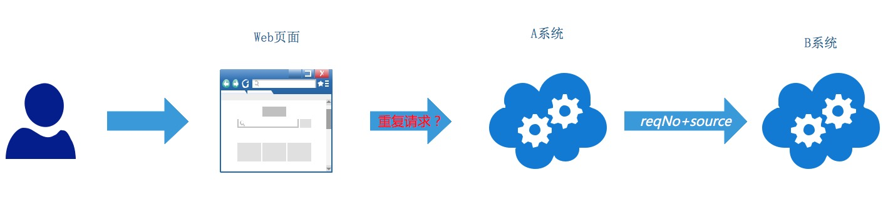
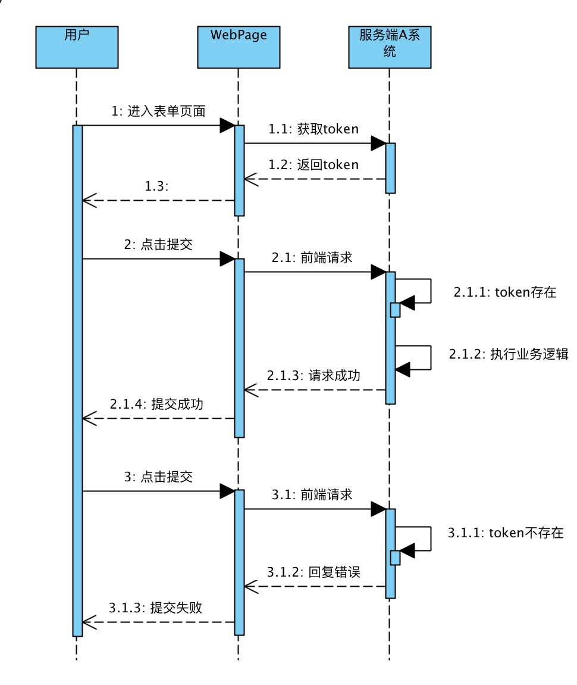
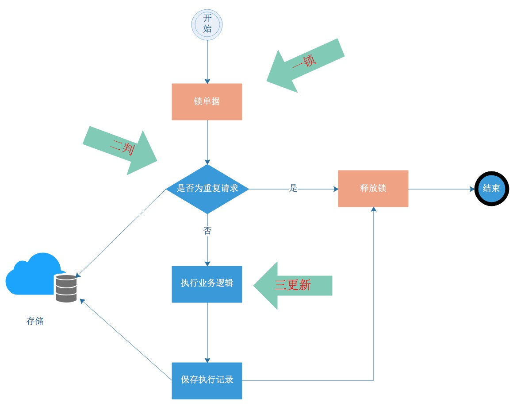
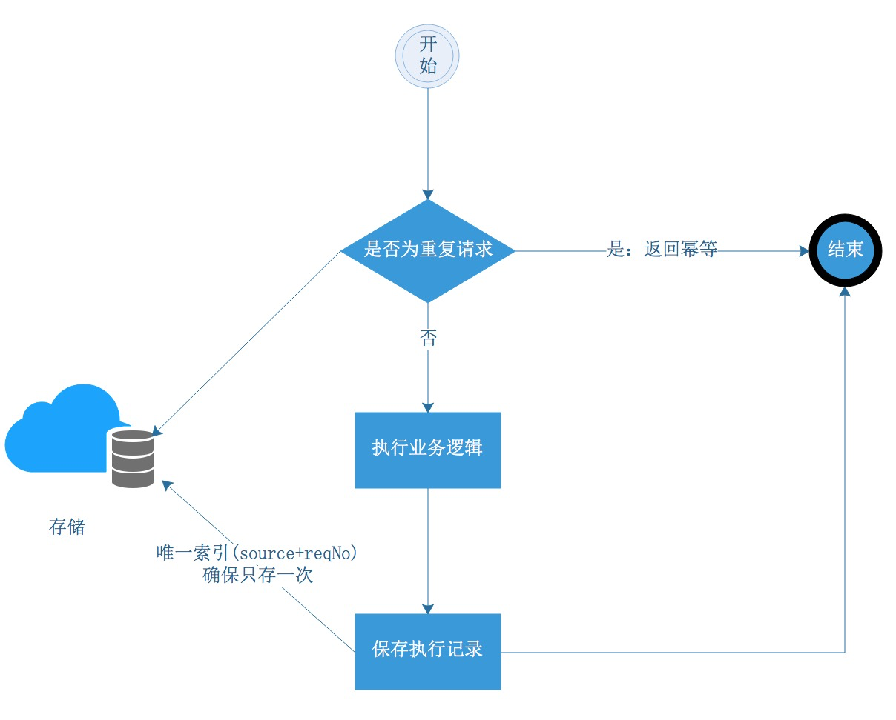

## 分布式其他面试题

### 如何保证微服务的幂等？

### 方案举例：token机制识别前端重复请求

在一条调用链路的后端系统中，一般都可以通过上游系统传递的reqNo+source来识别是否是为重复的请求。如下图，B系统是依赖于A系统传递的reqNo+source来识别相同请求的，但是A系统是直接和前端页面交互的系统，如何识别用户发起的请求是相同的呢？比如用户在支付界面上点击了多次，A系统怎么识别这是一次重复操作呢？



前端可以在第一次点击完成时，将按钮设置为disable，这样用户无法在界面上重复点击第二次，但这只是提升体验的前端解决方案，不是真正安全的解决方案。

常见的服务端解决方案是采用token机制来实现防重复提交。如下图，



（1）当用户进入到表单页面的时候，前端会从服务端申请到一个token，并保存在前端。
（2）当用户第一次点击提交的时候，会将该token和表单数据一并提交到服务端，服务端判断该token是否存在，如果存在则执行业务逻辑。
（3）当用户第二次点击提交的时候，会将该token和表单数据一并提交到服务端，服务端判断该token是否存在，如果不存在则返回错误，前端显示提交失败。

这个方案结合前后端，从前端视角，这是用于防止重复请求，从服务端视角，这个用于**识别前端相同请求**。服务端往往基于类似于redis之类的分布式缓存来实现，保证生成token的唯一性和操作token时的原子性即可。核心逻辑如下。

```

// SETNX keyName value: 如果key存在,则返回0，如果不存在，则返回1

// step1. 申请token
String token = generateUniqueToken();

// step2. 校验token是否存在
if(redis.setNx(token, 1) == 1){
  // do business
} else {
 // 幂等逻辑
}
```


### 加锁避免并发重复执行

很多幂等解决方案都和防并发有关，那么幂等和并发到底有什么关联呢？两者的联系是：幂等解决的是重复执行的问题，重复执行既有串行重复执行（例如定时任务），也有并发重复执行。如果重复执行的业务逻辑没有共享变量和数据变更操作时，并发重复执行是没有副作用的，可以不考虑并发的问题。对于包含共享变量、涉及变更操作的服务（实际上这类服务居多），并发问题可能导致乱序读写共享变量，重复插入数据等问题。特别是并发读写共享变量，往往都是发生生产故障后才被感知到。

所以在并发执行的维度，将并发重复执行变成串行重复执行是最好的幂等解决方案。支付宝最常见的方法就是：**一锁二判三更新**，如下图。当一个请求过来之后：一锁，锁住要操作的资源；二判，识别是否为重复请求（第一部曲要定义的问题）、判断业务状态是否正常；三更新：执行业务逻辑。



> Q&A

小A：锁可能造成性能影响，先判后锁再执行，可以提升效能。
大明：这样可能会失去防并发的效果。还记得double check实现单例模式吗？在加锁前判断了下，那加锁后为啥还要判断下？实际上第二次check才是必须的。想想看？
小A画图思考中...
小A：明白了，一锁二判三更新，锁和判的顺序是不能变的，如果锁冲突比较高，可以在锁之前判断下，提高效率，所以称之为double check。
大明：是的，聪明。这两个场景不一样，但并发思路是一样的。

```
private volatile static Girl theOnlyGirl;

// 实现单例时做了 double check
public static Girl getTheOnlyGirl() {

    if (theOnlyGirl == null) {   // 加锁前check
        synchronized (Girl.class) {
            if (theOnlyGirl == null) {  // 加锁后check
                theOnlyGirl = new Girl();    // 变更执行
            }
        }
    }

    return theOnlyGirl;
}
```

锁的实现可以是分布式锁，也是可以是数据库锁。分布式锁本身会带来锁的一致性问题，需要根据业务对系统稳定性的要求来考量。支付宝的很多系统是通过在业务数据库中新建一个锁记录表来实现业务锁组件，其分表逻辑和业务表的分表逻辑一致，就可以实现单机数据库锁。如果没有锁组件，悲观锁锁住业务单据也是可以满足条件的，悲观锁要在事务中用select for update来实现，要注意死锁问题，且where条件中必须命中索引，否则会锁表，不锁记录。

并发维度几乎是一个分布式幂等的通用分析维度，所以一个通用的锁组件是很有必要的。但这也只是解决了并发这一个维度的副作用。**虽然没有了并发重复执行的情况，但串行重复执行的情况依旧存在，重复执行才是幂等核心要解决的问题，重复执行如果还存在其它副作用，幂等问题就是没有解决掉**。

加锁后业务的性能会降低，这个怎么解决？笔者认为，大多数情况下架构的稳定性比系统性能的优先级更高，况且对于性能的优化有太多地方可以去实现，减少坏代码、去除慢SQL、优化业务架构、水平扩展数据库资源等方式。通过系统压测来实现一个满足SLA的服务才是评估全链路性能的正确方法。


### 唯一性约束避免重复落库

在数据表设计时，设计两个字段：source、reqNo，source表示调用方，seqNo表示调用方发送过来的请求号。source和reqNo设置为组合唯一索引，保证单据不会重复落两次。如果调用方没有source和reqNo这两个字段，可以根据业务实际情况将请求中的某几个业务参数生成一个md5作为唯一性字段落到唯一性字段中来避免重复落库。



核心逻辑如下：

```
try {
    dao.insert(entity);    
    // do business
} catch (DuplicateKeyException e) {
    dao.select(param);
    // 幂等返回
}
```

这里直接insert单据，若果成功则表示没请求过，举行执行业务逻辑，如果抛出DuplicateKeyException异常，则表示已经执行过，做幂等返回，简单的服务通过这种方式也可以识别是否为重复请求（第一部曲）。

利用数据库唯一索引来避免重复记录，需要注意以下几个问题：
（1）因为存在读写分离的设计，有可能insert操作的是主库，但select查询的却是从库，如果主备同步不及时，有可能select查出来也是空的。
（2）在数据库有Failover机制的情况下，如果一个城市出现自然灾害，很可能切换到另外一个城市的备用库，那么唯一性约束可能就会出现失效的情况，比如并发场景下第一次insert是在杭州的库，然后此时failover将库切到上海了，再一次同样的请求insert也是成功的。
（3）数据库扩容场景下，因为分库规则发生变化，有可能第一次insert操作是在A库，第二次insert操作是在B库，唯一索引同样不起作用。
（4）有的系统catch的是SQLIntegrityConstraintViolationException，这个是完整性约束，包含了唯一性约束，如果未给一个必填字段设值，也会抛这个异常，所以应该catch键重复异常DuplicateKeyException。
对于第（1）个问题，将insert 和select放在同一个事务中即可解决，对于（2）和（3），支付宝内部为了应对容量暴涨和FO，设计了一套基于数据复制技术的分布式数据平台，这个case笔者了解不深，后续有机会再讨论。

> 小A：如果我用唯一性约束来保证不会落重复数据，是不是可以不加锁防并发了？

大明：两者没有直接关系，加锁防并发解决的是并发维度的副作用问题，唯一性约束只是解决重复数据这单个副作用的问题。如果没有唯一性约束，串行重复执行也会导致insert重复落数据的问题，唯一性约束本质上解决的是重复数据问题，不是并发问题。


### 如何保证TCC幂等


### 如何保证消息幂等

