# 分布式一致性协议

## ZAB 协议

Zookeeper 主要分为四种角色，分别为 领导者、follower、Observer

每个Server在工作过程中有三种状态：

- LOOKING：当前Server不知道leader是谁，正在搜寻
- LEADING：当前Server即为选举出来的leader
- FOLLOWING：leader已经选举出来，当前Server与之同步


Observer 也是一种follower 但是并不参与投票，但是也接收客户端连接，用于提高读并发

因为在每次Zookeeper 进行写入数据时都需要进行投票，如果follower 越多 那么时间就越长

ZK集群对客户端的请求，按照类型（读、写两类）分开处理：

- 读请求

  客户端直接从当前节点（其建立连接的节点）中读取数据；

- 写请求

  这里涉及到了分布式事务。 客户端就会向 Leader 提交事务，Leader 接收到事务提交，会广播该事务，只要超过半数节点写入成功，该事务就会被提交。

### ZXID

当产生新Leader的时候，就从这个Leader服务器上取出本地log中最大事务Zxid，从里面读出epoch+1，作为一个新epoch，并将低32位置0（保证id绝对自增）

ZXID : 事务的Proposal（提议） 的id，可以简单理解为事务id

ZXID 是一个 64 位的数字，其中低 32 位可看作是计数器，Leader 服务器每产生一个新的事务 Proposal 的时候，都会该计数器进行加 1 操作。

ZXID 的高 32 位表示 Leader 周期 epoch 的编号，每当选举一个新的 Leader 服务器，就会从该服务器本地的事务日志中最大 Proposal 的 ZXID 中解析出对应的 epoch 值，然后对其加 1 操作，这个值就作为新的 epoch 值，并将低 32 位初始化为 0 来开始生成新的 ZXID。

[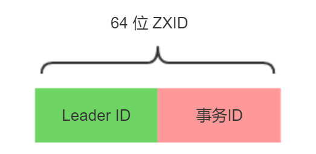](https://static001.geekbang.org/infoq/fe/fe0cdd1fa848de0ad89568f316c81965.jpeg)


### Zookeeper 选主过程

#### 1、选举阶段（Leader Election）

节点在一开始都处于选举节点，只要有一个节点得到超过半数节点的票数，它就可以当选准 Leader，只有到达第三个阶段（也就是同步阶段），这个准 Leader 才会成为真正的 Leader。

Zookeeper 规定所有有效的投票都必须在同一个轮次中，每个服务器在开始新一轮投票时，都会对自己维护的 logicalClock 进行自增操作。

每个服务器在广播自己的选票前，会将自己的投票箱（recvset）清空。该投票箱记录了所受到的选票。

**例子**

例如：Server_2 投票给 Server_3，Server_3 投票给 Server_1，则Server_1的投票箱为(2,3)、(3,1)、(1,1)。（每个服务器都会默认给自己投票）

前一个数字表示投票者，后一个数字表示被选举者。

票箱中只会记录每一个投票者的最后一次投票记录，如果投票者更新自己的选票，则其他服务器收到该新选票后会在自己的票箱中更新该服务器的选票。

这一阶段的目的就是为了选出一个准 Leader ，然后进入下一个阶段。

协议并没有规定详细的选举算法，后面会提到实现中使用的 Fast Leader Election。

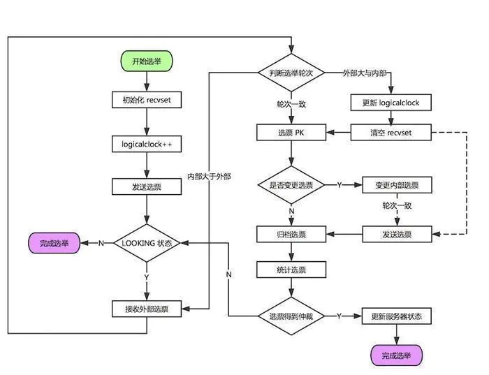


#### 2、发现阶段（Descovery）

这个阶段的主要目的是发现当前大多数节点接收的最新 Proposal，并且准 Leader 生成新的 epoch，让 Followers 接收，更新它们的 acceptedEpoch。

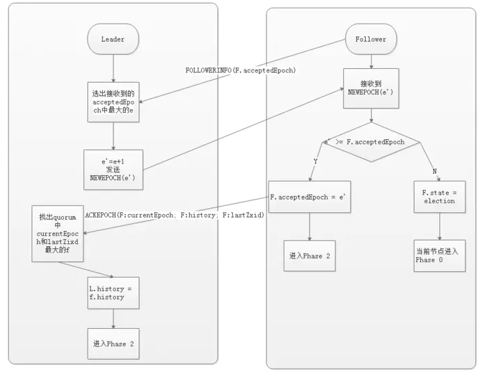


#### 3、同步阶段（Synchronization）

同步阶段主要是利用 Leader 前一阶段获得的最新 Proposal 历史，同步集群中所有的副本。

只有当 quorum（超过半数的节点） 都同步完成，准 Leader 才会成为真正的 Leader。

Follower 只会接收 zxid 比自己 lastZxid 大的 Proposal。

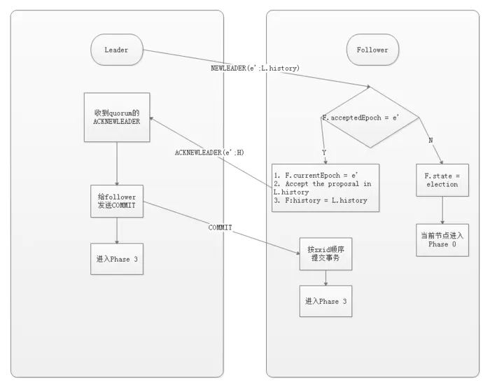


#### 4、广播阶段（Broadcast）

到了这个阶段，Zookeeper 集群才能正式对外提供事务服务，并且 Leader 可以进行消息广播。

同时，如果有新的节点加入，还需要对新节点进行同步。

需要注意的是，Zab 提交事务并不像 2PC 一样需要全部 Follower 都 Ack，只需要得到 quorum（超过半数的节点）的Ack 就可以。

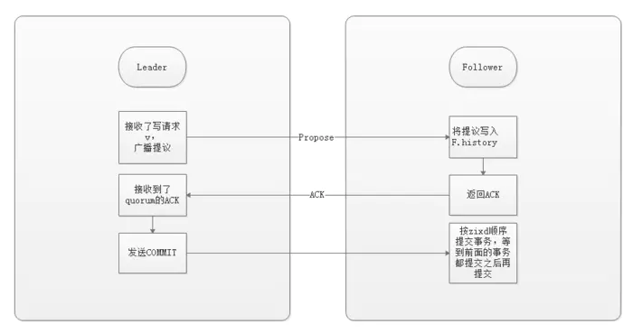


### Zookeeper 集群模式

当整个集群启动过程中，或者当 Leader 服务器出现网络中断、崩溃退出或重启等异常时，ZAB协议就会进入崩溃恢复模式，选举产生新的Leader。当选举产生了新的 Leader，同时集群中有过半的机器与该 Leader 服务器完成了状态同步（即数据同步）之后，**ZAB协议就会退出崩溃恢复模式，进入消息广播模式。**这时，如果有一台遵守ZAB协议的服务器加入集群，因为此时集群中已经存在一个Leader服务器在广播消息，那么该新加入的服务器自动进入恢复模式：找到Leader服务器，并且完成数据同步。同步完成后，作为新的Follower一起参与到消息广播流程中。

#### 消息广播

1）在zookeeper集群中，数据副本的传递策略就是采用消息广播模式。zookeeper中农数据副本的同步方式与二段提交相似，但是却又不同。二段提交要求协调者必须等到所有的参与者全部反馈ACK确认消息后，再发送commit消息。要求所有的参与者要么全部成功，要么全部失败。二段提交会产生严重的阻塞问题。

2）Zab协议中 Leader 等待 Follower 的ACK反馈消息是指“只要半数以上的Follower成功反馈即可，不需要收到全部Follower反馈”


消息广播流程图


#### 消息广播具体步骤

1）客户端发起一个写操作请求。

2）Leader 服务器将客户端的请求转化为事务 Proposal 提案，同时为每个 Proposal 分配一个全局的ID，即zxid。

3）Leader 服务器为每个 Follower 服务器分配一个单独的队列，然后将需要广播的 Proposal 依次放到队列中取，并且根据 FIFO 策略进行消息发送。

4）Follower 接收到 Proposal 后，会首先将其以事务日志的方式写入本地磁盘中，写入成功后向 Leader 反馈一个 Ack 响应消息。

5）Leader 接收到超过半数以上 Follower 的 Ack 响应消息后，即认为消息发送成功，可以发送 commit 消息。

6）Leader 向所有 Follower 广播 commit 消息，同时自身也会完成事务提交。Follower 接收到 commit 消息后，会将上一条事务提交。

**zookeeper 采用 Zab 协议的核心，就是只要有一台服务器提交了 Proposal，就要确保所有的服务器最终都能正确提交 Proposal。这也是 CAP/BASE 实现最终一致性的一个体现。**

**Leader 服务器与每一个 Follower 服务器之间都维护了一个单独的 FIFO 消息队列进行收发消息，使用队列消息可以做到异步解耦。 Leader 和 Follower 之间只需要往队列中发消息即可。如果使用同步的方式会引起阻塞，性能要下降很多。**


#### 崩溃恢复

**一旦 Leader 服务器出现崩溃或者由于网络原因导致 Leader 服务器失去了与过半 Follower 的联系，那么就会进入崩溃恢复模式。**

在 Zab 协议中，为了保证程序的正确运行，整个恢复过程结束后需要选举出一个新的 Leader 服务器。因此 Zab 协议需要一个高效且可靠的 Leader 选举算法，从而确保能够快速选举出新的 Leader 。

Leader 选举算法不仅仅需要让 Leader 自己知道自己已经被选举为 Leader ，同时还需要让集群中的所有其他机器也能够快速感知到选举产生的新 Leader 服务器。

崩溃恢复主要包括两部分：**Leader选举** 和 **数据恢复**


## Raft 协议

Raft 动态图演示：http://www.kailing.pub/raft/index.html

`Raft 算法`是分布式系统开发首选的`共识算法`。比如现在流行 Etcd、Consul、Nacos。，Raft算法主要分为两个过程，分别为Leader Election 和 LogReplication

### Raft 角色

**跟随者（Follower）**：`普通群众`，默默接收和来自领导者的消息，当领导者心跳信息超时的时候，就主动站出来，推荐自己当候选人。

**候选人（Candidate）**：`候选人`将向其他节点请求投票 RPC 消息，通知其他节点来投票，如果赢得了大多数投票选票，就晋升当领导者。

**领导者（Leader）**：`霸道总裁`，一切以我为准。处理写请求、管理日志复制和不断地发送心跳信息，通知其他节点“我是领导者，我还活着，你们不要”发起新的选举，不用找新领导来替代我。


### 一、角色

Raft 算法是通过”一切以领导者为准“的方式，实现一系列值的共识和各节点日志的一致。Raft算法的核心就是通过 **选举** 来达成一致性，该算法一共涉及三种角色（状态）、两大过程（Leader Election、Log Replication）。

我们先来看下Raft算法涉及的角色，在Raft算法中，所有节点都有三种状态，状态之间可以互相转换。


节点的状态流转见下图：

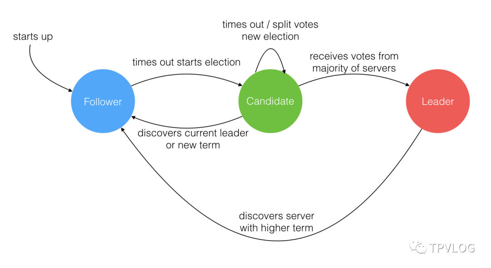


#### 1.1 Follower（跟随者）

Raft协议刚开始时，所有节点都是Follower，默默地接收和处理来自Leader的消息，当等待Leader心跳信息超时的时候，就主动站出来，推荐自己当Candidate。


#### 1.2 Candidate（候选人）

Candidate将向其他节点发送投票请求（RequestVote），通知其他节点来投票，如果赢得了大多数（N/2+1）选票，就晋升Leader。


#### 1.3 Leader（领导者）

Leader主要负责处理客户端请求，进行日志复制等操作，每一轮选举的目标就是选出一个Leader；Leader会不断地发送心跳信息，通知其他节点“我是领导者，我还活着，你们现在不要发起新的选举，找个新领导者来替代我。”


### 二、Leader Election（领导者选举）


#### 2.1 选举流程

1.首先，在初始状态下，集群中所有的节点都是**Follower**状态，并被设定一个随机 **election timeout**（150ms-300ms）：

> election timeout选举超时是指followers*跟随者成为*candidates*候选者之前所等待的时间

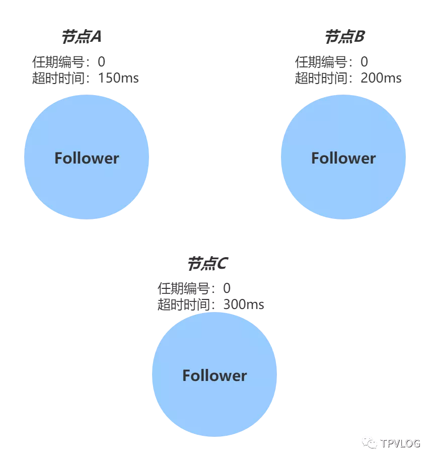

2.如果超时时间到期后没有收到来自Leader的心跳，节点就发起选举：将自己的状态切换为 **Candidate**，增加自己的任期编号，并且向自己投票，然后向集群中的其它 Follower 节点发送请求，询问其是否选举自己成为 Leader：

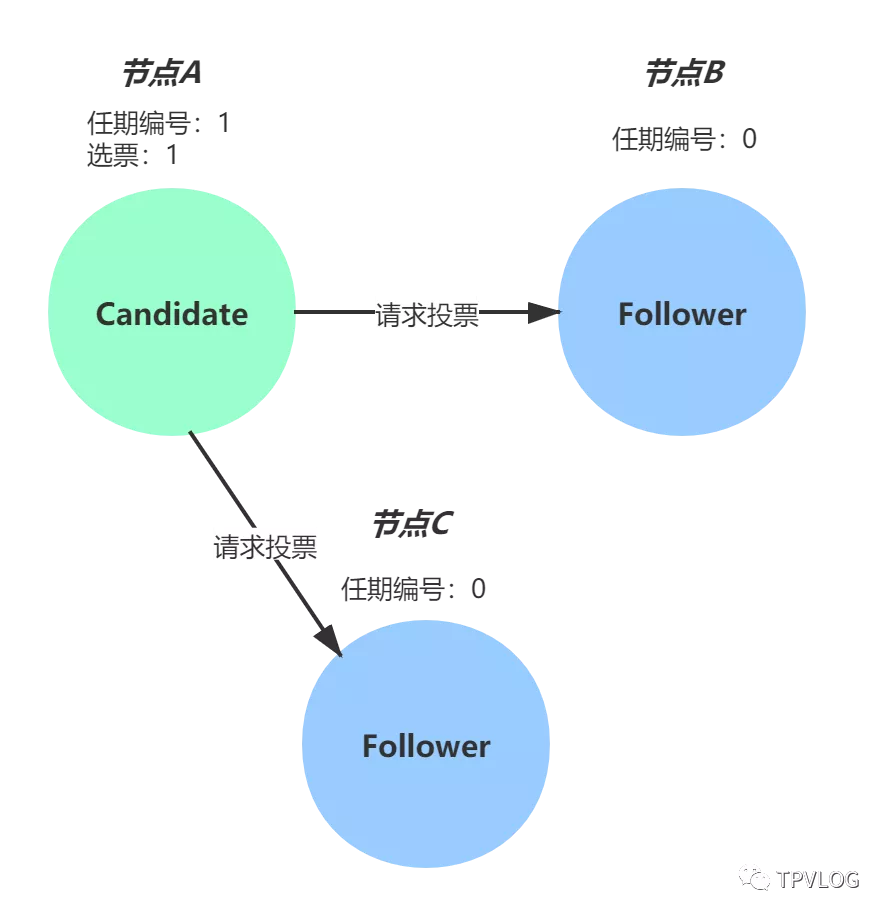

3.其他节点接收到候选人 A 的请求投票消息后，如果在编号为 1 的这届任期内还没有进行过投票，那么它将把选票投给节点 A，并增加自己的任期编号，然后重置自己的election timeout超时时间：


4.当收到来自集群中过半数节点的接受投票后，节点即成为本届任期内 Leader，他将周期性地发送心跳消息，通知其他节点我是Leader，阻止Follower发起新的选举，并且领导者开始向其追随者发送*Append Entries*追加条目消息，这些消息以heartbeat timeout心跳超时指定的时间间隔发送：

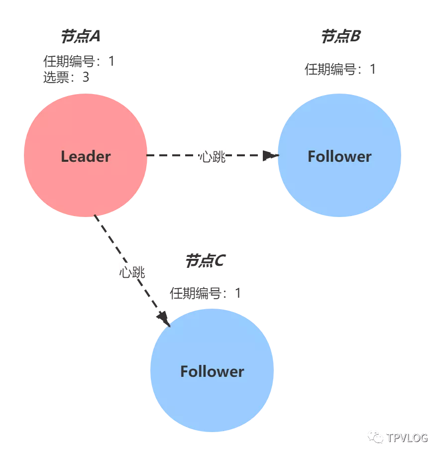

> 如果在指定时间内（一个随机时间，每个节点都不同），Follower没有接收到来自Leader的心跳消息，那么它就认为当前没有Leader，推举自己为Candidate，发起新一轮选举。


#### 2.2 分裂投票

5、如果在同一个时间出现多个Follower同时变为候选者则会触发分裂投票，并且候选节点都开始以相同的任期进行选举：

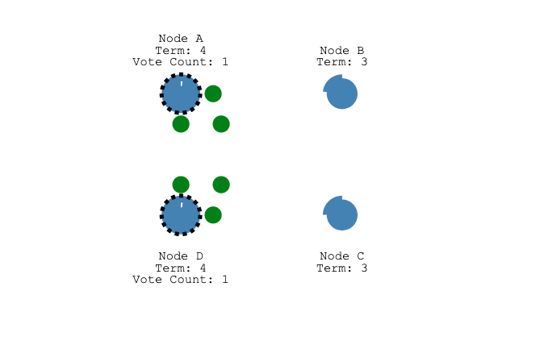


6、并且两个候选节点每个都先到达一个跟随者节点

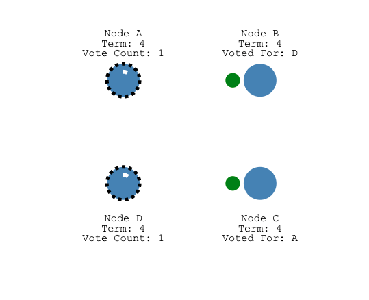


7、现在，每个候选人都有2票，并且在这个任期中将无法获得更多选票


8、所有节点将开始等待新的选举，然后再试一次。

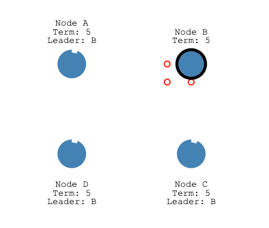


#### 2.3 通信方式

在 Raft 算法中，节点之间的通信采用的是RPC方式，在Leader选举中，需要用到两类RPC：

1. 请求投票（RequestVote）RPC：由Candidate在选举期间发起，通知各Follower进行投票；
2. 日志复制（AppendEntries）RPC：由Leader发起，用来进行日志复制和心跳。


#### 2.4 任期

在选举流程中，我提到Leader节点是有任期的，每个任期由单调递增的数字标识，比如节点 A 的任期编号是 1。任期编号是随着选举的举行而变化的：

1. Follower在等待Leader的心跳信息超时后，会推举自己为Candidate，此时会增加自己的任期编号；
2. 如果一个节点发现自己的任期编号比其他节点小，那么它会更新自己的编号为较大的编号值。比如节点 B 的任期编号是 0，当收到来自节点 A 的请求投票消息时，因为消息中包含了节点 A 的任期编号，且编号为 1，那么节点 B 将把自己的任期编号更新为 1。
3. 当任期编号相同时，日志完整性高的Follower（也就是最后一条日志项对应的任期编号值更大，索引号更大），拒绝投票给日志完整性低的Candidate。


### 三、Log Replication（日志复制）

在 Raft 算法中，副本数据是以日志的形式存在的，Leader接收到来自客户端写请求后，处理写请求的过程就是一个日志复制的过程。

#### 3.1 日志项

日志是由**日志项**组成的，那么日志项究竟是什么样子呢？

日志项是一种数据格式，它主要包含客户端的指令（Command），还有索引值（Log index）、任期编号（Term）等信息：


从上图可以看到，一届领导者的任期中，往往有多条日志项，而且日志项的索引值是连续的，


#### 3.2 复制流程

1. 首先，当Leader节点接收到客户端的写请求后，会创建一个新日志项，并附加到本地日志中；
2. Leader通过日志复制（AppendEntries）RPC 消息，将日志项复制到集群其它Follower节点上；
3. 如果Leader接收到大多数的“复制成功”响应后，它将日志项应用到自己的状态机，并返回成功给客户端。如果Leader没有接收到大多数的“复制成功”响应，那么就返回错误给客户端；
4. 当Follower接收到心跳信息，或者新的AppendEntries消息后，如果发现Leader已经提交了某条日志项，而自己还没应用，那么Follower就会将这条日志项应用到本地的状态机中。

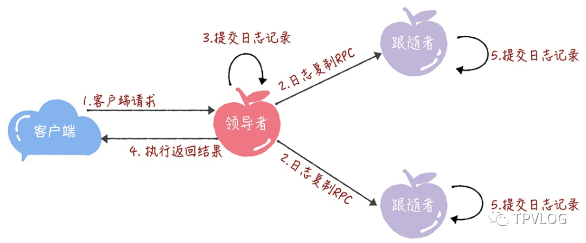

从上面这个过程可以看出，当Follower节点接受Leader的心跳消息或者AppendEntries消息后，会将日志项应用到自己的状态机。这个优化，降低了处理客户端请求的延迟，将二阶段提交优化为了一段提交，降低了一半的消息延迟。


#### 3.3 网络分区

1、由于网络分区已经出现了两个领导者

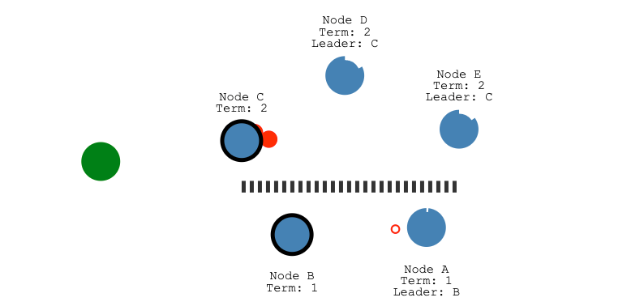

2、让我们添加另一个客户端，并尝试更新两个领导者，一个客户端将尝试将节点B的值设置为“ 3”

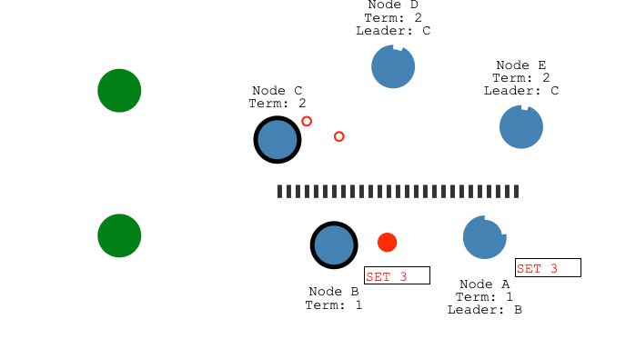

3、节点B无法复制为多数，因此其日志条目保持未提交状态

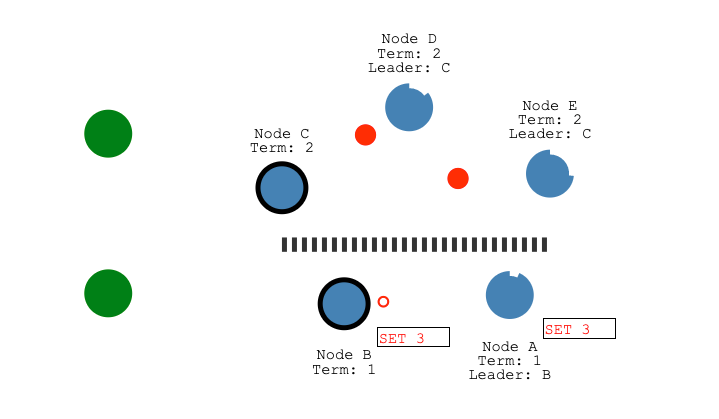

4、另一个客户端将尝试将节点 C 的值设置为“ 8”，这样会成功，因为它可以复制到大多数

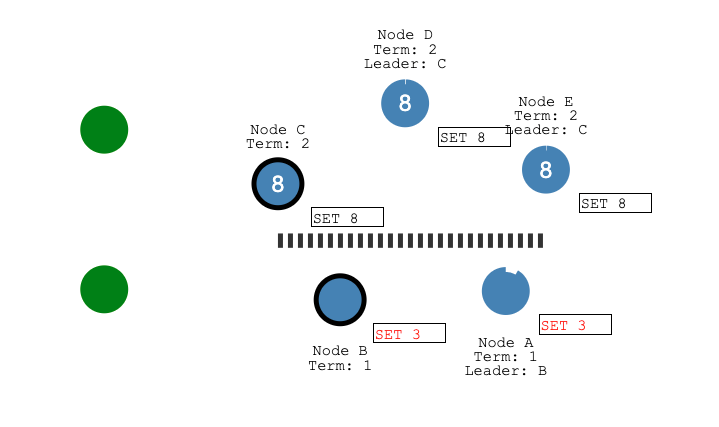


5、当修复网络分区之后，节点B将看到较高的选举期限并退出，节点A和B都将回滚其未提交的条目并匹配新领导者的日志

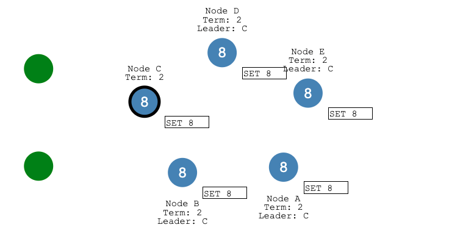


#### 3.3 一致性检查

在 Raft 算法中，Leader通过强制Follower直接复制自己的日志项，处理不一致日志。具体有 2 个步骤：

1. 首先，Leader通过AppendEntries消息，找到Follower节点上与自己相同日志项的最大索引值。也就是说，这个索引值之前的日志，Leader和Follower是一致的，之后的日志是不一致的了。
2. 然后，Leader强制Follower更新不一致日志项，实现日志的一致。

举个例子来理解下， 为了方便演示，我们引入 2 个新变量 ：

- **PrevLogEntry：**表示当前要复制的日志项的前一条日志项的索引值。比如下图中，如果Leader将索引值为8的日志项发送给Follower，那么此时 PrevLogEntry 值为 7；
- **PrevLogTerm：**表示当前要复制的日志项的前一条日志项的任期编号。比如下图中，如果Leader将索引值为8的日志项发送给Follower，那么此时 PrevLogTerm 值为 4。

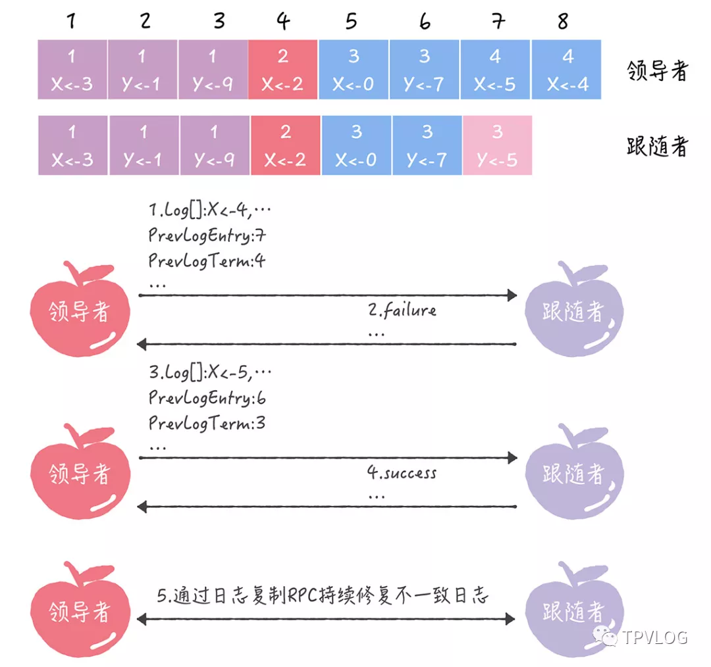

1. 首先，Leader通过AppendEntries消息，发送当前最新的日志项到Follower，这个日志项的 PrevLogEntry 值为 7，PrevLogTerm 值为 4；
2. 如果Follower在它的日志中，找不到PrevLogEntry 值为 7、PrevLogTerm 值为 4 的日志项，也就是说它的日志和Leader的不一致了，那么Follower就会拒绝接收新的日志项，并返回失败信息给Leader；
3. 此时Leader会递减要复制的日志项的索引值，并发送新的日志项到Follower，这个消息的 PrevLogEntry 值为 6，PrevLogTerm 值为 3；
4. 如果Follower在它的日志中，找到了 PrevLogEntry 值为 6、PrevLogTerm 值为 3 的日志项，那么AppendEntries消息返回成功，这样一来，Leader就知道在 PrevLogEntry 值为 6、PrevLogTerm 值为 3 的位置，Follower的日志项与自己相同；
5. 最后， Leader通过AppendEntries消息，复制并更新覆盖该索引值之后的日志项（也就是不一致的日志项），最终实现了集群各节点日志的一致。


### 四、总结

本章，我对Raft算法的原理进行了详细讲解，Raft算法是Multi-Paxos 思想的落地，其核心就是领导者选举和日志复制。Raft 算法能很好地处理绝大部分场景的一致性问题，推荐大家在设计分布式系统时，优先考虑 Raft 算法，当 Raft 算法不能满足现有场景需求时，再去调研其他共识算法。

目前开源界对Raft算法的实现有很多，在生产环境落地较多并接受过大量检验的是 Hashicorp Raft ， 感兴趣的读者可以自行参考官方文档进行学习。


## Gossip协议

Gossip 协议动画演示网址：https://flopezluis.github.io/gossip-simulator/

### 原理

Gossip协议基本思想就是：一个节点想要分享一些信息给网络中的其他的一些节点。于是，它**周期性**的**随机**选择一些节点，并把信息传递给这些节点。这些收到信息的节点接下来会做同样的事情，即把这些信息传递给其他一些随机选择的节点。一般而言，信息会周期性的传递给N个目标节点，而不只是一个。这个N被称为**fanout**（这个单词的本意是扇出）


### 用途

Gossip协议的主要用途就是**信息传播和扩散**：即把一些发生的事件传播到全世界。它们也被用于数据库复制，信息扩散，集群成员身份确认，故障探测等。

基于Gossip协议的一些有名的系统：Apache Cassandra，Redis（Cluster模式），Consul等。

### 图解

接下来通过多张图片剖析Gossip协议是如何运行的。如下图所示，Gossip协议是周期循环执行的。图中的公式表示Gossip协议把信息传播到每一个节点需要多少次循环动作，需要说明的是，公式中的10表示整个集群有10个节点，2表示某个节点会向2个目标节点传播消息：

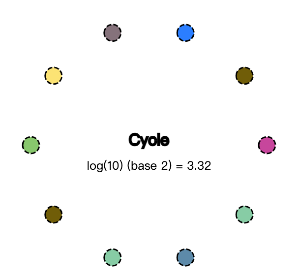

如下图所示，红色的节点表示其已经“受到感染”，即接下来要传播信息的源头，连线表示这个初始化感染的节点能正常连接的节点（其不能连接的节点只能靠接下来感染的节点向其传播消息）。并且N等于2，我们假设2根较粗的线路，就是它第一次传播消息的线路：

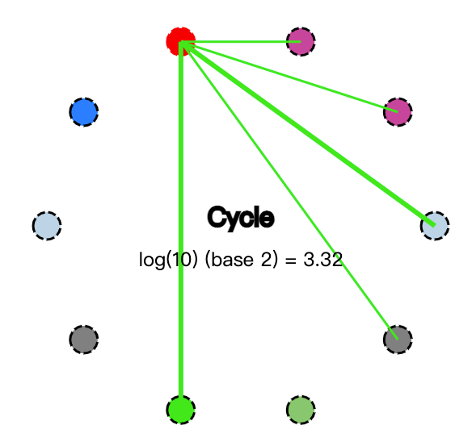

第一次消息完成传播后，新增了2个节点会被“感染”，即这4个节点也收到了消息。这时候，总计有3个节点变成红色：

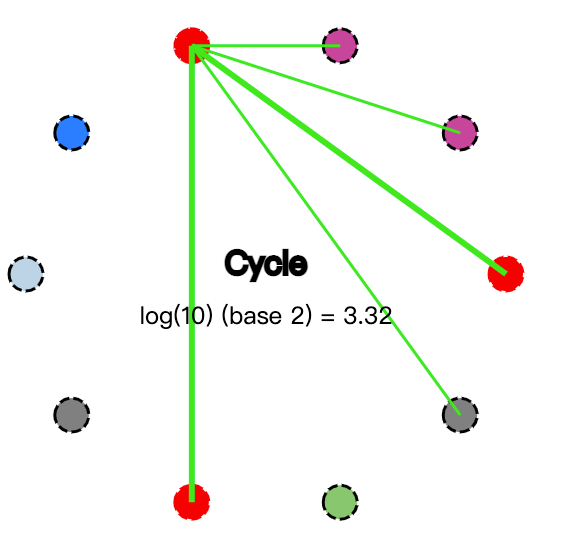

那么在下一次传播周期时，总计有3个节点，且这3个节点每个节点都会向2个节点传播消息。最后，经过4次循环，10个节点全部被感染（都变成红色节点），即说明需要传播的消息已经传播给了所有节点：

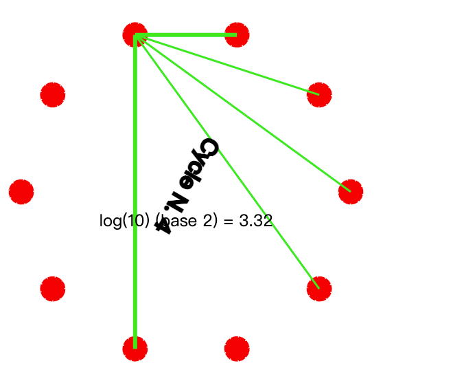

需要说明的是，20个节点且设置fanout=2，公式结果是3.32，这只是个近似值。真实传递时，可能需要3次甚至4次循环才能让所有节点收到消息。这是因为每个节点在传播消息的时候，是随机选择N个节点的，这样的话，就有可能某个节点会被选中2次甚至更多次。

Gossip 动态演示图如下：

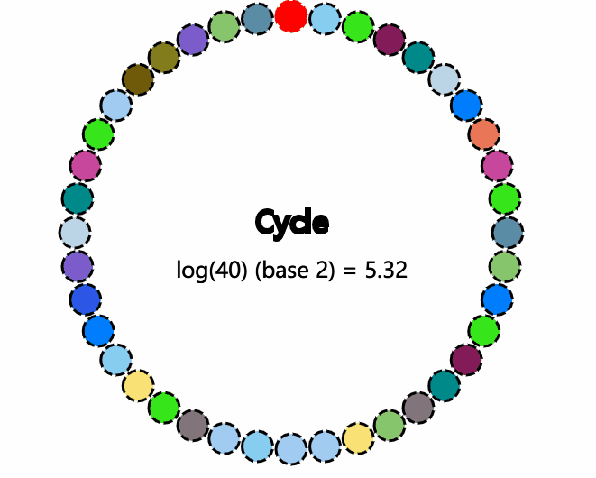


### 集群模式和 Gossip 简介

**对于数据存储领域，当数据量或者请求流量大到一定程度后，就必然会引入分布式**。比如 Redis，虽然其单机性能十分优秀，但是因为下列原因时，也不得不引入集群。

- 单机无法保证高可用，需要引入多实例来提供高可用性
- 单机能够提供高达 8W 左右的QPS，再高的QPS则需要引入多实例
- 单机能够支持的数据量有限，处理更多的数据需要引入多实例；
- 单机所处理的网络流量已经超过服务器的网卡的上限值，需要引入多实例来分流。

有集群，集群往往需要维护一定的元数据，比如实例的ip地址，缓存分片的 slots 信息等，所以需要一套分布式机制来维护元数据的一致性。这类机制一般有两个模式：分散式和集中式

分散式机制将元数据存储在部分或者所有节点上，不同节点之间进行不断的通信来维护元数据的变更和一致性。Redis Cluster，Consul 等都是该模式。


而集中式是将集群元数据集中存储在外部节点或者中间件上，比如 zookeeper。旧版本的 kafka 和 storm 等都是使用该模式。


两种模式各有优劣，具体如下表所示：

| 模式   | 优点                                                         | 缺点                                                         |
| ------ | ------------------------------------------------------------ | ------------------------------------------------------------ |
| 集中式 | 数据更新及时，时效好，元数据的更新和读取，时效性非常好，一旦元数据出现了变更，立即就更新到集中式的外部节点中，其他节点读取的时候立即就可以感知到; | 较大数据更新压力，更新压力全部集中在外部节点，作为单点影响整个系统 |
| 分散式 | 数据更新压力分散，元数据的更新比较分散，不是集中某一个节点，更新请求比较分散，而且有不同节点处理，有一定的延时，降低了并发压力 | 数据更新延迟，可能导致集群的感知有一定的滞后                 |

分散式的元数据模式有多种可选的算法进行元数据的同步，比如说 Paxos、Raft 和 Gossip。Paxos 和 Raft 等都需要全部节点或者大多数节点(超过一半)正常运行，整个集群才能稳定运行，而 Gossip 则不需要半数以上的节点运行。

Gossip 协议，顾名思义，就像流言蜚语一样，利用一种随机、带有传染性的方式，将信息传播到整个网络中，并在一定时间内，使得系统内的所有节点数据一致。对你来说，掌握这个协议不仅能很好地理解这种最常用的，实现最终一致性的算法，也能在后续工作中得心应手地实现数据的最终一致性。

Gossip 协议又称 epidemic 协议（epidemic protocol），是基于流行病传播方式的节点或者进程之间信息交换的协议，在P2P网络和分布式系统中应用广泛，它的方法论也特别简单：

> 在一个处于有界网络的集群里，如果每个节点都随机与其他节点交换特定信息，经过足够长的时间后，集群各个节点对该份信息的认知终将收敛到一致。

这里的“特定信息”一般就是指集群状态、各节点的状态以及其他元数据等。Gossip协议是完全符合 BASE 原则，可以用在任何要求最终一致性的领域，比如分布式存储和注册中心。另外，它可以很方便地实现弹性集群，允许节点随时上下线，提供快捷的失败检测和动态负载均衡等。

此外，Gossip 协议的最大的好处是，即使集群节点的数量增加，每个节点的负载也不会增加很多，几乎是恒定的。这就允许 Redis Cluster 或者 Consul 集群管理的节点规模能横向扩展到数千个。


### Redis Cluster 的 Gossip 通信机制

Redis Cluster 是在 3.0 版本引入集群功能。为了让让集群中的每个实例都知道其他所有实例的状态信息，Redis 集群规定各个实例之间按照 Gossip 协议来通信传递信息。


上图展示了主从架构的 Redis Cluster 示意图，其中实线表示节点间的主从复制关系，而虚线表示各个节点之间的 Gossip 通信。

Redis Cluster 中的每个节点都**维护一份自己视角下的当前整个集群的状态**，主要包括：

1. *当前集群状态*
2. *集群中各节点所负责的 slots信息，及其migrate状态*
3. *集群中各节点的master-slave状态*
4. 集群中各节点的存活状态及怀疑Fail状态

也就是说上面的信息，就是集群中Node相互八卦传播流言蜚语的内容主题，而且比较全面，既有自己的更有别人的，这么一来大家都相互传，最终信息就全面而且一致了。

Redis Cluster 的节点之间会相互发送多种消息，较为重要的如下所示：

- MEET：通过「cluster meet ip port」命令，已有集群的节点会向新的节点发送邀请，加入现有集群，然后新节点就会开始与其他节点进行通信；
- PING：节点按照配置的时间间隔向集群中其他节点发送 ping 消息，消息中带有自己的状态，还有自己维护的集群元数据，和部分其他节点的元数据；
- PONG: 节点用于回应 PING 和 MEET 的消息，结构和 PING 消息类似，也包含自己的状态和其他信息，也可以用于信息广播和更新；
- FAIL: 节点 PING 不通某节点后，会向集群所有节点广播该节点挂掉的消息。其他节点收到消息后标记已下线。

Redis 的源码中 cluster.h 文件定义了全部的消息类型，代码为 redis 4.0版本。

```c
// 注意，PING 、 PONG 和 MEET 实际上是同一种消息。
// PONG 是对 PING 的回复，它的实际格式也为 PING 消息，
// 而 MEET 则是一种特殊的 PING 消息，用于强制消息的接收者将消息的发送者添加到集群中（如果节点尚未在节点列表中的话）
#define CLUSTERMSG_TYPE_PING 0          /* Ping 消息 */
#define CLUSTERMSG_TYPE_PONG 1          /* Pong 用于回复Ping */
#define CLUSTERMSG_TYPE_MEET 2          /* Meet 请求将某个节点添加到集群中 */
#define CLUSTERMSG_TYPE_FAIL 3          /* Fail 将某个节点标记为 FAIL */
#define CLUSTERMSG_TYPE_PUBLISH 4       /* 通过发布与订阅功能广播消息 */
#define CLUSTERMSG_TYPE_FAILOVER_AUTH_REQUEST 5 /* 请求进行故障转移操作，要求消息的接收者通过投票来支持消息的发送者 */
#define CLUSTERMSG_TYPE_FAILOVER_AUTH_ACK 6     /* 消息的接收者同意向消息的发送者投票 */
#define CLUSTERMSG_TYPE_UPDATE 7        /* slots 已经发生变化，消息发送者要求消息接收者进行相应的更新 */
#define CLUSTERMSG_TYPE_MFSTART 8       /* 为了进行手动故障转移，暂停各个客户端 */
#define CLUSTERMSG_TYPE_COUNT 9         /* 消息总数 */
```

通过上述这些消息，集群中的每一个实例都能获得其它所有实例的状态信息。这样一来，即使有新节点加入、节点故障、Slot 变更等事件发生，实例间也可以通过 PING、PONG 消息的传递，完成集群状态在每个实例上的同步。下面，我们依次来看看几种常见的场景。


#### 定时 PING/PONG 消息

Redis Cluster 中的节点都会定时地向其他节点发送 PING 消息，来交换各个节点状态信息，检查各个节点状态，包括在线状态、疑似下线状态 PFAIL 和已下线状态 FAIL。

Redis 集群的定时 PING/PONG 的工作原理可以概括成两点：

- 一是，每个实例之间会按照一定的频率，从集群中随机挑选一些实例，把 PING 消息发送给挑选出来的实例，用来检测这些实例是否在线，并交换彼此的状态信息。PING 消息中封装了发送消息的实例自身的状态信息、部分其它实例的状态信息，以及 Slot 映射表。
- 二是，一个实例在接收到 PING 消息后，会给发送 PING 消息的实例，发送一个 PONG 消息。PONG 消息包含的内容和 PING 消息一样。

下图显示了两个实例间进行 PING、PONG 消息传递的情况，其中实例一为发送节点，实例二是接收节点


#### 新节点上线

Redis Cluster 加入新节点时，客户端需要执行 CLUSTER MEET 命令，如下图所示。


节点一在执行 CLUSTER MEET 命令时会首先为新节点创建一个 clusterNode 数据，并将其添加到自己维护的 clusterState 的 nodes 字典中。有关 clusterState 和 clusterNode 关系，我们在最后一节会有详尽的示意图和源码来讲解。

然后节点一会根据据 CLUSTER MEET 命令中的 IP 地址和端口号，向新节点发送一条 MEET 消息。新节点接收到节点一发送的MEET消息后，新节点也会为节点一创建一个 clusterNode 结构，并将该结构添加到自己维护的 clusterState 的 nodes 字典中。

接着，新节点向节点一返回一条PONG消息。节点一接收到节点B返回的PONG消息后，得知新节点已经成功的接收了自己发送的MEET消息。

最后，节点一还会向新节点发送一条 PING 消息。新节点接收到该条 PING 消息后，可以知道节点A已经成功的接收到了自己返回的P ONG消息，从而完成了新节点接入的握手操作。

MEET 操作成功之后，节点一会通过稍早时讲的定时 PING 机制将新节点的信息发送给集群中的其他节点，让其他节点也与新节点进行握手，最终，经过一段时间后，新节点会被集群中的所有节点认识。


#### 节点疑似下线和真正下线

Redis Cluster 中的节点会定期检查已经发送 PING 消息的接收方节点是否在规定时间 ( cluster-node-timeout ) 内返回了 PONG 消息，如果没有则会将其标记为疑似下线状态，也就是 PFAIL 状态，如下图所示。


然后，节点一会通过 PING 消息，将节点二处于疑似下线状态的信息传递给其他节点，例如节点三。节点三接收到节点一的 PING 消息得知节点二进入 PFAIL 状态后，会在自己维护的 clusterState 的 nodes 字典中找到节点二所对应的 clusterNode 结构，并将主节点一的下线报告添加到 clusterNode 结构的 fail_reports 链表中。


随着时间的推移，如果节点十 (举个例子) 也因为 PONG 超时而认为节点二疑似下线了，并且发现自己维护的节点二的 clusterNode 的 fail_reports 中有**半数以上的主节点数量的未过时的将节点二标记为 PFAIL 状态报告日志**，那么节点十将会把节点二将被标记为已下线 FAIL 状态，并且节点十会**立刻**向集群其他节点广播主节点二已经下线的 FAIL 消息，所有收到 FAIL 消息的节点都会立即将节点二状态标记为已下线。如下图所示。


需要注意的是，报告疑似下线记录是由时效性的，如果超过 cluster-node-timeout *2 的时间，这个报告就会被忽略掉，让节点二又恢复成正常状态。


### Redis Cluster 通信源码实现

综上，我们了解了 Redis Cluster 在定时 PING/PONG、新节点上线、节点疑似下线和真正下线等环节的原理和操作流程，下面我们来真正看一下 Redis 在这些环节的源码实现和具体操作。

##### 涉及的数据结构体

首先，我们先来讲解一下其中涉及的数据结构，也就是上文提到的 ClusterNode 等结构。

**每个节点都会维护一个 clusterState 结构**，表示当前集群的整体状态，它的定义如下所示。

```c
typedef struct clusterState {
   clusterNode *myself;  /* 当前节点的clusterNode信息 */
   ....
   dict *nodes;          /* name到clusterNode的字典 */
   ....
   clusterNode *slots[CLUSTER_SLOTS]; /* slot 和节点的对应关系*/
   ....
} clusterState;
```

它有三个比较关键的字段，具体示意图如下所示：

- myself 字段，是一个 clusterNode 结构，用来记录自己的状态；
- nodes 字典，记录一个 name 到 clusterNode 结构的映射，以此来记录其他节点的状态；
- slot 数组，记录slot 对应的节点 clusterNode结构。


clusterNode 结构**保存了一个节点的当前状态**，比如**节点的创建时间、节点的名字、节点 当前的配置纪元、节点的IP地址和端口号等等**。除此之外，clusterNode结构的 link 属性是一个clusterLink结构，该结构保存了连接节点所需的有关信息**，比如**套接字描述符，输入缓冲区和输出缓冲区。clusterNode 还有一个 fail_report 的列表，用来记录疑似下线报告

摘抄自：https://segmentfault.com/a/1190000038373546


### java 版本实现

```java

/**
 * 模拟Gossip 协议
 */
public class GossipTest {

    private static final Random random = new Random();
    //节点数量
    private static final int nodeSize = 40;
    //传播节点数量
    private static final int propagate = 2;
    //最大传播轮次
    private static final int maxStep = (int) Math.ceil(logBaseX(nodeSize, propagate));

    @Test
    public void test() {
        //定义节点数组
        Node[] nodes = new Node[nodeSize];
        //初始化所有节点
        for (int i = 0; i < nodes.length; i++) {
            nodes[i] = new Node("node" + i);
        }

        Random random = new Random();
        //选出首个随机节点
        int startIndex = random.nextInt(nodeSize);
        //随机选出来首个节点
        Node initNode = nodes[startIndex];
        Set<Node> nodeSet = Collections.singleton(initNode);
        //递归添加
        nodeSet = propagateNode(nodes, nodeSet, 0);
        //遍历所有节点
        nodeSet.forEach(System.out::println);

    }


    /**
     * 传播节点
     *
     * @param initNodes 初始节点
     * @param nodes     传播节点
     * @param step      当前传播轮次
     */
    public Set<Node> propagateNode(Node[] initNodes, Set<Node> nodes, int step) {
        if (step >= maxStep) {
            return nodes;
        }

        HashSet<Node> nodeSets = Sets.newHashSet(nodes);
        for (Node node : nodes) {
            for (int j = 0; j < propagate; j++) {
                int index = random.nextInt(initNodes.length);
                initNodes[index].meet(node);
                nodeSets.add(initNodes[index]);
            }
        }

        return propagateNode(initNodes, nodeSets, ++step);
    }


    @RequiredArgsConstructor
    static class Node {

        private final String nodeName;

        /**
         * 当前节点被Meet的所有节点信息
         */
        Set<Node> meetNodes = new HashSet<>();
        /**
         * 是否被Meet
         */
        boolean meet;

        public void meet(Node node) {
            this.meetNodes.add(node);
            if (!meet)
                meet = true;
        }

        @Override
        public boolean equals(Object o) {
            if (this == o) return true;
            if (o == null || getClass() != o.getClass()) return false;
            Node node = (Node) o;
            return Objects.equals(nodeName, node.nodeName);
        }

        @Override
        public int hashCode() {
            return Objects.hash(nodeName);
        }

        @Override
        public String toString() {

            StringBuilder nodeNames = new StringBuilder("[ ");
            meetNodes.forEach(node ->  nodeNames.append(node.nodeName).append(","));
            nodeNames.append(" ]");
            
            return "Node{" +
                    "nodeName='" + nodeName + '\'' +
                    ", meetNodes=" + nodeNames +
                    ", meet=" + meet +
                    '}';
        }
    }


    public static double logBaseX(double x, double base) {
        return Math.log(x) / Math.log(base);
    }

}
```

