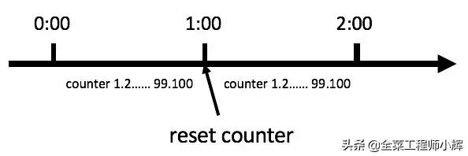

## 计数器限流


### 理论

又称计数器算法。固定时间窗口算法就是统计记录单位时间内进入系统或者某一接口的请求次数，在限定的次数内的请求则正常接收处理，超过次数的请求则拒绝掉或者改为异步处理等限流措施。

时间窗口长度如果为1分钟，如图。



计数器算法

此算法在单机还是分布式环境下实现都非常简单，使用redis的incr原子自增性即可轻松实现。


### 限流实现

```java
package com.cloud.dashboard.limit;

import lombok.Getter;
import lombok.extern.slf4j.Slf4j;

import java.time.Duration;
import java.time.LocalDateTime;
import java.util.HashSet;
import java.util.Set;
import java.util.concurrent.ExecutorService;
import java.util.concurrent.Executors;
import java.util.concurrent.Phaser;
import java.util.concurrent.TimeUnit;
import java.util.concurrent.atomic.AtomicLong;
import java.util.concurrent.atomic.AtomicReferenceFieldUpdater;

/**
 * 计数器限流
 *
 * @author zhangyang
 * @date 2021-05-07
 */
@Slf4j
public class CounterLimit {

    /**
     * 当前时间窗口
     */
    private AtomicReferenceFieldUpdater<CounterLimit, WindowCounter> W =
            AtomicReferenceFieldUpdater.newUpdater(CounterLimit.class, WindowCounter.class, "currentWindow");

    /**
     * 用于表示当前时间窗口，不考虑过期的时间窗口
     */
    private volatile WindowCounter currentWindow;

    /**
     * 窗口间隔时间,以秒为单位
     */
    private Duration interval;

    /**
     * 窗口内的最大请求数量
     */
    private Integer maxCount;


    public CounterLimit(int seconds, Integer maxCount) {
        this.interval = Duration.ofSeconds(seconds);
        this.maxCount = maxCount;
    }

    /**
     * 尝试获取获取计数器
     *
     * @return -1 代表当前时间窗口请求数量已经饱和
     */
    long tryAcquire() {

        for (; ; ) {

            LocalDateTime openTime = LocalDateTime.now();
            LocalDateTime closeTime = openTime.plus(interval);

            if (W.get(this) == null) {
                WindowCounter counter = new WindowCounter(openTime, closeTime, maxCount);
                if (!W.compareAndSet(this, null, counter)) {
                    continue;
                }
            }

            LocalDateTime nowTime = LocalDateTime.now();

            if (!currentWindow.rangeTime(nowTime)) {
                log.info("重置时间窗口");
                W.compareAndSet(this, currentWindow, null);
                continue;
            }

            if (currentWindow.isAllow()) {
                return currentWindow.count();
            }
            return -1;
        }
    }

    /**
     * 窗口计数器
     */
    @Getter
    private static class WindowCounter {

        /**
         * 窗口的开始周期
         */
        private LocalDateTime openTime;

        /**
         * 窗口的结束周期
         */
        private LocalDateTime closeTime;

        /**
         * 时间窗口内的最大请求数量
         */
        private final long maxCount;

        /**
         * 窗口内的请求数量
         */
        private AtomicLong counter = new AtomicLong(0);

        private Set<Thread> windowThreads = new HashSet<>();

        public WindowCounter(LocalDateTime openTime, LocalDateTime closeTime, long maxCount) {
            this.openTime = openTime.withNano(0);
            this.closeTime = closeTime.withNano(0);
            this.maxCount = maxCount;
        }

        public boolean rangeTime(LocalDateTime dateTime) {
            return dateTime.isBefore(closeTime) && dateTime.compareTo(openTime) >= 0;
        }

        public boolean isAllow() {
            return counter.incrementAndGet() <= maxCount;
        }

        public long count() {
            return counter.get();
        }

    }
}

```


### 特点

1. 实现简单。

2. 时间窗口固定，每个窗口开始时计数为零，这样后面的请求不会受到之前的影响，做到了前后请求隔离。

3. 因为两个时间窗口之间没有任何联系，如果调用者可以在一个时间窗口的结束到下一个时间窗口的开始这个非常短的时间段内发起两倍于阈值的请求，会导致流量突增，既 固定窗口时间 无法保证流量的稳定，所以固定时间窗口算法无法限制窗口间突发流量，举个例子：

   假设固定窗口的时间范围  = 1s，一个固定的时间窗口可接受的流量为 1000 QPS，如果在当前时间窗口的最后100ms 流入1000QPS的请求，在下一个窗口的前100ms流入1000QPS的请求，那么短短200ms，就产生了2倍与 固定窗口的 流量，假如系统1s只可以接受1000QPS的流量，那么这 200ms内产生的流量就可能把系统打爆，当然实际也不是这么算的，所以在实际的生产环境中我们一般使用滑动窗口算法来保证某一个窗口期内 始终只可以接受固定QPS的流量或者使用限制总并发数来保证系统的稳定性