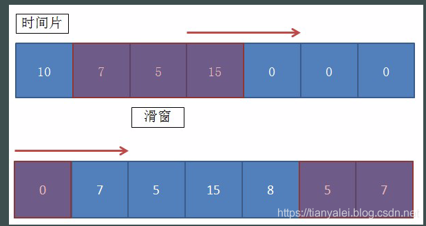

## 滑动窗口算法


### 原理

 滑动时间窗口算法其实是固定时间窗口算法的优化，主要是为了解决固定时间窗口算法无法限制窗口间突发流量的缺点 

滑动窗口的主要原理比较简单，就是将这个单位时间进行拆分，譬如5秒的统计范围，我们将它划分成5个1秒。

当请求进来时，先判断当前请求属于这5个1秒的时间片中的哪个，然后将对应的时间片对应的统计值加1，再判断当前加上前4个时间片的次数总和是否已经超过了设置的阈值。

当时间已经到达第6个时间片时，就把第一个时间片给干掉，因为无论第一片是多少个统计值，它都不会再参与后续的计算了。

就这样，随着时间的推移，统计值就随着各个时间片的滚动，不断地进行统计。

  

具体要将单位时间拆分为多少片，要根据实际情况来决定。当然，毫无疑问的是切分的越小，毛刺现象也越少。系统统计也越准确，随之就是内存占用会越大，因为你的这个窗口的数组会更大。

代码实现思路就是定义好分片数量，每个分片都有一个独立的计数器，所有的分片合计为一个数组。当请求来时，按照分片规则，判断请求应该划分到哪个分片中去。要判断是否超过阈值，就将前N个统计值相加，对比定义的阈值即可。


### 实现

```java
package com.cloud.dashboard.limit;

import java.util.concurrent.atomic.AtomicInteger;

/**
 * 滑动窗口。该窗口同样的key，都是单线程计算。
 *
 * @author wuweifeng wrote on 2019-12-04.
 */
public class SlidingWindow {
    /**
     * 循环队列，就是装多个窗口用，该数量是windowSize的2倍
     */
    private AtomicInteger[] timeSlices;
    /**
     * 队列的总长度
     */
    private int timeSliceSize;
    /**
     * 每个时间片的时长，以毫秒为单位
     */
    private int timeMillisPerSlice;
    /**
     * 共有多少个时间片（即窗口长度）
     */
    private int windowSize;
    /**
     * 在一个完整窗口期内允许通过的最大阈值
     */
    private int threshold;
    /**
     * 该滑窗的起始创建时间，也就是第一个数据
     */
    private long beginTimestamp;
    /**
     * 最后一个数据的时间戳
     */
    private long lastAddTimestamp;


    public SlidingWindow(int duration, int threshold) {
        //超过10分钟的按10分钟
        if (duration > 600) {
            duration = 600;
        }
        //要求5秒内探测出来的，
        if (duration <= 5) {
            this.windowSize = 5;
            this.timeMillisPerSlice = duration * 200;
        } else {
            this.windowSize = 10;
            this.timeMillisPerSlice = duration * 100;
        }
        this.threshold = threshold;
        // 保证存储在至少两个window
        this.timeSliceSize = windowSize * 2;

        reset();
    }

    public SlidingWindow(int timeMillisPerSlice, int windowSize, int threshold) {
        this.timeMillisPerSlice = timeMillisPerSlice;
        this.windowSize = windowSize;
        this.threshold = threshold;
        // 保证存储在至少两个window
        this.timeSliceSize = windowSize * 2;

        reset();
    }

    /**
     * 初始化
     */
    private void reset() {
        System.out.println("调用reset");
        beginTimestamp = SystemClock.now();
        //窗口个数
        AtomicInteger[] localTimeSlices = new AtomicInteger[timeSliceSize];
        for (int i = 0; i < timeSliceSize; i++) {
            localTimeSlices[i] = new AtomicInteger(0);
        }
        timeSlices = localTimeSlices;
    }

    private void print() {
        for (AtomicInteger integer : timeSlices) {
            System.out.print(integer + "-");
        }
    }

    /**
     * 计算当前所在的时间片的位置
     */
    private int locationIndex() {
        long now = SystemClock.now();
        //如果当前的key已经超出一整个时间片了，那么就直接初始化就行了，不用去计算了
        if (now - lastAddTimestamp > timeMillisPerSlice * windowSize) {
            reset();
        }

        // now = 7s beginTimestamp=3s timeMillisPerSlice=1s timeSliceSize=10


        System.out.println("now - beginTimestamp :" + (now - beginTimestamp));

        return (int) (((now - beginTimestamp) / timeMillisPerSlice) % timeSliceSize);
    }

    /**
     * 增加count个数量
     */
    public boolean addCount(int count) {
        //当前自己所在的位置，是哪个小时间窗
        int index = locationIndex();
//        System.out.println("index:" + index);
        //然后清空自己前面windowSize到2*windowSize之间的数据格的数据
        //譬如1秒分4个窗口，那么数组共计8个窗口
        //当前index为5时，就清空6、7、8、1。然后把2、3、4、5的加起来就是该窗口内的总和
        clearFromIndex(index);

        int sum = 0;
        // 在当前时间片里继续+1
        sum += timeSlices[index].addAndGet(count);
        //加上前面几个时间片
        for (int i = 1; i < windowSize; i++) {
            sum += timeSlices[(index - i + timeSliceSize) % timeSliceSize].get();
        }
        System.out.println(sum + "---" + threshold);

        lastAddTimestamp = SystemClock.now();

        return sum >= threshold;
    }

    private void clearFromIndex(int index) {
        for (int i = 1; i <= windowSize; i++) {
            int j = index + i;
            if (j >= windowSize * 2) {
                j -= windowSize * 2;
            }
            timeSlices[j].set(0);
        }
    }


    public static void main(String[] args) {
        //1秒一个时间片，窗口共5个
        SlidingWindow window = new SlidingWindow(100, 4, 8);
        for (int i = 0; i < 20; i++) {
            System.out.println(window.addCount(2));

            window.print();
            System.out.println("--------------------------");
            try {
                Thread.sleep(100);
            } catch (InterruptedException e) {
                e.printStackTrace();
            }
        }
    }
}
```


### 场景

1. 因为窗口顺延，所以可以抵御窗口间突发流量(对比固定时间窗口算法)。
2. 假如限流10万次/小时，如果某个调用者在前10分钟调用了10万次那么他必须再等待1小时才能发起下一次正常请求。所以没有做到前后请求隔离。