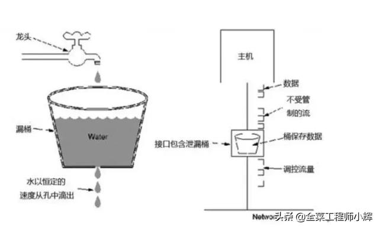

## 漏桶算法

### 特点

漏桶大小固定，处理速度固定，但请求进入速度不固定（在突发情况请求过多时，会丢弃过多的请求)

 漏桶算法其实很简单，可以粗略的认为就是注水漏水过程，往桶中以一定速率流出水，以任意速率流入水，当水超过桶流量则丢弃，因为桶容量是不变的，保证了整体的速率。这个从桶底流出去的水就是系统正常处理的请求，从旁边流出去的水就是系统拒绝掉的请求。 

  

### 实现

 Guava 的 RateLimter 实现

 

### 场景

1、 因为流出的速度是一定的，可以抵御突发流量，做到更加平滑的限流，而且不允许流量突发 