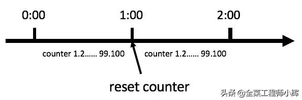
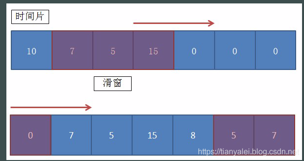
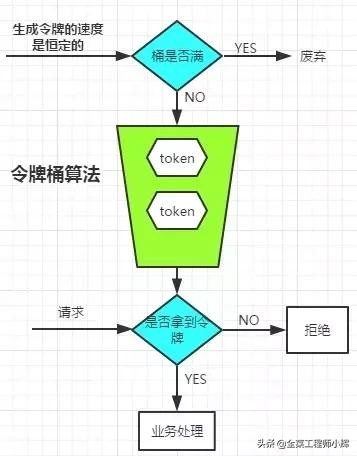

# 限流

## 限制总并发数

### 特点

可以保证某一时间系统的并发总数不得超过某个阈值

### 实现

使用semphare 实现

```java
public class CounterLimit {

    public Semaphore semaphore;

    public CounterLimit(int count, boolean fair) {
        semaphore = new Semaphore(count, fair);
    }

    public void acquire() throws InterruptedException {
        semaphore.acquire();
    }

    public boolean tryAcquire() throws InterruptedException {
        return semaphore.tryAcquire();
    }

    /**
     * 释放许可
     */
    public void relase(){
        semaphore.release();
    }
    
}
```


### 缺点

无法限制资源在某一时间段内的调用次数


## 计数器限流

### 理论

又称计数器算法。固定时间窗口算法就是统计记录单位时间内进入系统或者某一接口的请求次数，在限定的次数内的请求则正常接收处理，超过次数的请求则拒绝掉或者改为异步处理等限流措施。

时间窗口长度如果为1分钟，如图。



计数器算法

此算法在单机还是分布式环境下实现都非常简单，使用redis的incr原子自增性即可轻松实现。


### 限流实现

```java
package com.cloud.dashboard.limit;

import lombok.Getter;
import lombok.extern.slf4j.Slf4j;

import java.time.Duration;
import java.time.LocalDateTime;
import java.util.HashSet;
import java.util.Set;
import java.util.concurrent.ExecutorService;
import java.util.concurrent.Executors;
import java.util.concurrent.Phaser;
import java.util.concurrent.TimeUnit;
import java.util.concurrent.atomic.AtomicLong;
import java.util.concurrent.atomic.AtomicReferenceFieldUpdater;

/**
 * 计数器限流
 *
 * @author zhangyang
 * @date 2021-05-07
 */
@Slf4j
public class CounterLimit {

    /**
     * 当前时间窗口
     */
    private AtomicReferenceFieldUpdater<CounterLimit, WindowCounter> W =
            AtomicReferenceFieldUpdater.newUpdater(CounterLimit.class, WindowCounter.class, "currentWindow");

    /**
     * 用于表示当前时间窗口，不考虑过期的时间窗口
     */
    private volatile WindowCounter currentWindow;

    /**
     * 窗口间隔时间,以秒为单位
     */
    private Duration interval;

    /**
     * 窗口内的最大请求数量
     */
    private Integer maxCount;


    public CounterLimit(int seconds, Integer maxCount) {
        this.interval = Duration.ofSeconds(seconds);
        this.maxCount = maxCount;
    }

    /**
     * 尝试获取获取计数器
     *
     * @return -1 代表当前时间窗口请求数量已经饱和
     */
    long tryAcquire() {

        for (; ; ) {

            LocalDateTime openTime = LocalDateTime.now();
            LocalDateTime closeTime = openTime.plus(interval);

            if (W.get(this) == null) {
                WindowCounter counter = new WindowCounter(openTime, closeTime, maxCount);
                if (!W.compareAndSet(this, null, counter)) {
                    continue;
                }
            }

            LocalDateTime nowTime = LocalDateTime.now();

            if (!currentWindow.rangeTime(nowTime)) {
                log.info("重置时间窗口");
                W.compareAndSet(this, currentWindow, null);
                continue;
            }

            if (currentWindow.isAllow()) {
                return currentWindow.count();
            }
            return -1;
        }
    }

    /**
     * 窗口计数器
     */
    @Getter
    private static class WindowCounter {

        /**
         * 窗口的开始周期
         */
        private LocalDateTime openTime;

        /**
         * 窗口的结束周期
         */
        private LocalDateTime closeTime;

        /**
         * 时间窗口内的最大请求数量
         */
        private final long maxCount;

        /**
         * 窗口内的请求数量
         */
        private AtomicLong counter = new AtomicLong(0);

        private Set<Thread> windowThreads = new HashSet<>();

        public WindowCounter(LocalDateTime openTime, LocalDateTime closeTime, long maxCount) {
            this.openTime = openTime.withNano(0);
            this.closeTime = closeTime.withNano(0);
            this.maxCount = maxCount;
        }

        public boolean rangeTime(LocalDateTime dateTime) {
            return dateTime.isBefore(closeTime) && dateTime.compareTo(openTime) >= 0;
        }

        public boolean isAllow() {
            return counter.incrementAndGet() <= maxCount;
        }

        public long count() {
            return counter.get();
        }

    }
}

```


### 特点

1. 实现简单。

2. 时间窗口固定，每个窗口开始时计数为零，这样后面的请求不会受到之前的影响，做到了前后请求隔离。

3. 因为两个时间窗口之间没有任何联系，如果调用者可以在一个时间窗口的结束到下一个时间窗口的开始这个非常短的时间段内发起两倍于阈值的请求，会导致流量突增，既 固定窗口时间 无法保证流量的稳定，所以固定时间窗口算法无法限制窗口间突发流量，举个例子：

   假设固定窗口的时间范围  = 1s，一个固定的时间窗口可接受的流量为 1000 QPS，如果在当前时间窗口的最后100ms 流入1000QPS的请求，在下一个窗口的前100ms流入1000QPS的请求，那么短短200ms，就产生了2倍与 固定窗口的 流量，假如系统1s只可以接受1000QPS的流量，那么这 200ms内产生的流量就可能把系统打爆，当然实际也不是这么算的，所以在实际的生产环境中我们一般使用滑动窗口算法来保证某一个窗口期内 始终只可以接受固定QPS的流量或者使用限制总并发数来保证系统的稳定性


## 滑动窗口算法

### 原理

 滑动时间窗口算法其实是固定时间窗口算法的优化，主要是为了解决固定时间窗口算法无法限制窗口间突发流量的缺点 

滑动窗口的主要原理比较简单，就是将这个单位时间进行拆分，譬如5秒的统计范围，我们将它划分成5个1秒。

当请求进来时，先判断当前请求属于这5个1秒的时间片中的哪个，然后将对应的时间片对应的统计值加1，再判断当前加上前4个时间片的次数总和是否已经超过了设置的阈值。

当时间已经到达第6个时间片时，就把第一个时间片给干掉，因为无论第一片是多少个统计值，它都不会再参与后续的计算了。

就这样，随着时间的推移，统计值就随着各个时间片的滚动，不断地进行统计。

  

具体要将单位时间拆分为多少片，要根据实际情况来决定。当然，毫无疑问的是切分的越小，毛刺现象也越少。系统统计也越准确，随之就是内存占用会越大，因为你的这个窗口的数组会更大。

代码实现思路就是定义好分片数量，每个分片都有一个独立的计数器，所有的分片合计为一个数组。当请求来时，按照分片规则，判断请求应该划分到哪个分片中去。要判断是否超过阈值，就将前N个统计值相加，对比定义的阈值即可。


### 实现

```java
package com.cloud.dashboard.limit;

import java.util.concurrent.atomic.AtomicInteger;

/**
 * 滑动窗口。该窗口同样的key，都是单线程计算。
 *
 * @author wuweifeng wrote on 2019-12-04.
 */
public class SlidingWindow {
    /**
     * 循环队列，就是装多个窗口用，该数量是windowSize的2倍
     */
    private AtomicInteger[] timeSlices;
    /**
     * 队列的总长度
     */
    private int timeSliceSize;
    /**
     * 每个时间片的时长，以毫秒为单位
     */
    private int timeMillisPerSlice;
    /**
     * 共有多少个时间片（即窗口长度）
     */
    private int windowSize;
    /**
     * 在一个完整窗口期内允许通过的最大阈值
     */
    private int threshold;
    /**
     * 该滑窗的起始创建时间，也就是第一个数据
     */
    private long beginTimestamp;
    /**
     * 最后一个数据的时间戳
     */
    private long lastAddTimestamp;


    public SlidingWindow(int duration, int threshold) {
        //超过10分钟的按10分钟
        if (duration > 600) {
            duration = 600;
        }
        //要求5秒内探测出来的，
        if (duration <= 5) {
            this.windowSize = 5;
            this.timeMillisPerSlice = duration * 200;
        } else {
            this.windowSize = 10;
            this.timeMillisPerSlice = duration * 100;
        }
        this.threshold = threshold;
        // 保证存储在至少两个window
        this.timeSliceSize = windowSize * 2;

        reset();
    }

    public SlidingWindow(int timeMillisPerSlice, int windowSize, int threshold) {
        this.timeMillisPerSlice = timeMillisPerSlice;
        this.windowSize = windowSize;
        this.threshold = threshold;
        // 保证存储在至少两个window
        this.timeSliceSize = windowSize * 2;

        reset();
    }

    /**
     * 初始化
     */
    private void reset() {
        System.out.println("调用reset");
        beginTimestamp = SystemClock.now();
        //窗口个数
        AtomicInteger[] localTimeSlices = new AtomicInteger[timeSliceSize];
        for (int i = 0; i < timeSliceSize; i++) {
            localTimeSlices[i] = new AtomicInteger(0);
        }
        timeSlices = localTimeSlices;
    }

    private void print() {
        for (AtomicInteger integer : timeSlices) {
            System.out.print(integer + "-");
        }
    }

    /**
     * 计算当前所在的时间片的位置
     */
    private int locationIndex() {
        long now = SystemClock.now();
        //如果当前的key已经超出一整个时间片了，那么就直接初始化就行了，不用去计算了
        if (now - lastAddTimestamp > timeMillisPerSlice * windowSize) {
            reset();
        }

        // now = 7s beginTimestamp=3s timeMillisPerSlice=1s timeSliceSize=10


        System.out.println("now - beginTimestamp :" + (now - beginTimestamp));

        return (int) (((now - beginTimestamp) / timeMillisPerSlice) % timeSliceSize);
    }

    /**
     * 增加count个数量
     */
    public boolean addCount(int count) {
        //当前自己所在的位置，是哪个小时间窗
        int index = locationIndex();
//        System.out.println("index:" + index);
        //然后清空自己前面windowSize到2*windowSize之间的数据格的数据
        //譬如1秒分4个窗口，那么数组共计8个窗口
        //当前index为5时，就清空6、7、8、1。然后把2、3、4、5的加起来就是该窗口内的总和
        clearFromIndex(index);

        int sum = 0;
        // 在当前时间片里继续+1
        sum += timeSlices[index].addAndGet(count);
        //加上前面几个时间片
        for (int i = 1; i < windowSize; i++) {
            sum += timeSlices[(index - i + timeSliceSize) % timeSliceSize].get();
        }
        System.out.println(sum + "---" + threshold);

        lastAddTimestamp = SystemClock.now();

        return sum >= threshold;
    }

    private void clearFromIndex(int index) {
        for (int i = 1; i <= windowSize; i++) {
            int j = index + i;
            if (j >= windowSize * 2) {
                j -= windowSize * 2;
            }
            timeSlices[j].set(0);
        }
    }


    public static void main(String[] args) {
        //1秒一个时间片，窗口共5个
        SlidingWindow window = new SlidingWindow(100, 4, 8);
        for (int i = 0; i < 20; i++) {
            System.out.println(window.addCount(2));

            window.print();
            System.out.println("--------------------------");
            try {
                Thread.sleep(100);
            } catch (InterruptedException e) {
                e.printStackTrace();
            }
        }
    }
}
```

### 场景

1. 因为窗口顺延，所以可以抵御窗口间突发流量(对比固定时间窗口算法)。
2. 假如限流10万次/小时，如果某个调用者在前10分钟调用了10万次那么他必须再等待1小时才能发起下一次正常请求。所以没有做到前后请求隔离。


## 漏桶算法

### 特点

漏桶大小固定，处理速度固定，但请求进入速度不固定（在突发情况请求过多时，会丢弃过多的请求)

 漏桶算法其实很简单，可以粗略的认为就是注水漏水过程，往桶中以一定速率流出水，以任意速率流入水，当水超过桶流量则丢弃，因为桶容量是不变的，保证了整体的速率。这个从桶底流出去的水就是系统正常处理的请求，从旁边流出去的水就是系统拒绝掉的请求。 

  

### 实现

 Guava 的 RateLimter 实现

 

### 场景

1、 因为流出的速度是一定的，可以抵御突发流量，做到更加平滑的限流，而且不允许流量突发 


## 令牌桶算法

### 特点

令牌桶算法是比较常见的限流算法之一，Google开源项目Guava中的RateLimiter使用的就是令牌桶算法。流程如下：

1. 所有的请求在处理之前都需要拿到一个可用的令牌才会被处理。
2. 根据限流大小，设置按照一定的速率往桶里添加令牌。
3. 桶设置最大的放置令牌限制，当桶满时、新添加的令牌就被丢弃或者拒绝。
4. 请求到达后首先要获取令牌桶中的令牌，拿着令牌才可以进行其他的业务逻辑，处理完业务逻辑之后，将令牌直接删除。



令牌桶算法

单机伪代码如下，分布式环境可以使用Redisson。

```
class TokenBucketDemo { public long timeStamp = getNowTime(); public int capacity; // 桶的容量 public int rate; // 令牌放入速度 public int tokens; // 当前令牌数量 public boolean grant() { long now = getNowTime(); // 先添加令牌 tokens = min(capacity, tokens + (now - timeStamp) * rate); timeStamp = now; if (tokens < 1) { // 若桶中没有令牌,则拒绝 return false; } else { // 还有令牌，领取令牌 tokens -= 1; return true; } }}
```

### 实现

Guava 的 RateLimter 的实现

### 场景

1. 可以抵御突发流量，因为桶内的令牌数不会超过给定的最大值
2. 可以做到更加平滑的限流，因为令牌是匀速放入的。
3. 令牌桶算法允许流量一定程度的突发。(相比漏桶算法)

在时间点刷新的临界点上，只要剩余token足够，令牌桶算法会允许对应数量的请求通过，而后刷新时间因为token不足，流量也会被限制在外，这样就比较好的控制了瞬时流量。因此，令牌桶算法也被广泛使用。


### Redis + Lua 实现限流

