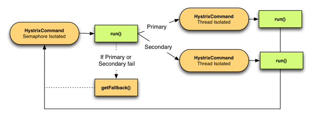

# Hystrix

 在分布式系统中，每个服务都可能会调用很多其他服务，被调用的那些服务就是依赖服务，我们无法保证下层被依赖服务永远不出现故障。当下层某个服务出现故障，就有可能出现下图中的雪崩现象，导致整个服务不可用。 

  

Hystrix 可以让我们在分布式系统中对服务间的调用进行控制，加入一些调用延迟或者依赖故障的容错机制。

Hystrix 通过将依赖服务进行资源隔离，进而阻止某个依赖服务出现故障时在整个系统所有的依赖服务调用中进行蔓延；同时Hystrix 还提供故障时的 fallback 机制。

## Hystrix 工作流程

Hystrix 的设计目标：

- 资源隔离
- 熔断器
- 对来自依赖的延迟和故障进行防护和控制——这些依赖通常都是通过网络访问的
- 阻止故障的连锁反应
- 快速失败并迅速恢复
- 回退并优雅降级
- 提供近实时的监控与告警


Hystrix 遵循的设计原则：

- 防止任何单独的依赖耗尽资源（线程）
- 过载立即切断并快速失败，防止排队
- 尽可能提供回退以保护用户免受故障
- 使用隔离技术（例如隔板，泳道和断路器模式）来限制任何一个依赖的影响
- 通过近实时的指标，监控和告警，确保故障被及时发现
- 通过动态修改配置属性，确保故障及时恢复
- 防止整个依赖客户端执行失败，而不仅仅是网络通信


Hystrix如何实现这些设计目标？

- 使用命令模式将所有对外部服务（或依赖关系）的调用包装在HystrixCommand或HystrixObservableCommand对象中，并将该对象放在单独的线程中执行；
- 每个依赖都维护着一个线程池（或信号量），线程池被耗尽则拒绝请求（而不是让请求排队）。
- 记录请求成功，失败，超时和线程拒绝。
- 服务错误百分比超过了阈值，熔断器开关自动打开，一段时间内停止对该服务的所有请求。
- 请求失败，被拒绝，超时或熔断时执行降级逻辑。
- 近实时地监控指标和配置的修改。


### Hystrix 工作流程图

官方流程图如下：

  

1. 构造一个 HystrixCommand或HystrixObservableCommand对象，用于封装请求，并在构造方法配置请求被执行需要的参数；
2. 执行命令，Hystrix提供了4种执行命令的方法，后面详述；
3. 判断是否使用缓存响应请求，若启用了缓存，且缓存可用，直接使用缓存响应请求。Hystrix支持请求缓存，但需要用户自定义启动；
4. 判断熔断器是否打开，如果打开，跳到第8步；
5. 判断线程池/队列/信号量是否已满，已满则跳到第8步；
6. 执行HystrixObservableCommand.construct()或HystrixCommand.run()，如果执行失败或者超时，跳到第8步；否则，跳到第9步；
7. 统计熔断器监控指标；
8. 走Fallback备用逻辑
9. 返回请求响应


 下图简单罗列的一个请求（即我们包装的**Command**）在Hystrix内部被执行的关键过程：

  

1. 构建Hystrix的Command对象, 调用执行方法.
2. Hystrix检查当前服务的熔断器开关是否开启, 若开启, 则执行降级服务getFallback方法.
3. 若熔断器开关关闭, 则Hystrix检查当前服务的线程池是否能接收新的请求, 若超过线程池已满, 则执行降级服务getFallback方法.
4. 若线程池接受请求, 则Hystrix开始执行服务调用具体逻辑run方法.
5. 若服务执行失败, 则执行降级服务getFallback方法, 并将执行结果上报Metrics更新服务健康状况.
6. 若服务执行超时, 则执行降级服务getFallback方法, 并将执行结果上报Metrics更新服务健康状况.
7. 若服务执行成功, 返回正常结果.
8. 若服务降级方法getFallback执行成功, 则返回降级结果.
9. 若服务降级方法getFallback执行失败, 则抛出异常.


## 资源隔离

 货船为了进行防止漏水和火灾的扩散,会将货仓分隔为多个, 如下图所示: 

  

 这种资源隔离减少风险的方式被称为:Bulkheads(舱壁隔离模式)，Hystrix将同样的模式运用到了服务调用者上. 

在RPC调用过程中，使用舱壁模式可以保护有限的系统资源不被耗尽。在一个基于微服务的应用程序中，通常需要调用多个服务提供者的接口，才能完成一个特定任务。不使用舱壁模式，所有的RPC调用都从同一个线程池中获取线性，一个具体的实例如图5-4所示。在该实例中，服务提供者Provider A对依赖的Provider B、Provider C、Provider D的所有RPC调用，都从公共的线程池获取线程


在高服务器请求的情况下，对某个性能较低的服务提供者的RPC调用很容易“霸占”整个公共的RPC线程池，对其他性能正常的服务提供者的RPC调用，往往需要等待线程资源的释放。最后，整个WEB容器（Tomcat）会崩溃。现在假定Provider A的RPC线程个数为1000，而并发量非常大，其中有500个线程来执行Provider B的RPC调用，如果Provider B不小心宕机了，那么这500个线程都会超时，此时剩下的服务Provider C、Provider D总共可用的线程为500个，随着并发量的增大，剩余的500个线程估计也会被Provider B的RPC耗尽，然后Provider A进入瘫痪，最后导致整个系统的所有服务都不可用，这就是服务的雪崩效应

为了最大限度地减少的Provider之间的相互影响，一个很好的做法是：对于不同的服务提供者，可以设置不同的RPC调用线程池；让不同RPC通过专门的线程池请求到各自的Provider服务提供者，像舱壁一样对Provider进行隔离。对于不同的服务提供者设置不同的RPC调用线程池，这种模式叫做舱壁模式，具体如图所示


使用舱壁避，可以避免对单个Provider的RPC消耗掉所有资源，从而防止由于某一个服务性能底而引起的级联故障和雪崩效应。在Provider A中，假定对服务Provider B的RPC调用分配专门的线程池叫做Thread Pool B，其中有 10个线程，只要对Provider B的RPC并发量超过了10，后续的RPC就走降级服务，就算服务Provider B挂了，最多也就导致Thread Pool B不可用，而不会影响系统中的对其他服务的RPC


一般来说，RPC线程与WEB容器的IO线程，也是需要隔离的。在如图5-6所示中，当Provider A的用户请求涉及到Provider B和Provider C的RPC的时候，Provider A的IO线程会将任务交给对应的RPC线程池里面的RPC线程来执行，Provider A的IO线程就可以去干别的事情去了，当RPC线程执行完远程调用的任务之后，就会将调用的结果返回给IO线程。如果RPC线程池耗尽了，IO线程池也不会受到影响， 从而实现RPC线程与WEB容器的IO线程的相互隔离。


Hystrix为我们提供了两种RPC隔离方式：线程池隔离模式与信号量模式


### 线程池隔离

Hystrix 通过为每一组Command 配置公用的线程池，这样可以剥离开rpc线程与web io线程，不会因为 rpc 占用web io 线程导致系统吞吐量降低，并且会把我们的业务请求封装成一个命令交给特定的与之关联的线程池进行处理，这样为不同的command 使用不同的执行资源


**尽管线程池提供了线程隔离，我们的客户端底层代码也必须要有超时设置，不能无限制的阻塞以致线程池一直饱和**


#### 线程池隔离的优点：

1、应用程序会被完全保护起来，即使依赖的一个服务的线程池满了，也不会影响到应用程序的其他部分 

2、 我们给应用程序引入一个新的风险较低的客户端lib的时候，如果发生问题，也是在本lib中，并不会影响到其他内容，因此我们可以大胆的引入新lib库 

3、 当依赖的一个失败的服务恢复正常时，应用程序会立即恢复正常的性能 

4、 如果我们的应用程序一些参数配置错误了，线程池的运行状况将会很快显示出来，比如延迟、超时、拒绝等。同时可以通过动态属性实时执行来处理纠正错误的参数配置 

5、 如果服务的性能有变化，从而需要调整，比如增加或者减少超时时间，更改重试次数，就可以通过线程池指标动态属性修改，而且不会影响到其他调用请求 

6、 除了隔离优势外，hystrix拥有专门的线程池可提供内置的并发功能，使得可以在同步调用之上构建异步的外观模式，这样就可以很方便的做异步编程（Hystrix引入了Rxjava异步框架） 


#### 缺点：

1、 线程池的主要缺点就是它增加了计算的开销，每个业务请求（被包装成命令）在执行的时候，会涉及到请求排队，调度和上下文切换。不过Netflix公司内部认为线程隔离开销足够小，不会产生重大的成本或性能的影响 


### 信号量隔离

​     除了使用线程池进行资源隔离之外，Hystrix还可以使用信号量机制完成的资源隔离。信号量所起到的作用，就像一个开关，而信号量的值就是每个命令的并发执行数量，当并发数高于信号量的值时，就不再执行命令。比如，如果Provider A的RPC信号量大小为10，那么它同时只允许有10个RPC线程来访问服务Provider A，其他的请求都会被拒绝，从而达到资源隔离和限流保护的作用。 

​    Hystrix信号量机制不提供专用的线程池，也不提供额外的线程，在获取到信号量之后，执行HystrixCommand命令逻辑的线程，还是之前WEB容器的IO线程。

 信号量可以细分为run执行信号量和fallback回退信号量。 

IO线程在执行HystrixCommand命令之前，需要抢到run执行信号量，成功之后才允许执行HystrixCommand.run( )方法。如果争抢失败，就准备回退，但是在执行HystrixCommand.getFallback( )回退方法之前，还需要争抢fallback回退信号量，成功之后才允许执行HystrixCommand.getFallback( )回退方法。如果都获取失败，则操作直接终止。

 在如图5-9所示的例子中，假设有5个WEB容器的IO线程并发进行RPC远程调用，但是执行信号量的大小为3，也就是只有3个IO线程能够真正的抢到run执行信号量，这些线程才能发起RPC调用。剩下的2个IO线程准备回退，去抢fallback回退信号量，争抢成功后执行HystrixCommand.getFallback () 回退方法。


### 线程池与信号量对比


## Command

 Hystrix包装需降级的业务逻辑采用的是Command设计模式，我们知道，命令模式主要是将请求封装到对象内部，让我们使用对象一样来使用请求。这样对Hystrix大有好处，因为你需要降级的业务逻辑和数据已经封装成一个Command对象交给Hystrix了，Hystrix直接来接管业务逻辑的执行权，该何时调用，或者甚至不调用都可以，我们来看看Hystrix定义的命令接口（实际是抽象类，这里已简化）： 

```java
public abstract class HystrixCommand<R> {
 
	protected abstract R run() throws Exception;
 
	protected R getFallback() {
		throw new UnsupportedOperationException("No fallback available.");
	}
	
	public R execute() {
	    try {
	        return queue().get();
	    } catch (Exception e) {
	        throw Exceptions.sneakyThrow(decomposeException(e));
	    }
	}
	
	public Future<R> queue() {
	    ... 太长了，略 ...
	}
	
}
```

我们需要自行 实现run 方法，将我们需要执行的业务逻辑包裹在 run方法中中，

Hystrix 分为两个基本的Command，分别为HystrixCommand 与 HyrtixObservbleCommand ，前者可为异步或者阻塞，后者只支持异步模式, 如下：

HystrixCommand用在依赖服务返回单个操作结果的时候。又两种执行方式

- execute():同步执行。从依赖的服务返回一个单一的结果对象，或是在发生错误的时候抛出异常。
- queue();异步执行。直接返回一个Future对象，其中包含了服务执行结束时要返回的单一结果对象。

　　　　

HystrixObservableCommand 用在依赖服务返回多个操作结果的时候。它也实现了两种执行方式

- observe():返回Obervable对象，他代表了操作的多个结果，他是一个HotObservable
- toObservable():同样返回Observable对象，也代表了操作多个结果，但它返回的是一个Cold Observable。


### AbstractCommand

我们可以看到在Abstract 中 初始化了 group、自定义的降级逻辑、降级策略等等，大部门的执行逻辑都是交给AbstractCommand来执行的 

```java
protected AbstractCommand(HystrixCommandGroupKey group, HystrixCommandKey key, HystrixThreadPoolKey threadPoolKey,
                          HystrixCircuitBreaker circuitBreaker, HystrixThreadPool threadPool,
                          HystrixCommandProperties.Setter commandPropertiesDefaults, HystrixThreadPoolProperties.Setter threadPoolPropertiesDefaults,
                          HystrixCommandMetrics metrics, TryableSemaphore fallbackSemaphore, TryableSemaphore executionSemaphore,
                          HystrixPropertiesStrategy propertiesStrategy, HystrixCommandExecutionHook executionHook) {

    //初始化group，group主要是用来对不同的command key进行统一管理
    this.commandGroup = initGroupKey(group);

    //command key，用来标识降级逻辑
    this.commandKey = initCommandKey(key, getClass());

    // 初始化自定义的降级策略
    this.properties = initCommandProperties(this.commandKey, propertiesStrategy, commandPropertiesDefaults);

    // 初始化线程池key，相同的线程池key将公用线程池
    this.threadPoolKey = initThreadPoolKey(threadPoolKey, this.commandGroup, this.properties.executionIsolationThreadPoolKeyOverride().get());

    // 初始化监控器
    this.metrics = initMetrics(metrics, this.commandGroup, this.threadPoolKey, this.commandKey, this.properties);

    // 初始化断路器
    this.circuitBreaker = initCircuitBreaker(this.properties.circuitBreakerEnabled().get(), circuitBreaker, this.commandGroup, this.commandKey, this.properties, this.metrics);

    // 初始化线程池
    this.threadPool = initThreadPool(threadPool, this.threadPoolKey, threadPoolPropertiesDefaults);

    ......
}
```

Hystrix 的所有的核心逻辑都由AbstractCommand（即HystrixCommand的父类，HystrixCommand**只是对**AbstractCommand进行了简单包装）抽象类串起来，从功能上来说，AbstractCommand必须将如下功能联系起来：

  


### Command 调用方式

Command 调用方式支持四种，其中HystrixObservbleCommand 支支持异步的observble() 与 toObservble 方法


execute

HystrixCommand的execute( )方法以同步堵塞方式执行run( )。一旦开始执行该命令，当前线程会阻塞，直到该命令返回结果，然后才能继续执行下面的逻辑


queue( )方法 

HystrixCommand的queue( )方法以异步非阻塞方式执行run( )方法，该方法直接返回一个Future对象。可通过Future.get( )拿到run( )的返回结果，但Future.get( )是阻塞执行的


observe( )方法

HystrixCommand的observe( )方法会返回一个响应式编程Observable主题。可以为该主题对象注册上Subscriber观察者回调实例，或者注册上Action1不完全回调实例来响应式处理命令的执行结果。 不管下游是否由订阅者，都会执行命令内部逻辑，当有下游调用者调用时间，会返回调用结果


toObservable( )方法 

HystrixCommand的toObservable( )方法也会返回一个响应式编程Observable主题。同样可以为该主题对象注册上Subscriber观察者回调实例，或者注册上Action1 不完全回调实例，来响应式处理命令的执行结果。不过，和observe( )返回的主题不同，Observable主题返回的是冷主题，并且只能被订阅一次。 


> 什么是cold Observable（冷主题）？
>
> 就是在进行主题获取的时候，不会立即触发执行。只有在观察者订阅时，才会执行内部的HystrixCommand命令的run( )方法。 
>
> 对比起来，toObservable( )方法和observe( )方法之间的区别如下： 
>
> （1）observe( )和toObservable( )虽然都返回了Observable主题，但是observe( )返回的是热主题(hot Observable)，toObservable( )返回的是冷主题。 
>
> （2）observe( )返回的主题可以被多次订阅，而toObservable( )返回的主题只能被单次订阅。 
>
>  在使用 @HystrixCommand注解时，observe( )方法对应的执行模式为EAGER，toObservable( )方法对应的执行模式为LAZY，具体如下：
>
> ```
> //此注解，使用observe() 方法来获取主题 
> @HystrixCommand(observableExecutionMode = ObservableExecutionMode.EAGER) 
> //此注解，使用toObservable()方法来获取冷主题 
> @HystrixCommand(observableExecutionMode = ObservableExecutionMode.LAZY) 
> ```


Hystrix内部总是以Observable的形式作为响应式的调用，不同执行命令方法只是进行了相应Observable转换。Hystrix的核心类HystrixCommand尽管只返回单个结果，但也确实是基于RxJava的Observable主题类实现的

获取HystrixCommand命令的结果，可以使用execute( )、queue( )、observe( )和toObservable( )四个方法，实质上，四种方法之间的关系如图5-2所示


execute( )、queue( )、observe( )和toObservable( )四种方法的之间的调用关系具体如下： 

- toObservable( )返回一个冷主题，订阅者可以进行结果订阅。
- observe( )首先调用toObservable( )获得一个冷主题，再创建一个ReplaySubject重复主题去订阅该冷主题，然后将重复主题转化为热主题。所以，因此调用observe()会自动触发执行run()/construct( )方法
- queue( )调用了toObservable( ).toBlocking( ).toFuture( )。详细来说，queue( )首先是通过toObservable( )来获得一个冷主题，然后通过toBlocking( )将该冷主题转换成BlockingObservable阻塞主题，该主题可以把数据以阻塞的方式发出来，最后通过toFuture方法是把BlockingObservable阻塞主题转换成一个Future异步回调实例，并且返回该Future实例。但是，queue() 自身并不会阻塞，消费者可以自己决定如何处理Future的异步回调操作
- execute( )是调用了queue( ).get( )，阻塞消费者的线程，同步获取Future异步回调实例的结果


除了定义了HystrixCommand这个具备同步获取结果的命令处理器之外， Hystrix还定义了另一个只具备响应式编程能力的命令处理器 HystrixObservableCommand，该命令没有实现execute( )、queue( )两种方法，仅仅实现了observe( )和toObservable( )两种方法，具体如图5-3所示


### Command 注意点：

因为Command对象是有状态的（比如每次请求参数可能不同），所以每次请求都需要新创建Command，这么多初始化工作，如果并发量过高，会不会带来过大的系统开销？其实构造函数中的很多初始化工作只会集中在创建第一个Command时来做，后续创建的Command对象主要是从静态Map中取对应的实例来赋值，比如监控器、断路器和线程池的初始化，因为相同的Command的command key和线程池key都是一致的，在HystrixCommandMetrics、HystrixCircuitBreaker.Factory、HystrixThreadPool中会分别有如下静态属性：

```java
private static final ConcurrentHashMap<String, HystrixCommandMetrics> metrics = new ConcurrentHashMap<String, HystrixCommandMetrics>();
 
private static ConcurrentHashMap<String, HystrixCircuitBreaker> circuitBreakersByCommand = new ConcurrentHashMap<String, HystrixCircuitBreaker>();
 
final static ConcurrentHashMap<String, HystrixThreadPool> threadPools = new ConcurrentHashMap<String, HystrixThreadPool>();
```

 可见所有Command对象都可以在这里找到自己对应的资源实例。 

## 请求缓存


## 请求合并


Hystrix请求命令 HystrixCommand、HystrixObservableCommand


## Hystrix 配置

我们一般可以通过两种方式来为我们自定义的命令进行 配置，一种是直接在@HystrixCommand 注解中进行配置，另一种是在我们继承HystrixCommand 类之后，传入的 HystrixCommand.Setter 实例。

Hystrix 的命令配置由以下几个配置类组成：

- HystrixComandGroupKey：设置该命令的分组

- HystrixCommandKey：设置该命令的名称
- HystrxCommandProperties：与命令执行相关的一些属性集、包括降级设置、断路器的配置、隔离策略、以及一些监控指标配置项等
- HystrixThreadPoolProperties：与线程池相关的一些属性集，包括线程池大小、排队队列的大小等。

我们可以通过HystrixCommand.Setter配置实例，整体设置一些其他的属性集合。


其中每个命令必须要配置的包括以下三个基本配置项： 

- CommandKey：该命令的名称。 
- GroupKey：该命令属于哪一个组，以帮助我们更好的组织命令。 
- ThreadPoolKey：该命令所属线程池的名称，相同的线程池名称会共享同一线程池，若不做配置，会默认使用GroupKey作为线程池名称。（如果使用线程池隔离模式的话）
- executionIsolationStrategy：设置当前命令使用哪一种隔离模式（默认为线程池隔离模式）


### 配置代码

Hystrix 的配置类代码 分为Commn 与 ThreadPoolProperties，如下所示：

common 通用配置代码：

````java
        private Boolean circuitBreakerEnabled = null;
        private Integer circuitBreakerErrorThresholdPercentage = null;
        private Boolean circuitBreakerForceClosed = null;
        private Boolean circuitBreakerForceOpen = null;
        private Integer circuitBreakerRequestVolumeThreshold = null;
        private Integer circuitBreakerSleepWindowInMilliseconds = null;
        private Integer executionIsolationSemaphoreMaxConcurrentRequests = null;
        private ExecutionIsolationStrategy executionIsolationStrategy = null;
        private Boolean executionIsolationThreadInterruptOnTimeout = null;
        private Boolean executionIsolationThreadInterruptOnFutureCancel = null;
        private Integer executionTimeoutInMilliseconds = null;
        private Boolean executionTimeoutEnabled = null;
        private Integer fallbackIsolationSemaphoreMaxConcurrentRequests = null;
        private Boolean fallbackEnabled = null;
        private Integer metricsHealthSnapshotIntervalInMilliseconds = null;
        private Integer metricsRollingPercentileBucketSize = null;
        private Boolean metricsRollingPercentileEnabled = null;
        private Integer metricsRollingPercentileWindowInMilliseconds = null;
        private Integer metricsRollingPercentileWindowBuckets = null;
        /* null means it hasn't been overridden */
        private Integer metricsRollingStatisticalWindowInMilliseconds = null;
        private Integer metricsRollingStatisticalWindowBuckets = null;
        private Boolean requestCacheEnabled = null;
        private Boolean requestLogEnabled = null;
````


threadPool 配置代码：

```java
 	    private Integer coreSize = null;
        private Integer maximumSize = null;
        private Integer keepAliveTimeMinutes = null;
        private Integer maxQueueSize = null;
        private Integer queueSizeRejectionThreshold = null;
        private Boolean allowMaximumSizeToDivergeFromCoreSize = null;
        private Integer rollingStatisticalWindowInMilliseconds = null;
        private Integer rollingStatisticalWindowBuckets = null;
```


### Hystrix 基本配置

- executionIsolationStrategy 

  设置当前的Command 的隔离策略，默认为线程池隔离策略

- executionTimeoutEnabled 

  是否开启超时设置

- executionTimeoutInMilliseconds 

  执行的超时时间，默认为 1000 ms

- executionIsolationThreadInterruptOnTimeout 

  发生超时后是否中断方法的执行，默认值为true 

- executionIsolationThreadInterruptOnFutureCancel 

  当调用Future.cannel() 时，是否中断方法的执行，默认为true

- fallbackEnabled 


### Hystrix 信号量配置

- withExecutionIsolationSemaphoreMaxConcurrentRequests

  此方法设置当使用执行信号量的大小，也就是HystrixCommand.run( )方法允许的最大请求数。如果达到最大请求数时，后续的请求会被拒绝。

- withFallbackIsolationSemaphoreMaxConcurrentRequests

  此方法设置当使用回退信号量的大小，也就是HystrixCommand.getFallback() 方法允许的最大请求数。如果达到最大请求数时，后续的回退请求会被拒绝。

  

### Hystrix 线程池配置

- coreSize 

  设置线程池核心线程数

- maximumSize

  设置线程池最大线程数

- keepAliveTimeMinutes

  设置线程可同线时间

-  maxQueueSize

  设置队列的最大常速

- queueSizeRejectionThreshold;

  线程池拒绝的因为

-  allowMaximumSizeToDivergeFromCoreSize;

  线程池maximumSize最大线程数是否生效

- rollingStatisticalWindowInMilliseconds;

-  rollingStatisticalWindowBuckets;


### Hystrix 统计配置

- withMetricsRollingStatisticalWindowBuckets

  可统计的滑动窗口内的buckets数量,用于熔断器和指标发布

- withMetricsRollingStatisticalWindowBuckets

  可统计的滑动窗口的时间长度，这段时间内的执行数据用于熔断器和指标发布

- hystrix.command.default.metrics.rollingPercentile.enabled

  该配置项用于设置百分比命令执行时间统计窗口是否生效，命令的执行时间是否被跟踪，并且计算各个百分比如 1%、10%、50%、90%、99.5% 等的平均时间。该配置项默认为true 

- hystrix.command.default.metrics.rollingPercentile.timeInMilliseconds

  设置百分比命令执行时间统计窗口的持续时间（以毫秒为单位），默认值为 60000 毫秒，当然，此滑动窗口也会被进一步细分为时间桶（bucket），以便提高统计的效率
  
- hystrix.command.default.metrics.rollingPercentile.numBuckets

  设置百分比命令执行时间统计窗口被划分的时间桶（bucket）的数量，默认值为 6。此滑动窗口的默认持续时间为默认的 60000 毫秒，默认情况下，一个 时间桶（bucket）的时间即 10 秒。如果要做定制化的配置，此窗口所设置的numBuckets （时间桶数量）值和timeInMilliseconds （滑动窗口时长）值有关联关系，必须符合timeInMilliseconds（滑动窗口时长）% numberBuckets == 0 的规则，否则将抛出异常。

- hystrix.command.default.metrics.rollingPercentile.bucketSize

  设置百分比命令执行时间统计窗口的时间桶（bucket）内最大的统计次数，如果bucketSize为 100，而桶的时长为1秒，若这1秒里有500次执行，则只有最后100次执行的信息会被统计到桶里去。增加此配置项的值，会导致内存开销及其他计算开销的上升，该配置项的默认值为 100。

- 

  


### Hystrix 断路器配置

- hystrix.command.default.circuitBreaker.enabled

  该配置用来确定是否启用断路器，默认值为true

- hystrix.command.default.circuitBreaker.errorThresholdPercentage 

  该配置用于设置错误率阈值，当健康统计滑动窗口的错误率超过此值时，断路器进入open开启状态，所有请求都会触发失败回退（fallback），错误率阈值百分比的默认值为50

- circuitBreakerForceClosed

  是否强制关闭断路器

- hystrix.command.default.circuitBreaker.forceOpen 

  如果配置为true，断路器将被强制打开，所有请求将被触发失败回退（fallback）。此配置的默认值为false。 

- hystrix.command.default.circuitBreaker.requestVolumeThreshold 

  该配置用于设置断路器触发熔断的最少请求次数。如果设为20，那么当一个滑动窗口时间内（比如10秒）收到19个请求，即使19个请求都失败，断路器也不会打开变成open状态，默认值为20。 

-  hystrix.command.default.circuitBreaker.sleepWindowInMilliseconds

  此配置项指定了熔断器打开后经过多长时间允许一次请求尝试执行。熔断器打开时，Hystrix会在经过一段时间后就放行一条请求，如果这条请求执行成功了，说明此时服务很可能已经恢复了正常，那么会将熔断器关闭，如果此请求执行失败，则认为目标服务依然不可用，熔断器继续保持打开状态。 该配置的用于配置断路器的睡眠窗口，具体指的是定断路器打开之后过多长时间才允许一次请求尝试执行，默认值为5000毫秒，表示当断路器开启（open）后，5000毫秒内会拒绝所有的请求，5000毫秒之后，断路器才会进行入half-open状态


示例配置：


## Hystrix 异常机制和处理

Hystrix 的异常处理中，有5种出错的情况下会被fallback 所截获，从而触发fallback，包括如下物种情况：

- Failure: 执行失败，抛出异常
- Timeout：执行超时
- short_circuited: 断路器打开
- thread_pool_rejected: 线程池拒绝
- semaphore_rejected: 信号量拒绝

有一种类型的异常是不出发fallback且不会被计数进入熔断的，它是BAD_REQUEST, 会抛出HystrixBadRequest 


```java
// 断路器的请求次数阈值：大于3次请求  ConfigurationManager  .getConfigInstance()  .setProperty(  "hystrix.command.default.circuitBreaker.requestVolumeThreshold", 3); 
```


## 再看Hystrix 命令执行流程

在获取HystrixCommand命令的执行结果时，无论是使用 

- execute（）、
- toObservable（）方法，
- observe（）方法，

最终都会通过执行HystrixCommand.toObservable（）订阅执行结果和返回。在Hystrix内部，调用toObservable（）方法返回一个观察的主题，当Subscriber订阅者订阅主题后，HystrixCommand会弹射一个事件，然后通过一系列的判断，顺序依次是缓存是否命中、断路器是否打开、线程池是否占满，然后它才会开始执行实际的HystrixCommand.run() 方法，该方法的实现主要为异步处理的业务逻辑，如果在这其中任何一个环节出现错误或者抛出异常，它都会回退到getFallback() 方法进行服务降级处理，当降级处理完成之后，它会将结果返回给实际的调用者

HystrixCommand的工作流程，总结起来大致如下： 

（1）判断是否使用缓存响应请求，若启用了缓存，且缓存可用，直接使用缓存响应请求。Hystrix支持请求缓存，但需要用户自定义启动。 

（2）判断熔断器是否开启，如果熔断器处于open状态，则跳到第5步。 

（3）如果使用线程池进行请求隔离，则判断线程池是否已占满，已满则跳到第5步；如果使用信号量进行请求隔离，则判断信号量是否耗尽，耗尽则跳到第5步。 

（4）执行HystrixCommand.run( )方法执行具体业务逻辑，如果执行失败或者超时，跳到第5步；否则，跳到第6步。 

（5）执行HystrixCommand.getFallback( )服务降级处理逻辑。

 （6）返回请求响应。 以上流程，具体如图5-12所示。 


什么场景下会触发fallback方法呢？请见表5-2。 表5-2 触发fallback方法的场景 


## 断路器模式

断路器的工作机制为：统计最近RPC调用发生错误的次数，然后根据统计值中的失败比例等信息，决定是否允许后面的RPC调用是否继续，或者快速的失败回退。断路器的三种状态如下：

- closed：断路器关闭状态，这也是断路器的初始状态，此状态下RPC调用正常放行
- open：失败比例到一定的阈值之后，断路器进入开启状态，此状态下RPC将会快速失败，执行失败回退逻辑； 
- half-open：在打开一定时间之后（睡眠窗口结束），断路器进入半开启状态，小流量尝试进行RPC调用放行。如果尝试成功则断路器变为closed状态，RPC调用正常；如果尝试失败则断路器变为open状态RPC调用快速失败。 

断路器状态之间相互转换的逻辑关系如图所示：


### 断路器的工作原理

上面已经介绍了关于断路器状态转换的工作流程，下面我们来看一下断路器的工作原理，我们再来回顾一下断路器的执行流程：

 


  

熔断器工作的详细过程如下：

**第一步**，调用allowRequest()判断是否允许将请求提交到线程池

1. 如果熔断器强制打开，circuitBreaker.forceOpen为true，不允许放行，返回。
2. 如果熔断器强制关闭，circuitBreaker.forceClosed为true，允许放行。此外不必关注熔断器实际状态，也就是说熔断器仍然会维护统计数据和开关状态，只是不生效而已。

**第二步**，调用isOpen()判断熔断器开关是否打开

1. 如果熔断器开关打开，进入第三步，否则继续；
2. 如果一个周期内总的请求数小于circuitBreaker.requestVolumeThreshold的值，允许请求放行，否则继续；
3. 如果一个周期内错误率小于circuitBreaker.errorThresholdPercentage的值，允许请求放行。否则，打开熔断器开关，进入第三步。

**第三步**，调用allowSingleTest()判断是否允许单个请求通行，检查依赖服务是否恢复

1. 如果熔断器打开，且距离熔断器打开的时间或上一次试探请求放行的时间超过circuitBreaker.sleepWindowInMilliseconds的值时，熔断器器进入半开状态，允许放行一个试探请求；否则，不允许放行。

此外，为了提供决策依据，每个熔断器默认维护了10个bucket，每秒一个bucket，当新的bucket被创建时，最旧的bucket会被抛弃。其中每个blucket维护了请求成功、失败、超时、拒绝的计数器，Hystrix负责收集并统计这些计数器。


从上面我们不难看出，断路器需要的时间窗口请求量和错误率这两个统计数据，都是指固定时间长度内的统计数据，断路器的目标，就是根据这些统计数据来预判并决定系统下一步的行为，Hystrix通过滑动窗口来对数据进行“平滑”统计，默认情况下，一个滑动窗口包含10个桶（Bucket），每个桶时间宽度是1秒，负责1秒的数据统计。滑动窗口包含的总时间以及其中的桶数量都是可以配置的，来张官方的截图认识下滑动窗口：
  

上图的每个小矩形代表一个桶，可以看到，每个桶都记录着**1**秒内的四个指标数据：**成功量**、**失败量**、**超时量和拒绝量**，这里的拒绝量指的就是上面流程图中【信号量/线程池资源检查】中被拒绝的流量。**10个桶合起来是一个完整的滑动窗口**，所以计算一个滑动窗口的总数据需要将**10个桶的数据加起来**。 


### 滑动窗口实现原理

断路器的配置，包含了滑动窗口的配置和断路器自身的配置。Hystrix的健康统计是通过滑动窗口来完成的，其断路器的状态变化，也是依据滑动窗口的统计数据


### 滑动窗口代码实现


## 降级策略

Hystrix提供了三种降级策略：并发、耗时和错误率，而Hystrix的设计本身就能很好的支持动态的调整这些策略（简单的说就是调整并发、耗时和错误率的阈值），当然，如何去动态调整需要用户自己来实现，Hystrix只提供了入口，就是说，Hystrix并没有提供一个服务端界面来动态调整这些策略


### 降级回退方式

**Fail Fast 快速失败**

快速失败是最普通的命令执行方法，命令没有重写降级逻辑。 如果命令执行发生任何类型的故障，它将直接抛出异常。

**Fail Silent 无声失败**

指在降级方法中通过返回null，空Map，空List或其他类似的响应来完成。

```
@Overrideprotected Integer getFallback() {   return null;} @Overrideprotected List<Integer> getFallback() {   return Collections.emptyList();} @Overrideprotected Observable<Integer> resumeWithFallback() {   return Observable.empty();}
```

**Fallback: Static**

指在降级方法中返回静态默认值。 这不会导致服务以“无声失败”的方式被删除，而是导致默认行为发生。如：应用根据命令执行返回true / false执行相应逻辑，但命令执行失败，则默认为true

```
@Overrideprotected Boolean getFallback() {    return true;}@Overrideprotected Observable<Boolean> resumeWithFallback() {    return Observable.just( true );}
```

**Fallback: Stubbed**

当命令返回一个包含多个字段的复合对象时，适合以Stubbed 的方式回退。

```
@Overrideprotected MissionInfo getFallback() {   return new MissionInfo("missionName","error");}
```

**Fallback: Cache via Network**

有时，如果调用依赖服务失败，可以从缓存服务（如redis）中查询旧数据版本。由于又会发起远程调用，所以建议重新封装一个Command，使用不同的ThreadPoolKey，与主线程池进行隔离。

```
@Overrideprotected Integer getFallback() {   return new RedisServiceCommand(redisService).execute();}
```

**Primary + Secondary with Fallback**

有时系统具有两种行为- 主要和次要，或主要和故障转移。主要和次要逻辑涉及到不同的网络调用和业务逻辑，所以需要将主次逻辑封装在不同的Command中，使用线程池进行隔离。为了实现主从逻辑切换，可以将主次command封装在外观HystrixCommand的run方法中，并结合配置中心设置的开关切换主从逻辑。由于主次逻辑都是经过线程池隔离的HystrixCommand，因此外观HystrixCommand可以使用信号量隔离，而没有必要使用线程池隔离引入不必要的开销。原理图如下：

  


