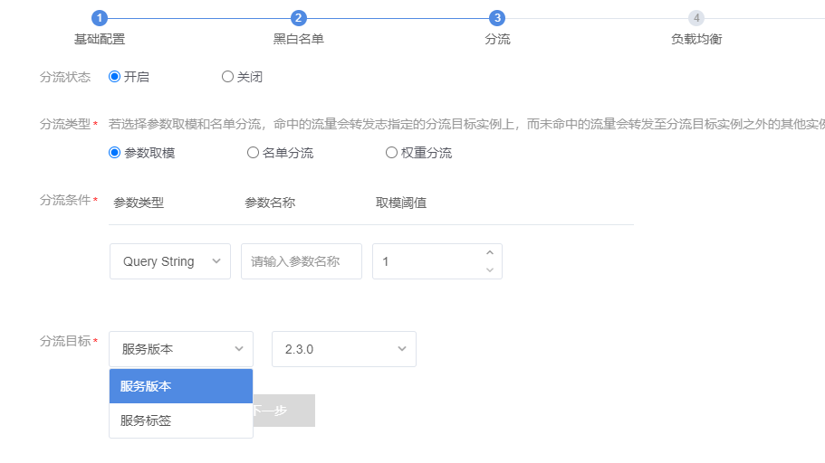
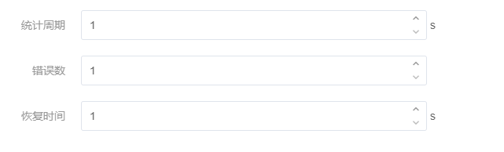

## 服务治理

不管是服务负载也好，还是服务容错也好，也都是针对上游服务请求下游服务时的一些选项配置，当流量已经路由到下游服务时，我们会采取限流、降级、熔断等策略来治理服务

### 服务负载

1、负载策略

当我们调用下游服务时，我们需要从下游服务对应的多个实例中进行选择，常用的负载算法如下：

- 轮询
- 随机
- 会话粘连
- 响应时间加权
- 可用性过滤
- 最大可用

2、参数分流

既根据已有规则，进行分流，比如针对 某些header 或者 cookie 或者query string 类型的参数 具体路由到某一些服务

3、黑白名单

我们可以针对一些来源请求做一些黑白名单，比如 来源于已知服务的请求则受理，否则拒绝

### 服务容错

服务容错主要是针对上游服务请求下游服务时间的一些失败重试策略

常用的有 failover、failfast、failback、等等其实针对的就是两个目标

- 当调用某一个服务实例失败时间，进行重试
- 当调用某一个服务失败时，选择其他服务实例

1、failover （失效转移策略）

当调用下游服务实例失败时，尝试调用下游服务的其他服务实例

2、failfast（快速失败策略)

当调用下游服务实例失败时间，直接报告失败

3、failback （失败重试策略）

当调用下游服务出错时，进行重试

4、自定义

5、主备切换

当某一个时间段内 对某个服务时间的请求失败次数达到阈值，则在下次调用该服务时，从服务中心返回的服务列表中剔除，直到当前时间达到设置的恢复时间时，才重新尝试

