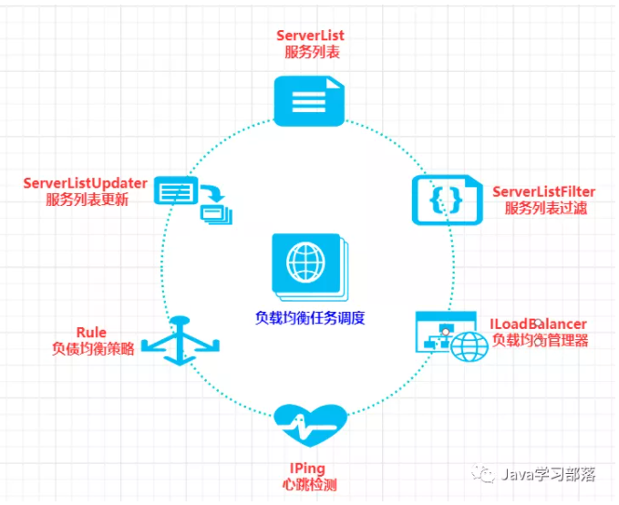

# Ribbon


## Ribbon 简介

Ribbon 一般用来实现客户端的负载均衡，是一个基于HTTP和TCP 的客户端负载均衡工具，它基于Netflix 的 Ribbon 实现。


## LoadBanlanced 注解原理

Spring 本身是可以通过注解对 生成的Bean 对象进行设置别名的，LoadBanlance 注解则是 通过对我们自定义生成的RestTemplate Bean 与 WebClient Bean 进行设置别名，而后再有spring 进行收集处理，分别为两种Client 设置相关的Interceptor 与 FilterFunction

Spring 针对 这种客户端的负载均衡 添加了一个标准级的接口，为LoadBalenceClient，LoadBanlanceClient 分别有两种实现，分别为 RibbonLoadBanlanceClient 与 BlockLoadbalanceClient，前一种是基于Ribbon 来实现的负载均衡，后一种则是通过rector + roundrobin 来实现的负载均衡

Spring 针对每一个服务都创建了与之相应的上下文，这种上下文则是通过NameContextFactory 来实现的，既一个服务对应一个LoadBanlanceClient 对象，而且每一个服务与之相关的可能还有其他类型的Bean，比如IConfig、IPing、IRule等，

Spring 针对两种Client 的 则采用了不同的类去解决，分别为SpringClientFactory 与 LoadBanlanceClientFactory ，用来保存每个服务与之对应的上下文

LoadBalenceClient 接口方法如下：

- **execute(String serviceId, ServiceInstance serviceInstance, LoadBalancerRequest** **request)**

  使用从负载均衡器中挑选出的服务实例来执行请求内容。

-  **URI reconstructURI(ServiceInstance instance, URI original)** 

  为系统构建一个合适的host:port形式的URI。在分布式系统中，我们使用逻辑上的服务名称作为host来构建URI（替代服务实例的host:port形式）进行请求，比如http://myservice/path/to/service。在该操作的定义中，前者ServiceInstance对象是带有host和port的具体服务实例，而后者URI对象则是使用逻辑服务名定义为host的URI，而返回的URI内容则是通过ServiceInstance的服务实例详情拼接host:port形式的请求地址。

-  **ServiceInstance choose(String serviceId)** 

   父接口ServiceInstanceChooser的方法，根据传入的服务名serviceId，从负载均衡器中挑选一个对应服务的实例。 


## Ribbon 原理

Ribbion 本身有六个核心的接口，架构图如下：




下面对这六个核心接口进行一一说明：

### ServerList

ServerList用于获取服务节点列表并存储的组件。

存储分为静态存储和动态存储两种方式。

默认从配置文件中获取服务节点列表并存储称为静态存储。

从注册中心获取对应的服务实例信息并存储称为动态存储。


### **ServerListFilter**

 ServerListFilter主要用于实现服务实例列表的过滤，通过传入的服务实例清单，根据规则返回过滤后的服务实例清单。 


### **ServerListUpdater**

ServerListUpdater是列表更新器，用于动态的更新服务列表。

ServerListUpdater通过任务调度去定时实现更新操作。所以它有个唯一实现子类：PollingServerListUpdater。

PollingServerListUpdater动态服务器列表更新器要更新的默认实现，使用一个任务调度器ScheduledThreadPoolExecutor完成定时更新。


### **IPing**

缓存到本地的服务实例信息有可能已经无法提供服务了，这个时候就需要有一个检测的组件，来检测服务实例信息是否可用。

IPing就是用来客户端用于快速检查服务器当时是否处于活动状态（心跳检测）


### **ILoadBalancer**

ILoadBalancer是整个Ribbon中最重要的一个环节，它将负载均衡器最核心的资源也就是所有的服务的获取，更新，过滤，选择等操作都能安排的妥妥当当。

```java

package com.netflix.loadbalancer;
import java.util.List;

public interface ILoadBalancer {
    void addServers(List<Server> var1);
    Server chooseServer(Object var1);
    void markServerDown(Server var1);
    /** @deprecated */
    @Deprecated
    List<Server> getServerList(boolean var1);
    List<Server> getReachableServers();
    List<Server> getAllServers();
}
```


ILoadBalancer最重要的重要是获取所有的服务节点信息，或者是获取可访问的服务节点信息，然后通过ServerListFilter按照指定策略过滤服务节点列表，通过ServerListUpdater动态更新一组服务列表，通过IPing剔除非存活状态下的服务节点以及根据IRule从现有服务器列表中选择一个服务。


### Ribbon 配置


### Ribbon 与 spring集成


