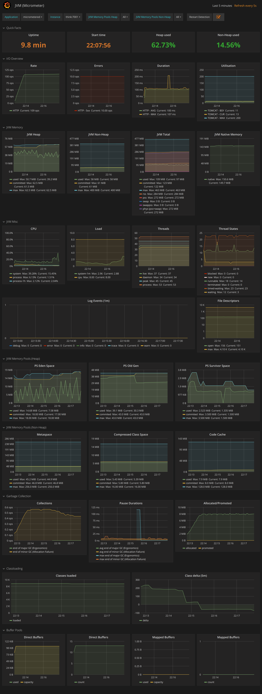
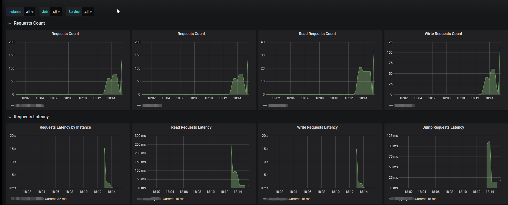

## 前言

转自：http://trumandu.github.io/2020/04/08/Spring-Boot-%E5%BA%94%E7%94%A8%E7%9B%91%E6%8E%A7%E6%9C%80%E4%BD%B3%E5%AE%9E%E8%B7%B5%E4%B9%8BMicrometer/

Spring Boot应用监控有很多方案，例如elastic APM,Prometheus等。各有特色，本次实践采用方案：[Micrometer](https://micrometer.io/docs)+[Prometheus](https://prometheus.io/)+[Grafana](https://grafana.com/)。

选择Micrometer最重要的原因是他的设计很灵活，并且和spring boot 2.x集成度很高。对于jvm的监控很容易集成，难度很小。本次实践包含jvm监控和业务性能指标监控。

## 环境准备

1. 搭建promethues

   ```sh
   docker run \   
   	-p 9090:9090 \
   	--name prometheus -v /tmp/prometheus.yml:/etc/prometheus/prometheus.yml \    
   	prom/prometheus
   ```

   ```yaml
   global:
     scrape_interval:     15s # By default, scrape targets every 15 seconds.
     evaluation_interval: 15s # By default, scrape targets every 15 seconds.
     # scrape_timeout is set to the global default (10s).
   # Load rules once and periodically evaluate them according to the global 'evaluation_interval'.
   rule_files:
     # - "first.rules"
     # - "second.rules"
   
   # A scrape configuration containing exactly one endpoint to scrape:
   # Here it's Prometheus itself.
   scrape_configs:
     # The job name is added as a label `job=<job_name>` to any timeseries scraped from this config.
     - job_name: 'demo_platform'
   
       # Override the global default and scrape targets from this job every 5 seconds.
       scrape_interval: 5s
   
       metrics_path: '/actuator/prometheus'
       # scheme defaults to 'http'.
   
       static_configs:
         - targets: ['127.0.0.1:8080']
   ```

1. 搭建grafana

   ```sh
   docker run -d -p 3000:3000 --name grafana grafana/grafana:6.5.0
   ```


## Micrometer简介

Micrometer（译：千分尺） Micrometer provides a simple facade over the instrumentation clients for the most popular monitoring systems. 翻译过来大概就它提供一个门面，类似SLF4j。支持将数据写入到很多监控系统，不过我谷歌下来，很多都是后端接入的是Prometheus.

Micrometer提供了与供应商无关的接口，包括 **timers（计时器）**， **gauges（量规）**， **counters（计数器）**， **distribution summaries（分布式摘要）**， **long task timers（长任务定时器）**。它具有维度数据模型，当与维度监视系统结合使用时，可以高效地访问特定的命名度量，并能够跨维度深入研究。

支持的监控系统：AppOptics ， Azure Monitor ， Netflix Atlas ， CloudWatch ， Datadog ， Dynatrace ， Elastic ， Ganglia ， Graphite ， Humio ， Influx/Telegraf ， JMX ， KairosDB ， New Relic ， Prometheus ， SignalFx ， Google Stackdriver ， StatsD ， Wavefront

### Micrometer提供的度量类库

`Meter`是指一组用于收集应用中的度量数据的接口，Meter单词可以翻译为”米”或者”千分尺”，但是显然听起来都不是很合理，因此下文直接叫Meter，理解它为度量接口即可。`Meter`是由`MeterRegistry`创建和保存的，可以理解`MeterRegistry`是`Meter`的工厂和缓存中心，一般而言每个JVM应用在使用Micrometer的时候必须创建一个`MeterRegistry`的具体实现。Micrometer中，`Meter`的具体类型包括：`Timer`，`Counter`，`Gauge`，`DistributionSummary`，`LongTaskTimer`，`FunctionCounter`，`FunctionTimer`和`TimeGauge`。一个`Meter`具体类型需要通过名字和`Tag`(这里指的是Micrometer提供的Tag接口)作为它的唯一标识，这样做的好处是可以使用名字进行标记，通过不同的`Tag`去区分多种维度进行数据统计。

## Spring Boot集成

与spring boot 集成，这里的metric主要是由spring actuator 提供

### 安装

```xml
<dependency>
	<groupId>org.springframework.boot</groupId>
	<artifactId>spring-boot-starter-actuator</artifactId>
</dependency>

<dependency>
	<groupId>io.micrometer</groupId>
	<artifactId>micrometer-registry-prometheus</artifactId>
</dependency>
```

### 配置

```yaml
management:
  endpoint:
    health:
      enabled: false
  endpoints:
    web:
      exposure:
        include: '*'
        exclude: env,beans
  metrics:
    enable:
      http: false
      hikaricp: false
```

这里有几个注意的点`management.endpoint.health.enabled`只是为了禁用spring 默认的健康检查，非必须。`exclude: env,beans`也不需要配置，只是在我项目中为了减少导出的metric。同理`management.metrics.enable`也是为了减少收集的数据，使用方法为你定义指标的前缀。

只有`management.endpoints.web.exposure.include`为必须的，这里也只是为了导出`/actuator/prometheus`，通过该地址可以访问到响应的metric信息。

### 可视化

访问 `http://localhost:8080/actuator/prometheus` 即可看到响应的metric信息。

在grafana中中导入[JVM (Micrometer)](https://grafana.com/grafana/dashboards/4701)

即可看到如下效果：




## 自定义业务性能监控

因为系统遗留监控代码的原因，这里采用的是全局静态方法实现。

```java
protected static Iterable<Tag> tags(String service, String category, String method) {
    return Tags.of("service", service, "category", category, "method", method);
}

protected static Iterable<Tag> tags(String service, String category) {
    return Tags.of("service", service, "category", category);
}

public static void controllerMetric(String service, MonitorMetric.MonitorOperationType type, String method, long time) {
    try {
        Metrics.counter(Constants.HTTP_REQUESTS_TOTAL, tags(service, type.name(), method)).increment();
        Metrics.timer(Constants.REQUESTS_LATENCY, tags(service, type.name())).record(Duration.ofMillis(time));
    } catch (Exception e) {
        e.printStackTrace();
    }
}
```

解释一下，这里可以统计出请求数和请求延迟。

对于每秒请求数据量，可以使用`increase(http_requests_total{job=~"$job",instance=~"$instance"}[1m])`

对于平均请求延迟，可以使用`rate(timer_sum[1m])/rate(timer_count[1m])`

对于Throughput 可以使用`rate(timer_count[1m])`




## 使用中的困惑

### 问题

**Percentile histograms**与**Distribution summaries**性能损失还无法确定，不过查看`PrometheusTimer`，结合测试，还是有一定的性能损失，不过这里未深入研究。

### 全局使用一些开发建议

可以在定义静态方法类，初始化的时候做一点配置，registry可以使用spring 注入进来例如：

```java

@Autowired 
MeterRegistry registry;

public MonitorMetric(MeterRegistry registry) {
        registry.config().meterFilter(
                new MeterFilter() {
                    @Override
                    public DistributionStatisticConfig configure(Meter.Id id, DistributionStatisticConfig config) {
             if (id.getName().startsWith("requests_latency")) {
                            return DistributionStatisticConfig.builder()
                                    .percentiles(0.5, 0.75, 0.9)
                                    .sla(1)
                                    .expiry(Duration.ofMinutes(1))
                                    .minimumExpectedValue(1L)
                                    .build()
                                    .merge(config);
                        }
                        return config;
                    }
                });
        Metrics.addRegistry(registry)；
    }
```


## 参考

与prometheus 集成 https://micrometer.io/docs/registry/prometheus


