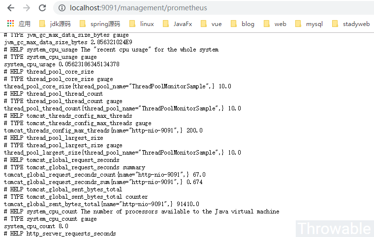
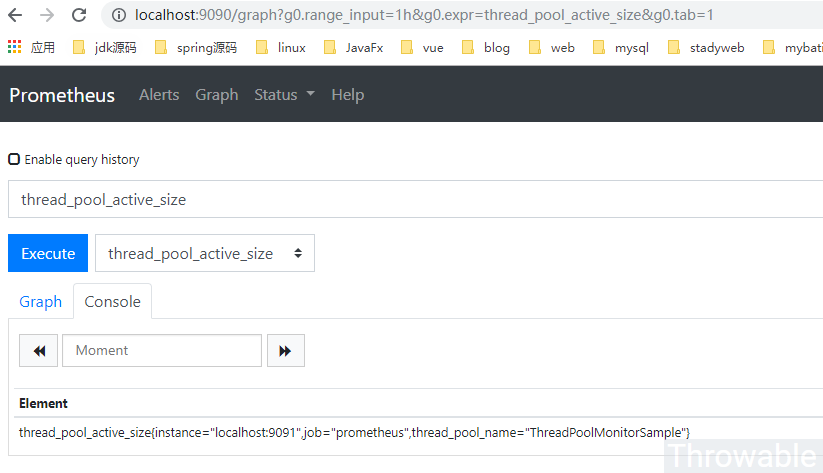
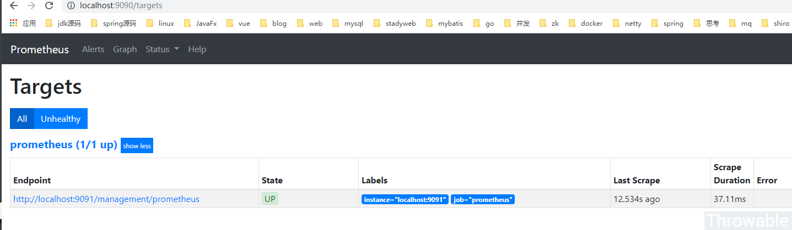
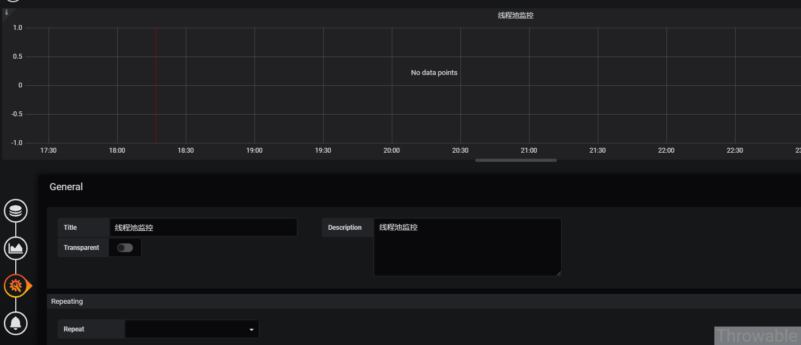
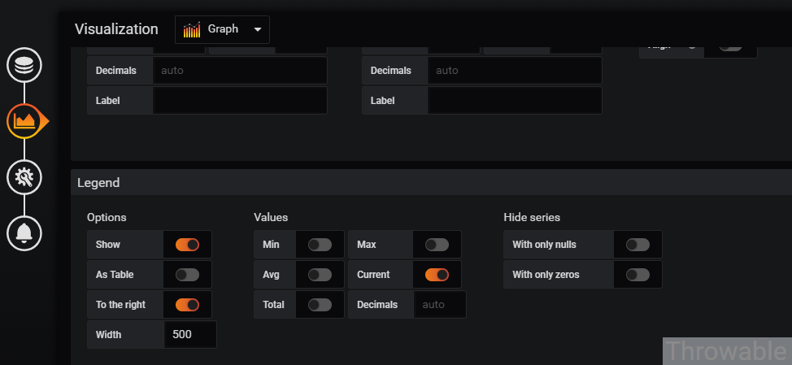
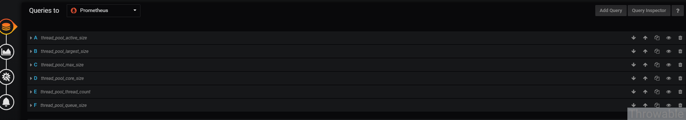
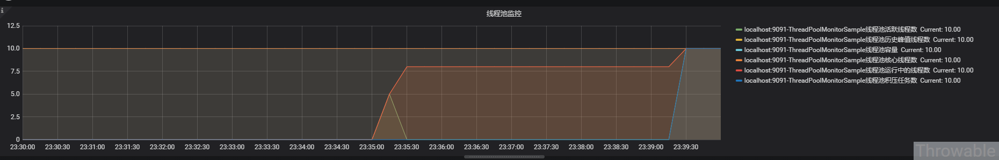

## micrometer实时监控线程池的各项指标

转自：https://my.oschina.net/u/4269649/blog/3266186

### 前提

最近的一个项目中涉及到文件上传和下载，使用到JUC的线程池`ThreadPoolExecutor`，在生产环境中出现了某些时刻线程池满负载运作，由于使用了`CallerRunsPolicy`拒绝策略，导致满负载情况下，应用接口调用无法响应，处于假死状态。考虑到之前用micrometer + prometheus + grafana搭建过监控体系，于是考虑使用micrometer做一次主动的线程池度量数据采集，最终可以相对实时地展示在grafana的面板中。


### 实践过程

下面通过真正的实战过程做一个仿真的例子用于复盘。


### 代码改造

首先我们要整理一下`ThreadPoolExecutor`中提供的度量数据项和micrometer对应的Tag的映射关系：

- 线程池名称，Tag：`thread.pool.name`，这个很重要，用于区分各个线程池的数据，如果使用IOC容器管理，可以使用BeanName代替。
- `int getCorePoolSize()`：核心线程数，Tag：`thread.pool.core.size`。
- `int getLargestPoolSize()`：历史峰值线程数，Tag：`thread.pool.largest.size`。
- `int getMaximumPoolSize()`：最大线程数(线程池线程容量)，Tag：`thread.pool.max.size`。
- `int getActiveCount()`：当前活跃线程数，Tag：`thread.pool.active.size`。
- `int getPoolSize()`：当前线程池中运行的线程总数(包括核心线程和非核心线程)，Tag：`thread.pool.thread.count`。
- 当前任务队列中积压任务的总数，Tag：`thread.pool.queue.size`，这个需要动态计算得出。

接着编写具体的代码，实现的功能如下：

- 1、建立一个`ThreadPoolExecutor`实例，核心线程和最大线程数为10，任务队列长度为10，拒绝策略为`AbortPolicy`。
- 2、提供两个方法，分别使用线程池实例模拟短时间耗时的任务和长时间耗时的任务。
- 3、提供一个方法用于清空线程池实例中的任务队列。
- 4、提供一个单线程的调度线程池用于定时收集`ThreadPoolExecutor`实例中上面列出的度量项，保存到micrometer内存态的收集器中。

由于这些统计的值都会跟随时间发生波动性变更，可以考虑选用`Gauge`类型的Meter进行记录。

```java
// ThreadPoolMonitor
import io.micrometer.core.instrument.Metrics;
import io.micrometer.core.instrument.Tag;
import org.springframework.beans.factory.InitializingBean;
import org.springframework.stereotype.Service;

import java.util.Collections;
import java.util.concurrent.*;
import java.util.concurrent.atomic.AtomicInteger;

/**
 * @author throwable
 * @version v1.0
 * @description
 * @since 2019/4/7 21:02
 */
@Service
public class ThreadPoolMonitor implements InitializingBean {
    
	private static final String EXECUTOR_NAME = "ThreadPoolMonitorSample";
	private static final Iterable<Tag> TAG = Collections.singletonList(Tag.of("thread.pool.name", EXECUTOR_NAME));
	private final ScheduledExecutorService scheduledExecutor = Executors.newSingleThreadScheduledExecutor();

	private final ThreadPoolExecutor executor = new ThreadPoolExecutor(10, 10, 0, TimeUnit.SECONDS,
			new ArrayBlockingQueue<>(10), new ThreadFactory() {

		private final AtomicInteger counter = new AtomicInteger();

		@Override
		public Thread newThread(Runnable r) {
			Thread thread = new Thread(r);
			thread.setDaemon(true);
			thread.setName("thread-pool-" + counter.getAndIncrement());
			return thread;
		}
	}, new ThreadPoolExecutor.AbortPolicy());


	private Runnable monitor = () -> {
		//这里需要捕获异常,尽管实际上不会产生异常,但是必须预防异常导致调度线程池线程失效的问题
		try {
			Metrics.gauge("thread.pool.core.size", TAG, executor, ThreadPoolExecutor::getCorePoolSize);
			Metrics.gauge("thread.pool.largest.size", TAG, executor, ThreadPoolExecutor::getLargestPoolSize);
			Metrics.gauge("thread.pool.max.size", TAG, executor, ThreadPoolExecutor::getMaximumPoolSize);
			Metrics.gauge("thread.pool.active.size", TAG, executor, ThreadPoolExecutor::getActiveCount);
			Metrics.gauge("thread.pool.thread.count", TAG, executor, ThreadPoolExecutor::getPoolSize);
			// 注意如果阻塞队列使用无界队列这里不能直接取size
			Metrics.gauge("thread.pool.queue.size", TAG, executor, e -> e.getQueue().size());
		} catch (Exception e) {
			//ignore
		}
	};

	@Override
	public void afterPropertiesSet() throws Exception {
		// 每5秒执行一次
		scheduledExecutor.scheduleWithFixedDelay(monitor, 0, 5, TimeUnit.SECONDS);
	}

	public void shortTimeWork() {
		executor.execute(() -> {
			try {
				// 5秒
				Thread.sleep(5000);
			} catch (InterruptedException e) {
				//ignore
			}
		});
	}

	public void longTimeWork() {
		executor.execute(() -> {
			try {
				// 500秒
				Thread.sleep(5000 * 100);
			} catch (InterruptedException e) {
				//ignore
			}
		});
	}

	public void clearTaskQueue() {
		executor.getQueue().clear();
	}
}
```


```java
//ThreadPoolMonitorController
import club.throwable.smp.service.ThreadPoolMonitor;
import lombok.RequiredArgsConstructor;
import org.springframework.http.ResponseEntity;
import org.springframework.web.bind.annotation.GetMapping;
import org.springframework.web.bind.annotation.RestController;

/**
 * @author throwable
 * @version v1.0
 * @description
 * @since 2019/4/7 21:20
 */
@RequiredArgsConstructor
@RestController
public class ThreadPoolMonitorController {

	private final ThreadPoolMonitor threadPoolMonitor;

	@GetMapping(value = "/shortTimeWork")
	public ResponseEntity<String> shortTimeWork() {
		threadPoolMonitor.shortTimeWork();
		return ResponseEntity.ok("success");
	}

	@GetMapping(value = "/longTimeWork")
	public ResponseEntity<String> longTimeWork() {
		threadPoolMonitor.longTimeWork();
		return ResponseEntity.ok("success");
	}

	@GetMapping(value = "/clearTaskQueue")
	public ResponseEntity<String> clearTaskQueue() {
		threadPoolMonitor.clearTaskQueue();
		return ResponseEntity.ok("success");
	}
}
```


配置如下：

```json
server:
  port: 9091
management:
  server:
    port: 9091
  endpoints:
    web:
      exposure:
        include: '*'
      base-path: /management
```

prometheus的调度Job也可以适当调高频率，这里默认是15秒拉取一次/prometheus端点，也就是会每次提交3个收集周期的数据。项目启动之后，可以尝试调用/management/prometheus查看端点提交的数据：



因为`ThreadPoolMonitorSample`是我们自定义命名的Tag，看到相关字样说明数据收集是正常的。如果prometheus的Job没有配置错误，在本地的spring-boot项目起来后，可以查下prometheus的后台：





OK，完美，可以进行下一步。


### grafana面板配置

确保JVM应用和prometheus的调度Job是正常的情况下，接下来重要的一步就是配置grafana面板。如果暂时不想认真学习一下prometheus的PSQL的话，可以从prometheus后台的`/graph`面板直接搜索对应的样本表达式拷贝进去grafana配置中就行，当然最好还是去看下prometheus的文档系统学习一下怎么编写PSQL。

- 基本配置：



- 可视化配置，把右边的标签勾选，宽度尽量调大点：



- 查询配置，这个是最重要的，最终图表就是靠查询配置展示的：



查询配置具体如下：

- A：thread_pool_active_size，Legend：`{{instance}}-{{thread_pool_name}}线程池活跃线程数`。
- B：thread_pool_largest_size，Legend：`{{instance}}-{{thread_pool_name}}线程池历史峰值线程数`。
- C：thread_pool_max_size，Legend：`{{instance}}-{{thread_pool_name}}线程池容量`。
- D：thread_pool_core_size，Legend：`{{instance}}-{{thread_pool_name}}线程池核心线程数`。
- E：thread_pool_thread_count，Legend：`{{instance}}-{{thread_pool_name}}线程池运行中的线程数`。
- F：thread_pool_queue_size，Legend：`{{instance}}-{{thread_pool_name}}线程池积压任务数`。


### 最终效果

多调用几次例子中提供的几个接口，就能得到一个监控线程池呈现的图表：




### 小结

针对线程池`ThreadPoolExecutor`的各项数据进行监控，有利于及时发现使用线程池的接口的异常，如果想要快速恢复，最有效的途径是：**清空线程池中任务队列中积压的任务**。具体的做法是：可以把`ThreadPoolExecutor`委托到IOC容器管理，并且把`ThreadPoolExecutor`的**任务队列清空的方法暴露成一个REST端点即可**。像HTTP客户端的连接池如Apache-Http-Client或者OkHttp等的监控，可以用类似的方式实现，数据收集的时候可能由于加锁等原因会有少量的性能损耗，不过这些都是可以忽略的，**如果真的怕有性能影响，可以尝试用反射API直接获取`ThreadPoolExecutor`实例内部的属性值，这样就可以避免加锁的性能损耗**。