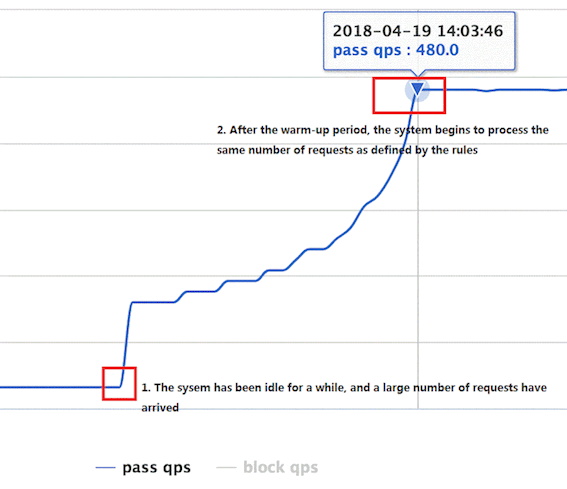

# 保护规则

Sentinel 主要为我们提供了四种保护系统的规则，而且定义的规则都可以在内存态中，动态的查询以及修改，修改之后立即生效，而且可以根据sentinel 提供的持久化规则扩展点来自定义扩展规则，规则如下：

- 流量控制规则
- 熔断降级规则
- 系统保护规则
- 热点参数限流规则
- 黑白名单


## 流量控制

### 规则定义

Sentinel 中流量规则定义主要由FlowRule定义，并且加载到FlowRuleManager的内存中，或者通过FlowRuleManager.register2Property 来动态加载限流规则

 限流的直接表现是在执行 `Entry nodeA = SphU.entry(resourceName)` 的时候抛出 `FlowException` 异常。`FlowException` 是 `BlockException` 的子类，您可以捕捉 `BlockException` 来自定义被限流之后的处理逻辑 

一条限流桂萼主要有下面几个因素组成，我们可以组合这些元素来实现不同的限流效果

- resouurce：资源名称，既限流规则的作用对象
- count：限流阈值
- grade：限流阀值类型，分别为 QPS限流或者时并发线程数限流
- limitApp：流控针对的调用来源，若为default 则不区分来源
- strategy：调用关系限流策略
- controlBehavior：流量控制效果（直接角色、Warm Up、允许排队）


### 流控概览

Sentinel的流量控制分为三个方面，分别为 限流策略、流控效果、调用关系限流

限流策略主要分为以下两种：

- QPS 限流
- 并发线程数限流

流控效果分为三种：

- 直接拒绝
- Warm Up
- 匀速排队

调用关系限流策略：

- 调用链路入口限流
- 调用关系限流

下面我们就从这三个方面来对Sentinel 的流量控制进行解读


### 限流策略

流量控制主要有两种统计类型，一种是统计并发线程数，另外一种则是统计 QPS。类型`FlowRule` 的 `grade` 字段来定义。其中，0 代表根据并发数量来限流，1 代表根据 QPS 来进行流量控制。其中线程数、QPS 值，都是由 `StatisticSlot` 实时统计获取的。 

#### 并发线程数控制

 并发数控制用于保护业务线程池不被慢调用耗尽。例如，当应用所依赖的下游应用由于某种原因导致服务不稳定、响应延迟增加，对于调用者来说，意味着吞吐量下降和更多的线程数占用，极端情况下甚至导致线程池耗尽。为应对太多线程占用的情况，业内有使用隔离的方案，比如通过不同业务逻辑使用不同线程池来隔离业务自身之间的资源争抢（线程池隔离）。这种隔离方案虽然隔离性比较好，但是代价就是线程数目太多，线程上下文切换的 overhead 比较大，特别是对低延时的调用有比较大的影响。Sentinel 并发控制不负责创建和管理线程池，而是简单统计当前请求上下文的线程数目（正在执行的调用数目），如果超出阈值，新的请求会被立即拒绝，效果类似于信号量隔离。**并发数控制通常在调用端进行配置。** 


#### QPS流量控制

当 QPS 超过某个阈值的时候，则采取措施进行流量控制。流量控制的效果包括以下几种：**直接拒绝**、**Warm Up**、**匀速排队**。对应 `FlowRule` 中的 `controlBehavior` 字段。

> 注意：若使用除了直接拒绝之外的流量控制效果，则调用关系限流策略（strategy）会被忽略。


### 流控效果


#### 直接拒绝

 **直接拒绝**（`RuleConstant.CONTROL_BEHAVIOR_DEFAULT`）方式是默认的流量控制方式，当QPS超过任意规则的阈值后，新的请求就会被立即拒绝，拒绝方式为抛出`FlowException`。这种方式适用于对系统处理能力确切已知的情况下，比如通过压测确定了系统的准确水位时 

#### Warm Up

 Warm Up（`RuleConstant.CONTROL_BEHAVIOR_WARM_UP`）方式，即预热/冷启动方式。当系统长期处于低水位的情况下，当流量突然增加时，直接把系统拉升到高水位可能瞬间把系统压垮。通过"冷启动"，让通过的流量缓慢增加，在一定时间内逐渐增加到阈值上限，给冷系统一个预热的时间，避免冷系统被压垮。

当流量突然增大的时候，我们常常会希望系统从空闲状态到繁忙状态的切换的时间长一些。即如果系统在此之前长期处于空闲的状态，我们希望处理请求的数量是缓步的增多，经过预期的时间以后，到达系统处理请求个数的最大值。Warm Up（冷启动，预热）模式就是为了实现这个目的的。

这个场景主要用于启动需要额外开销的场景，例如建立数据库连接等。

它的实现是在 [Guava](https://github.com/google/guava/blob/master/guava/src/com/google/common/util/concurrent/SmoothRateLimiter.java) 的算法的基础上实现的。然而，和 Guava 的场景不同，Guava 的场景主要用于调节请求的间隔，即 [Leaky Bucket](https://en.wikipedia.org/wiki/Leaky_bucket)，而 Sentinel 则主要用于控制每秒的 QPS，即我们满足每秒通过的 QPS 即可，我们不需要关注每个请求的间隔，换言之，我们更像一个 [Token Bucket](https://en.wikipedia.org/wiki/Token_bucket)。

我们用桶里剩余的令牌来量化系统的使用率。假设系统每秒的处理能力为 b,系统每处理一个请求，就从桶中取走一个令牌；每秒这个令牌桶会自动掉落b个令牌。令牌桶越满，则说明系统的利用率越低；当令牌桶里的令牌高于某个阈值之后，我们称之为令牌桶"饱和"。

当令牌桶饱和的时候，基于 Guava 的计算上，我们可以推出下面两个公式:

```
rate(c)=m*c+ coldrate
```

其中，rate 为当前请求和上一个请求的间隔时间，而 rate 是和令牌桶中的高于阈值的令牌数量成线形关系的。cold rate 则为当桶满的时候，请求和请求的最大间隔。通常是 `coldFactor * rate(stable)`。

通常冷启动的过程系统允许通过的 QPS 曲线如下图所示：



默认 `coldFactor` 为 3，即请求 QPS 从 `threshold / 3` 开始，经预热时长逐渐升至设定的 QPS 阈值。


#### 匀速排队

匀速排队（`RuleConstant.CONTROL_BEHAVIOR_RATE_LIMITER`）方式会严格控制请求通过的间隔时间，也即是让请求以均匀的速度通过，对应的是漏桶算法。详细文档可以参考 [流量控制 - 匀速器模式](https://github.com/alibaba/Sentinel/wiki/流量控制-匀速排队模式)，具体的例子可以参见 [PaceFlowDemo](https://github.com/alibaba/Sentinel/blob/master/sentinel-demo/sentinel-demo-basic/src/main/java/com/alibaba/csp/sentinel/demo/flow/PaceFlowDemo.java)。

该方式的作用如下图所示：


这种方式主要用于处理间隔性突发的流量，例如消息队列。想象一下这样的场景，在某一秒有大量的请求到来，而接下来的几秒则处于空闲状态，我们希望系统能够在接下来的空闲期间逐渐处理这些请求，而不是在第一秒直接拒绝多余的请求。

> 注意：匀速排队模式暂时不支持 QPS > 1000 的场景。


### 调用关系限流策略

调用关系包括调用方、被调用方；一个方法又可能会调用其它方法，形成一个调用链路的层次关系。Sentinel 通过 `NodeSelectorSlot` 建立不同资源间的调用的关系，并且通过 `ClusterBuilderSlot` 记录每个资源的实时统计信息。

有了调用链路的统计信息，我们可以衍生出多种流量控制手段。

### 3.1 根据调用方限流

`ContextUtil.enter(resourceName, origin)` 方法中的 `origin` 参数标明了调用方身份。这些信息会在 `ClusterBuilderSlot` 中被统计。可通过以下命令来展示不同的调用方对同一个资源的调用数据：

```
curl http://localhost:8719/origin?id=nodeA
```

调用数据示例：

```
id: nodeA
idx origin  threadNum passedQps blockedQps totalQps aRt   1m-passed 1m-blocked 1m-total 
1   caller1 0         0         0          0        0     0         0          0
2   caller2 0         0         0          0        0     0         0          0
```

上面这个命令展示了资源名为 `nodeA` 的资源被两个不同的调用方调用的统计。

流控规则中的 `limitApp` 字段用于根据调用来源进行流量控制。该字段的值有以下三种选项，分别对应不同的场景：

- `default`：表示不区分调用者，来自任何调用者的请求都将进行限流统计。如果这个资源名的调用总和超过了这条规则定义的阈值，则触发限流。
- `{some_origin_name}`：表示针对特定的调用者，只有来自这个调用者的请求才会进行流量控制。例如 `NodeA` 配置了一条针对调用者`caller1`的规则，那么当且仅当来自 `caller1` 对 `NodeA` 的请求才会触发流量控制。
- `other`：表示针对除 `{some_origin_name}` 以外的其余调用方的流量进行流量控制。例如，资源`NodeA`配置了一条针对调用者 `caller1` 的限流规则，同时又配置了一条调用者为 `other` 的规则，那么任意来自非 `caller1` 对 `NodeA` 的调用，都不能超过 `other` 这条规则定义的阈值。

同一个资源名可以配置多条规则，规则的生效顺序为：**{some_origin_name} > other > default**

### 3.2 根据调用链路入口限流：链路限流

`NodeSelectorSlot` 中记录了资源之间的调用链路，这些资源通过调用关系，相互之间构成一棵调用树。这棵树的根节点是一个名字为 `machine-root` 的虚拟节点，调用链的入口都是这个虚节点的子节点。

一棵典型的调用树如下图所示：

```
     	          machine-root
                    /       \
                   /         \
             Entrance1     Entrance2
                /             \
               /               \
      DefaultNode(nodeA)   DefaultNode(nodeA)
```

上图中来自入口 `Entrance1` 和 `Entrance2` 的请求都调用到了资源 `NodeA`，Sentinel 允许只根据某个入口的统计信息对资源限流。比如我们可以设置 `strategy` 为 `RuleConstant.STRATEGY_CHAIN`，同时设置 `refResource` 为 `Entrance1` 来表示只有从入口 `Entrance1` 的调用才会记录到 `NodeA` 的限流统计当中，而不关心经 `Entrance2` 到来的调用。

调用链的入口（上下文）是通过 API 方法 `ContextUtil.enter(contextName)` 定义的，其中 contextName 即对应调用链路入口名称。详情可以参考 [ContextUtil 文档](https://github.com/alibaba/Sentinel/wiki/如何使用#上下文工具类-contextutil)。

### 3.3 具有关系的资源流量控制：关联流量控制

当两个资源之间具有资源争抢或者依赖关系的时候，这两个资源便具有了关联。比如对数据库同一个字段的读操作和写操作存在争抢，读的速度过高会影响写得速度，写的速度过高会影响读的速度。如果放任读写操作争抢资源，则争抢本身带来的开销会降低整体的吞吐量。可使用关联限流来避免具有关联关系的资源之间过度的争抢，举例来说，`read_db` 和 `write_db` 这两个资源分别代表数据库读写，我们可以给 `read_db` 设置限流规则来达到写优先的目的：设置 `strategy` 为 `RuleConstant.STRATEGY_RELATE` 同时设置 `refResource` 为 `write_db`。这样当写库操作过于频繁时，读数据的请求会被限流。


### 示例代码


## 熔断规则

Sentinel 中的熔断规则主要由 DegradeRule 规则进行定义，并且通过DegradeRuleManager 来管理加载规则，也可以通过DegradeRuleManager.registerProperty 来动态加载规则

### 熔断概览

熔断降级规则主要包含以下几个方面

- 触发熔断降级的指标点
- 熔断的时长
- 熔断触发的最小请求书
- 单位统计时长（对 该单位时间内的指标点进行统计，滑动窗口实现）

触发熔断降级的指标点主要包括 慢调用比例、异常比例、异常数量 三个指标


#### 慢调用比例

慢调用比例 (`SLOW_REQUEST_RATIO`)：选择以慢调用比例作为阈值，需要设置允许的慢调用 RT（即最大的响应时间），请求的响应时间大于该值则统计为慢调用。当单位统计时长（`statIntervalMs`）内请求数目大于设置的最小请求数目，并且慢调用的比例大于阈值，则接下来的熔断时长内请求会自动被熔断。经过熔断时长后熔断器会进入探测恢复状态（HALF-OPEN 状态），若接下来的一个请求响应时间小于设置的慢调用 RT 则结束熔断，若大于设置的慢调用 RT 则会再次被熔断。

慢调用比例主要关注下面两个点

- 临界RT（既最大响应时间阈值） ，既当响应时间大于 临界RT 时被记为满调用
- 在统计窗口内的满调用比例，既当该统计窗口内如果 超过临界RT 的请求数比例大于比例阈值，那么就认为达到了 慢调用比例的指标阈值，就进行熔断降级


#### 异常比例

 异常比例 (`ERROR_RATIO`)：当单位统计时长（`statIntervalMs`）内请求数目大于设置的最小请求数目，并且异常的比例大于阈值，则接下来的熔断时长内请求会自动被熔断。经过熔断时长后熔断器会进入探测恢复状态（HALF-OPEN 状态），若接下来的一个请求成功完成（没有错误）则结束熔断，否则会再次被熔断。异常比率的阈值范围是 `[0.0, 1.0]`，代表 0% - 100% 

异常比例主要关注的也有两个点

- 异常比例阈值，既当统计的时间窗口内产生的异常数量 / 总请求书 > 异常比例阈值 就认为 当前已经达到指标阈值，就进行熔断降级
- 异常收集，既sentinel 收集的异常应该只包含业务异常，不应该计入sentinel 本身的异常。使用Tracer.trace() 来收集业务异常即可


#### 异常数量

异常数 (`ERROR_COUNT`)：当单位统计时长内的异常数目超过阈值之后会自动进行熔断。经过熔断时长后熔断器会进入探测恢复状态（HALF-OPEN 状态），若接下来的一个请求成功完成（没有错误）则结束熔断，否则会再次被熔断。

异常数量同样关注的也有两点

- 异常数量阀值，既当统计的时间窗口内 产生的异常数量 > 总请求数量，就认为当前已经达到指标比例阈值，则进行熔断降级
- 异常类型收集，同异常比例-异常收集一样


>  注意异常降级**仅针对业务异常**，对 Sentinel 限流降级本身的异常（`BlockException`）不生效。为了统计异常比例或异常数，需要通过 `Tracer.trace(ex)` 记录业务异常。示例： 
>
> ```java
> Entry entry = null;
> try {
>   entry = SphU.entry(key, EntryType.IN, key);
> 
>   // Write your biz code here.
>   // <<BIZ CODE>>
> } catch (Throwable t) {
>   if (!BlockException.isBlockException(t)) {
>     Tracer.trace(t);
>   }
> } finally {
>   if (entry != null) {
>     entry.exit();
>   }
> }
> ```

**`@SentinelResource` 注解会自动统计业务异常，无需手动调用。 **


### 规则配置说明

熔断降级规则（DegradeRule）包含下面几个重要的属性：


| Field              | 说明                                                         | 默认值     |
| ------------------ | ------------------------------------------------------------ | ---------- |
| resource           | 资源名，即规则的作用对象                                     |            |
| grade              | 熔断策略，支持慢调用比例/异常比例/异常数策略                 | 慢调用比例 |
| count              | 慢调用比例模式下为慢调用临界 RT（超出该值计为慢调用）；异常比例/异常数模式下为对应的阈值 |            |
| timeWindow         | 熔断时长，单位为 s                                           |            |
| minRequestAmount   | 熔断触发的最小请求数，请求数小于该值时即使异常比率超出阈值也不会熔断（1.7.0 引入） | 5          |
| statIntervalMs     | 统计时长（单位为 ms），如 60*1000 代表分钟级（1.8.0 引入）   | 1000 ms    |
| slowRatioThreshold | 慢调用比例阈值，仅慢调用比例模式有效（1.8.0 引入）           |            |


### 熔断事件监听

Sentinel 支持注册自定义的事件监听器监听熔断器状态变换事件（state change event）。示例：

```
EventObserverRegistry.getInstance().addStateChangeObserver("logging",
    (prevState, newState, rule, snapshotValue) -> {
        if (newState == State.OPEN) {
            // 变换至 OPEN state 时会携带触发时的值
            System.err.println(String.format("%s -> OPEN at %d, snapshotValue=%.2f", prevState.name(),
                TimeUtil.currentTimeMillis(), snapshotValue));
        } else {
            System.err.println(String.format("%s -> %s at %d", prevState.name(), newState.name(),
                TimeUtil.currentTimeMillis()));
        }
    });
```


## 系统保护规则


## 热点参数限流规则


## 黑白名单