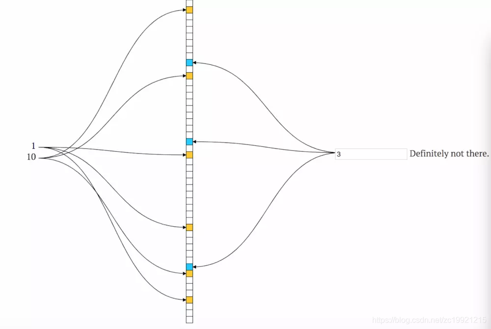

# 分布式缓存

分布式缓存 指的是在分布式场景下，提供缓存

分布式缓存有两个痛点，如下：

- 分布式缓存一致性
- 热点探测，多级缓存


在分布式场景下，我们一般针对敏感与非敏感数据都有不同的处理策略，比如针对敏感数据我们需要强一致性，针对非敏感数据追求追踪一致性即可。


## 分布式缓存一致性

> 这里大概看一下了解以下对于实时性要求比较高的 或者实时性要求不高的 的数据如何缓存包括 不过期缓存以及过期缓存 的 解决方案

分布式缓存一致性分为弱一致性与强一致性，当请求的缓存需要与数据库数据实时一致的，我们称为强一致，如果不需要与数据库实时一致的，比如修改了商品的名称，这个时候并不需要实时生效，可能当大促的并发流量过后再生效，既保证与数据库的最终一致

假设我们现在有两种对外提供的服务，一种是敏感服务即 库存服务，一种是非敏感服务即商品服务,我们针对两种方法有两种解决方案：


### 敏感数据

1、业务线程1（伪代码）

```go
func updateData() {
    //操作1
	deleteCache()
    
    //操作2
	updateDB()
}
```


2、业务线程2

```go
func searchData(){
    //操作3
	var cacheData = searchFromCache()
	if(cacheData == null){
        //操作5
		cacheData=searchFromDB()
	}
	
    //操作4
	putToCache(cacheData)
}
```


我们针对以上伪代码进行分析出现的场景有以下几种：

- 当执行操作1步骤删除缓存后 如果还没来的及更新DB，这个时候业务线程二又拿到了旧数据

- 我们将业务线程1的操作步骤颠倒，先更新数据，再删除缓存，如果删除缓存失败，业务线程二还是拿到了旧数据

- 我们针对敏感数据,将数据设置为将操作1的步骤改为如下，示例 3-1：

  ```go
  func updateData() {
      //操作1
  	updateDB()
      
      //操作2
  	updateCache()
  }
  ```

  这里暴露出来的问题就是，如果更新缓存失败，则会导致缓存与数据库的又一次不一致


所以我们针对以上场景以及敏感数据，我们需要一些解决的方案，

- 分布式读写锁（时效性超级高一致性）

  使用分布式读写锁的意义在于，当我们对缓存数据写入的时候会阻塞他的读取操作，当写入操作完成后，我们再进行读取，这个时候读取到的一定是新的数据，但是会导致系统的吞吐量降低，可能会导致一些性能问题

- 双写 + 过期时间

  如示例3-1，我们先更新DB，再更新缓存，然后为缓存设置可容忍的失效时间（不管更新缓存是否生效），

  然后在启动一个线程 判断当前key 对应的缓存中的数据是否已经更新，如果更新则删除过期时间，否则不处理，等待过期

  业务线程2读取的时候判断缓存是否为空，如果为空则加分布式读锁，从数据库种获取

- 分布式锁 + 过期时间

  当我们更新数据之后，直接删除对应的缓存（如果删除失败，那么就自动补偿重试，如果还是不成功，则给消息打一个失效标记），然后如果其他线程再来读取数据时间，会发现数据为空，这个时候从数据库读取最新的数据然后放入缓存，设置可容忍的失效时间即可


### 非敏感数据

我们针对非敏感数据，也可以采用以下场景来进行缓存数据：

- 采用双写机制 + 过期时间（过期时间可调节为比较长一些的），如果完全信任redis的写入，可以不写入过期时间
- 分布式锁 + 过期时间，过期时间可以设置的比较长一些。可以容忍不一致的最大时间
- 消息队列 ，当我们写入db后，我们将改操作推入到mq种，程序从MQ种对改缓存更新操作进行监听，然后写入更新操作


### 不过期缓存


### 过期缓存


## 热点探测

### 热点探测


### 多级缓存

### 


## 缓存性能

描述以及角色的方法：

  


### 缓存穿透

缓存穿透是指要访问的数据既不在 Redis 缓存中，也不在数据库中，导致请求在访问缓存时，发生缓存缺失，再去访问数据库时，发现数据库中也没有要访问的数据。此时，应用也无法从数据库中读取数据再写入缓存，来服务后续请求，这样一来，缓存也就成了“摆设”，如果应用持续有大量请求访问数据，就会同时给缓存和数据库带来巨大压力，如下图所示：


那么，缓存穿透会发生在什么时候呢？一般来说，有两种情况。

- 业务层误操作：缓存中的数据和数据库中的数据被误删除了，所以缓存和数据库中都没有数据；
- 恶意攻击：专门访问数据库中没有的数据。

为了避免缓存穿透的影响，我来给你提供三种应对方案。

**第一种方案是，缓存空值或缺省值。**

一旦发生缓存穿透，我们就可以针对查询的数据，在 Redis 中缓存一个空值或是和业务层协商确定的缺省值（例如，库存的缺省值可以设为 0）。紧接着，应用发送的后续请求再进行查询时，就可以直接从 Redis 中读取空值或缺省值，返回给业务应用了，避免了把大量请求发送给数据库处理，保持了数据库的正常运行**。**

**第二种方案是，使用布隆过滤器快速判断数据是否存在，避免从数据库中查询数据是否存在，减轻数据库压力。**
我们先来看下，布隆过滤器是如何工作的。

布隆过滤器由一个初值都为 0 的 bit 数组和 N 个哈希函数组成，可以用来快速判断某个数据是否存在。当我们想标记某个数据存在时（例如，数据已被写入数据库），布隆过滤器会通过三个操作完成标记：

1. 首先，使用 N 个哈希函数，分别计算这个数据的哈希值，得到 N 个哈希值。
2. 然后，我们把这 N 个哈希值对 bit 数组的长度取模，得到每个哈希值在数组中的对应位置。
3. 最后，我们把对应位置的 bit 位设置为 1，这就完成了在布隆过滤器中标记数据的操作。

如果数据不存在（例如，数据库里没有写入数据），我们也就没有用布隆过滤器标记过数据，那么，bit 数组对应 bit 位的值仍然为 0。

当需要查询某个数据时，我们就执行刚刚说的计算过程，先得到这个数据在 bit 数组中对应的 N 个位置。紧接着，我们查看 bit 数组中这 N 个位置上的 bit 值。只要这 N 个 bit 值有一个不为 1，这就表明布隆过滤器没有对该数据做过标记，所以，查询的数据一定没有在数据库中保存。为了便于你理解，我画了一张图，你可以看下。


图中布隆过滤器是一个包含 10 个 bit 位的数组，使用了 3 个哈希函数，当在布隆过滤器中标记数据 X 时，X 会被计算 3 次哈希值，并对 10 取模，取模结果分别是 1、3、7。所以，bit 数组的第 1、3、7 位被设置为 1。当应用想要查询 X 时，只要查看数组的第 1、3、7 位是否为 1，只要有一个为 0，那么，X 就肯定不在数据库中。

正是基于布隆过滤器的快速检测特性，我们可以在把数据写入数据库时，使用布隆过滤器做个标记。当缓存缺失后，应用查询数据库时，可以通过查询布隆过滤器快速判断数据是否存在。如果不存在，就不用再去数据库中查询了。这样一来，即使发生缓存穿透了，大量请求只会查询 Redis 和布隆过滤器，而不会积压到数据库，也就不会影响数据库的正常运行。布隆过滤器可以使用 Redis 实现，本身就能承担较大的并发访问压力。

**最后一种方案是，**在请求入口的前端进行请求检测。缓存穿透的一个原因是有大量的恶意请求访问不存在的数据，所以，一个有效的应对方案是在请求入口前端，对业务系统接收到的请求进行合法性检测，把恶意的请求（例如请求参数不合理、请求参数是非法值、请求字段不存在）直接过滤掉，不让它们访问后端缓存和数据库。（IP限流）


**布隆过滤器的弊端**

由于bloomFilter 只能添加不能修改，所以在我们添加数据到布隆过滤器时，会加载数据库中有的数据的key到BloomFilter 中，当前台请求到来时，如果在bloomfilter 中无法获取到该key，那么就说明数据库中该值不存在，所以可以直接返回给前台 空值，当数据库添加完成数据后，我们可以将对应的cache key 添加到 bloomfilter中，这样的场景下就会暴露以下bloomFilter 的缺点

- bloomFilter 只能添加数据，不能删除数据
- bloomFilter 内部本身就已经有误差性，当我们删除数据库数据后，我们是无法将这个 删除动作反馈给bloomFilter的，因为bloomFilter 本身并不支持删除操作，所以会导致外在的误差率的增加

所以我们针对上面的两种缺点，衍生出了以下解决方法：

1、 定时重新组建BloomFilter，由于数据库操作的相关变动，会导致BloomFilter 除了自身的误差率意外还会增加外在的误差率，所以我们需要定时重新组建，保证外在的误差率的减少

2、两种解决方案嵌套，两种方案如下：

- 缓存null值，既数据库不存在的值就将该值缓存在redis中。如果存在大量请求会导致大量的缓存NULL值的增加
- bloom filter：因为bloom filter不支持删除操作，所以在数据库中响应数据删除的时候会导致外在误差率的增加，因而针对这些删除的值会存在缓存穿透

所以在高并发的场景下，我们结合以上两种方法，进行互补，既通过bloomFilter的请求 会二次判断该值是否为NULL值，如果为NULL值则返回，主要是为了避免热点数据删除后的大量缓存穿透

如果并发比较低，那么就只需要bloomFilter即可，并且定时的重建BloomFilter，降低外在数据的误差率


### 缓存雪崩

缓存雪崩是指大量的应用请求无法在 Redis 缓存中进行处理，紧接着，应用将大量请求发送到数据库层，导致数据库层的压力激增。

缓存雪崩一般是由两个原因导致的，应对方案也有所不同，我们一个个来看。

第一个原因是**：缓存中有大量数据同时过期**，导致大量请求无法得到处理。

具体来说，当数据保存在缓存中，并且设置了过期时间时，如果在某一个时刻，大量数据同时过期，此时，应用再访问这些数据的话，就会发生缓存缺失。紧接着，应用就会把请求发送给数据库，从数据库中读取数据。如果应用的并发请求量很大，那么数据库的压力也就很大，这会进一步影响到数据库的其他正常业务请求处理。我们来看一个简单的例子，如下图所示：


针对大量数据同时失效带来的缓存雪崩问题，我给你提供两种解决方案。

首先，我们可以避免给大量的数据设置相同的过期时间。如果业务层的确要求有些数据同时失效，你可以在用 EXPIRE 命令给每个数据设置过期时间时，给这些数据的过期时间增加一个较小的随机数（例如，随机增加 1~3 分钟），这样一来，不同数据的过期时间有所差别，但差别又不会太大，既避免了大量数据同时过期，同时也保证了这些数据基本在相近的时间失效，仍然能满足业务需求。

除了微调过期时间，**我们还可以通过服务降级，来应对缓存雪崩。**

**所谓的服务降级，是指发生缓存雪崩时，针对不同的数据采取不同的处理方式。**

1. 当业务应用访问的是非核心数据（例如电商商品属性）时，暂时停止从缓存中查询这些数据，而是直接返回预定义信息、空值或是错误信息；
2. 当业务应用访问的是核心数据（例如电商商品库存）时，仍然允许查询缓存，如果缓存缺失，也可以继续通过数据库读取。

这样一来，只有部分过期数据的请求会发送到数据库，数据库的压力就没有那么大了。下面这张图显示的是服务降级时数据请求的执行情况，你可以看下。


**除了大量数据同时失效会导致缓存雪崩，还有一种情况也会发生缓存雪崩，那就是，Redis 缓存实例发生故障宕机了，无法处理请求，这就会导致大量请求一下子积压到数据库层，从而发生缓存雪崩。**

一般来说，一个 Redis 实例可以支持数万级别的请求处理吞吐量，而单个数据库可能只能支持数千级别的请求处理吞吐量，它们两个的处理能力可能相差了近十倍。由于缓存雪崩，Redis 缓存失效，所以，数据库就可能要承受近十倍的请求压力，从而因为压力过大而崩溃。

此时，因为 Redis 实例发生了宕机，我们需要通过其他方法来应对缓存雪崩了。我给你提供两个建议。

**第一个建议，是在业务系统中实现服务熔断或请求限流机制。**

所谓的**服务熔断**，是指在发生缓存雪崩时，为了防止引发连锁的数据库雪崩，甚至是整个系统的崩溃，我们暂停业务应用对缓存系统的接口访问。再具体点说，就是业务应用调用缓存接口时，缓存客户端并不把请求发给 Redis 缓存实例，而是直接返回，等到 Redis 缓存实例重新恢复服务后，再允许应用请求发送到缓存系统。

这样一来，我们就避免了大量请求因缓存缺失，而积压到数据库系统，保证了数据库系统的正常运行。在业务系统运行时，我们可以监测 Redis 缓存所在机器和数据库所在机器的负载指标，例如每秒请求数、CPU 利用率、内存利用率等。

如果我们发现 Redis 缓存实例宕机了，而数据库所在机器的负载压力突然增加（例如每秒请求数激增），此时，就发生缓存雪崩了。大量请求被发送到数据库进行处理。我们可以启动服务熔断机制，暂停业务应用对缓存服务的访问，从而降低对数据库的访问压力，如下图所示：


服务熔断虽然可以保证数据库的正常运行，但是暂停了整个缓存系统的访问，对业务应用的影响范围大。为了尽可能减少这种影响，我们也可以进**行请求限流**。这里说的请求限流，就是指，我们在业务系统的请求入口前端控制每秒进入系统的请求数，避免过多的请求被发送到数据库。

我给你举个例子。假设业务系统正常运行时，请求入口前端允许每秒进入系统的请求是 1 万个，其中，9000 个请求都能在缓存系统中进行处理，只有 1000 个请求会被应用发送到数据库进行处理。

一旦发生了缓存雪崩，数据库的每秒请求数突然增加到每秒 1 万个，此时，我们就可以启动请求限流机制，在请求入口前端只允许每秒进入系统的请求数为 1000 个，再多的请求就会在入口前端被直接拒绝服务。所以，使用了请求限流，就可以避免大量并发请求压力传递到数据库层。


使用服务熔断或是请求限流机制，来应对 Redis 实例宕机导致的缓存雪崩问题，是属于“事后诸葛亮”，也就是已经发生缓存雪崩了，我们使用这两个机制，来降低雪崩对数据库和整个业务系统的影响。

**我给你的第二个建议就是事前预防**

通过主从节点的方式构建 Redis 缓存高可靠集群。如果 Redis 缓存的主节点故障宕机了，从节点还可以切换成为主节点，继续提供缓存服务，避免了由于缓存实例宕机而导致的缓存雪崩问题。

缓存雪崩是发生在大量数据同时失效的场景下，而接下来我要向你介绍的**缓存击穿**，是发生在某个热点数据失效的场景下。和缓存雪崩相比，缓存击穿失效的数据数量要小很多，应对方法也不一样，我们来看下。


#### 2.解决方案

> - 事前：尽量保证整个 redis 集群的高可用性，发现机器宕机尽快补上。选择合适的内存淘汰策略；
> - 事中：本地ehcache缓存 + hystrix限流&降级，避免MySQL崩掉；
> - 事后：利用 redis 持久化机制保存的数据尽快恢复缓存；
>   

#### 2.1 事前-Redis删除机制
定期删除+惰性删除

> - 定期删除：redis默认是每隔 100ms 就随机抽取一些设置了过期时间的key，检查其是否过期，如果过期就删除。注意这里是随机抽取的。为什么要随机呢？你想一想假如 redis 存了几十万个 key ，每隔100ms就遍历所有的设置过期时间的 key 的话，就会给 CPU 带来很大的负载！
> - 惰性删除 ：定期删除可能会导致很多过期 key 到了时间并没有被删除掉。所以就有了惰性删除。假如你的过期 key，靠定期删除没有被删除掉，还停留在内存里，除非你的系统去查一下那个 key，才会被redis给删除掉。这就是所谓的惰性删除。

但是仅仅通过设置过期时间还是有问题的，我们想一下：如果定期删除漏掉了很多过期key，然后你也没及时去查，也就没走惰性删除，此时会怎么样？如果大量过期key堆积在内存里，导致redis内存快耗尽了，怎么解决这个问题呢？我们需要选择合适的 redis 内存淘汰机制。


#### 2.2 事前-Redis内存淘汰机制

```
redis 配置文件 redis.conf 中有相关注释：http://download.redis.io/redis-stable/redis.conf
```


redis 提供 6种数据淘汰策略，4.0版本后增加了两种：

- volatile-lru：从已设置过期时间的数据集（server.db[i].expires）中挑选最近最少使用的数据淘汰；
- volatile-ttl：从已设置过期时间的数据集（server.db[i].expires）中挑选将要过期的数据淘汰；
- volatile-random：从已设置过期时间的数据集（server.db[i].expires）中任意选择数据淘汰；
- allkeys-lru：当内存不足以容纳新写入数据时，在键空间中，移除最近最少使用的key（常用）；
- allkeys-random：从数据集（server.db[i].dict）中任意选择数据淘汰；
- no-eviction：禁止驱逐数据，也就是说当内存不足以容纳新写入数据时，新写入操作会报错 (谨慎使用)；
- volatile-lfu：从已设置过期时间的数据集(server.db[i].expires)中挑选最不经常使用的数据淘汰；
- allkeys-lfu：当内存不足以容纳新写入数据时，在键空间中，移除最不经常使用的key；


#### 2.3 事中-限流

  


### 缓存预热

在当系统需要接入大量请求之前，将一些热点数据先缓存到redis中，避免瞬时流量打崩系统


### 缓存击穿

缓存击穿是指，针对某个访问非常频繁的热点数据的请求，无法在缓存中进行处理，紧接着，访问该数据的大量请求，一下子都发送到了后端数据库，导致了数据库压力激增，会影响数据库处理其他请求。缓存击穿的情况，经常发生在热点数据过期失效时，如下图所示：


为了避免缓存击穿给数据库带来的激增压力，我们的解决方法也比较直接，**对于访问特别频繁的热点数据，我们就不设置过期时间了**。这样一来，对热点数据的访问请求，都可以在缓存中进行处理，而 Redis 数万级别的高吞吐量可以很好地应对大量的并发请求访问。

> 解决缓存击穿的方法和解决缓存雪崩的方法很类似：
>
> 1、加锁，保证单线程访问缓存。这样第一个请求到达数据库后就会重新写入缓存，后续的请求就可以直接读取缓存。
>
> 2、内存允许的情况下，可以将缓存设置为永不失效。完全信任redis的情况下可实时修改这些热点数据


## 布隆过滤器

什么是Bloom Filter(布隆过滤器)？

Bloom Filter可以理解为是一个m位的数组，它有k个相互独立的哈希函数。每当新来一个元素时，会使用这些哈希函数分别计算，将对应位置置为1。查询时也要进行k次哈希运算，如果对应的k个位置都为1，则表明元素可能存在。代码Demo如下：

 


Bloom Filter示意图：

  

  


那么，m和k分别取多少比较合适呢？

这两个数值是通过公式推导出来的，具体推导过程可以看《数学之美》或者是本文参考中给出的链接，这边直接贴一下结论：

  


然后论文《Less Hashing, Same Performance: Building a Better Bloom Filter》又提出的一个技巧，可以用2个哈希函数来模拟k个哈希函数，即gi(x) = h1(x) + ih2(x) ，其中0<=i<=k-1；


### Guava包中的布隆过滤器分析：

  


Funnel：

Funnel是Guava中定义的一个接口，它和PrimitiveSink配套使用，主要是把任意类型的数据转化成HashCode (byte数组)。Guava预定义了一些原生类型的Funnel，如String、Long、Integer等等。

 

Strategy：

    它是一个内部接口，主要有put()和mightContain()两个方法，它们的作用分别是将元素放入布隆过滤器和判断元素在布隆过滤器中是否存在。
    
    目前有两种策略：MURMUR128_MITZ_32 和 MURMUR128_MITZ_64，两者使用的都是MurmurHash3算法，个人理解两者的区别在于使用hash值的位数不同，前者使用了64位，后者是使用全部的128位，默认情况下使用的是后者。本文这里选取默认的Strategy进行分析。

 


put():

 


mightContain():

 


### BloomFilter的扩展

 布隆过滤器无法支持元素的删除操作,但是Counting BloomFilter通过存储位元素每一位的置为1的数量，使得布隆过滤器可以支持删除操作，但是这样会数倍地增加布隆过滤器的存储空间 


## 常见缓存算法

### LRU

LRU全称是Least Recently Used，即最近最久未使用的意思。如果一个数据在最近一段时间没有被访问到，那么在将来它被访问的可能性也很小。也就是说，当限定的空间已存满数据时，应当把最久没有被访问到的数据淘汰。而用什么数据结构来实现LRU算法呢？

可能大多数人都会想到：用一个数组来存储数据，给每一个数据项标记一个访问时间戳，每次插入新数据项的时候，先把数组中存在的数据项的时间戳自增，并将新数据项的时间戳置为0并插入到数组中。每次访问数组中的数据项的时候，将被访问的数据项的时间戳置为0。当数组空间已满时，将时间戳最大的数据项淘汰。这种实现思路很简单，但是有什么缺陷呢？需要不停地维护数据项的访问时间戳，另外，在插入数据、删除数据以及访问数据时，时间复杂度都是O(n)。

那么有没有更好的实现办法呢？

那就是***利用链表移动访问时间的数据顺序\***和**hashmap查询是否是新数据项**。当需要插入新的数据项的时候，如果新数据项在链表中存在（一般称为命中），则把该节点移到链表头部，如果不存在，则新建一个节点，放到链表头部，若缓存满了，则把链表最后一个节点删除即可。在访问数据的时候，如果数据项在链表中存在，则把该节点移到链表头部，否则返回-1。这样一来在链表尾部的节点就是最近最久未访问的数据项。
 参考[LRU cache](https://link.jianshu.com?t=http://www.cnblogs.com/dolphin0520/p/3741519.html)


### LFU

LFU（Least Frequently Used）最近最少使用算法。它是基于“如果一个数据在最近一段时间内使用次数很少，那么在将来一段时间内被使用的可能性也很小”的思路。
 注意LFU和LRU算法的不同之处，LRU的淘汰规则是基于访问时间，而LFU是基于访问次数的。举个简单的例子：
 假设缓存大小为3，数据访问序列为set(2,2),set(1,1),get(2),get(1),get(2),set(3,3),set(4,4)，
 则在set(4,4)时对于LFU算法应该淘汰(3,3)，而LRU应该淘汰(1,1)。

为了能够淘汰最少使用的数据，因此LFU算法最简单的一种设计思路就是 利用一个数组存储 数据项，用hashmap存储每个数据项在数组中对应的位置，然后为每个数据项设计一个访问频次，当数据项被命中时，访问频次自增，在淘汰的时候淘汰访问频次最少的数据。这样一来的话，在插入数据和访问数据的时候都能达到O(1)的时间复杂度，在淘汰数据的时候，通过选择算法得到应该淘汰的数据项在数组中的索引，并将该索引位置的内容替换为新来的数据内容即可，这样的话，淘汰数据的操作时间复杂度为O(n)。


### FIFO

FIFO（First in First out），先进先出。其实在操作系统的设计理念中很多地方都利用到了先进先出的思想，比如作业调度（先来先服务），为什么这个原则在很多地方都会用到呢？因为这个原则简单、且符合人们的惯性思维，具备公平性，并且实现起来简单，直接使用数据结构中的队列即可实现。在FIFO Cache设计中，核心原则就是：如果一个数据最先进入缓存中，则应该最早淘汰掉。


## 分布式缓存数据一致解读

### 缓存策略

在分布式缓存中主要有几个比较经典的缓存策略如下：

- Cache-Aside Pattern
- Read-Through/Write through
- Write behind


### Cache-Aside Pattern

Cache-Aside Pattern，即旁路缓存模式，它的提出是为了尽可能地解决缓存与数据库的数据不一致问题。

#### Cache-Aside的读流程

Cache-Aside Pattern的读请求流程如下：


> 读的时候，先读缓存，缓存命中的话，直接返回数据;
>
> 缓存没有命中的话，就去读数据库，从数据库取出数据，放入缓存后，同时返回响应。


#### Cache-Aside 写流程

Cache-Aside Pattern的写请求流程如下：


> 更新的时候，先更新数据库，然后再删除缓存


### Read-Through/Write-Through（读写穿透）

Read/Write Through模式中，服务端把缓存作为主要数据存储。应用程序跟数据库缓存交互，都是通过抽象缓存层完成的。

#### Read-Through读流程

Read-Through的简要读流程如下


> 从缓存读取数据，读到直接返回
> 如果读取不到的话，从数据库加载，写入缓存后，再返回响应。

这个简要流程是不是跟Cache-Aside很像呢？

其实Read-Through就是多了一层Cache-Provider，流程如下：

[](https://img-blog.csdnimg.cn/20210522212527364.png)

> Read-Through的优点

Read-Through实际只是在Cache-Aside之上进行了一层封装，它会让程序代码变得更简洁，同时也减少数据源上的负载。


#### Write-Through写流程

Write-Through模式下，当发生写请求时，也是由缓存抽象层完成数据源和缓存数据的更新,流程如下：

[](https://img-blog.csdnimg.cn/20210522212542188.png)


### Write behind （异步缓存写入）

Write behind跟Read-Through/Write-Through有相似的地方，都是由Cache Provider来负责缓存和数据库的读写。它两又有个很大的不同：Read/Write Through是同步更新缓存和数据的，Write Behind则是只更新缓存，不直接更新数据库，通过批量异步的方式来更新数据库。

[](https://img-blog.csdnimg.cn/20210522212601631.png?x-oss-process=image/watermark,type_ZmFuZ3poZW5naGVpdGk,shadow_10,text_aHR0cHM6Ly9ibG9nLmNzZG4ubmV0L3dqMTMxNDI1MA==,size_16,color_FFFFFF,t_70)

这种方式下，缓存和数据库的一致性不强，对一致性要求高的系统要谨慎使用。

> 但是它适合频繁写的场景，MySQL的InnoDB Buffer Pool机制就使用到这种模式。


### 三种模式的比较

Cache Aside 更新模式实现起来比较简单，但是需要维护两个数据存储:

- 一个是缓存（Cache）
- 一个是数据库（Repository）。

Read/Write Through 的写模式需要维护一个数据存储（缓存），实现起来要复杂一些。

Write Behind Caching 更新模式和Read/Write Through 更新模式类似，区别是Write Behind Caching 更新模式的数据持久化操作是**异步的**，但是Read/Write Through 更新模式的数据持久化操作是**同步的**。

Write Behind Caching 的优点是直接**操作内存速度快**，多次操作可以合并持久化到数据库。缺点是数据可能会丢失，例如系统断电等。


### Cache Aside 的问题

**更新数据的时候，Cache-Aside是删除缓存呢，还是应该更新缓存？**

  

 我们在操作缓存的时候，到底应该删除缓存还是更新缓存呢？我们先来看个例子： 

  

操作的次序如下：

> 线程A先发起一个写操作，第一步先更新数据库
> 线程B再发起一个写操作，第二步更新了数据库

**现在，由于网络等原因，线程B先更新了缓存, 线程A更新缓存。**

这时候，缓存保存的是A的数据（老数据），数据库保存的是B的数据（新数据），数据不一致了，脏数据出现啦。如果是删除缓存取代更新缓存则不会出现这个脏数据问题。

> 更新缓存相对于删除缓存，还有两点劣势：

> 1 如果你写入的缓存值，是经过复杂计算才得到的话。 更新缓存频率高的话，就浪费性能啦。

> 2 在写多读少的情况下，数据很多时候还没被读取到，又被更新了，这也浪费了性能呢(实际上，写多的场景，用缓存也不是很划算了)

任何的措施，也不是绝对的好， 只有分场景看是不是适合，更新缓存的措施，也是有用的：

> 在读多写少的场景，价值大。


#### 解决方案

在CacheAside这种模式下 如果先删除缓存然后再更新数据库的话，可能会导致缓存与数据库不一致，流程如下

  

A、B两个请求的操作流程如下：

1. 线程A发起一个写操作，第一步del cache
2. 此时线程B发起一个读操作，cache miss
3. 线程B继续读DB，读出来一个老数据
4. 然后线程B把老数据设置入cache
5. 线程A写入DB最新的数据

这样就会导致缓存中依旧缓存的老的数据，所以我们需要先更新数据库然后再删除缓存，这样的话还有一个问题，如果数据库回滚就会导致，缓存与预期又不一致，我们可以通过Spring的TransactionSynchronizationManager 来注册回调监听器， 代码如下：

```java
 TransactionSynchronizationManager.registerSynchronization(new TransactionSynchronization() {
            @Override
            public void afterCompletion(int status) {
                
                if (status == TransactionSynchronization.STATUS_ROLLED_BACK || status == TransactionSynchronization.STATUS_UNKNOWN){
                    //TODO deleteCache()
                }
            }
        });
```

TransactionSynchronizationManager 是针对当前线程内最近的事务提交时 才会对该方法进行回调，默认提供了比如提交事务前的回调、提交事务后的回调等等。当事务状态为回滚或者是UNKONW 状态时，我们可以直接删除对应的缓存数据，或者通过异步来删除缓存数据都可以，因为在删除缓存数据时有可能因为网络问题导致执行比较慢，而延长当前事务时间，导致长事务的放生


### 基于 Redis 的PubSub 进行实现

我们通过Cannal 来订阅Mysql 的 binlog ，当对应的数据表进行改变时我们发布相应的PubSub 事件


### 基于RocketMQ 来实现

我们通过Cannal 来订阅Mysql 的 binlog ，当对应的数据表进行改变时我们将对应的改变放入消息队列中，有对应的服务进行消息订阅，然后删除缓存

  


### L2 级缓存实现

 L2 级缓存主要是针对并发量比较庞大时，由于访问缓存带来的网络IO 导致整体程序性能下降，所以在Redis缓存的基础上我们添加了一级缓存既 JVM 堆内缓存或者是JVM 堆外缓存，方案如下：

 

首先从jvm 内存中或者是堆外进行数据获取，如果获取不到数据则从Redis 进行获取，如果还是获取不到数据则从Mysql 中获取，然后依次回填更新，流程如下：

  


L2级缓存与数据库的数据一致性保障方案：

- 方案1：biglog同步保障数据一致性
- 方案2：使用程序方式发送更新消息，保障数据一致性


方案1：biglog同步保障数据一致性的架构：

方案1，可以通过biglog同步，来保障二级缓存的数据一致性，具体的架构如下

[](https://img-blog.csdnimg.cn/20210605172721406.png)

`rocketMQ`是支持广播消费的，只需要在消费端进行配置即可，`rocketMQ`默认情况下使用的是集群消费，这就意味着如果我们配置了多个消费者实例，只会有一个实例消费消息。

对于更新Redis来说，一个实例消费消息，完成redis的更新，这就够了。

对于更新Guava或者其他1级缓存来说，一个实例消费消息，是不够的，需要每一个实例都消息，所以，必须设置 rocketMQ 客户端的消费模式，为 广播模式；

```
@RocketMQMessageListener(topic = "seckillgood", consumerGroup = "UpdateGuava", messageModel = MessageModel.BROADCASTING)
```


方案2：使用程序方式保障数据一致性的架构

使用程序方式保障数据一致性的架构，可以编写一个通用的2级缓存通用组件，当数据更新的时候，去发送消息，具体的架构如下：

[](https://img-blog.csdnimg.cn/2021060511550868.png)

**方案2和方案1 的区别**

方案2和方案1 的整体区别不大，只不过 方案2 需要自己写代码（或者中间组件）发送数据的变化通知。

方案1 的一个优势：可以和 建立索引等其他的消费者，共用binlog的消息队列。


### L3 级缓存与数据一致性

> TIPS: 一般不会用到三级缓存，除非并发量及其大，已经破百万级别，否则二级缓存足够进行支撑

对于高并发巨大的请求，接入层Nginx有着巨大的作用，能反向代理，负载均衡，动静分离以及和Lua整合，可以实现请求定向分发等非常有用的功能，同理Nginx层可以实现缓存的功能

可以利用接入层Nginx的进程内缓存，缓存极热数据的高并发访问，在接入层，当请求过来时，判断本地缓存中是否存在，如果存在着直接返回请求结果（或者展现静态资源的数据），这样的请求不会直接发送到后端服务层

为了解决以上可能出现的问题，让缓存层更稳定，健壮，我们引入三级缓存架构

- 1级为本地缓存，或者进程内的缓存（如 Ehcache） —— 速度快，进程内可用
- 2级为集中式缓存（如 Redis）—— 可同时为多节点提供服务
- 3级为接入层Nginx本地缓存—— 速度快，进程内可用


#### 三级缓存的架构

三级缓存架构 图: 具体如下图所示

[](https://img-blog.csdnimg.cn/20210605173601418.png)


#### 使用Nginx Lua共享字典作为L3本地缓存

#### lua_shared_dict 指令介绍

原文： [lua_shared_dict](https://github.com/openresty/lua-nginx-module#lua_shared_dict)

```
syntax：lua_shared_dict <name> <size>
default: no
context: http
phase: depends on usage
```

声明一个共享内存区域 name，以充当基于 Lua 字典 `ngx.shared.` 的共享存储。

> lua_shared_dict 指令定义的共享内存总是被当前 Nginx 服务器实例中所有的 Nginx worker 进程所共享。

size 参数接受大小单位，如 k，m：

```
http {
    #指定缓存信息
  lua_shared_dict seckill_cache 128m;
    ...
}
```

详细参见： [ngx.shared.DICT](https://github.com/openresty/lua-nginx-module#ngxshareddict)


**Lua共享内存的使用**

然后在lua脚本中使用：

local shared_memory = ngx.shared.seckill_cache

即可以取到放在共享内存中的数据。对共享内存的操作也是如set ,get 之类。

```
--优先从缓存获取，否则访问上游接口
local seckill_cache = ngx.shared.seckill_cache
local goodIdCacheKey = "goodId_" .. goodId
local goodCache = seckill_cache:get(goodIdCacheKey)

if goodCache == "" or goodCache == nil then

    ngx.log(ngx.DEBUG,"cache not hited " .. goodId)

    --回源上游接口,比如Java 后端rest接口
    local res = ngx.location.capture("/stock-provider/api/seckill/good/detail/v1", {
        method = ngx.HTTP_POST,
        -- args = requestBody ,  -- 重要：将请求参数，原样向上游传递
        always_forward_body = false, -- 也可以设置为false 仅转发put和post请求方式中的body.
    })

    --返回上游接口的响应体 body
    goodCache = res.body;

    --单位为s
    seckill_cache:set(goodIdCacheKey, goodCache, 10 * 60 * 60)

end
ngx.say(goodCache);
```


**Lua共享内存的淘汰机制**

ngx.shared.DICT的实现是采用红黑树实现，当申请的缓存被占用完后如果有新数据需要存储则采用 LRU 算法淘汰掉“多余”数据。

> LRU原理

> LRU的设计原理就是，当数据在最近一段时间经常被访问，那么它在以后也会经常被访问。这就意味着，如果经常访问的数据，我们需要然其能够快速命中，而不常访问的数据，我们在容量超出限制内，要将其淘汰。


**L3本地缓存的优缺点**

L3与L2一样，都是本地缓存，优点和缺点如下：

**1. 访问速度快，但无法进行大数据存储**

- 本地缓存位于同一个JVM的堆中，相对于分布式缓存的好处是，故性能更好，减少了跨网络传输，
- 但是本地缓存由于占用 JVM 内存空间 （或者进程的内存空间），故不能进行大数据量的数据存储。

**2. 数据一致性问题**

本地缓存只支持被该应用进程访问，一般无法被其他应用进程访问，如果对应的数据库数据，存在数据更新，则需要同步更新不同节点的本地缓存副本，来保证数据一致性

本地缓存的更新，复杂度较高并且容易出错，如基于 Redis 的发布订阅机制、或者消息队列MQ来同步更新各个部署节点。


**L3级缓存的数据一致性保障**

L3级缓存主要用于极热数据，如秒杀的商品数据（对于秒杀这样的场景，瞬间有十几万甚至上百万的请求要同时读取商品。如果没有命中本地缓存，可能导致缓存击穿。

> 缓存击穿与 缓存穿透的简单区别：
>
> - 缓存击穿是指数据库中有数据，但是缓存中没有，大量的请求打到数据库；
> - 缓存穿透是指缓存和数据库中都没有的数据，而用户不断发起请求，如发起为id为“-1”的数据或id为特别大不存在的数据。这时的用户很可能是攻击者，攻击会导致数据库压力过大。

为了防止缓存击穿，同时也保持数据一致性，具体的方案为：

**L3级缓存的数据一致性保障以及防止缓存击穿方案：**

1.数据预热（或者叫预加载）

2.设置热点数据永远不过期，通过 ngx.shared.DICT的缓存的LRU机制去淘汰

3.如果缓存主动更新，在快过期之前更新，如有变化，通过订阅变化的机制，主动本地刷新

4.提供兜底方案，如果本地缓存没有，则通过后端服务获取数据，然后缓存起来


## 有赞TMC 解决 多级缓存方案

### TMC 是什么

TMC ，即“透明多级缓存（ Transparent Multilevel Cache ）”，是有赞 PaaS 团队给公司内应用提供的整体缓存解决方案。

TMC 在通用“分布式缓存解决方案（如 CodisProxy + Redis ，如有赞自研分布式缓存系统 zanKV ）”基础上，增加了以下功能：

- 应用层热点探测
- 应用层本地缓存
- 应用层缓存命中统计

以帮助应用层解决缓存使用过程中出现的热点访问问题。


### 为什么要做 TMC

使用有赞服务的电商商家数量和类型很多，商家会不定期做一些“商品秒杀”、“商品推广”活动，导致“营销活动”、“商品详情”、“交易下单”等链路应用出现 **缓存热点访问** 的情况：

- 活动时间、活动类型、活动商品之类的信息不可预期，导致 *缓存热点访问* 情况不可提前预知；
- *缓存热点访问* 出现期间，应用层少数 **热点访问 key** 产生大量缓存访问请求：冲击分布式缓存系统，大量占据内网带宽，最终影响应用层系统稳定性；

为了应对以上问题，需要一个能够 *自动发现热点* 并 *将热点缓存访问请求前置在应用层本地缓存* 的解决方案，这就是 TMC 产生的原因。


###  多级缓存解决方案的痛点

基于上述描述，我们总结了下列 **多级缓存解决方案** 需要解决的需求痛点：

- 热点探测：如何快速且准确的发现 **热点访问 key** ？
- 数据一致性：前置在应用层的本地缓存，如何保障与分布式缓存系统的数据一致性？
- 效果验证：如何让应用层查看本地缓存命中率、热点 key 等数据，验证多级缓存效果？
- 透明接入：整体解决方案如何减少对应用系统的入侵，做到快速平滑接入？

TMC 聚焦上述痛点，设计并实现了整体解决方案。以支持“热点探测”和“本地缓存”，减少热点访问时对下游分布式缓存服务的冲击，避免影响应用服务的性能及稳定性。


### 整体架构


TMC 整体架构如上图，共分为三层：

- 存储层：提供基础的kv数据存储能力，针对不同的业务场景选用不同的存储服务（ codis / zankv / aerospike ）；
- 代理层：为应用层提供统一的缓存使用入口及通信协议，承担分布式数据水平切分后的路由功能转发工作；
- 应用层：提供统一客户端给应用服务使用，内置“热点探测”、“本地缓存”等功能，对业务透明；

本篇聚焦在应用层客户端的“热点探测”、“本地缓存”功能。


### 三、 TMC 本地缓存

#### 3-1. 如何透明

TMC 是如何减少对业务应用系统的入侵，做到透明接入的？

对于公司 Java 应用服务，在缓存客户端使用方式上分为两类：

- 基于`spring.data.redis`包，使用`RedisTemplate`编写业务代码；
- 基于`youzan.framework.redis`包，使用`RedisClient`编写业务代码；

不论使用以上那种方式，最终通过`JedisPool`创建的`Jedis`对象与缓存服务端代理层做请求交互。


TMC 对原生jedis包的`JedisPool`和`Jedis`类做了改造，在JedisPool初始化过程中集成TMC“热点发现”+“本地缓存”功能`Hermes-SDK`包的初始化逻辑，使`Jedis`客户端与缓存服务端代理层交互时先与`Hermes-SDK`交互，从而完成 “热点探测”+“本地缓存”功能的透明接入。

对于 Java 应用服务，只需使用特定版本的 jedis-jar 包，无需修改代码，即可接入 TMC 使用“热点发现”+“本地缓存”功能，做到了对应用系统的最小入侵。


#### 3-2. 整体结构


**3-2-1. 模块划分**

TMC 本地缓存整体结构分为如下模块：

- **Jedis-Client**： Java 应用与缓存服务端交互的直接入口，接口定义与原生 Jedis-Client 无异；
- **Hermes-SDK**：自研“热点发现+本地缓存”功能的SDK封装， Jedis-Client 通过与它交互来集成相应能力；
- **Hermes服务端集群**：接收 Hermes-SDK 上报的缓存访问数据，进行热点探测，将热点 key 推送给 Hermes-SDK 做本地缓存；
- **缓存集群**：由代理层和存储层组成，为应用客户端提供统一的分布式缓存服务入口；
- **基础组件**： etcd 集群、 Apollo 配置中心，为 TMC 提供“集群推送”和“统一配置”能力；


**3-2-2. 基本流程**

1） key 值获取

- Java 应用调用 **Jedis-Client** 接口获取key的缓存值时，**Jedis-Client** 会询问 **Hermes-SDK** 该 key 当前是否是 **热点key**；
- 对于 **热点key** ，直接从 **Hermes-SDK** 的 *热点模块* 获取热点 key 在本地缓存的 value 值，不去访问 **缓存集群** ，从而将访问请求前置在应用层；
- 对于非 **热点key** ，**Hermes-SDK** 会通过`Callable`回调 **Jedis-Client** 的原生接口，从 **缓存集群** 拿到 value 值；
- 对于 **Jedis-Client** 的每次 key 值访问请求，**Hermes-SDK** 都会通过其 *通信模块* 将 ***key访问事件\*** 异步上报给 **Hermes服务端集群** ，以便其根据上报数据进行“热点探测”；

2）key值过期

- Java 应用调用 **Jedis-Client** 的`set()` `del()` `expire()`接口时会导致对应 key 值失效，**Jedis-Client** 会同步调用 **Hermes-SDK** 的`invalid()`方法告知其“ key 值失效”事件；
- 对于 **热点key** ，**Hermes-SDK** 的 *热点模块* 会先将 key 在本地缓存的 value 值失效，以达到本地数据**强一致**。同时 *通信模块* 会异步将“ key 值失效”事件通过 **etcd集群** 推送给 Java 应用集群中其他 **Hermes-SDK** 节点；
- 其他**Hermes-SDK**节点的 *通信模块* 收到 “ key 值失效”事件后，会调用 *热点模块* 将 key 在本地缓存的 value 值失效，以达到集群数据**最终一致**；

3）热点发现

- **Hermes服务端集群** 不断收集 **Hermes-SDK**上报的 ***key访问事件\***，对不同业务应用集群的缓存访问数据进行周期性（3s一次）分析计算，以探测业务应用集群中的**热点key**列表；
- 对于探测到的**热点key**列表，**Hermes服务端集群** 将其通过 **etcd集群** 推送给不同业务应用集群的 **Hermes-SDK** *通信模块*，通知其对**热点key**列表进行本地缓存；

4）配置读取

- **Hermes-SDK** 在启动及运行过程中，会从 **Apollo配置中心** 读取其关心的配置信息（如：启动关闭配置、黑白名单配置、etcd地址...）；
- **Hermes服务端集群** 在启动及运行过程中，会从 **Apollo配置中心** 读取其关心的配置信息（如：业务应用列表、热点阈值配置、 etcd 地址...）；


**3-2-3. 稳定性**

TMC本地缓存稳定性表现在以下方面：

- 数据上报异步化：**Hermes-SDK** 使用`rsyslog技术`对“ key 访问事件”进行异步化上报，不会阻塞业务；
- 通信模块线程隔离：**Hermes-SDK** 的 *通信模块* 使用独立线程池+有界队列，保证事件上报&监听的I/O操作与业务执行线程隔离，即使出现非预期性异常也不会影响基本业务功能；
- 缓存管控：**Hermes-SDK** 的 *热点模块* 对本地缓存大小上限进行了管控，使其占用内存不超过 64MB（LRU），杜绝 JVM 堆内存溢出的可能；


**3-2-4. 一致性**

TMC 本地缓存一致性表现在以下方面：

- **Hermes-SDK** 的 *热点模块* 仅缓存 **热点key** 数据，绝大多数非热点 key 数据由 **缓存集群** 存储；
- **热点key** 变更导致 value 失效时，**Hermes-SDK** 同步失效本地缓存，保证 **本地强一致**；
- **热点key** 变更导致 value 失效时，**Hermes-SDK** 通过 **etcd集群** 广播事件，异步失效业务应用集群中其他节点的本地缓存，保证 **集群最终一致**；


### 四、TMC热点发现


#### 4-1. 整体流程


TMC 热点发现流程分为四步：

- **数据收集**：收集 **Hermes-SDK** 上报的 *key访问事件*；
- **热度滑窗**：对 App 的每个 Key ，维护一个时间轮，记录基于当前时刻滑窗的访问热度；
- **热度汇聚**：对 App 的所有 Key ，以``的形式进行 *热度排序汇总*；
- **热点探测**：对 App ，从 *热Key排序汇总* 结果中选出 *TopN的热点Key* ，推送给 **Hermes-SDK**；


#### 4-2. 数据收集

**Hermes-SDK** 通过本地`rsyslog`将 ***key访问事件\*** 以协议格式放入 **kafka** ，**Hermes服务端集群** 的每个节点消费 kafka 消息，实时获取 ***key访问事件\***。

访问事件协议格式如下：

- appName：集群节点所属业务应用
- uniqueKey：业务应用 *key访问事件* 的 key
- sendTime：业务应用 *key访问事件* 的发生时间
- weight：业务应用 *key访问事件* 的访问权值

**Hermes服务端集群** 节点将收集到的 ***key访问事件\*** 存储在本地内存中，内存数据结构为`Map>`，对应业务含义映射为`Map< appName , Map< uniqueKey , 热度 >>`。


#### 4-3. 热度滑窗


**4-3-1. 时间滑窗**

**Hermes服务端集群** 节点，对每个App的每个 key ，维护了一个 ***时间轮\***：

- 时间轮中共10个 ***时间片\***，每个时间片记录当前 key 对应 3 秒时间周期的总访问次数；
- 时间轮10个时间片的记录累加即表示当前 key 从当前时间向前 30 秒时间窗口内的总访问次数；


**4-3-2. 映射任务**

**Hermes服务端集群** 节点，对每个 App *每3秒* 生成一个 **映射任务** ，交由节点内 *“缓存映射线程池”* 执行。**映射任务** 内容如下：

- 对当前 App ，从`Map< appName , Map< uniqueKey , 热度 >>`中取出 *appName* 对应的Map `Map< uniqueKey , 热度 >>`；
- 遍历`Map< uniqueKey , 热度 >>`中的 key ，对每个 key 取出其热度存入其 ***时间轮\*** 对应的时间片中；


#### 4-4. 热度汇聚


完成第二步“热度滑窗”后，**映射任务** 继续对当前 App 进行“热度汇聚”工作：

- 遍历 App 的 key ，将每个 key 的 **时间轮** 热度进行汇总（即30秒时间窗口内总热度）得到探测时刻 **滑窗总热度**；
- 将 `< key , 滑窗总热度 >` 以排序集合的方式存入 *Redis存储服务* 中，即 **热度汇聚结果**；


#### 4-5. 热点探测

- 在前几步，***每3秒\*** 一次的 **映射任务** 执行，对每个 App 都会产生一份当前时刻的 **热度汇聚结果** ；
- **Hermes服务端集群** 中的“热点探测”节点，对每个 App ，只需周期性从其最近一份 **热度汇聚结果** 中取出达到热度阈值的 TopN 的 key 列表，即可得到本次探测的 **热点key列表**；

TMC 热点发现整体流程如下图：


#### 4-6. 特性总结

**4-6-1. 实时性**

**Hermes-SDK**基于rsyslog + kafka 实时上报 ***key访问事件\***。
**映射任务** 3秒一个周期完成“热度滑窗” + “热度汇聚”工作，当有 ***热点访问场景\*** 出现时最长3秒即可探测出对应 **热点key**。

**4-6-2. 准确性**

key 的**热度汇聚结果**由“基于时间轮实现的滑动窗口”汇聚得到，相对准确地反应当前及最近正在发生访问分布。

**4-6-3.扩展性**

**Hermes服务端集群** 节点无状态，节点数可基于 kafka 的 partition 数量横向扩展。

“热度滑窗” + “热度汇聚” 过程基于 App 数量，在单节点内多线程扩展。


### 五、TMC实战效果

#### 5-1. 快手商家某次商品营销活动

有赞商家通过快手直播平台为某商品搞活动，造成该商品短时间内被集中访问产生访问热点，活动期间 TMC 记录的实际热点访问效果数据如下：

**5-1-1. 某核心应用的缓存请求&命中率曲线图**


- 上图蓝线为应用集群调用`get()`方法访问缓存次数
- 上图绿线为获取缓存操作命中 TMC 本地缓存的次数


- 上图为本地缓存命中率曲线图

可以看出活动期间缓存请求量及本地缓存命中量均有明显增长，本地缓存命中率达到近 80% （即应用集群中 80% 的缓存查询请求被 TMC 本地缓存拦截）。

**5-1-2. 热点缓存对应用访问的加速效果**


- 上图为应用接口QPS曲线


- 上图为应用接口RT曲线

可以看出活动期间应用接口的请求量有明显增长，由于 TMC 本地缓存的效果应用接口的 RT 反而出现下降。


#### 5-2. 双十一期间部分应用 TMC 效果展示

**5-2-1. 商品域核心应用效果**


**5-2-2. 活动域核心应用效果**


