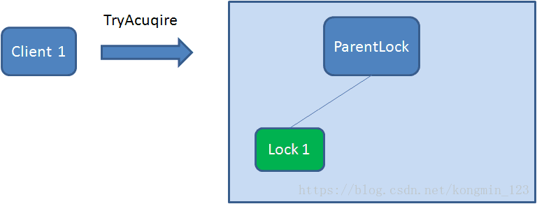

# 分布式锁

分布式锁是为了保证系统在集群环境下同一时间对某一个资源的顺序执行

分布式锁的实现由很多种，比如文件锁、数据库、redis、zookeeper、etcd 等


### 数据库锁

数据库锁分为乐观锁与悲观锁

### 悲观锁

所谓悲观锁，悲观锁是对数据被的修改持悲观态度（认为数据在被修改的时候一定会存在并发问题），因此在整个数据处理过程中将数据锁定

示例如下：

```sql
//0.开始事务
begin; 
	
//1.查询出商品信息

select stockCount from seckill_good where id=1 for update;

//2.根据商品信息生成订单

insert into seckill_order (id,good_id) values (null,1);

//3.修改商品stockCount减一

update seckill_good set stockCount=stockCount-1 where id=1;

//4.提交事务

commit;
```

以上，在对id = 1的记录修改前，先通过for update的方式进行加锁，然后再进行修改。这就是比较典型的悲观锁策略。

如果以上修改库存的代码发生并发，同一时间只有一个线程可以开启事务并获得id=1的锁，其它的事务必须等本次事务提交之后才能执行。这样我们可以保证当前的数据不会被其它事务修改。

悲观锁的实现，往往依靠数据库提供的锁机制。在数据库中，悲观锁的流程如下：

- 在对记录进行修改前，先尝试为该记录加上排他锁（exclusive locking）。
- 如果加锁失败，说明该记录正在被修改，那么当前查询可能要等待或者抛出异常。具体响应方式由开发者根据实际需要决定。
- 如果成功加锁，那么就可以对记录做修改，事务完成后就会解锁了。
- 其间如果有其他事务对该记录做加锁的操作，都要等待当前事务解锁或直接抛出异常。


### 数据库乐观锁

我们可以为某一行数据设置一个version 版本号，当需要修改时通过CAS 自旋保证数据的一致

> CAS的实现中，在表中增加一个version字段，操作前先查询version信息，在数据提交时检查version字段是否被修改，如果没有被修改则进行提交，否则认为是过期数据。

示例如下：

比如前面的扣减库存问题，通过乐观锁可以实现如下：

```sql
//1.查询出商品信息
			
select stockCount, version from seckill_good where id=1;
			
//2.根据商品信息生成订单
insert into seckill_order (id,good_id) values (null,1);

//3.修改商品库存
update seckill_good set stockCount=stockCount-1, version = version+1 where id=1, version=version;
```

CAS 乐观锁有两个问题：

- CAS 存在一个比较重要的问题，即**ABA问题**. 解决的办法是version字段顺序递增。
- 乐观锁的方式，在高并发时，只有一个线程能执行成功，会造成大量的失败，这给用户的体验显然是很不好的。


## Redis 分布式锁

Redis 实现分布式锁主要有两种方式，一种是基于原生Redis 的 setnx 来实现分布式锁，另一种是基于Redission 来实现分布式锁


### 原生Redis 分布式锁


当我们使用redis 实现分布式锁时，需要为分布式锁添加过期时间，这样的话就算某个节点拥有分布式锁之后宕机，分布式锁也会自动过期，并不会阻塞集群中其他程序的运行

通过Redis的setnx、expire命令可以实现简单的锁机制：

- key不存在时创建，并设置value和过期时间，返回值为1；成功获取到锁；
- 如key存在时直接返回0，抢锁失败；
- 持有锁的线程释放锁时，手动删除key； 或者过期时间到，key自动删除，锁释放。


####  加锁的方式

Redis 可以通过一下两种方式实现分布式锁：

- 在使用setnx 时，同时使用PX 为该值设置过期时间
- 使用lua 脚本，在setnx 之后调用expire 指令为设置的值添加过期时间

总的来说就是不管通过哪一种方式都要保证其原子性,Redis 解锁也是一样，我们要首先get redis 中的值判断是否已当前的值相等，如果相等则进行delete，那么 get 与 delete 也要保证其原子性，故可以使用 lua 脚本来实现


#### lua 脚本

加锁和删除锁的操作，使用纯lua进行封装，保障其执行时候的原子性。

基于纯Lua脚本实现分布式锁的执行流程，大致如下：


**加锁的Lua脚本： lock.lua**

```
--- -1 failed
--- 1 success
---
local key = KEYS[1]
local requestId = KEYS[2]
local ttl = tonumber(KEYS[3])
local result = redis.call('setnx', key, requestId)
if result == 1 then
    --PEXPIRE:以毫秒的形式指定过期时间
    redis.call('pexpire', key, ttl)
else
    result = -1;
    -- 如果value相同，则认为是同一个线程的请求，则认为重入锁
    local value = redis.call('get', key)
    if (value == requestId) then
        result = 1;
        redis.call('pexpire', key, ttl)
    end
end
--  如果获取锁成功，则返回 1
return result
```


**解锁的Lua脚本： unlock.lua：**

```
--- -1 failed
--- 1 success

-- unlock key
local key = KEYS[1]
local requestId = KEYS[2]
local value = redis.call('get', key)
if value == requestId then
    redis.call('del', key);
    return 1;
end
return -1
```


### Redission 分布式锁

Redisson框架支持的分布式锁类型，大致如下：

- 可重入锁
- 公平锁
- 联锁
- 红锁
- 读写锁
- 信号量
- 可过期信号量
- 闭锁（/倒数闩）


#### 可重入锁（Reentrant Lock）

Redisson的分布式可重入锁RLock Java对象实现了java.util.concurrent.locks.Lock接口，同时还支持自动过期解锁。

```
public void testReentrantLock(RedissonClient redisson){
	RLock lock = redisson.getLock("anyLock");
	try{
		// 1. 最常见的使用方法
		//lock.lock();
		// 2. 支持过期解锁功能,10秒钟以后自动解锁, 无需调用unlock方法手动解锁
		//lock.lock(10, TimeUnit.SECONDS);
		// 3. 尝试加锁，最多等待3秒，上锁以后10秒自动解锁
		boolean res = lock.tryLock(3, 10, TimeUnit.SECONDS);
		if(res){ //成功
		// do your business
		}
	} catch (InterruptedException e) {
		e.printStackTrace();
	} finally {
		lock.unlock();
	}
}
```


Redisson同时还为分布式锁提供了异步执行的相关方法：

```
public void testAsyncReentrantLock(RedissonClient redisson){
	RLock lock = redisson.getLock("anyLock");
	try{
		lock.lockAsync();
		lock.lockAsync(10, TimeUnit.SECONDS);
		Future<Boolean> res = lock.tryLockAsync(3, 10, TimeUnit.SECONDS);
		if(res.get()){
		// do your business
		}
	} catch (InterruptedException e) {
		e.printStackTrace();
	} catch (ExecutionException e) {
		e.printStackTrace();
	} finally {
		lock.unlock();
	}
}
```


#### 2.公平锁（Fair Lock）

Redisson分布式可重入公平锁也是实现了java.util.concurrent.locks.Lock接口的一种RLock对象。在提供了自动过期解锁功能的同时，保证了当多个Redisson客户端线程同时请求加锁时，优先分配给先发出请求的线程。

```
public void testFairLock(RedissonClient redisson){
	RLock fairLock = redisson.getFairLock("anyLock");
	try{
		// 最常见的使用方法
		fairLock.lock();
		// 支持过期解锁功能, 10秒钟以后自动解锁,无需调用unlock方法手动解锁
		fairLock.lock(10, TimeUnit.SECONDS);
		// 尝试加锁，最多等待100秒，上锁以后10秒自动解锁
		boolean res = fairLock.tryLock(100, 10, TimeUnit.SECONDS);
	} catch (InterruptedException e) {
		e.printStackTrace();
	} finally {
		fairLock.unlock();
	}
}
```

Redisson同时还为分布式可重入公平锁提供了异步执行的相关方法：


```
RLock fairLock = redisson.getFairLock("anyLock");
fairLock.lockAsync();
fairLock.lockAsync(10, TimeUnit.SECONDS);
Future<Boolean> res = fairLock.tryLockAsync(100, 10, TimeUnit.SECONDS);
```


#### 3.联锁（MultiLock）

Redisson的RedissonMultiLock对象可以将多个RLock对象关联为一个联锁，每个RLock对象实例可以来自于不同的Redisson实例。

```
public void testMultiLock(RedissonClient redisson1,RedissonClient redisson2, RedissonClient redisson3){
	RLock lock1 = redisson1.getLock("lock1");
	RLock lock2 = redisson2.getLock("lock2");
	RLock lock3 = redisson3.getLock("lock3");
	RedissonMultiLock lock = new RedissonMultiLock(lock1, lock2, lock3);
	try {
		// 同时加锁：lock1 lock2 lock3, 所有的锁都上锁成功才算成功。
		lock.lock();
		// 尝试加锁，最多等待100秒，上锁以后10秒自动解锁
		boolean res = lock.tryLock(100, 10, TimeUnit.SECONDS);
	} catch (InterruptedException e) {
		e.printStackTrace();
	} finally {
		lock.unlock();
	}
}
```


#### 4.红锁（RedLock）

Redisson的RedissonRedLock对象实现了Redlock介绍的加锁算法。该对象也可以用来将多个RLock对象关联为一个红锁，每个RLock对象实例可以来自于不同的Redisson实例。

```
public void testRedLock(RedissonClient redisson1,RedissonClient redisson2, RedissonClient redisson3){
	RLock lock1 = redisson1.getLock("lock1");
	RLock lock2 = redisson2.getLock("lock2");
	RLock lock3 = redisson3.getLock("lock3");
	RedissonRedLock lock = new RedissonRedLock(lock1, lock2, lock3);
	try {
		// 同时加锁：lock1 lock2 lock3, 红锁在大部分节点上加锁成功就算成功。
		lock.lock();
		// 尝试加锁，最多等待100秒，上锁以后10秒自动解锁
		boolean res = lock.tryLock(100, 10, TimeUnit.SECONDS);
	} catch (InterruptedException e) {
		e.printStackTrace();
	} finally {
		lock.unlock();
	}
}
```


#### 5.读写锁（ReadWriteLock）

Redisson的分布式可重入读写锁RReadWriteLock,Java对象实现了java.util.concurrent.locks.ReadWriteLock接口。同时还支持自动过期解锁。该对象允许同时有多个读取锁，但是最多只能有一个写入锁。

```
RReadWriteLock rwlock = redisson.getLock("anyRWLock");
// 最常见的使用方法
rwlock.readLock().lock();
// 或
rwlock.writeLock().lock();
// 支持过期解锁功能
// 10秒钟以后自动解锁
// 无需调用unlock方法手动解锁
rwlock.readLock().lock(10, TimeUnit.SECONDS);
// 或
rwlock.writeLock().lock(10, TimeUnit.SECONDS);
// 尝试加锁，最多等待100秒，上锁以后10秒自动解锁
boolean res = rwlock.readLock().tryLock(100, 10, TimeUnit.SECONDS);
// 或
boolean res = rwlock.writeLock().tryLock(100, 10, TimeUnit.SECONDS);
...
lock.unlock();
```


#### 6.信号量（Semaphore）

Redisson的分布式信号量（Semaphore）Java对象RSemaphore采用了与java.util.concurrent.Semaphore相似的接口和用法。

```
RSemaphore semaphore = redisson.getSemaphore("semaphore");
semaphore.acquire();
//或
semaphore.acquireAsync();
semaphore.acquire(23);
semaphore.tryAcquire();
//或
semaphore.tryAcquireAsync();
semaphore.tryAcquire(23, TimeUnit.SECONDS);
//或
semaphore.tryAcquireAsync(23, TimeUnit.SECONDS);
semaphore.release(10);
semaphore.release();
//或
semaphore.releaseAsync();
```


#### 7.可过期性信号量（PermitExpirableSemaphore）

Redisson的可过期性信号量（PermitExpirableSemaphore）实在RSemaphore对象的基础上，为每个信号增加了一个过期时间。每个信号可以通过独立的ID来辨识，释放时只能通过提交这个ID才能释放。

```
RPermitExpirableSemaphore semaphore = redisson.getPermitExpirableSemaphore("mySemaphore");
String permitId = semaphore.acquire();
// 获取一个信号，有效期只有2秒钟。
String permitId = semaphore.acquire(2, TimeUnit.SECONDS);
// ...
semaphore.release(permitId);
```


#### 8.闭锁/倒数闩（CountDownLatch）

Redisson的分布式闭锁（CountDownLatch）Java对象RCountDownLatch采用了与java.util.concurrent.CountDownLatch相似的接口和用法。

```
RCountDownLatch latch = redisson.getCountDownLatch("anyCountDownLatch");
latch.trySetCount(1);
latch.await();
// 在其他线程或其他JVM里
RCountDownLatch latch = redisson.getCountDownLatch("anyCountDownLatch");
latch.countDown();
```


#### Redission 加锁机制

Redission 使用lua 脚本来进行加锁，脚本内容如下：


**KEYS[1]**代表的是你加锁的那个key，比如说：

> RLock lock = redisson.getLock("DISLOCK");

这里你自己设置了加锁的那个锁key就是“DISLOCK”。

**ARGV[1]**代表的就是锁key的默认生存时间

> 调用的时候，传递的参数为 internalLockLeaseTime ，该值默认30秒。

**ARGV[2]**代表的是加锁的客户端的ID，类似于下面这样：

> 01a6d806-d282-4715-9bec-f51b9aa98110:1


从 脚本中可以看出 redission 使用 hash 的数据结构进行加锁，加锁时不仅会设置过期时间，也会将加锁的次数以及客户端ID 也设置到hash 结构中去，当其他客户端进行加锁时会判断当前的客户端id 是否等于自己的客户端id，如果不是则进行订阅当前的分布式锁 channel，直到 拥有锁的客户端解锁时会调用 publish 命令广播一条消息，通知其他客户端可以进行尝试加锁了，这样可以防止无效的自旋 浪费性能


所有竞争这把锁的线程都要判断在这个key下有没有自己线程的字段，如果没有则不能获得锁，如果有，则相当于重入，字段值加1（次数）


#### Redission 解锁机制

redission 在解锁时，会对hash结构中的 count 进行 减1，如果发现加锁次数是0了，说明这个客户端已经不再持有锁了，此时就会用：“del lock_name”命令，从redis里删除这个key。对应的lua脚本如下：


脚本含义如下：

​	   1、判断是否存在一个叫“DISLOCK”的key

　　2、如果不存在，返回nil

　　3、如果存在，使用Redis *Hincrby* 命令用于为哈希表中的字段值加上指定增量值 -1 ，代表减去1

　　4、若counter >，返回空，若字段存在，则字段值减1

　　5、若减完以后，counter > 0 值仍大于0，则返回0

　　6、减完后，若字段值小于或等于0，则用 publish 命令广播一条消息，广播内容是0，并返回1；


### Watch dog 机制

在Redisson框架实现分布式锁的思路，就使用watchDog机制实现锁的续期。

当加锁成功后，同时开启守护线程，默认有效期是30秒，每隔10秒就会给锁续期到30秒，只要持有锁的客户端没有宕机，就能保证一直持有锁，直到业务代码执行完毕由客户端自己解锁，如果宕机了自然就在有效期失效后自动解锁


首先watchdog的具体思路是 加锁时，默认加锁 30秒，每10秒钟检查一次，如果存在就重新设置 过期时间为30秒。

然后设置默认加锁时间的参数是 lockWatchdogTimeout（监控锁的看门狗超时，单位：毫秒）


**注意：**

- 要使 watchLog机制生效 ，lock时 不要设置 过期时间
- watchlog的延时时间 可以由 lockWatchdogTimeout指定默认延时时间，但是不要设置太小。如100
- watchdog 会每 lockWatchdogTimeout/3时间，去延时。
- watchdog 通过 类似netty的 Future功能来实现异步延时
- watchdog 最终还是通过 lua脚本来进行延时


### RedLock

RedLock 是为了解决当master宕机后 slave 晋升为master 之后进行主从复制时，复制还没有彻底完成，这时候又来了其他客户端进行加锁，导致多个客户端加锁成功的问题

#### 场景

在master- slave的集群架构中，就是如果你对某个redis master实例，写入了DISLOCK这种锁key的value，此时会异步复制给对应的master slave实例。

但是，这个过程中一旦发生redis master宕机，主备切换，redis slave变为了redis master。而此时的主从复制没有彻底完成.....

接着就会导致，客户端2来尝试加锁的时候，在新的redis master上完成了加锁，而客户端1也以为自己成功加了锁。

此时就会导致多个客户端对一个分布式锁完成了加锁。

> 这时系统在业务语义上一定会出现问题，导致脏数据的产生。

所以这个是是redis master-slave架构的主从异步复制导致的redis分布式锁的最大缺陷：

> 在redis master实例宕机的时候，可能导致多个客户端同时完成加锁。


#### RedLock算法思想

> 不能只在一个redis实例上创建锁，应该是在多个redis实例上创建锁，n / 2 + 1，必须在大多数redis节点上都成功创建锁，才能算这个整体的RedLock加锁成功，避免说仅仅在一个redis实例上加锁而带来的问题。

这个场景是假设有一个 redis cluster，有 5 个 redis master 实例。然后执行如下步骤获取一把红锁：

1. 获取当前时间戳，单位是毫秒；
2. 跟上面类似，轮流尝试在每个 master 节点上创建锁，过期时间较短，一般就几十毫秒；
3. 尝试在大多数节点上建立一个锁，比如 5 个节点就要求是 3 个节点 n / 2 + 1；
4. 客户端计算建立好锁的时间，如果建立锁的时间小于超时时间，就算建立成功了；
5. 要是锁建立失败了，那么就依次之前建立过的锁删除；
6. 只要别人建立了一把分布式锁，你就得不断轮询去尝试获取锁。


RedLock是基于redis实现的分布式锁，它能够保证以下特性：

- 互斥性：在任何时候，只能有一个客户端能够持有锁；避免死锁：
- 当客户端拿到锁后，即使发生了网络分区或者客户端宕机，也不会发生死锁；（利用key的存活时间）
- 容错性：只要多数节点的redis实例正常运行，就能够对外提供服务，加锁或者释放锁；

以sentinel模式架构为例，如下图所示，有sentinel-1，sentinel-2，sentinel-3总计3个sentinel模式集群，如果要获取分布式锁，那么需要向这3个sentinel集群通过EVAL命令执行LUA脚本，需要3/2+1=2，即至少2个sentinel集群响应成功，才算成功的以Redlock算法获取到分布式锁：

[](https://img-blog.csdnimg.cn/20210421140328536.png)

Redission 默认是使用 MutiLock 来实现的RedLock 锁

链接地址：

https://www.cnblogs.com/crazymakercircle/p/14731826.html


### Redis 分段锁


## Zookeeper 分布式锁

### zookeeper 数据模型

ZooKeeper 的数据模型，在结构上和标准文件系统的非常相似，拥有一个层
次的命名空间，都是采用树形层次结构，ZooKeeper 树中的每个节点被称为—
Znode。和文件系统的目录树一样，ZooKeeper 树中的每个节点可以拥有子节点。
但也有不同之处：

1. Znode 兼具文件和目录两种特点。既像文件一样维护着数据、元信息、ACL、
时间戳等数据结构，又像目录一样可以作为路径标识的一部分，并可以具有
子 Znode。用户对 Znode 具有增、删、改、查等操作（权限允许的情况下）。
2. Znode 具有原子性操作，读操作将获取与节点相关的所有数据，写操作也将
替换掉节点的所有数据。另外，每一个节点都拥有自己的 ACL(访问控制列
表)，这个列表规定了用户的权限，即限定了特定用户对目标节点可以执行的
操作。
3. Znode 存储数据大小有限制。ZooKeeper 虽然可以关联一些数据，但并没有
被设计为常规的数据库或者大数据存储，相反的是，它用来管理调度数据，
比如分布式应用中的配置文件信息、状态信息、汇集位置等等。这些数据的
共同特性就是它们都是很小的数据，通常以 KB 为大小单位。ZooKeeper 的服
务器和客户端都被设计为严格检查并限制每个 Znode 的数据大小至多 1M，当
时常规使用中应该远小于此值。
4. Znode 通过路径引用，如同 Unix 中的文件路径。路径必须是绝对的，因此他
们必须由斜杠字符来开头。除此以外，他们必须是唯一的，也就是说每一个
路径只有一个表示，因此这些路径不能改变。在 ZooKeeper 中，路径由
Unicode 字符串组成，并且有一些限制。字符串"/zookeeper"用以保存管理
信息，比如关键配额信息。


图中的每个节点称为一个 Znode。 每个 Znode 由 3 部分组成:

- stat：此为状态信息, 描述该 Znode 的版本, 权限等信息
-  data：与该 Znode 关联的数据
-  children：该 Znode 下的子节点


### 节点属性


- dataVersion：数据版本号，每次对节点进行 set 操作，dataVersion 的值都
  会增加 1（即使设置的是相同的数据），可有效避免了数据更新时出现的先后顺
  序问题。
- cversion ：子节点的版本号。当 znode 的子节点有变化时，cversion 的值
  就会增加 1。
- aclVersion ：ACL 的版本号。
- cZxid ：Znode 创建的事务 id。
- mZxid ：Znode 被修改的事务 id，即每次对 znode 的修改都会更新 mZxid。
  对于 zk 来说，每次的变化都会产生一个唯一的事务 id，zxid（ZooKeeper
  Transaction Id）。通过 zxid，可以确定更新操作的先后顺序。例如，如果 zxid1
  小于 zxid2，说明 zxid1 操作先于 zxid2 发生，zxid 对于整个 zk 都是唯一的，
  即使操作的是不同的 znode。
- ctime：节点创建时的时间戳.
- mtime：节点最新一次更新发生时的时间戳
- ephemeralOwner:如果该节点为临时节点, ephemeralOwner 值表示与该节点
  绑定的 session id. 如果不是, ephemeralOwner 值为 0.


### 实现原理

通过创建有序的临时节点 + watcher 监听来实现

zookeeper 的临时节点，当客户端断开后，会自动删除


让我们来回顾一下Zookeeper节点的概念：


Zookeeper的数据存储结构就像一棵树，这棵树由节点组成，这种节点叫做Znode。


#### 节点类型

Znode分为四种类型：

**1.持久节点 （PERSISTENT）**

默认的节点类型。创建节点的客户端与zookeeper断开连接后，该节点依旧存在 。

**2.持久节点顺序节点（PERSISTENT_SEQUENTIAL）**

所谓顺序节点，就是在创建节点时，Zookeeper根据创建的时间顺序给该节点名称进行编号：

**3.临时节点（EPHEMERAL） **

和持久节点相反，当创建节点的客户端与zookeeper断开连接后，临时节点会被删除。

**4.临时顺序节点（EPHEMERAL_SEQUENTIAL） **

顾名思义，临时顺序节点结合和临时节点和顺序节点的特点：在创建节点时，Zookeeper根据创建的时间顺序给该节点名称进行编号；当创建节点的客户端与Zookeeper断开连接后，临时节点会被删除。

那临时顺序节点和Zookeeper的分布式锁有什么关系呢？


#### Zookeeper分布式锁的原理

Zookeeper分布式锁恰恰应用了临时顺序节点。具体如何实现呢？让我们来看一看详细步骤：

**获取锁**

首先，在Zookeeper当中创建一个持久节点ParentLock。当第一个客户端想要获得锁时，需要在ParentLock这个节点下面创建一个临时顺序节点 Lock1。



之后，Client1查找ParentLock下面所有的临时顺序节点并排序，判断自己所创建的节点Lock1是不是顺序最靠前的一个。如果是第一个节点，则成功获得锁。 


这时候，如果再有一个客户端 Client2 前来获取锁，则在ParentLock下载再创建一个临时顺序节点Lock2。 


Client2查找ParentLock下面所有的临时顺序节点并排序，判断自己所创建的节点Lock2是不是顺序最靠前的一个，结果发现节点Lock2并不是最小的。

于是，Client2向排序仅比它靠前的节点Lock1注册Watcher，用于监听Lock1节点是否存在。这意味着Client2抢锁失败，进入了等待状态。 


这时候，如果又有一个客户端Client3前来获取锁，则在ParentLock下载再创建一个临时顺序节点Lock3。 


Client3查找ParentLock下面所有的临时顺序节点并排序，判断自己所创建的节点Lock3是不是顺序最靠前的一个，结果同样发现节点Lock3并不是最小的。

于是，Client3向排序仅比它靠前的节点Lock2注册Watcher，用于监听Lock2节点是否存在。这意味着Client3同样抢锁失败，进入了等待状态。 


这样一来，Client1得到了锁，Client2监听了Lock1，Client3监听了Lock2。这恰恰形成了一个等待队列，很像是Java当中ReentrantLock所依赖的AQS（AbstractQueuedSynchronizer）。


#### 释放锁

释放锁分为两种情况：

**1.任务完成，客户端显示释放**

当任务完成时，Client1会显示调用删除节点Lock1的指令。


**2.任务执行过程中，客户端崩溃**

获得锁的Client1在任务执行过程中，如果Duang的一声崩溃，则会断开与Zookeeper服务端的链接。根据临时节点的特性，相关联的节点Lock1会随之自动删除。 


由于Client2一直监听着Lock1的存在状态，当Lock1节点被删除，Client2会立刻收到通知。这时候Client2会再次查询ParentLock下面的所有节点，确认自己创建的节点Lock2是不是目前最小的节点。如果是最小，则Client2顺理成章获得了锁。 


同理，如果Client2也因为任务完成或者节点崩溃而删除了节点Lock2，那么Client3就会接到通知。 


最终，Client3成功得到了锁。 


使用Zookeeper实现分布式锁的大致流程就是这样。那么使用Zookeeper实现的分布式锁和Redis实现的分布式锁相比有什么优势和劣势呢？


下面总结一下他们各自的优劣。

| 分布式锁  | 优点                                                         | 缺点                                                         |
| --------- | ------------------------------------------------------------ | ------------------------------------------------------------ |
| Zookeeper | 1.有封装好的框架，容易实现2.有等待锁的队列，大大提升抢锁效率。 | 添加和删除节点性能较低                                       |
| Redis     | Set和Del指令性能较高                                         | 1.实现复杂，需要考虑超时，原子性，误删等情形。2.没有等待锁的队列，只能在客户端自旋来等待，效率低下。 |


## ZooKeeper分布式锁的优点和缺点

总结一下ZooKeeper分布式锁：

（1）优点：ZooKeeper分布式锁（如InterProcessMutex），能有效的解决分布式问题，不可重入问题，使用起来也较为简单。

（2）缺点：ZooKeeper实现的分布式锁，性能并不太高。为啥呢？
因为每次在创建锁和释放锁的过程中，都要动态创建、销毁瞬时节点来实现锁功能。大家知道，ZK中创建和删除节点只能通过Leader服务器来执行，然后Leader服务器还需要将数据同不到所有的Follower机器上，这样频繁的网络通信，性能的短板是非常突出的。

总之，在高性能，高并发的场景下，不建议使用ZooKeeper的分布式锁。而由于ZooKeeper的高可用特性，所以在并发量不是太高的场景，推荐使用ZooKeeper的分布式锁。

在目前分布式锁实现方案中，比较成熟、主流的方案有两种：

- 基于Redis的分布式锁
- 基于ZooKeeper的分布式锁

两种锁，分别适用的场景为：

- 基于ZooKeeper的分布式锁，适用于高可靠（高可用）而并发量不是太大的场景；
- 基于Redis的分布式锁，适用于并发量很大、性能要求很高的、而可靠性问题可以通过其他方案去弥补的场景。

总之，这里没有谁好谁坏的问题，而是谁更合适的问题。