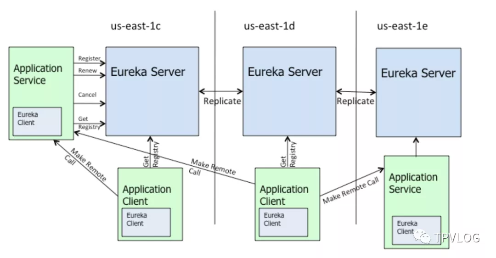
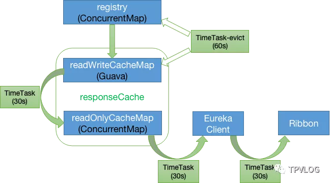
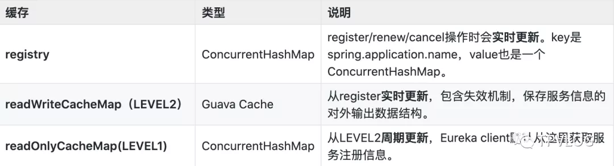
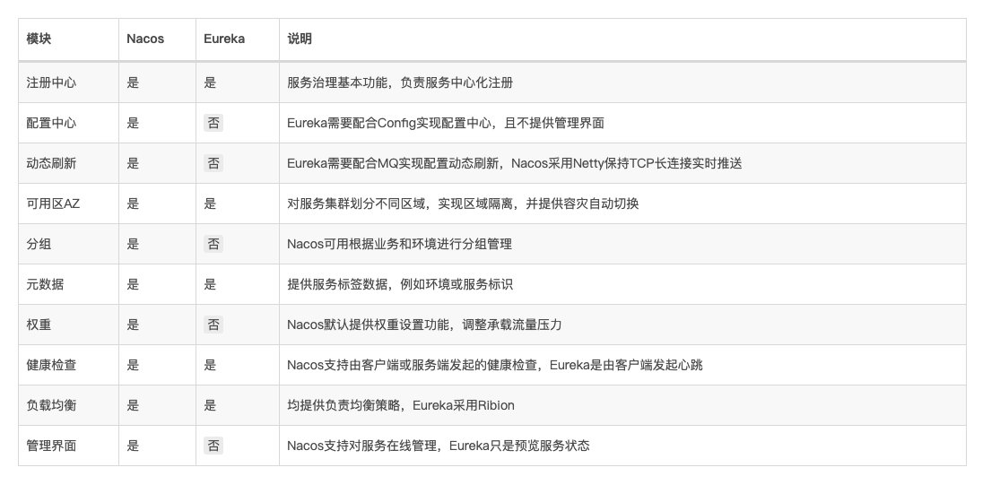
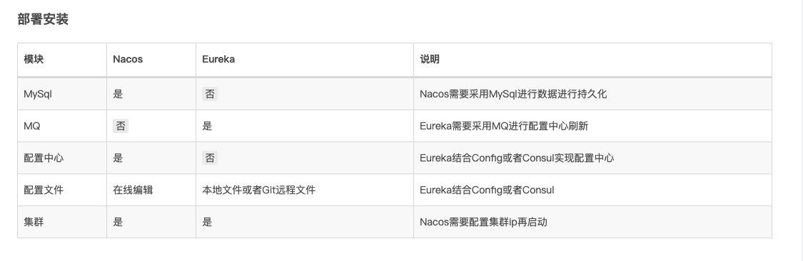
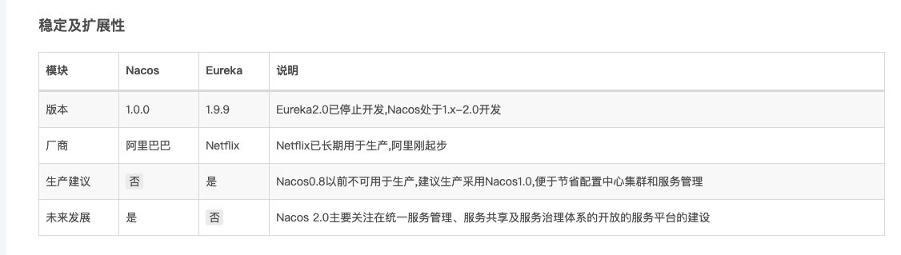

# 注册中心

## 分布式一致性算法

### CAP 理论

### ZAB 协议

### Raft 协议

## Eureka

除了Eureka可以作为服务注册中心外，主流的还有Consul(https://spring.io/projects/spring-cloud-consul)、Zookeeper(https://zookeeper.apache.org/)、Etcd(https://etcd.io/)。这几种注册中心的区别我这里不做赘述，读者可以自行参阅官网的介绍，并根据自己公司的业务场景进行技术选型。

> 虽然Netflix官方表示对Eureka 2.x进行无限期搁置，但事实上1.x版本已经非常稳定，而且官方仍在不断维护，所以没有必要危言耸听。另外，很多大公司都是基于Eureka或Zookeeper二次开发，自研注册中心的。

## 一、Eureka基本架构

我们先从Eureka的基本架构开始。Eureka从整体上可以分为两个主体：**Eureka Server** 和 **Eureka Client**。

Eureka Client和Eureka Server之间的主要交互，可以参考下面这张官方的图：

上图中：

- Eureka Server：表示注册中心集群
- us-east-1x：表示集群所在的区域，可以理解成数据中心
- Application Service：表示服务提供者
- Application Client：表示服务消费者
- Eureka Client：表示Eureka客户端

我们来一一看下各个组件和以及它们之间的交互情况。

### 1.1 Eureka Server

Eureka Server（注册中心服务端）， 主要是维护服务注册表 ，主要对外提供三项功能：

**服务注册** 服务提供者启动时，会通过 Eureka Client 向 Eureka Server 注册信息，Eureka Server 会存储该服务的信息，Eureka Server 内部有**多级缓存机制**来维护服务注册表。

**服务发现** 服务消费者在调用服务时，如果 Eureka Client 没有缓存注册表的话，会从 Eureka Server 获取最新的注册表。

**状态同步** Eureka Client 通过注册、心跳机制和 Eureka Server 同步当前客户端的状态。

### 1.2 Eureka Client

Eureka Client（注册中心客户端），向注册中心注册服务的应用都可以叫做Eureka Client（包括Eureka Server本身）。Eureka Client 可以从Eureka Server获取注册表，缓存在本地，从中查找服务提供者，从而进行远程调用。

服务注册表信息定期（每30秒钟）更新一次。每次返回注册列表信息可能与 Eureka Client 的缓存信息不同，Eureka Client 会自动处理。

> Eureka Client 和 Eureka Server 可以使用 JSON/XML 格式进行通讯。在默认情况下 Eureka Client 使用压缩 JSON 格式来获取注册列表的信息。

### 1.3 Register（服务注册）

服务提供者，会将自身的服务信息注册到 Eureka Server ，服务提供者也是一个 Eureka Client。当 Eureka Client 向 Eureka Server 注册时，它提供自身的元数据，包括 IP 地址、端口，运行状况指示符 URL，主页等。

### 1.4 Renew（服务续约）

Eureka Client 默认每隔 30 秒 向 Eureka Server发送一次心跳来续约，通过续约来告知 Eureka Server 该 Eureka Client 运行正常，没有出现问题。

> 可以通过以下参数配置心跳时间：
>
> 续约心跳间隔时间： `eureka.instance.lease-renewal-interval-in-seconds=30`

### 1.5 Cancel（服务下线）

Eureka Client 在程序关闭时会向 Eureka Server 发送取消请求。Eureka Server 接收到请求后，会将该服务从注册表中删除。

### 1.6 Eviction（服务剔除）

默认情况下，Eureka Server 每隔60s会检查一次注册表，如果有 Eureka Client 超过 90 秒还没续约，Server 端会将该服务从其注册表中剔除（Eviction）。

> 可以通过以下参数配置服务失效剔除时间：
>
> 服务失效剔除时间： `eureka.instance.lease-expiration-duration-in-seconds=90`

## 二、自我保护机制

Eureka自我保护机制是为了防止误杀服务而提供的一种机制。默认情况下，如果 Eureka Server 在 90s 内没有接收到某个微服务实例的心跳，就会注销该实例。但是在分布式系统中，服务之间的网络通信往往会面临着各种问题，比如网络分区故障，此时服务仍然可能是正常的，如果Eureka将其剔除，会造成误杀。

固定时间内大量实例被注销，可能会严重威胁整个分布式系统的可用性。为了解决这个问题，Eureka 开发了自我保护机制。Eureka Server 在运行期间会去统计心跳失败比例在 15 分钟之内是否高于 15%，如果高于 15%，Eureka Server 即会进入自我保护机制。

### 2.1 工作流程

Eureka Server 进入自我保护机制后，会做以下事情：

1. 不再从注册表中移除因为长时间没收到心跳而本应该过期的服务；
2. 仍然接受新服务的注册和查询请求，但是不会被同步到其它节点上；
3. 网络恢复后，自动退出自我保护机制，并将注册信息同步到其它节点中。

注意，如果在保护期内刚好某个服务提供者下线了，此时服务消费者就会拿到一个无效的服务实例，会调用失败。对于这个问题，服务消费者要有一些容错机制，如重试、降级等。

> 通过在 Eureka Server 配置如下参数，开启或者关闭保护机制： `eureka.server.enable-self-preservation=true`

**注意：**自我保护机制这个功能存在较多问题，生产上不建议打开。

## 三、多级缓存

Eureka Server采用一种多级缓存机制来保存服务注册表，如下图：

Eureka Server 的服务注册表保存在内存中，整个数据存储分为两层：**数据存储层**和**缓存层**。

- 数据存储层：registry，本质是一个**ConcurrentHashMap**，保存原始的服务信息；
- 缓存层：**readWriteCacheMap**和**readOnlyCacheMap**，其中readOnlyCacheMap是一级缓存，readWriteCacheMap是二级缓存，保存即将要对外传输的服务信息 。

### 3.1 registry 

当Eureka Client进行 `register`、 `renew`、 `cancel`操作时，registry会**实时更新**。registry中保存着原始的服务信息，本质是一个ConcurrentHashMap。

### 3.2 readWriteCacheMap

readWriteCacheMap中保存的是加工后的服务注册表。

registry实时更新后，会将readWriteCacheMap清空，同时，Server端每隔60s会清理超过90s未续约的服务，此时也会将readWriteCacheMap清空。

另外，每隔30s，Eureka Server会将readWriteCacheMap中的信息同步至readOnlyCacheMap(Level1)；

### 3.2 readOnlyCacheMap

当Eureka Client发送 `getRegistry`请求拉取服务注册信息时，实际是从readOnlyCacheMap这个一级缓存中获取的。如果获取不到，会触发二级缓存readWtireCacheMap的 `load`机制：从registry中获取原始服务信息后进行处理加工，再加载到二级缓存readWtireCacheMap中。

### 3.3 优点

Eureka的这种多级缓存数据结构，最大的好处是提升了性能，同时能减少并发访问服务注册表时的冲突。因为如果只有一个服务注册表，同时读写必然涉及加锁，在服务很多的情况下，会导致性能低下。

### 3.4 缺点

默认配置下，Eureka的数据时效性是比较差的，服务发现、服务注册的感知可能要几十秒甚至几分钟。数据时效差，主要是因为默认的几个定时任务同步都是30s：

我们可以对以下参数进行优化：

- 二级缓存同步时间间隔（默认30s）： `eureka.server.responseCacheUpdateIntervalMs=3000`
- Eureka Client获取注册表时间间隔（默认30s）： `eureka.client.registryFetchIntervalSeconds=3`
- 服务心跳感知时间间隔（默认30s）： `eureka.client.leaseRenewalIntervalInSeconds=30`
- 心跳超时后的服务剔除时间间隔（默认60s）： `eureka.server.evictionIntervalTimerInMs=6000`
- Eureka Server至上一次收到client心跳之后，等待下一次心跳的超时时间（在这个时间内若没收到下一次心跳，则将移除该client）： `eureka.instance.leaseExpirationDurationInSeconds=6`

经过上述参数优化后，数据的时效性一般可以达到秒级。

## 四、高可用

Eureka本身为了实现高可用，支持**集群部署**。我们假设有三台 Eureka Server 组成的集群，第一台 Eureka Server 在us-east-1c机房，另外两台 Eureka Server 分别部署在us-east-1d和us-east-1e机房。

这样三台 Eureka Server 就组建成了一个跨区域集群，三个地方的任意一个机房出现问题，都不会影响整个集群的可用性。

从上图可以看出， Eureka Server 集群之间通过 Replicate 来同步数据，所有节点都是对等的。在这种架构下，节点通过互相注册来提高可用性，每个节点需要添加一个或多个有效的 serviceUrl 指向其他节点。

如果某台 Eureka Server 宕机了，Eureka Client 的请求会自动切换到新的 Eureka Server 节点。当宕机服务器恢复后，Eureka 会再次将其纳入到服务器集群管理之中。

Eureka Server 的同步遵循着一个非常简单的原则：**只要有一条边将节点连接，就可以进行信息传播与同步。所以，如果存在多个节点，只需要将节点之间两两连接起来形成通路，那么其它注册中心都可以共享信息**。

每个 Eureka Server 同时也是 Eureka Client，多个 Eureka Server 之间通过 **P2P 方式**完成服务注册表的同步。当 Eureka Client 在向某个 Eureka 注册时，如果发现连接失败，则会自动切换至其它节点，只要有一台 Eureka Server 还在，就能保证整个集群的可用性，但是由于Eureka Server 集群之间的状态同步是异步方式的，所以不保证节点间的状态是强一致的，只能保证最终一致性。

### 4.1 Eureka分区

Eureka 提供了 Region 和 Zone 两个概念来进行分区，这两个概念均来自于亚马逊的 AWS。

**Region**：可以理解为地理级的区域划分，比如亚洲地区，中国区或者深圳等等。没有具体大小的限制，可根据项目具体的情况，自行合理划分 region。

**Zone**：可以理解为 Region 内的具体机房，比如说 Region 划分为深圳，然后深圳有两个机房，就可以在此 Region 之下划分出 zone1、zone2。

## Nacos

## Eureka 与 Nacos 的区别

Nacos 在1.0 之后同时支持CP 与 AP 模式，而 Eureka 只支持AP 模式

  

  

  